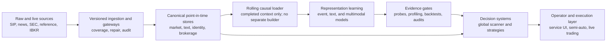

# Task History

This is the chat-independent view of durable user-requested outcomes across
the user's 2026 Codex work. `TASK_HISTORY.csv` is the canonical editable
ledger; the table below is generated from it by
`python scripts/render_task_history.py` and must not be edited by hand.

## Current Focus

- **TASK-0071 - Add point-in-time SEC filing inventory, ticker feed, and reader containers**. Next: Three focused backend tests, Python compilation, frontend TypeScript, production build, and diff checks pass. In-browser semantic validation confirmed the All SEC query controls and label options, linked AAPL filing sections, and dedicated detail loading path. The local ClickHouse endpoint on port 8123 was unavailable, so populated filing rows and document rendering could not be revalidated in this run; the UI exposed point-in-time loading or empty states without fabricated data. The task-started Vite server on port 4175 was stopped.
- **TASK-0059 - Build deterministic news phrase and causal reaction reference tables**. Next: Sixteen targeted tests and Python compilation pass. The resumed build preserved and advanced 453 completed days and 2,981,900 rows through 2020-03-29 before exposing repeated full-news joins on March 30-31. The exact previously failing 2020-03-31 initial shard now writes 930 rows under the unchanged 6 GiB cap with 2.12 GiB peak memory; selected rows fell from about 10.5 million to 119 thousand and join-build rows from about 10.2 million to 32,898. The 16,210-row bounded news cache matched its canonical source in both EXCEPT directions, and an independent reaction comparison produced 20 rows from each path with zero differences across every persisted field except finalized timestamp. All temporary validation tables were removed and production rows/checkpoints were not mutated by validation. The full 2019-2026 write remains resumable rather than rerun.
- **TASK-0058 - Standardize Canvas ticker identities and market times**. Next: Frontend production build, six targeted backend/news tests, Python compilation, and diff checks pass. Live browser checks confirmed presentation logos in scanner, chart, and news surfaces; exchange-time primary and VAN secondary labels; a single displayed date; no Details control; and clickable ticker-news headlines.
- **TASK-0025 - QMD live market-data gateway**. Next: Twenty-six QMD Live Rust tests and ten QMD History Rust tests pass, both crates pass cargo check --all-targets and cargo fmt --check, and scripts/run_qmd_gateway.ps1 -CheckOnly passes. A real AAPL 2026-07-10 history probe returned 45 causal one-second family rows ending exactly at as_of, reused one build across family/condition/macro requests with one miss and two hits, and reported 131456 bytes against the 1 GiB ceiling. Earlier official validation still showed the same 788 one-minute bars as Massive with zero missing, extra, or OHLC mismatches. Production startup still needs the broader rolling-retention smoke already tracked by this task.
- **TASK-0046 - Rebuild SEC source and rendered text into audited v3 tables**. Next: Resume workstation run sec_render_v8_20260716_151718 using validated retained exports, inspect its validation/distribution report, then finalize v3 SEC chunking and run the combined token/embedding build.
- **TASK-0051 - Unify IBKR-shaped live, replay, backtest, and debug authorities**. Next: Ten QMD History Rust tests, cargo check --all-targets, cargo fmt --check, and a real service probe pass. The probe returned no family bar beyond the 13:44:15Z as_of boundary, rejected an invalid resolution with HTTP 400, reused one cold build for three product views, and released the exact probe process afterward. Earlier AAPL 2026-07-10 validation processed 1,913,913 events into 788 bars and indicators, reduced an identical request from 30.98 seconds cold to 334 milliseconds hot, and resumed sequences without duplication. Next: migrate feature-dependent strategies and legacy /api/backtests routes to the shared event-derived broker/runtime, then validate authenticated IBKR paper websocket/reconciliation behavior.
- **TASK-0052 - Build the historical-first source-aware trading workspace**. Next: Implement the runtime-compatible strategy loader and shared historical run-controller/journal read APIs, bind real run content and debug/results flows, then apply the finalized global container platform to Live.
- **TASK-0057 - Build database-backed All News, Ticker News, and News Detail containers**. Next: Frontend production build, nine targeted news tests, Python compilation, and diff checks pass. Live ClickHouse-backed queries returned the expected company, multi, analyst, AI, and market classifications. Real-browser validation confirmed source-canvas isolation when opening and closing the reader, reuse of the same reader for a second story, registry visibility in Canvas management, and compact light and dark rendering without horizontal document overflow. The priority-layout follow-up rendered 4 company stories above 16 other stories, verified descending company timestamps, and resolved the dark-theme hot token to neon red #ff3b5c. Exact ml4t reproduction returned the AAPL 72-hour page in 0.102 seconds and the all-news 6-hour page in 0.057 seconds, eliminating the prior 1.8-second timeout path. The latest browser review confirmed All News classification filters and controlled topics, the company-versus-other Ticker News split, News Detail classification evidence, and exact light-theme tokens hot #ff1744, cold #007dff, and old #717182. The exact HCA why-moving article 9b980742dab83b66030b5ac4db529b05 now resolves as editorial why-moving coverage with is_company_news=false in both the SQL list query and Python detail contract, while a verified issuer announcement resolves as company news. A database audit found 204,299 articles carrying bzi-* provider tags, including 180,541 single-ticker articles; the exact b2185e66008f39d6875a8f4449f82b7f article now resolves as Insights in both SQL and detail contracts, renders under Other coverage with bzi-ia visible, and exposes no low-level database or implementation text. The financial-value follow-up passed the production build and strict UI review at light 80%/1600x1000 and dark 125%/1180x760 with zero objective issues. Real-browser checks on HCA and ERAS articles verified intact decimals, ranges, percentages, headline prices, and theme-correct semantic colors.
- **TASK-0063 - Implement timeframe-native QMD microstructure signal architecture**. Next: All 46 shared QMD tests and all 12 QMD History tests pass. An isolated release gateway reproduced AAPL history at 1m with 284 of 284 nonzero anchored OFI and trade-delta rows, ending at 45,760 OFI and 431,373 signed-volume delta; 5s produced 1,225 of 1,225 nonzero rows and both bullish-confirmation and bearish-absorption states. The corrected gateway, backend, and Canvas loaded successfully in the browser, and all task-started services and isolated build artifacts were removed.
- **TASK-0069 - Add causal QMD liquidity levels and market structure indicators**. Next: The 12 focused QMD indicator tests and all 12 QMD History tests pass; both Rust crates compile, Rust formatting passes, and the frontend TypeScript/Vite production build passes. An isolated freshly built qmd-derived-v11 history gateway returned five aligned AAPL one-minute bars and indicators with schema 11, 52-week high 331.7827, 52-week low 181.46, prior-month high 324.0977, prior-month low 246.63, prior-month close 289.00, and estimated LULD bands 282.9889-345.8753. The BOS/CHoCH unit contract verifies bullish and bearish continuation versus opposite-direction character changes and a no-break case. Canvas browser review confirmed the complete guide in the default light presentation and in dark mode at a compact 900 by 700 viewport with maximum-scale typography; the original light theme and 110 percent scale were restored. The historical-label follow-up production build passed; a populated AAPL one-minute browser replay generated 69 bounded causal structure segments and remained readable at default 1280 by 720 and compact 900 by 720 widths with collision-managed labels. The guide explicitly distinguishes selected-timeframe structure from session and completed-daily references. The overlay redesign passes the frontend production build and populated AAPL browser review in Light at 80 and 110 percent plus Dark at 125 percent, at normal and compact widths. Two 50-command range-change stress passes retained one canvas overlay, zero historical DOM price-zone nodes, six current detail labels, and a responsive main application without a black-page failure. The legend exposed independent 10-500 bar history, 0-30 tag limit, current-label, historical-tag, marker-size, connector, stroke, opacity, and visibility controls for the applicable groups. The blank-page follow-up frontend build passes; a 240-event zoom-and-pan stress run retained exactly one price-zone canvas, four bounded session nodes, five to six detail labels, one live main application, and zero browser warnings or errors. A second 240-event run with loaded-edge constraints active retained the same bounded object counts and kept candles visible. The isolated gateway was stopped, the pre-existing gateway on port 8801 was untouched, and the task-started Vite review service was stopped. The cumulative-interaction follow-up passes 13 QMD History Rust tests, the targeted Python history contract, frontend TypeScript and production build, and a real Chromium regression with 24 repeated wheel, pan, price-axis, and time-axis interaction cycles; the chart remained visible with zero page errors or objective issues. The final correction reproduces the prior 100 ms failure as 475 descending transitions in a 5,000-row AAPL response, adds a chronological-order regression test, passes all 16 trading-runtime unit tests and the frontend production build, and survives 100 dense-chart interaction cycles plus a final 30-cycle reload pass with five panes, 51 canvases, and zero new browser warnings, errors, or renderer-boundary activation. The definitive follow-up verifies 5,000 AAPL 100 ms rows are strictly chronological both directly from QMD History on port 8801 and through the frontend proxy; all 14 QMD History tests, all 16 trading-runtime tests, Rust formatting, diff checks, and the frontend production build pass. A fresh browser run with eight configured indicators survived 420 mixed plot and axis wheel/scale interactions plus 180 pan gestures without a blank page, renderer boundary, chart failure, or browser error.

## Overall Direction

The work is converging on a local-first, explainable quantitative research
and trading platform: reliable historical/live data and identity layers feed
reusable research, scanner, backtest, and representation-learning systems;
those systems are validated through operator-facing service, semi-automatic,
and live-trading workflows before they influence real execution.

The laptop repository remains the code source of truth. The workstation
provides heavy storage, ingestion, profiling, and training capacity.

## High-Level Flow

## Ledger Summary

- Durable tasks: 71
- In progress: 19
- Completed: 44
- Superseded: 8

Times use the Vancouver offset when an exact request timestamp is available.
Date-only values identify consolidated historical boundaries where false
timestamp precision would be misleading.

## Imported Task Table

<!-- GENERATED FROM TASK_HISTORY.csv; DO NOT EDIT THIS TABLE DIRECTLY. -->
| ID | Scope | Area | Status | Task | Started | Last updated | Completed | Description | Progress / what happened | Final result or next dependency | Program contribution |
|---|---|---|---|---|---|---|---|---|---|---|---|
| TASK-0070 | quant-research-workbench | Trading UX | Completed | Add a point-in-time Stock Facts container to Canvas | 2026-07-18 | 2026-07-18 | 2026-07-18 | Create a compact single-symbol Canvas container that organizes canonical ticker, issuer, listing, capitalization, share supply, volume, short positioning, IBKR borrow, fundamentals, corporate actions, identifiers, classifications, and source availability without estimating missing facts. | Added one bounded point-in-time backend contract anchored to the canonical US tradable identity and concurrent reads from q_live identity and market-publication tables, SEC XBRL facts, FINRA short volume, persisted IBKR borrow, and QMD completed daily bars. The responsive Stock Facts surface provides six high-level facts, detailed short and borrow evidence, dated SEC fundamentals, issuer and listing context, provider taxonomy, safe external company links, identifiers, corporate actions, explicit data notes, and table-level provenance. It follows Canvas ticker-link ownership and the shared clock, keeps missing float and borrow fields unavailable rather than inferred, distinguishes short interest from short-sale volume, and includes a large complete interpretation guide. | Four focused backend tests, Python compilation, and the frontend TypeScript/Vite production build pass. A real AAPL point-in-time response returned canonical Apple identity, 4.37T market cap, 14.7B shares, 57.8M latest daily volume versus an 81.2M 20-session average, 144.2M short shares, dated FINRA ratios, eight SEC facts, IBKR and provider classification context, corporate actions, identifiers, and explicit missing-float warnings. Browser validation confirmed the populated compact 487-pixel container, guide overlay, non-overlapping default Canvas placement, Light and Dark themes, and 100 and 125 percent UI scales. The isolated port 8011 backend used for review was stopped. | Adds an auditable company and security context surface beside intraday price, news, and microstructure tools while preserving point-in-time and source-authority boundaries. |
| TASK-0071 | quant-research-workbench | Trading UX | Completed | Add point-in-time SEC filing inventory, ticker feed, and reader containers | 2026-07-18 | 2026-07-18 | 2026-07-18 | Create All SEC, Ticker SEC, and SEC Detail Canvas containers modeled on the corresponding news surfaces, with filing-specific content, accepted-time freshness, and an initial explainable label taxonomy. | Added a bounded point-in-time SEC product API over canonical filing, document, rendered-text, XBRL fact, and security-identity tables. Content coverage filters execute before stable accepted-time pagination. A shared form-rule taxonomy classifies results, material events, insider and large-holder ownership, offerings, governance, M&A, registrations, compliance notices, fund disclosures, and other filings with visible evidence. Canvas now provides a searchable All SEC inventory, linked-symbol Ticker SEC feed, and dedicated reader with source-document selection, readable text, XBRL facts, safe SEC.gov links, and hot, cold, or old accepted-time states. | Three focused backend tests, Python compilation, frontend TypeScript, production build, and diff checks pass. In-browser semantic validation confirmed the All SEC query controls and label options, linked AAPL filing sections, and dedicated detail loading path. The local ClickHouse endpoint on port 8123 was unavailable, so populated filing rows and document rendering could not be revalidated in this run; the UI exposed point-in-time loading or empty states without fabricated data. The task-started Vite server on port 4175 was stopped. | Establishes filing-specific discovery and reading surfaces on the same point-in-time, link-ownership, and freshness model as news while preserving SEC source provenance and avoiding raw operational schemas in the product UI. |
| TASK-0059 | quant-research-workbench | News research | Completed | Build deterministic news phrase and causal reaction reference tables | 2026-07-17 | 2026-07-18 | 2026-07-18 | Extract one canonical phrase-presence fact per article without retaining repetition counts, label causal post-news price reactions at fixed and session-boundary horizons, and aggregate 2019-2025 phrase probabilities while keeping 2026 held out. | Retained the 81-concept and 277-variant language dictionary, article-level phrase presence, XNYS-aware horizons, auditable quality evidence, restart checkpoints, and 2019-2025 statistics split. Replaced the incorrect fixed-clock one-second-bar authority with exact canonical compact events: anchors are the last eligible trade strictly before publication, and terminal/high/low observations use every exact eligible event inside each news-relative interval. The query applies the same condition-token update-last, update-high-low, and extended-hours Form-T rules as QMD. Removed resolution fields and the intraday-bar prerequisite, aligned SPY adjustments to asset-extrema timestamps, versioned physical v2 outputs, and documented the event-relative contract. Publication months build shared exact-event caches from deterministic ticker shards, so each requested ticker's event days and SPY are read once per month. A separate bounded monthly news/ticker cache now materializes canonical publication and availability inputs once; event-cache builders, day workers, and overlap checks reuse it instead of rebuilding multi-million-row joins in every shard. Four bounded day workers reuse both caches, dynamically shard news links at 100 per query with a 64-query ceiling, skip event work for empty days, and preserve completed day checkpoints while rebuilding only incomplete days. Event authority and every chunk are clamped to the configured publication range, so the default build requires only events_2019 through events_2026. Coverage uses active ClickHouse part metadata instead of scanning event payloads. Phrase extraction evaluates each canonical rule once per source field and directly emits its source mask instead of materializing repeatedly expanded global position arrays. Day workers decode only active ticker and exact horizon-date cache rows, retain a continuous SPY benchmark spine, assemble each article/ticker event set once through its maximum horizon, and apply exact horizon caps during metric calculation. Memory-limit failures clear the incomplete day and retry with finer deterministic news shards up to the configured bound. | Sixteen targeted tests and Python compilation pass. The resumed build preserved and advanced 453 completed days and 2,981,900 rows through 2020-03-29 before exposing repeated full-news joins on March 30-31. The exact previously failing 2020-03-31 initial shard now writes 930 rows under the unchanged 6 GiB cap with 2.12 GiB peak memory; selected rows fell from about 10.5 million to 119 thousand and join-build rows from about 10.2 million to 32,898. The 16,210-row bounded news cache matched its canonical source in both EXCEPT directions, and an independent reaction comparison produced 20 rows from each path with zero differences across every persisted field except finalized timestamp. All temporary validation tables were removed and production rows/checkpoints were not mutated by validation. The full 2019-2026 write remains resumable rather than rerun. | Creates a reproducible, leakage-controlled language/reaction reference layer directly from causal market events, without fixed-grid boundary loss or a redundant historical bar build. |
| TASK-0058 | quant-research-workbench | Trading UX | Completed | Standardize Canvas ticker identities and market times | 2026-07-16 | 2026-07-16 | 2026-07-16 | Render authoritative presentation-table logos beside ticker identities throughout Canvas and standardize market timestamps as exchange time with Vancouver context without repeating dates. | Added one batched ticker-presentation API backed by linked universe assets with deterministic presentation-table fallback contracts. Shared ticker identity and time components now cover chart titles, scanner and preview tables, linked-container summaries, All News, Ticker News, News Detail, and Canvas telemetry. Missing or failed logos render no placeholder. Ticker News removes the redundant Details action and opens the shared News Reader directly from the headline row. | Frontend production build, six targeted backend/news tests, Python compilation, and diff checks pass. Live browser checks confirmed presentation logos in scanner, chart, and news surfaces; exchange-time primary and VAN secondary labels; a single displayed date; no Details control; and clickable ticker-news headlines. | Creates one reusable presentation and time authority for current and future Canvas containers, reducing duplicated logo queries and inconsistent timezone formatting. |
| TASK-0001 | massive-flat-files | Market data | Completed | Massive flat-file downloader application | 2026-01-06 10:57 -08:00 | 2026-01-06 | 2026-01-06 | Turn Massive flat-file examples into a Streamlit application for browsing, selective download, and resumable bulk download to a user-selected data root. | Added file browsing, destination selection, bulk traversal, existing-file checks, automatic destinations, and visible download progress. | Delivered the first operator-facing historical market-data acquisition tool; later ingestion systems replaced this standalone app. | Established resumable local-first acquisition and the separation of code roots from large external data roots. |
| TASK-0002 | stock-news-analysis | News data | Superseded | Agentic historical news discovery and document extraction | 2026-01-08 16:46 -08:00 | 2026-01-17 | 2026-01-17 | Build an agentic Ollama-assisted workflow to discover, group, deduplicate, download, and preserve Benzinga/Massive news plus linked PDF content. | Fixed structured agent outputs, added grouping/deduplication, PDF download and text/image extraction, asynchronous probes, versioned discovery modules, raw JSON conventions, retries, and incremental date-partitioned storage. | The experiments produced the acquisition and document-handling conventions later consolidated into the news pipeline and gateway. | Introduced raw-source preservation, document enrichment, agentic text processing, and restartable historical news collection. |
| TASK-0003 | stock-scanner | Scanner platform | Superseded | Standalone live stock scanner and local data application | 2026-01-17 10:34 -08:00 | 2026-01-23 | 2026-01-23 | Create a configurable multi-page scanner that combines Massive snapshots with locally persisted news, filings, financials, corporate actions, market calendars, derived metrics, and readable live tables. | Built settings, scheduler, live scanner, snapshot storage, market-hours/last-snapshot behavior, postprocessing, derived columns, filter groups, dual timezones, news freshness, financial/filing download pages, data-root conventions, and table styling. | Delivered a working standalone scanner; its data, UI, and scanner lessons were superseded by the current workbench and service architecture. | Proved the value of joining real-time market state with locally maintained event/fundamental context and operator-friendly tables. |
| TASK-0004 | ibkr-order-placement | Brokerage | Completed | IBKR Client Portal order and session library | 2026-02-02 16:51 -08:00 | 2026-02-10 | 2026-02-10 | Create Python abstractions for IBKR Client Portal authentication, keepalive, contract lookup, bracket/trailing orders, serialization, unique order IDs, exchange-hours behavior, and durable order bookkeeping. | Diagnosed gateway authentication, added periodic tickles, order dataclasses and enum-safe serialization, outside-RTH logic, unique parent IDs, trailing/bracket semantics, status tracking, and persisted order records. | Delivered the broker/order foundation later reused conceptually by the live-trading workspace and IBKR supervisor. | Established broker-authoritative order lifecycle and persistence requirements before live trading was integrated into the larger platform. |
| TASK-0005 | ibkr-order-placement | Trading UX | Superseded | IBKR trading frontend and service prototype | 2026-02-10 10:47 -08:00 | 2026-02-13 | 2026-02-13 | Design a frontend/backend application around the IBKR order library with scanner inputs, connection state, order entry, order book, portfolio visibility, and service abstractions. | Developed API/service boundaries, scanner repository/mapping, broker services, order-management views, and application workflow concepts over several design and implementation iterations. | The standalone prototype was superseded by the workbench's semi-automatic and real-live trading modules. | Supplied early live-trading application patterns and clarified that broker, scanner, portfolio, and UI concerns need explicit service boundaries. |
| TASK-0006 | quant-research-workbench | Strategy research | Superseded | QuantConnect momentum strategy prototype | 2026-05-06 16:25 -07:00 | 2026-05-08 | 2026-05-08 | Repair and iteratively improve the original QuantConnect momentum strategy using saved backtests, logs, charts, and exact entry/exit rules. | Iterated breakout, quote-triggered entry, failure exits, scanner quality, ORB, MACD/TEMA confirmation, ranking, re-entry, and order telemetry; repeatedly compared code behavior with individual trades. | Superseded by the local-first Python research workflow after platform execution and strategy behavior became too difficult to disentangle. | Established the evidence-first strategy-debugging method and the need to separate research logic from brokerage execution. |
| TASK-0009 | quant-research-workbench | Visualization | Completed | Reusable TradingView-style chart system | 2026-05-08 | 2026-05-12 | 2026-05-12 | Build a standalone, reusable candlestick component with synchronized oscillator panes, indicators, exchange-time axes, extended hours, legends, styling, fit controls, and fullscreen behavior. | Iterated pane synchronization, crosshair behavior, axis labels, indicator styling, viewport fill, date ranges, extended-session shading, dynamic series, and closeable panes. | Delivered a configurable chart component shared by run, review, and later trading surfaces. | Provides a common visual verification surface for data, supervision, signals, and executions. |
| TASK-0007 | quant-research-workbench | Research platform | Completed | Local-first strategy research and backtest foundation | 2026-05-08 10:38 -07:00 | 2026-05-08 | 2026-05-08 | Move strategy development into modular Python over local Polars market data, then translate only approved logic to execution platforms. | Added reusable backtest modules, strategy folders, saved reproducible run artifacts, local data adapters, result summaries, and initial frontend access. | A runnable Phase 1 local backtester and documented research workflow were delivered. | Became the base on which later scanners, strategies, simulations, and model research operate. |
| TASK-0008 | quant-research-workbench | Product UX | Completed | Backtest run workspace and explainable results | 2026-05-08 11:21 -07:00 | 2026-05-09 | 2026-05-09 | Give each run a clear identity, live progress, one consistent results view, parameter inspection, deletion controls, and time-indexed scanner debugging. | Reworked run navigation, live dashboards, compact headers, overview metrics, daily results, orders, trades, positions, rankings, signals, rejections, and cached artifact loading. | Delivered a compact run-oriented workspace in which completed and active runs use the same inspection surface. | Makes strategy results and missed trades inspectable instead of reducing research to a PnL number. |
| TASK-0010 | quant-research-workbench | Market data | Completed | Canonical market data provider and supervision store | 2026-05-09 06:18 -07:00 | 2026-05-14 | 2026-05-14 | Create one authority that builds and serves complete multi-timeframe bars, indicators, features, labels, and supervision for UI and backtests. | Added offline builds, online reads, manifests, versioned artifacts, vectorized Polars expressions, feature catalogs, supervision horizons, resource guards, staged jobs, progress, pause, and review tooling. | Delivered the canonical provider architecture with resource-bounded builds and persisted reusable artifacts. | Prevents calculation drift across consumers and supplies research-ready features from one source. |
| TASK-0012 | quant-research-workbench | Data verification | Completed | Market-data catalog, review, and supervision validation | 2026-05-10 | 2026-05-13 | 2026-05-13 | Make built data, schemas, formulas, intermediates, lookahead labels, and supervision understandable and visually verifiable. | Added overview, preview, charts, coverage, artifacts, schema cards, formula descriptions, grouped display items, separate supervision controls, visual styles, filters, and validation affordances. | Delivered a searchable catalog and review workspace that distinguishes causal indicators from lookahead supervision. | Makes the feature store auditable before it is trusted by strategies or models. |
| TASK-0011 | quant-research-workbench | Frontend platform | Completed | Replace Streamlit with the React workbench | 2026-05-10 11:11 -07:00 | 2026-05-12 | 2026-05-12 | Replace the temporary Streamlit UI with React while preserving useful workflows and adopting a compact financial design system. | Ported navigation, themes, tables, charts, run setup, data build/review, responsive controls, popovers, filters, column selection, and API-backed loading. | React became the main operator frontend with reusable table and chart components. | Supplies the durable UI shell for research, services, and trading workflows. |
| TASK-0013 | quant-research-workbench | Backtesting | Completed | Provider-driven modular backtest engine | 2026-05-12 20:47 -07:00 | 2026-05-15 | 2026-05-15 | Redesign backtesting so strategies consume already-built provider data through a common event contract with realistic state and strong observability. | Added version routing, preflight validation, daily context, strategy actions, portfolio/order/fill tracking, step debugging, action histories, rejection reasons, warmups, and performance work. | Delivered a provider-backed backtest path with inspectable strategy state and reusable strategy modules. | Bridges canonical historical data to reproducible strategy evaluation and later live execution. |
| TASK-0014 | quant-research-workbench | Strategy research | In progress | Long-momentum strategy family | 2026-05-15 | 2026-05-21 |  | Develop and compare versioned small-cap/long-momentum scanners, entries, exits, sizing, re-entry, stops, and filters using real backtest evidence. | Iterated scanner context, relative volume, spread/liquidity, VWAP/MACD/TEMA rules, stop entries, profit pockets, re-entry, watchlists, debug fields, and versions through the v11-era experiments. | Strategy infrastructure and many versions exist; no archived evidence establishes a final approved profitable strategy. Further work depends on renewed experiment selection and evaluation. | Remains the principal path from the research platform toward a validated trading policy. |
| TASK-0015 | quant-research-workbench | Trading UX | Completed | Semi-automatic trading workspace | 2026-05-21 07:08 -07:00 | 2026-05-23 | 2026-05-23 | Create a compact operator canvas for human-confirmed momentum trading using historical replay first and live-compatible concepts. | Built session setup, scanner, signals, charts, portfolio/trade panels, action controls, seek/run behavior, synchronized clocks, resizable containers, and cached replay data. | Delivered a functional semi-auto/replay workspace and reusable trading UI patterns. | Established the human-in-the-loop workflow later adapted for real live trading. |
| TASK-0016 | quant-research-workbench | Live trading | In progress | Real live trading workspace with Massive data and IBKR execution | 2026-05-21 07:53 -07:00 | 2026-06-03 |  | Build a live-only module that visually follows the semi-auto workspace but uses real exchange time, Massive market data, broker-authoritative portfolios, and real order/fill semantics. | Added a connection/account gate, paper default, multi-account concepts, separate live modules, broker-aware order schemas, real-time market gateway, universe validation, scanner setup, chart caches, and safety corrections after unintended order behavior. | A substantial live foundation exists, but brokerage session hardening, multi-account routing, and end-to-end production validation remain dependent on the IBKR supervisor and live service work. | Connects research/scanner outputs to controlled human-supervised market execution. |
| TASK-0017 | quant-research-workbench | News UX | Completed | News-aware scanner and trading panels | 2026-05-23 | 2026-05-24 | 2026-05-24 | Surface news recency and content inside scanner, signal, and trade workflows without cluttering the trading canvas. | Added ticker icons and filterable recency, company/market categorization, non-flickering panels, internal readable article/PDF views, scrolling/zoom, and table integration. | Delivered reusable news indicators and readable in-app news inspection. | Brings event context into human trading decisions and scanner filtering. |
| TASK-0018 | quant-research-workbench | Forecasting research | Completed | Chronos 2 applicability and evaluator | 2026-05-24 08:15 -07:00 | 2026-05-24 | 2026-05-24 | Determine how Chronos 2 can consume bars, quotes, spread, and volume without future covariates, then test it as a forecasting baseline. | Reviewed the paper and implementation, mapped multivariate inputs, added evaluation code, and explored fine-tuning and window behavior. | Chronos was established as a useful baseline/evaluator, not the final representation-learning architecture. | Provided an external baseline against which in-house market models can be judged. |
| TASK-0019 | quant-research-workbench | Model research | Superseded | In-house supervised transformer baseline series | 2026-05-24 13:42 -07:00 | 2026-05-28 | 2026-05-28 | Build progressively richer transformer baselines to verify learnability and study targets, time features, microstructure, and overfitting. | Implemented and profiled multiple versions, W&B metrics, binary targets, clock bars, microstructure inputs, notebooks, and training diagnostics. | Useful lessons and tooling were retained, but the architecture path was superseded by event-language and masked-event pretraining. | Established model/version conventions and showed which supervised formulations were too brittle or narrow. |
| TASK-0020 | quant-research-workbench | Training operations | Completed | Workstation-native reproducible training workflow | 2026-05-26 22:19 -07:00 | 2026-05-29 | 2026-05-29 | Move heavy model work from Colab to the 96 GB GPU workstation with self-contained launchers, runtime copies, outputs, manifests, and clear progress. | Added workstation packages, environment/path discovery, chunked preprocessing, launchers, profiling, W&B integration, cache sharing, and runtime sync conventions. | Delivered the workstation-first training pattern later standardized in `agent.md`. | Makes large experiments reproducible without treating runtime copies as source code. |
| TASK-0021 | quant-research-workbench | Representation learning | Superseded | Event-language transformer and preprocessing | 2026-05-28 07:26 -07:00 | 2026-05-30 | 2026-05-30 | Represent market activity as an event language with canonical chunking and train a transformer over that sequence. | Added v22 event vocabulary/preprocessing, chunk verification, training horizons, shared caches, profiling, and canonical event preparation. | The event representation survived, while the original supervised transformer objective was superseded by masked-event learning. | Created the token/event substrate used by later self-supervised and multimodal models. |
| TASK-0022 | quant-research-workbench | Representation learning | In progress | Masked-event model family and probes | 2026-05-29 11:31 -07:00 | 2026-06-28 |  | Learn reusable market-event embeddings through masked reconstruction, then test what price, time, semantic, and temporal information the representation captures. | Progressed through many architecture and objective versions, bottlenecks, decoders, tokenwise embeddings, fixed/random masks, stability fixes, long training, W&B reporting, caches, linear/temporal probes, ablations, and v29-era experiments. | Training and probing infrastructure is extensive; the latest archived analysis still found experiment and metric questions, so representation selection remains open. | This is the core learned-representation path intended to support downstream prediction and trading research. |
| TASK-0023 | quant-research-workbench | Data encoding | Completed | Compact canonical market-event codec | 2026-05-31 | 2026-06-07 | 2026-06-07 | Reduce canonical quote/trade event storage and preprocessing cost while preserving reconstruction fidelity and training semantics. | Added block quantization studies, compact byte/event formats, round-trip validation, storage benchmarks, merge discovery, ClickHouse ingest, compression, and simplified compact table naming. | Delivered a validated compact event representation and ingestion path with materially reduced storage/IO. | Makes long-horizon event-model datasets practical at SIP scale. |
| TASK-0024 | quant-research-workbench | Market data infrastructure | In progress | ClickHouse SIP historical ingestion and maintenance | 2026-06-01 | 2026-07-12 |  | Ingest quotes, trades, bars, and derived event data from workstation flatfiles into efficient ClickHouse tables with manifests, repair, audit, and bounded resource use. | Built file ingest, compact schemas, storage policies, codecs, manifests, benchmarks, daily/yearly repair, path mapping, progress, concurrency tuning, archive rebuild, and audit tools. | Core ingestion works, but archive rebuild, repair performance, and continuing data-integrity audits remain active. | Supplies the durable historical event store used by loaders, scanners, services, and models. |
| TASK-0025 | quant-research-workbench | Market data services | In progress | QMD live market-data gateway | 2026-06-04 | 2026-07-15 |  | Maintain a live whole-market connection, persist quotes/trades and required live state, fill recent gaps, and expose reliable operational telemetry without dropping data. | Replaced yearly live event tables and ordinals with one rolling q_live.events contract; aligned numeric, tape, and condition encoding with download_update_events DB references; added structured overflow audits, Rust Massive calendar and signed flatfile discovery, remote-identity-triggered v2 coverage, guarded rolling retention, and laptop/workstation updater handoff. Replaced the optional microbar plus three-table persistence split with required q_live.intraday_family_bars_v2: sparse trade, quote_bid, and quote_ask 100 ms bars roll up through 1h with Float64 size aggregates and unsigned keys/counts. Added the shared market_products core for fixed-grid family, condition, and macro rows; live products now consume the decoded sanitized compact contract after canonical encoding, expose full/update snapshots and streams, reconcile chart OHLC to trade-family authority, and use bounded sharded whole-partition LRU caches. The official Massive trade-condition rules remain authoritative for OHLC and volume, including extended-hours Form T. | Twenty-six QMD Live Rust tests and ten QMD History Rust tests pass, both crates pass cargo check --all-targets and cargo fmt --check, and scripts/run_qmd_gateway.ps1 -CheckOnly passes. A real AAPL 2026-07-10 history probe returned 45 causal one-second family rows ending exactly at as_of, reused one build across family/condition/macro requests with one miss and two hits, and reported 131456 bytes against the 1 GiB ceiling. Earlier official validation still showed the same 788 one-minute bars as Massive with zero missing, extra, or OHLC mismatches. Production startup still needs the broader rolling-retention smoke already tracked by this task. | Provides schema-consistent rolling events and price-valid training-aligned intraday bars for live scanners, charts, and production models while complementing read-only historical SIP ingestion. |
| TASK-0026 | quant-research-workbench | News data | Completed | Historical Benzinga acquisition, normalization, enrichment, and ClickHouse pipeline | 2026-06-05 | 2026-06-11 | 2026-06-11 | Consolidate historical news download, normalization, enrichment, article/PDF extraction, canonicalization, validation, and database ingestion. | Added archive/orchestrated download, enrichment lanes, PDF policy metadata, canonical schemas, ClickHouse file ingest, manifests, progress, performance work, and sample/model-serving experiments. | Delivered a historical pipeline and canonical database path for news and enriched text. | Creates the event-text source needed by trading UI, supervision, embeddings, and multimodal models. |
| TASK-0028 | quant-research-workbench | News intelligence | In progress | News model serving and supervision | 2026-06-05 | 2026-07-09 |  | Evaluate local/served language models over news, define prompts and labels, and connect useful intelligence to canonical news and market supervision. | Added model catalog/serving experiments, combined full-text supervision, benchmarks, sample caches, event linking, and later service/workplan refinements. | Components exist, but the final model choice and production intelligence contract remain under evaluation. | Aims to convert canonical news text into measurable signals and reusable embeddings. |
| TASK-0029 | quant-research-workbench | SEC data | Superseded | Historical SEC download, extraction, normalization, and ClickHouse pipeline | 2026-06-08 | 2026-06-21 | 2026-06-21 | Consolidate filing parents, documents, readable text, XBRL/company facts, submissions, timestamps, validation, and repair into one reproducible historical path from 2019 onward. | Added archive/feed downloaders, bulk ingest, acceptance repair, canonical schemas, stale-table cleanup, document/text extraction, XBRL integrity fixes, manifests, catch-up tooling, and workstation-ready orchestration. | The v2 historical SEC pipeline was delivered, but its stored text/timestamp products are being superseded by the non-destructive v3 rebuild in TASK-0046. | Supplies structured fundamentals and filing text to services, embeddings, and multimodal research. |
| TASK-0031 | quant-research-workbench | Training data | Completed | Event sample cache and shard-based training system | 2026-06-10 | 2026-06-20 | 2026-06-20 | Make very large event-model datasets fast and restartable through validated sample caches, shards, deterministic splits, and observable training loops. | Added batch-query benchmarks, cache builders, heartbeats, partial validation, shard cycling, long launchers, rich progress, failure recovery, validation caches, and prefetching. | Delivered reusable cache/shard infrastructure supporting long masked-event experiments. | Decouples expensive raw event retrieval from repeatable model training. |
| TASK-0027 | quant-research-workbench | News services | In progress | Live news gateway and gap/coverage management | 2026-06-18 | 2026-07-09 |  | Build a Python service that continuously polls news, detects and fills gaps, enriches in the background, keeps memory/database state coherent, and reports understandable progress. | Implemented first-run coverage, merged intervals, startup catch-up, workstation/manual large-gap policy, polling schedules, background enrichment, async structured logs, graceful-stop recovery, terminal dashboards, repair, and canonical integration. | The service is operational; enrichment/table drift, recovery edge cases, API standardization, and continued UI/service integration remain active. | Provides current event text and reliable historical continuity for trading and model inputs. |
| TASK-0030 | quant-research-workbench | SEC services | In progress | SEC live gateway and coverage/backfill lifecycle | 2026-06-18 | 2026-07-13 15:01 -07:00 |  | Build a Python SEC gateway whose live polling and historical gap fills produce identical schemas for filings, documents, text, and XBRL with restart-safe coverage. | Implemented polling, market-aware schedules, coverage bootstrap and steps, bulk prerequisites, generated full-argument workstation runs, progress/logging, XBRL catch-up, reference linkage, canonicalization, and repair workflows. Added accession-scoped live maintenance of market_sip_compact.sec_xbrl_context_v3 with event-valid bridge joins, durable pending manifests, bounded crash reconciliation, target-key idempotency, and operator metrics. | Restart the live gateway after the v3 historical rebuild and integrity audit are accepted, then verify new XBRL filings advance both q_live source tables and sec_xbrl_context_v3 without pending manifest rows. | Keeps the SEC/fundamental leg current after the historical pipeline establishes the base. |
| TASK-0032 | quant-research-workbench | Model evaluation | In progress | Temporal and market-behavior probe suite | 2026-06-21 | 2026-07-01 |  | Test whether learned embeddings contain future-return, extrema, temporal, and market-state information without confusing representation quality with decoder capacity. | Added temporal return horizons, linear/probe trainers, confusion and extrema metrics, conservative continuation experiments, documentation, and temporal v2/v3 iterations. | Probe infrastructure exists; interpretation and model selection continue alongside newer representations and loaders. | Provides the evidence gate before embeddings are trusted in predictive or trading systems. |
| TASK-0035 | quant-research-workbench | Reference data | In progress | Security reference and identity service | 2026-06-22 | 2026-07-10 |  | Create source-backed issuer/security/ticker/exchange dimensions and a service that resolves identities consistently across market, SEC, news, and brokerage data. | Added reference builders, historical issuers, source-backed security dimensions, market-identity linkage, gap repair, service snapshots, frontend integration, and SEC detail identity checks. | Reference data is usable, but full endpoint standardization, broader source coverage, and remaining identity audits continue. | Supplies the entity spine that lets otherwise separate datasets refer to the same tradable instrument. |
| TASK-0041 | quant-research-workbench | Service reliability | Completed | Gateway outage, shutdown, and terminal-layout review | 2026-06-24 18:12 -07:00 | 2026-06-25 | 2026-06-25 | Determine whether news, SEC, and QMD gateways were restart-safe after ClickHouse/Windows maintenance and fix the unreadable QMD terminal. | Reviewed exact logs and shutdown behavior, separated recoverable ClickHouse interruption from code risks, and fixed the Rich layout for normal and compact console heights. | Gateways were judged restart-safe with targeted caveats; the QMD messages panel became visible at compact heights. | Improves confidence that long-running services survive infrastructure maintenance and remain operable. |
| TASK-0033 | quant-research-workbench | Multimodal loading | In progress | Rolling event/text/market loader and profiler | 2026-06-25 11:21 -07:00 | 2026-07-11 |  | Build an efficient causal loader that rolls backward from decision time across event, text, reference, and bar context using the same implementation for profiling and training. | Added loaders, date pruning, prefetch, streaming/materialized caches, context assembly, Qwen text embeddings, replay/frontier profiling, memory fixes, and integration with multiple model versions. | The loader is functional and heavily profiled; current work is integrating global scanner bars and the v1 trainer while bounding startup and memory. | Becomes the common causal input layer for multimodal training and eventually live inference. |
| TASK-0034 | quant-research-workbench | Training data | In progress | Ticker-month indexed cache and intraday context | 2026-06-28 | 2026-07-08 |  | Build an efficient ticker/month-oriented cache for labels, sparse events, daily/intraday bars, corporate actions, and text so training avoids repeated wide ClickHouse reads. | Added vectorized gathers, compact labels, daily indexes, backward intraday bars, sparse conditions, ordinal fetches, audits, coordinated fetches, and text-embedding caches. | Core cache paths and audits exist; performance, source completeness, and integration with rolling/model loaders remain active. | Provides the indexed multimodal substrate needed for scalable per-ticker training examples. |
| TASK-0040 | quant-research-workbench | Market data repair | Completed | Macro-bar builder and New York session semantics | 2026-06-28 11:36 -07:00 | 2026-06-28 | 2026-06-28 | Repair the macro trade-bar build path, verify supported timeframes, and ensure session boundaries and post-market events are handled deliberately. | Restored the builder path, verified New York-time filtering, 04:00-20:00 session behavior, daily-bar semantics, full rebuild behavior, and separation from legacy staging tables. | Delivered a validated macro-bar build/rebuild path and documented safe run command. | Ensures longer-horizon causal bar context is available to research and loaders. |
| TASK-0036 | quant-research-workbench | Brokerage services | In progress | IBKR Client Portal Gateway supervisor | 2026-07-02 | 2026-07-06 |  | Automate Client Portal Gateway startup/login, maintain authentication, expose stable telemetry, persist meaningful status changes, and support multiple brokerage accounts. | Added Playwright login automation, paper/account selection, retries, timeout diagnostics, Rich panels, graceful Ctrl+C, status-change-only persistence, error-history recovery, and multi-account API research. | The supervisor works for tested login recovery; full HTTP service endpoints and production multi-account order routing remain dependencies for live trading. | Provides the reliable broker-session control plane required by real live trading. |
| TASK-0037 | quant-research-workbench | Text services | In progress | News and SEC text embedding gateway | 2026-07-02 | 2026-07-13 16:52 -07:00 |  | Keep news and filing embeddings current with gap discovery, mode-specific coverage, efficient batching, understandable terminal state, and a hard historical lookback floor. | Added source reports, coverage/gap panels, active work focus, last-extraction telemetry, historical/live modes, polling schedules, weekend behavior, repair, and a minimum 60-day lookback. SEC v3 now reads rendered documents directly, excludes date-only event-time fallbacks, preserves every 1024-token chunk without a tail cap, and widens chunk indexes for long filings. | Run the incremental July 10 recovery and acceptance repair, confirm the exact-time source population, then launch the combined v3 token/embedding build and measure sustained GPU/database throughput. | Produces reusable text vectors for search, event linking, and multimodal models. |
| TASK-0038 | quant-research-workbench | Service platform | In progress | Standard service APIs, dashboards, and operational UX | 2026-07-06 | 2026-07-10 |  | Give gateways and workers consistent health/config/metrics/status interfaces plus compact frontend pages that separate errors, logs, status, and controls. | Audited services, added standard snapshots and several endpoints, built/refined service pages, consolidated error surfaces, improved tables/modals, and used rendered UX checks. | Several services and pages are standardized; reference/IBKR endpoint parity and designated TBD services remain. | Creates one operator plane for understanding and controlling the platform's many long-running services. |
| TASK-0039 | quant-research-workbench | Scanner platform | In progress | Global scanner service and persistent causal scanner bars | 2026-07-08 | 2026-07-11 |  | Build a service that ranks the whole market from completed bars and can feed both live scanning and model training without current-bar leakage. | Added scanner service/dashboard work, market-state tables, profiling, 1-second base-bar benchmarks, a 15-minute scanner window design, completed-bar reads, per-session retention decisions, and loader integration work. | Scanner bars now have a defined causal/session contract; full loader/trainer integration and final operational profiling remain active. | Connects whole-market opportunity discovery to both human trading and learned models. |
| TASK-0043 | quant-research-workbench | SEC integrity | Completed | Inline-XBRL HTML classification and repair path | 2026-07-08 | 2026-07-11 | 2026-07-11 | Diagnose why readable inline-XBRL filing primaries were classified as sidecars and skipped, then prevent and repair the issue. | Reproduced a real accession, corrected format/role precedence for HTML-like filings, added targeted smoke validation, and defined scoped backfill and stale-skip cleanup. | New inline-XBRL HTML primaries follow the readable extraction path; historical repairs have a bounded workflow. | Protects filing-text completeness for SEC search, embeddings, and model training. |
| TASK-0042 | quant-research-workbench | SEC UX | Superseded | Readable SEC filing detail and document inventory | 2026-07-10 | 2026-07-11 | 2026-07-11 | Make the SEC detail page suitable for reading and verifying all stored filing text and document coverage rather than exposing only truncated technical rows. | Fixed detail/header errors, table freshness, backend and frontend text caps, `FINAL` detail queries, complete readable text parts, document inventory, identity context, and technical fallback tables. | The readable v2 detail milestone was delivered, but v2 data is stale; the page must follow the audited v3 source/rendered tables after TASK-0046 completes. | Gives operators a trustworthy verification surface for SEC extraction and model inputs. |
| TASK-0046 | quant-research-workbench | SEC data | In progress | Rebuild SEC source and rendered text into audited v3 tables | 2026-07-11 04:36 -07:00 | 2026-07-18 13:54 +00:00 |  | Non-destructively rebuild SEC data from 2019 through current archives into v3 source/document/filing/XBRL/bridge/rendered tables, preserving text-bearing source formats and then regenerate v3 embeddings/tokens from audited rendered text. | Delivered the non-destructive SEC v3 rebuild, complete source text preservation, versioned rendered-text storage, corrected UTC semantics, authoritative bulk mirrors, embedded-CIK relationships, revision lineage, PAC handling, bridge/context refresh, and live/historical schema parity. Added sec_filing_entity_v3 plus a source-versioned sec_filing_archive_accession_v3 inventory that records embedded CIKs, archive occurrence, document counts, acceptance strings, hashes, revision rank, and PRIVATE-TO-PUBLIC evidence. Historical finalization now uses that inventory to repair only archive-backed missing documents through the shared parser, repair only date-based timestamps with exact SGML acceptance values, perform verified cross-partition replacement, refresh affected derived products, and fail on repairable residuals while reporting genuine source omissions. The SEC gateway writes the same entity and accession inventory for live filings. Schema generation validates at 31 statements, Python compilation passes, and 77 focused SEC tests pass, including accession-prefix mismatch and targeted archive extraction without broad parent queries. Fifteen historical/live runtime files were synchronized to the workstation with zero SHA-256 mismatches. The first operator finalizer run exposed two orchestration defects before data mutation: a filename allowlist omitted --execute for new write-gated stages, and ClickHouse 26.3 rejected FINAL before an alias in current-view SQL. Execution propagation is now an explicit per-stage contract, both views use AS alias FINAL, the live server accepts the corrected syntax, and 78 focused SEC tests pass. Added pipeline and live-gateway lifecycle references that document source authority, stage ordering, table boundaries, identity/timestamp/revision rules, operational recovery, and every historical defect/remedy traced to the active v3 code. The documentation also records the remaining packed-renderer integration gap instead of treating rendering as accepted. The completed finalizer then exposed five Form 144 document identities still keyed to reporting-person CIKs. Added a targeted archive identity repair that reparses only mismatched members, verifies complete subject-company document/source/rendered lineage before mutation, invalidates stale v3 model rows, deletes child rows before the stale document key, preserves multi-entity relationships, and remains recoverable after interruption. The audit now retains every stored CIK for one archive member instead of overwriting candidates. All five real archive cases validate as one correct and one stale identity. The first identity-repair execution exposed that the shared Parquet writer inferred v3 lineage and archive-inventory fields as strings. The shared schema authority now encodes every affected integer, timestamp, date, and array field, maps legacy empty numerics to NULL, and performs field-type preflight before any ClickHouse insert. The retained failed run contains 75 type mismatches across 30 parts and is now rejected locally with exact field diagnostics. The next execution exposed an ambiguous parent-resolution contract: an intentionally empty targeted parent set triggered five parallel `sec_filing_v3 FINAL` window scans and exhausted 218 GiB of ClickHouse memory. Parent resolution is now explicit: normal rebuilds use `database_window`, targeted repairs use `supplied_only`, and missing targeted parents are built from authoritative SGML without database fallback. A real affected Form 144 member completed against an unreachable database endpoint with one corrected parent, one document, two entity rows, one source-text row, and zero errors. The following execution exposed a process-pool directory race: after one archive inserted, worker cleanup removed shared dataset directories while another worker was opening a shard. Worker cleanup now owns only its exact files, empty directories are pruned once after the pool exits, and the Parquet writer reasserts its directory at file-open time. The next finalizer repaired all five identities, deleted 15 stale rows, verified all five stale keys absent, passed the 1,150-relationship archive audit with zero mismatch or missing rows, rebuilt the 14,746-row bridge, and rebuilt filing/XBRL contexts. Its only failure was an integrity rule requiring SGML entities for 124,537 metadata-only filings absent from the archive inventory. Entity integrity now requires complete relationships only for archive-backed accessions and reports metadata-only coverage separately. The finalizer then completed every stage, wrote all historical coverage intervals through 2026-07-16, and reported 37 pass, 2 warn, 0 fail. A final code audit found source-text layout drift between generic/live creation and the completed monthly-partitioned table. Partition and sorting keys now have one shared authority used by rendered DDL, live table creation, historical validation, and integrity audit. Fresh DDL renders monthly archive partitions, the completed table passes the new layout check, the live audit reports 38 pass, 2 warn, 0 fail, and all 89 SEC tests pass. The renderer audit then profiled 24,378,949 logical source rows and 8.80T source characters, traced the live/historical producer to the stale extractor-local normalizer, and unified both paths on sec_packed_text_renderer_v8. The renderer now packs repeated XML records with tag-derived fields, preserves eligible XML in the rendered product, resolves HTML colspan/rowspan grids before header labeling, keeps internal empty-cell positions, removes only structurally proven separators/page artifacts, retains the exact 200-character duplicate policy, and avoids production intermediate-text duplication. Large real HTML, XML, plain-text, 10-K, 10-Q, 8-K, N-PX, and EX-102 samples were iterated until a fresh-sample loop found no further safe generic reduction. The audit report records distributions, before/after examples, field-accounting evidence, and rejected lossy rules. Ninety SEC tests and 12 market-SIP event tests pass. Added the only full-corpus v3 rendered-text rebuild path: monthly bounded workers, per-run staging, authoritative filing-form joins, immutable metadata-hash resume watermarks, shared-file-root preflight, durable partition checkpoints, explicit structured-XML accounting, non-structured empty-render failure, full length/hash/key validation, and atomic backup-preserving cutover. The live dry run confirms 91 partitions, 24,378,949 rows, and 8,796,397,697,809 source bytes; 97 SEC and 13 SEC market-event tests pass. The first renderer rebuild failed before any partition checkpoint: each worker combined a full filing join with cross-partition FINAL over large text and reached the 32 GiB query limit after reading 26-30 GiB. The rebuild now creates one indexed, watermarked SQLite authority for filing forms and current source versions, streams physical monthly partitions without FINAL, selects cross-partition authority locally, and performs no text join or sort. Live query validation reduced the July source scan from a 32 GiB failure to 5.24 MiB. Historical, live, repair, identity, market-SIP, and embedding paths now import the SEC-owned renderer; all SEC minimum-length and rendered-cap arguments and branches were removed. The failed empty staging table and run directory were cleaned. Ninety-nine SEC and 13 SEC market-event tests pass. The first Windows lookup build completed all 24,378,949 authority rows but cleanup failed because live PyArrow readers still held the temporary Parquet files. Readers now close before unlink, and a committed watermarked `.sqlite.tmp` lookup is validated and atomically promoted on same-run resume instead of being discarded and rebuilt. The resumed renderer transport exposed seven oversized Parquet page failures and one server-wide memory-overcommit cancellation before any staging insert. The export now checks page size after every source row, uses byte-bounded row groups without parallel encoding or bloom filters, and pipelines one ClickHouse export into a bounded four-process renderer pool. New work stops at the first failed stage, active workers drain, and the exact error is persisted in the manifest and partial result file. A full live export of previously failing partition 202002 completed 370,932 rows and 104.6 GB of source text into a fully scanned 4.48 GB Parquet file while peak query memory fell to 4.36 GB. All 102 SEC and 13 SEC market-event tests pass. The next same-run retry reached rendering and correctly failed two image-only HTML exhibits rather than silently omitting them: a 19-page EX-10.3 agreement and a two-page EX-5 legal opinion whose submitted HTML consists only of JPG references. The canonical renderer now emits a deterministic image-document inventory containing the HTML title and every non-tracking image source, alt/title label, and declared dimension, while explicitly flagging that image content was not OCR-extracted. Both exact production rows now render nonempty outputs of 587 and 251 characters; truly empty non-structured documents remain fatal. All 103 SEC and 15 SEC market-event tests pass. The next full-corpus resume exposed six ABS-EE EX-103 XML exhibits whose complete asset-related narrative lived in XML comments and one malformed S-3 legal-opinion HTML document that opened BODY before closing HEAD. The shared renderer now preserves substantive XML comments in source order, ends explicit head state when body begins, and rendered all seven exact failed production rows to 8,559-20,714 characters without OCR or truncation. Rebuild partition exports now have atomic run-bound receipts, validated Parquet footer/schema/row/file identity, same-run legacy-export adoption, renderer-failure reuse, and read-corruption invalidation after handle closure. All 105 SEC and 17 market-event tests pass. The next resume reached a genuine empty-source semantic case: Form C accession 0001670254-19-000538 has a valid 9,581-character primary XML document plus an EX-99 documents_list.htm whose complete source is the 26-character empty HTML wrapper. The renderer now distinguishes structural emptiness from parser loss, emits deterministic metadata-bearing presence records without fabricated content, and still returns an empty fatal result when visible characters were observed but dropped. The 200 most frequent short-HTML patterns covered 9,380 physical rows with 4,621 presence-only and 4,759 normal renders and zero unexpected empties. All 105 SEC and 21 market-event tests pass. The next resume exposed legacy SEC fixed-width tables that use S/C markers without TR/TD and may omit the closing CAPTION; the exact failed 485BPOS exhibit now renders all SERIES and EFFECTIVE DATE pairs. The rebuild now commits deterministic eight-row-group bundles, resumes from a durable bundle manifest, deduplicates crash-window retries with stable ClickHouse tokens, reconstructs authoritative seen keys from metadata-only projections, and stops all workers cooperatively at bundle boundaries. Live ClickHouse confirmed retry deduplication. Corrupt source re-exports now reset only the affected month because replacement row-group boundaries are not assumed stable. The exact failed exhibit produces 16 labelled series/date rows, and 109 SEC plus 22 market-event tests pass. The first bundle-mode resume then failed before any output insert because source_read_error was initialized in export validation instead of the bundle reader. Initialization now lives at the read boundary, successful bundle reads have a regression test, and worker-returned failures update both bundle and partition manifests. The failed attempt wrote zero rendered rows; 111 SEC tests and 22 market-event tests pass. The following resume committed 96 bundles and 717,890 source rows before 16 simultaneous Parquet inserts drove ClickHouse to 212 GiB RSS and triggered the 226 GiB global limit. Render concurrency is now independent from a shared cross-process insert gate that defaults to two lanes; a six-process Windows spawn smoke test observed exactly two concurrent slots. Existing bundle checkpoints remain reusable, insert lifecycle is visible in progress output, and 112 SEC plus 22 market-event tests pass. The two-lane resume committed 562 bundles covering 3,499,452 source rows and completed 20 months, but ClickHouse part logs proved that each small insert still scattered parts across all 64 CIK partitions; dozens of 0.4-1.5 GiB background merges exhausted the 226 GiB server limit while individual inserts remained bounded. The rebuild now separates layouts: a monthly ReplacingMergeTree(source_revision_rank) work table prevents the merge storm, then cutover builds the canonical 64-way CIK table one validated partition at a time. Existing hash staging is migrated server-side with exact logical count/checksum validation, atomically retained as a stopped-merge legacy copy, and all bundle checkpoints remain valid without rerendering. The migration stops legacy hash-table merges before any preflight or copy, preventing the original merge storm from recurring during recovery. Live ClickHouse smoke tests preserved exact count/checksum through both migrations, and all 114 SEC tests pass. The next resume failed on 67 source-authority filing IDs absent from the parent table. Row-level audit proved the parents existed and exposed the deployed sec_filing_text_v3 engine as stale ReplacingMergeTree(inserted_at), so FINAL selected database insertion order instead of SEC revision rank. A full metadata audit found 54,086 document winners across 7,637 filings where insertion and revision authority diverged, plus 142 authoritative documents with 12 noncanonical child IDs; 45,518 physical source rows across 9,810 accessions carry historical parent IDs. The renderer now performs a resumable upstream engine repair: monthly partitions are attached without text retransmission into ReplacingMergeTree(source_revision_rank), physical rows/bytes/hashes are validated, parent IDs are corrected against canonical CIK/accession relationships, and the old table is retained with merges stopped. Only affected rendered months, exports, lookup rows, and checkpoints are reset; unaffected completed work remains. Integrity audit now fails on the stale engine. Live ClickHouse smoke tests matched a 49,494-row attached partition exactly and proved equal-rank parent corrections replace the stale ID. All 117 SEC tests pass. The first production migration startup was rejected before mutation because system.tables.engine_full includes partition, ordering, and settings clauses while validation compared it to a bare engine expression. Shared engine introspection now parses only the ReplacingMergeTree version column; regression coverage uses exact live metadata and all 117 SEC tests pass. Production migration then exposed an 8.8 TB broad parent-correction scan, aggregate alias shadowing, equal-rank winner ambiguity, retained insert-deduplication state after partition reset, and projection-alias shadowing in WHERE. Parent repair now resolves 142 authoritative document keys across 12 filings, performs exact primary-key-pruned reads, assigns a deterministic rank increment, disables insert deduplication only for the resumable correction insert, and filters before replacing version fields. The live migration completed: the active 24,535,237-row table uses ReplacingMergeTree(source_revision_rank), the 24,535,095-row insertion-ranked backup is retained with merges stopped, authoritative parent mismatches are zero, and all 118 SEC tests pass. | Resume workstation run sec_render_v8_20260716_151718 using validated retained exports, inspect its validation/distribution report, then finalize v3 SEC chunking and run the combined token/embedding build. | Repairs the authoritative filing-text/fundamental substrate so temporal embeddings and downstream models do not learn from clipped, distorted, mis-timestamped, or collapsed SEC data. |
| TASK-0044 | quant-research-workbench | Training integration | Completed | Integrate persistent scanner bars into the v1 loader/trainer | 2026-07-11 10:33 -07:00 | 2026-07-12 | 2026-07-12 08:45 -07:00 | Feed only completed global 1-second scanner bars backward into the packed ticker-stream loader, unblock training after initial causal coverage, and profile the combined loader/model path. | Benchmarked bar queries, selected 1-second bases and a 15-minute scanner window, defined daily retention through after-hours, integrated scanner context into the packed ticker-stream loader and v1 trainer, applied the ClickHouse performance fix, and successfully profiled the combined path. Later consolidation moved reusable multimodal context helpers into the same packed-market package. | Profiling confirmed that the packed ticker-stream loader works for causal model training, so the superseded temporal chronological loader and a separate causal-model data builder are unnecessary and were removed from the architecture. | Completes the direct bridge from canonical global market context into causal multimodal model training without a redundant intermediate builder. |
| TASK-0045 | quant-research-workbench | Repository process | Completed | Chat-independent task history and maintenance rule | 2026-07-12 07:42 -07:00 | 2026-07-12 08:45 -07:00 | 2026-07-12 08:03 -07:00 | Create a durable high-level record of user-requested outcomes so any agent can understand completed work, active work, and the overall direction without reading prior chats. | Reviewed all 121 active-session files plus 13 archives, excluded 83 guardian/approval transcripts, reconciled 5,281 real user messages into 46 durable tasks, corrected the current SEC lifecycle, added January/February project lineage, converted the ledger to canonical CSV, generated Markdown focus/table output, expanded agent guidance from repeated instructions, and added a generated high-level program flow. | Delivered a validated CSV-backed task ledger, an explicit current-focus summary, a deterministic renderer, a high-level architecture flow, and same-commit maintenance requirements for future work. | Preserves continuity across independent chats and projects and makes the evolving program legible to future agents. |
| TASK-0047 | quant-research-workbench | Repository architecture | Completed | Align root README and document the final-version roadmap | 2026-07-12 | 2026-07-12 | 2026-07-12 | Audit the repository against the integrated automatic, manual, simulation, backtest, and live-trading product definition; document the current architecture, identify stale code for approval before removal, and define the remaining product-level outcomes. | Mapped the routed UI, backend APIs, strategy/backtest/data boundaries, gateways, pipelines, ClickHouse event contracts, active packed-model research, shared MLOps imports, and cross-family research dependencies. Replaced the stale momentum-only README, supported the approved research-stack cleanup, then re-audited the surviving UI, data, model-serving, strategy, and brokerage paths to add a concise final-version roadmap. | Delivered an evidence-based architecture baseline and a high-level roadmap covering authoritative data cutovers, shared market and trading contracts, operator integration, production forecasts, broker execution, text intelligence, and full-system acceptance. | Defines both the current product boundary and the remaining outcomes needed to reach a safe, integrated working version. |
| TASK-0048 | quant-research-workbench | Repository architecture | Completed | Remove superseded research and loader architecture | 2026-07-12 | 2026-07-12 | 2026-07-12 | Migrate the packed model off temporal rolling-loader helpers, delete approved stale research and data-loader abstractions, repair downstream references, validate the active paths, and synchronize the cleaned workstation code copy. | Moved month-window, multimodal context-query, and intraday bar helpers into research/mlops/packed_market/context.py; removed masked and temporal model families, the chronological rolling loader, the unused mlops/data stack, and the empty frontend placeholder; updated stale workstation paths and architecture docs; validated all remaining Python compilation, packed dummy training, real one-block ticker-stream, strict full-modality, and model profiles, plus 15 available unit tests. Pushed the source cleanup and synchronized the packed model/MLOps runtime code to the workstation copy. | Delivered one packed loader/model authority in both laptop source and workstation code. Verified 22 workstation packed Python files compile, required v1 launchers/defaults are present, and stale rolling_loader/mlops/data directories are absent; historical runtime outputs remain as provenance. | Consolidates active causal research around one packed loader/model authority and removes nearly 277,000 lines of superseded architecture without breaking operational pipelines. |
| TASK-0049 | quant-research-workbench | Agent UX | Completed | Personal frontend and terminal UI design skills | 2026-07-13 | 2026-07-13 | 2026-07-13 | Create distinct reusable skills that make Codex reason from product responsibility, authoritative data, semantics, importance, update rate, and operating context when designing browser and terminal interfaces. | Created portable frontend and terminal skill sources with data-driven design reasoning, explicit diagnosis-first full-review behavior, theme-first visual authority, independent global-scale coverage, rendered iteration, and durable feedback promotion. Added a deterministic Playwright launcher that uses the existing ml4t Conda environment when needed and captures bounded or exhaustive route/theme/scale/viewport matrices. Updated AGENTS.md and README, validated both skill packages and matching installed copies, built the frontend, and passed a strict 12-scenario targeted browser matrix with visual inspection. | Installed both validated skills under C:\\Users\\g835l\\.codex\\skills and delivered repository commands for targeted and full frontend visual review without installing another Playwright copy. | Raises UI work from style-rule compliance to repeatable product, data, interaction, theme, scale, and operational design reasoning across projects. |
| TASK-0050 | quant-research-workbench | Frontend architecture | Completed | Make the canvas-container workspace the shared trading UI authority | 2026-07-13 | 2026-07-13 | 2026-07-13 | Review the live trading canvas and container model for reusable UX and modular design, then revise navigation around the shared workspace authority. | Extracted shared canvas, container, manager, geometry, keyboard interaction, and summary primitives; migrated Live and Replay off duplicated implementations; separated their child-canvas namespaces; preserved user-controlled global scale; widened the default trading split; and reduced primary navigation to Live, Replay, and Service Health. | Delivered the shared workspace foundation and verified seeded Portfolio and Scanner containers in 24 strict browser scenarios across Live and Replay, light and dark themes, compact and normal viewports, and 80, 100, and 125 percent UI scales. | Establishes the reusable canvas-container contract that Backtesting and Market Intelligence can adopt before they are promoted into primary navigation. |
| TASK-0051 | quant-research-workbench | Trading runtime | In progress | Unify IBKR-shaped live, replay, backtest, and debug authorities | 2026-07-13 | 2026-07-15 |  | Make historical events the replay/backtest source of truth and use one IBKR Client Portal-shaped strategy, risk, broker, order, execution, account, portfolio, and persistence contract across simulated, paper, and live trading. | Implemented the shared IBKR request/resource schema, deterministic event-driven simulated broker, live Client Portal adapter, central risk validation, immutable strategy revisions, crash-safe SQLite journal/outbox, typed q_live tr_* schemas and mirror service, and historical anchor-date orchestration. Replaced the Python historical source with a read-only Rust qmd-history-gateway that depends directly on live QMD's qmd_core compact decoder and derived engines, cannot connect to Massive, and cannot write live state. QMD History now builds every configured intraday resolution once per revision-aware window, provides family/condition/macro products, full/update derived delivery, replay stepping and fast-forward, and bounded single-flight caches. Long windows use bounded concurrent ClickHouse time-chunk prefetch with causal ordered consumption; product horizons clamp to as_of before acquisition, and a shared atomic byte reservation prevents active or evicted leases from crossing the configured cache ceiling. | Ten QMD History Rust tests, cargo check --all-targets, cargo fmt --check, and a real service probe pass. The probe returned no family bar beyond the 13:44:15Z as_of boundary, rejected an invalid resolution with HTTP 400, reused one cold build for three product views, and released the exact probe process afterward. Earlier AAPL 2026-07-10 validation processed 1,913,913 events into 788 bars and indicators, reduced an identical request from 30.98 seconds cold to 334 milliseconds hot, and resumed sequences without duplication. Next: migrate feature-dependent strategies and legacy /api/backtests routes to the shared event-derived broker/runtime, then validate authenticated IBKR paper websocket/reconciliation behavior. | Establishes the common brokerage and audit substrate required to move a backtested automatic strategy unchanged into replay, paper, or live multi-account trading. |
| TASK-0052 | quant-research-workbench | Trading UX | In progress | Build the historical-first source-aware trading workspace | 2026-07-13 | 2026-07-16 |  | Make the shared canvas a source-aware container platform, design Replay and Backtest as the first complete consumers, and migrate Live only after the historical workspace contracts and workflows are stable. | Defined source-aware container contracts and routed dedicated Replay and Backtest setup pages. Added real Rust QMD History readiness, day coverage, and bounded event-derived bar APIs. Replaced mode-specific canvas configuration with one global persisted default layout, per-container presentation settings, and a central canvas registry. The Canvas page renders chart, scanner, portfolio, orders, executions, strategy, news, SEC, XBRL, and journal content at a default 09:45 New York clock; QMD/ClickHouse data is point-in-time and run-only resources are explicit IBKR-shaped fixtures. Container definitions now own an explicit single-symbol link capability: Chart currently supports linking, while generic Scanner, News, Orders, SEC/XBRL, portfolio, execution, strategy, and journal containers remain independent. Seven persisted neon groups share context only between eligible containers, and previously stored assignments for ineligible containers are normalized away. The title bar stays neutral; only the chain control carries the group accent. The former compact source-status dot is replaced by a marker rendered only on linked containers and colored from the same group token; link popovers dismiss on outside pointer interaction. Its popover selects a group and lists each same-color container with its current ticker and source status, while container settings such as Scanner Rows remain in a separate internal settings overlay. Containers may still move between canvases or open as linked copies in chromeless focus tabs. New managed canvases inherit the saved default or current layout instead of opening empty, and registry names open their pages directly. Title-bar minimize/restore and fullscreen maximize/exit use distinct icons. The QMD History launcher detects the expected healthy service on its resolved bind and exits successfully instead of starting a duplicate; unrelated or unhealthy port owners produce an actionable conflict. Real-browser Replay validation opened the verified day, loaded 15 event-derived bars, and advanced from 04:00 to 04:01. The global preview header now shows larger color-distinguished read-only ET, browser-local, and UTC timestamps through seconds, with Set default and the management toggle grouped at the far right; it has no ticker, date/time editor, refresh/status clutter, or duplicate Main context row. Canvas registry, the compact container library, and layout reset live in a collapsible right sidebar. The canvas now owns an isolated stacking context so dynamic container z-layers cannot cover the management sidebar. Application sidebar chrome is also promoted above the workspace context so its boundary collapse arrow remains fully visible and clickable over container title bars. Document-level horizontal overflow is clipped while the canvas retains independent horizontal scrolling. A shared market-status badge now distinguishes pre-market, regular open, after-hours, closed, and unavailable with semantic theme colors and icons: Canvas and historical modes use their ET clocks, active Replay follows its cursor, and Live polls QMD's Service Core snapshot. The redundant visible pan glyph was removed from every shared container title bar; the title bar itself retains the move cursor and drag/keyboard behavior, while action controls remain independent. Chart now mounts its real controls and loading/empty lifecycle immediately instead of waiting for the combined preview response. Linked-copy focus URLs carry the requested container identity, and TradingWorkspace accepts an explicit initial state so a focus page restores the intended container without depending only on a localStorage side effect. Horizontal overflow ownership is now enforced at the shared shell: document, body, page cache, main content, and focus shell are clipped, while the canvas alone scrolls horizontally. Window movement and resizing no longer clamp to the visible canvas width, so the canvas surface can grow in both axes. The Canvas chart now exposes the full historical-QMD timeframe contract (1s, 10s, 30s, 1m, 5m, and 1h), compact controls, every implemented canonical bar indicator, and selectable oscillator panes. Historical indicator rows are calculated by the shared Rust live-QMD indicator state and passed through the runtime preview, avoiding a parallel formula implementation. The Canvas header now uses a compact telemetry-strip hierarchy: three icon-led ET, local, and UTC cells show seconds as the primary value and the full date beneath, Market retains semantic status color, and Set default/Manage remain grouped as right-edge actions without colored cards or gradients. The telemetry cells are left-packed rather than stretched, followed by a dedicated flexible mode-context slot for Replay and Backtest Debug controls; global layout actions remain anchored at the far right. Market now owns an explicit left divider so the UTC-to-session boundary remains visible even though UTC correctly drops its terminal border. Canvas now bootstraps its 09:45 ET preview from QMD History's latest canonical covered session instead of the computer's previous weekday. QMD History exposes /coverage/latest from events_ordinal_continuity, each preview carries day coverage, and the chart distinguishes an uncovered date, a covered date with no ticker bars, and a source error. Chart period bounds remain derived from the preview response rather than a hard-coded start date. The frontend build passes; targeted browser validation passed 12 scenarios for second-precision clock presentation, document/canvas overflow ownership, collapsible management behavior, link eligibility, neon button-only accent, membership status rows, unlink/relink, separate settings, and window controls, and the exhaustive Canvas matrix passed 60 scenarios across all 10 themes, compact/normal viewports, and 80/100/125 percent scale. Documentation explicitly keeps the existing Live canvas marked as legacy until its planned migration to the global profile. Canvas containers can now be selected into persistent hierarchical compound groups: groups may contain groups or new containers, render one shared title bar with zero member-title height, and move, resize, minimize, fullscreen, transfer, pop out, detach, and ungroup as one surface. The grouping tray now explains the next selection step, names the exact merge result for containers, additions, and parent groups, exposes a prominent confirmation action, and supports Enter to confirm or Escape to cancel. The strict Canvas interaction review now creates two groups, nests them, adds another container, validates the guided completion states, shared controls, zero-title member chrome, reloads persistence, and reports zero issues; light 80% wide and dark 125% compact captures also report zero issues. | Implement the runtime-compatible strategy loader and shared historical run-controller/journal read APIs, bind real run content and debug/results flows, then apply the finalized global container platform to Live. | Establishes one explicit UI data-source contract and one canvas authority across live and historical modes without misrepresenting configuration fixtures as executed trading state. |
| TASK-0053 | quant-research-workbench | Service UX | Completed | Unify gateway terminals around height-bounded operational views | 2026-07-14 | 2026-07-14 | 2026-07-14 | Redesign the SEC, News, Text Embed, and Reference Gateway terminals so current work, durable progress, freshness, integrity, and active failures remain visible in normal and compact consoles. | Added a shared priority shell; replaced generic panel stacks with service-specific filing, news, embedding, and reference-integrity views; added durable-success timestamps and SEC worker focus; made Text Embed recovery mode-aware; made the Reference daemon preserve the child cycle's complete status snapshot; and replaced fixed recent-row limits with measured viewport allocation across all four terminals. | Delivered and validated compact bounds, explicit active/recovered error behavior, redirected-output defaults, Reference snapshot continuity, existing Reference smoke behavior, and adaptive recent histories that fill 44-row and 60-row viewports within one line while showing strictly more records at greater heights. | Makes four operational gateways readable and trustworthy from one shared terminal contract without hiding service-specific lifecycle or integrity state below the viewport. |
| TASK-0054 | quant-research-workbench | Service UX | Completed | Redesign Service Health as a live gateway responsibility monitor | 2026-07-14 | 2026-07-14 | 2026-07-14 | Redesign Service Health so every gateway exposes live status, meaningful objective-specific work, database health, today's durable output, overall primary-product volume, freshness, and operator attention in a compact monitoring surface. | Refined the objective-specific gateway cards into a transparent high-density monitor with restrained structural chrome. Each service has a neutral theme-driven outline, aligned section and column dividers, and a theme-aware light-gray database footer band that extends to the lower card edges while preserving the database separators. Four progress signals remain on one row with concise operational evidence such as remaining URLs/filings, unwritten rows, queue or sync failures, missing tables, late repairs, and caught-up coverage. Paired progress values now carry explicit current and total parts: the updating numerator receives a stable metric-specific theme accent while the separator and denominator retain primary foreground contrast. Routine metric accents have their own orange-free green, cyan, violet, and blue theme palette. Offline fleet capacity, missing database contracts, failed checks, unavailable sources, and partially unhealthy database contracts use neutral primary foreground rather than orange or red; their labels and counts communicate the condition while service badges retain severity. A pending zero-contract snapshot is also neutral instead of incorrectly green. Light-theme warning treatments now use centralized high-contrast violet instead of brown, orange, black, or red across Service Health, Canvas telemetry, Live startup, Replay, and Backtest; the dark warning treatment remains gold. A shared paired-metric renderer accents only the updating numerator while retaining the slash, denominator, and suffix in primary foreground, including fleet, database, service-work, and Live startup ratios. Fleet polling still refreshes database state every 30 seconds while preserving five-second live status updates; continuous work remains count-based with no progress bars or completion percentages. | Frontend build passes. Screenshot-matched Light captures for Service Health, Canvas, Live startup, Replay, and Backtest all report zero objective issues and were visually inspected for violet warning treatment and the absence of brown/orange leakage. Additional Light compact captures at minimum and maximum UI scale and a Dark compact maximum-scale Backtest capture report zero objective issues; paired numerator accents and primary-color denominators remain legible without overflow. | Makes each gateway's operational objective and durable database outcome immediately legible in a compact, clearly segmented card without false finite progress. |
| TASK-0055 | quant-research-workbench | Trading UX | Completed | Make the Canvas chart render and stream QMD data in real time | 2026-07-14 | 2026-07-16 | 2026-07-16 | Fix the blank and lagging Canvas chart, stream it from the live market-data authority, and retain useful recent context with lazy older-session loading. | Traced the white canvas to lightweight-charts rejecting unresolved semantic CSS variables and traced the lag to the chart waiting on a one-time QMD History preview. The chart resolves semantic theme tokens, retains trustworthy series during interruption, and reconnects with bounded backoff. Recent context loads from the read-only QMD History authority and lazily prepends older covered sessions; current-session updates use QMD Live. Official trade-condition eligibility prevents invalid prints from changing OHLC. The Canvas now enforces its shared point-in-time clock: historical bars whose end exceeds the selected cutoff are withheld, the in-progress QMD current bucket is never merged, and current-session live candles become visible only after their timeframe closes. Historical previews no longer open unnecessary live sockets and identify QMD History honestly. Theme-authoritative session regions shade 04:00-09:30 premarket light orange and 16:00-20:00 after-hours light blue. The history API now uses a lean point-in-time candle projection with exact session/as-of identity and exclusive intra-session cursors, while timeframe changes reuse one bounded Rust cache entry instead of cloning or re-requesting the complete derived payload. Canvas supports the full 100ms, 1s, 5s, 10s, 30s, 1m, 5m, and 1h grid, cancels obsolete requests, stops rerunning unrelated preview work on timeframe changes, and exposes indicators only where the enriched contract actually supplies them. Live 100ms and 5s use filtered canonical trade-family snapshots and revision streams normalized to the same chart candle contract. Corrected the 100ms chart projection so size-only trade-family buckets remain available to the canonical training cache but are removed before live or historical chart limits; subsecond axes now show seconds and tenths, and fixed-grid whitespace uses exact integer-millisecond stepping. Follow-up chart-system correction gives Canvas exclusive scroll ownership through an inner workspace plane; maximized containers fit the Canvas viewport, suppress Canvas and document scrolling, and reserve the right management sidebar. Extended-session shading is clipped to plot geometry rather than axes; crosshair timestamps now match subsecond, second, and minute granularity; the candle current-price line is disabled; and MACD is a default attached oscillator with a sign-colored histogram, bottom-only shared time axis, and persisted legend style and color controls. Every Canvas container now has a visible 22-pixel mouse and keyboard resize target; user pan and zoom survive older-bar prepends; fixed 100ms and 5s indicators use the shared QMD engine; histogram polarity inherits candle colors; extended-session regions cover all plots without covering axes; indicator editors are nearly opaque; attribution and value-guide clutter are removed. Final chart configuration adds a centered loading state, persisted mouse and keyboard oscillator-pane sizing, 180-day daily and 24-month monthly macro views, stable one-shot latest-session and centered-latest controls, and multiple independently persisted chart instances with readable timeframe-derived titles. Same-color chart instances share ticker context while preserving their own timeframe, indicators, pane sizes, appearance, and layout. Repaired the two chart range commands as strictly one-shot actions: subsequent user pan and zoom own the viewport, ordinary streamed updates preserve exact logical coordinates, only true history prepends use time anchoring, and price/oscillator synchronization suppresses echoed programmatic ranges. Replaced the ambiguous calendar-range and target icons with trading-day calendar and horizontal-centering icons, with explicit one-shot accessible labels and tooltips. Macro fit actions now use the loaded timeframe horizon instead of collapsing to one calendar bucket, a separate all-loaded-bars reset is explicit, and every fit writes through the price chart once so pane synchronization cannot echo an older range back after user interaction. Indicator editors render through a viewport-clamped portal with a lightly translucent theme surface, and oscillator series use deterministic histogram-before-line construction so lines remain above bars. The price chart now remains the range authority outside an active oscillator interaction, so delayed pane events cannot reverse Fit session, Center latest, or Reset view. Reset view explicitly restores the persisted candle spacing and right offset, while the indicator editor uses a readable 90 percent theme surface with backdrop blur. The full Indicators and Supervision menus now render through a shared viewport portal instead of inside the clipped chart container, with scale-aware anchor placement, viewport clamping, and the application overlay layer. Indicator style settings now include persisted per-series opacity for lines and histograms. Price is the sole passive horizontal-range authority and synchronizes oscillator ranges plus extended-hours redraws without replaying stale pane events. Grouping preserves each mounted container subtree through stable portal hosts, reserves shared title chrome outside member geometry, retains every chart pane and time axis, and keeps every grouped member stretched through an explicit full-height persistent content chain. The derived splitter capability was removed after browser validation showed nondeterministic resizing and a content-sizing regression. Workspace groups now persist an explicit open or closed lifecycle alongside their hierarchy, geometry, and editable purpose name. Root title bars expose a close action that hides the compound surface without deleting its members or configuration; Manage lists root and nested groups, supports inline rename, identifies open, closed, and nested state, and restores closed groups. Hidden group content is unmounted so closed charts and data containers do not keep invisible subscriptions running. Chart pane layout now treats persisted pane heights as shrinkable preferences, renders each lightweight chart at its actual allocated height, and keeps the bottom time axis inside the pane at the minimum container height. Grouped chart instances now have semantic per-instance render boundaries, local request and viewport state, and instance-keyed appearance storage, so one chart's data, timeframe, indicator, or interaction update cannot redraw an unrelated sibling; explicit color linking continues to share only ticker context. QMD indicator schema v2 separates canonical per-candle trade VWAP from TradingView-compatible cumulative HLC3 VWAP, isolates premarket accumulation, and resets the regular-session benchmark at the exchange's 09:30 New York open. | All 28 qmd_core Rust tests, all 10 QMD History Rust tests, 12 Python trading-runtime tests, Python compilation, and the frontend production build pass. A release-mode AAPL cold build through 09:45 ET processed 135,742 events in 1.46 seconds; cached timeframe switches took 30-275 ms, a 1s response was about 1.5 MB, and non-overlapping 100ms backward pages returned in about 190 ms. The real Canvas rendered 250 1m, 1,921 1s, 5,000 paged 100ms, and 2,287 5s bars through the cutoff with no console warnings. The strict bounded UI matrix captured 12 of 12 light/dark, 80/100/125 percent scale, normal/compact scenarios with zero objective issues. The failing AAPL sample contained 2,029 zero-OHLC rows among 5,000 returned 100ms rows; the corrected release returned 5,000 price-valid rows with zero invalid OHLC, a 313.21-316.40 source range, and correct pagination. Targeted real-browser checks showed a tight 313.5-316.5 visible scale, tenths-of-second labels, and no chart or console errors in light/dark, 80/100/125 percent scale, and compact viewport checks. The follow-up frontend build and Python compilation pass; a strict 24-scenario Canvas and Focus matrix across light and dark themes, compact and normal viewports, and 80, 100, and 125 percent UI scales reported zero issues, including the new fullscreen, sidebar-reservation, and vertical-scroll assertions. Latest validation passes 29 qmd_core tests, 10 QMD History tests, 13 Python trading-runtime tests, and the frontend build. The strict 24-scenario matrix again reports zero issues and exercises two-axis container resizing. An isolated updated QMD History instance returned 4,442 bars with 4,442 indicators for 100ms and 180 bars with 180 indicators for 5s; a real Canvas render showed one MACD pane, one session region in each plot, no page errors, an effectively opaque editor surface, and zero TradingView links. Final validation passes the frontend production build, 17 Python runtime/client tests, 8 shared QMD market-product tests, and 11 QMD History tests. Real endpoints returned 61 available AAPL daily trade bars inside the 90-day request and 20 available monthly bars inside the 36-month request, each with all three bar families; live browser checks confirmed persisted pane sizing, linked charts with independent 1m and monthly configurations, stable fit controls, and no chart error. The exhaustive reviewer captured 100 theme, scale, and viewport scenarios; the corrected per-instance interaction baseline passes with zero issues. The one-shot range follow-up passes the frontend production build and strict Canvas review with zero objective issues. In the real Canvas, both commands changed the range once, a subsequent manual horizontal pan changed it independently, the panned session-region coordinates remained exactly stable after waiting, and the browser reported no warnings or errors. The follow-up production build and 15 trading-runtime tests pass. Live macro endpoints returned 114 daily AAPL bars from the exact 180-day request and 20 monthly bars from the exact 24-month request. A deterministic real-browser Canvas review passed grouping guidance, viewport-clamped indicator configuration, daily/monthly fit labels, explicit reset, and pixel-stable manual pan after a one-shot fit with zero issues; an eight-scenario light/dark, 80/125 percent, compact/normal matrix also reported zero issues. The final frontend production build and Python reviewer compilation pass. A targeted real-browser interaction review and a 12-scenario light/dark, 80/100/125 percent, normal/compact matrix reported zero objective issues, including first-click stability for all three viewport actions and the translucent indicator editor. The portal follow-up passes the frontend production build and Python reviewer compilation. A fresh targeted capture and 12-scenario light/dark, 80/100/125 percent, normal/compact matrix reported zero issues and verified that the Indicators menu is a viewport child, stays inside every viewport, and remains the top layer above Canvas containers. The latest frontend build and Python reviewer compilation pass. Targeted light normal and dark 125 percent compact browser runs report zero objective issues; the populated grouped-chart run verifies preserved mount state, matching extended-hours coordinates across price and oscillator panes, retained time axes, first-click fit stability, persisted opacity input, and exact full-width/full-height propagation through every grouped member's persistent content host. The group lifecycle browser review creates and nests three groups, renames the root, closes it from the title bar, verifies the stored closed state, restores it from Manage, and confirms the name and five-member hierarchy after reload; the light normal run and dark 125 percent compact capture report zero objective issues. The production build and reviewer compilation pass; real-browser checks at Light 80% and Dark 125% confirmed the bottom oscillator and its time-axis table remain contained at the 240-pixel window minimum. The deterministic interaction review's new resize assertion passed; the broader strict run was blocked later by unrelated existing Canvas API 500 errors and fullscreen-state contamination. The latest frontend production build passes, qmd_core passes 34 tests, QMD History passes 11 tests, and the strict light normal Canvas interaction review reports zero objective issues. A fresh isolated QMD History build returned 284 AAPL one-minute bars and 284 schema-v2 indicator rows through 09:45 ET; the final regular-session VWAP was 313.6298796 versus the incorrect last-candle VWAP of 314.769409, with the exact 09:30 New York reset enforced across daylight-saving time. The validation gateway was stopped and port 8891 verified down. | Makes the primary chart a low-latency current-session surface and an exact point-in-time historical surface with closed-timeframe updates, no lookahead, official bar semantics, demand-loaded context, honest source authority, clear extended-session orientation, and reusable independently configured chart instances. |
| TASK-0056 | quant-research-workbench | SEC data | Completed | Build an approved SEC disclosure taxonomy and embedding workload policy | 2026-07-16 | 2026-07-16 | 2026-07-16 | Scrape official SEC form definitions, reconcile them with every observed v3 filing document type, manually approve market-impact labels and model policy, publish versioned authorities, and report the actual source and rendered embedding workload. | Added a rate-limited SEC Forms Index and conformance scraper, normalized exact and ordered-word title evidence, manually curated EDGAR submission aliases absent from the Forms Index, and kept fuzzy matches candidate-only. Published 240 approved rules, 44,405 observed candidates with real database distributions, and an uncapped Qwen policy to v3 ClickHouse tables through validated staging and atomic exchange. Generated a complete taxonomy report with per-rule source and rendered row counts, distinct filings, characters, P50/P90/P99/P99.9, maxima, embedding decisions, and unresolved statistics. | Tests and compilation pass. Live ClickHouse audit confirms 240 unique approved rules and policies, zero renderer/token/chunk caps, 23,992,352 resolved source rows covering 8.787T characters, 21,018,802 resolved rendered rows covering 728.402B characters, 4,609,777 eligible rendered rows covering 305.919B characters, and 745 explicit unresolved groups covering 9.472B source characters. Temporary v1 development tables were removed after v3 publication. | Creates the manual semantic authority and measured workload gate required before the first SEC v3 token and embedding extraction run; per-taxonomy rendered quantiles now support the next tokenizer audit and presence-chunk decision. |
| TASK-0057 | quant-research-workbench | Trading UX | Completed | Build database-backed All News, Ticker News, and News Detail containers | 2026-07-16 | 2026-07-17 | 2026-07-17 | Replace the generic Canvas news preview with three compact purpose-specific containers: a searchable database table, a symbol-linkable recent feed, and a readable article detail surface. | Added a bounded point-in-time news API with server-side text, ticker, time-window, content, and classification filters plus stable timestamp-and-ID pagination. All News provides a dense searchable table, classification tags, top-level type filtering, and older-page loading. Ticker News uses one product-wide temperature contract: hot through four hours is neon red, cold through 24 hours is neon blue, and old is neutral gray. The versioned deterministic classifier now combines normalized provider tags, channels, author, source links, article language, and ticker scope into explicit kind, origin, format, topic, confidence, evidence, and company-news fields. Classification precedence distinguishes issuer announcements and regulatory filings from analyst actions, generated Insights, AI stories, why-moving coverage, macro releases, multi-company coverage, and ordinary editorial reporting; ticker count is scope evidence only and never makes a single-ticker article company news. Every headline opens one persistent News Reader canvas and reuses its single News Detail container without mutating or closing containers on the originating canvas. News Detail renders the same temperature and classification metadata row as Ticker News together with readable text, provider tags, and source links; per-instance filters and teaser preferences remain persisted. Ticker News now separates newest-first company-specific stories into a priority stream above newest-first analyst, AI, multi-ticker, and market coverage. The news read query now uses the ticker table's ordered ticker/time index only to select matching article identities, derives display tickers from each normalized article, and applies published-date primary-key pruning instead of aggregating every ticker link in the requested window. News content reads have a separate bounded timeout and translate ClickHouse timeout/unavailable states into HTTP 504/503 rather than unhandled ASGI 500 errors. All News now keeps its query-window timestamp on one line, gives date, ET, and VAN time a compact hierarchy, increases ticker and headline readability, and shows the Vancouver date in the Canvas telemetry strip. A separate live contract proxies News Gateway revisions through the backend and refreshes the canonical database query without changing point-in-time Replay, Backtest, or configuration previews. Product news APIs now return explicit presentation DTOs that exclude database/table names, storage paths, raw ingestion diagnostics, and internal implementation fields; Canvas status copy reports only live, reconnecting, or point-in-time freshness. News Detail now identifies explicit monetary prices and rate expressions in headlines and article text without mutating the source, renders prices in semantic blue and percentages/basis points in semantic violet, and adds tabular-number typography so meaning does not depend on color. Years, dates, and ordinary counts remain unaccented; decimal-safe sentence splitting preserves values such as $29.10 and price ranges. | Frontend production build, nine targeted news tests, Python compilation, and diff checks pass. Live ClickHouse-backed queries returned the expected company, multi, analyst, AI, and market classifications. Real-browser validation confirmed source-canvas isolation when opening and closing the reader, reuse of the same reader for a second story, registry visibility in Canvas management, and compact light and dark rendering without horizontal document overflow. The priority-layout follow-up rendered 4 company stories above 16 other stories, verified descending company timestamps, and resolved the dark-theme hot token to neon red #ff3b5c. Exact ml4t reproduction returned the AAPL 72-hour page in 0.102 seconds and the all-news 6-hour page in 0.057 seconds, eliminating the prior 1.8-second timeout path. The latest browser review confirmed All News classification filters and controlled topics, the company-versus-other Ticker News split, News Detail classification evidence, and exact light-theme tokens hot #ff1744, cold #007dff, and old #717182. The exact HCA why-moving article 9b980742dab83b66030b5ac4db529b05 now resolves as editorial why-moving coverage with is_company_news=false in both the SQL list query and Python detail contract, while a verified issuer announcement resolves as company news. A database audit found 204,299 articles carrying bzi-* provider tags, including 180,541 single-ticker articles; the exact b2185e66008f39d6875a8f4449f82b7f article now resolves as Insights in both SQL and detail contracts, renders under Other coverage with bzi-ia visible, and exposes no low-level database or implementation text. The financial-value follow-up passed the production build and strict UI review at light 80%/1600x1000 and dark 125%/1180x760 with zero objective issues. Real-browser checks on HCA and ERAS articles verified intact decimals, ranges, percentages, headline prices, and theme-correct semantic colors. | Establishes one reusable canonical market-intelligence read path with gateway-driven live invalidation and stable point-in-time semantics across live, replay, and backtest canvases. |
| TASK-0060 | quant-research-workbench | Trading UX | Completed | Add Tape and NBBO Quotes containers to Canvas | 2026-07-17 | 2026-07-18 | 2026-07-17 | Create separate symbol-linkable Canvas containers for trade prints and consolidated quotes using canonical QMD events, with a Level-2-like monitoring layout that does not misrepresent NBBO as venue depth. | Enhanced Tape and Quotes to retain their latest 1,024 decoded rows from a 5,000-event source window. Standardized prior-close badges with explicit dollar or cent deltas and responsive wrapping; removed redundant header copy and Regular Sale chips. Rebuilt grouped quote expansion as ordinary aligned table rows with one shared timestamp, semantic summary colors, clearer spread treatment, and fully explained signed pressure tracks. Added semantic metric colors, a top-layer guide modal, and native DOM window activation that raises portaled Canvas content after any click without consuming the control action. A follow-up hardened optional ticker branding against ClickHouse memory pressure and restored primary-key pruning in the presentation query so logo lookup cannot make Canvas surfaces fail. Added readable quote-event and tape-metric guide tables, larger top-level share sizes, a raw-transition quote-strength path that accumulates aligned price and size pressure, and an executed-volume-at-price profile with at-bid and at-ask volume separated around the price ladder. Replaced the single unexplained visual with selectable comparison galleries: six Quote views (price/microprice, pressure, imbalance, spread, activity, and event mix) and seven Tape views (volume profile, cumulative delta, price/flow, aggressor mix, size distribution, activity, and delta/response). Every view now carries an always-visible four-part interpretation guide and honest axes; the gallery collapses to restore table space and short containers automatically prioritize the event table. The latest header redesign removed duplicated 25/100/500-event cards and now consumes the gateway's canonical interval and unified QMD architecture: Quotes owns displayed-liquidity evidence and reliability, while Tape owns aggressive flow, response, confidence, and the final strategy action. Redundant status, context, quote-pressure, lean, and secondary tape diagnostic rows were removed; remaining facts are compact and complementary. The Quote liquidity-event column is bounded and wraps, while narrow tables and architecture strips scroll independently without widening the container. | Frontend production build and 14 Python gateway/runtime tests pass. Real-browser verification confirmed 1,024 Tape rows, zero Regular Sale chips, identical 118-pixel change badges with -$3.07 notation, 12 expanded quote children using the same four columns with blank repeated times, first-click quote expansion, body-click z-order promotion from 2 to 5, and a guide layer at z-index 10080 above Canvas windows. The exhaustive Canvas matrix captured all 100 theme, scale, and viewport combinations; its five strict flags are pre-existing baseline clock, grouping, library, and popup-review assertions rather than defects in these containers. The branding follow-up adds a degraded-response regression test, passes four focused tests and Python compilation, and the exact live AAPL ticker-presentations request now returns HTTP 200 with the Apple logo payload instead of the reported memory-limit 500. The visualization follow-up passes the production build and two strict Canvas scale/theme checks with zero objective issues. Populated browser validation exercised all 13 chart selectors, retained 401 Quote groups and 1,024 Tape rows, verified semantic charts and four guide points per view, found no document overflow, and recovered 304 pixels of table height on collapse. Strict light 80% wide and dark 125% compact Canvas checks reported zero objective issues. The header redesign passed the production build, populated paired-container inspection with live AAPL QMD values, 325-pixel narrow-width containment checks, and 12/12 strict light/dark UI scenarios across 80%, 100%, and 125% scales at desktop and compact viewports with zero objective issues. Existing user services on 8801, 8000, and 5173 were left running. | Gives the shared Canvas compact, explainable short-horizon liquidity and execution-flow diagnostics while making single-ticker context immediately comparable with the previous extended-session close. |
| TASK-0061 | quant-research-workbench | Market data signals | Completed | Add canonical deterministic microstructure forecasts to QMD | 2026-07-17 | 2026-07-17 | 2026-07-17 | Add a deterministic quote-and-trade forecast inside QMD so live and historical strategies and Canvas diagnostics consume the same short-horizon signal contract. | Added deterministic_microstructure_v1 to the shared QMD Rust core with 25-, 100-, and 500-event horizons. The score combines quote-flow imbalance, microprice lean, eligible trade-flow imbalance, directional persistence, and realized midpoint response; confidence separately accounts for sample completion, component agreement, locked or crossed quotes, and absorption. Both live and historical gateways expose the same versioned route, Python clients and the strategy-facing backend proxy preserve the contract, and Canvas consumes the gateway result without duplicating the algorithm. Tape now reports price change over the latest 500 milliseconds in cents or dollars instead of basis points. Tape and Quotes show all horizons with score, direction, strength, confidence, observed duration, and regime, while chart interpretation guidance moved from the main page into accessible Guide dialogs. A presentation follow-up replaced the bar-like outlook with a shared forecast-card hierarchy: fast, confirmation, and context roles; a large directional verdict; separately labeled signal magnitude and evidence confidence; readable quality descriptions; and secondary score, regime, and quote/trade sample context. Responsive cards keep stable internal alignment and add horizontal scrolling only when the container cannot preserve useful column widths. | All 38 shared QMD Rust tests pass, QMD History compiles and its test suite passes, 16 targeted Python client/runtime tests pass, and the frontend production build passes. An isolated historical gateway returned byte-identical repeated AAPL forecasts with all three horizons; the backend Canvas payload retained 5,000 source events and the canonical forecast. Populated browser checks verified three horizon cards, 500-millisecond cent formatting, help-dialog interpretation content, no document overflow, and readable Light 80 percent and Dark 125 percent layouts. The restyled populated Quotes and Tape surfaces exposed six aligned forecast cards with no card overflow or console errors at Light 80 percent and Dark 125 percent scales. The final frontend build passes, and strict Light wide plus Dark compact Canvas captures each reported zero objective issues. Task-started isolated services were stopped without touching existing user services. | Creates one reproducible and strategy-usable microstructure forecast authority across live QMD, QMD History, backend consumers, and Canvas presentation. |
| TASK-0062 | quant-research-workbench | Market data signals | Completed | Add a unified QMD microstructure oscillator package to Canvas charts | 2026-07-18 | 2026-07-18 | 2026-07-18 | Plot the canonical short-horizon microstructure scores and confidences in one chart pane and derive one strategy-usable unified buy, sell, or wait signal without double-counting the duplicate Quotes and Tape cards. | Promoted the canonical forecast to schema v2 with a confidence-weighted unified result across the three unique 25-, 100-, and 500-event horizons using 50%, 30%, and 20% priors. Cross-horizon disagreement discounts confidence; action remains wait below 35% confidence or 0.15 absolute score. Extended shared live and historical IndicatorRow to schema v4. QMD now samples the rolling forecast once per closed 100 ms event bucket and reduces higher timeframes from those samples with constant-memory sufficient statistics: signals are confidence weighted and confidence is penalized by within-bar variance. Historical derived builds calculate only the requested chart timeframe plus the 100 ms authority, publish bars before a bounded indicator worker, and expose separate ordered bar and indicator streams under cache version qmd-derived-v4. Canvas opens both historical streams concurrently, retains the completed snapshot for pagination, and reserves identical left and right scale widths across price and oscillator charts so their time axes share the same plot geometry. Historical WebSocket rows are now buffered outside React state and committed atomically after both finite streams close, while live snapshots remain incremental. The chart-facing package intentionally exposes only one unified signal line and one confidence line; the 25-, 100-, and 500-event diagnostics remain available through QMD for strategy and API use. BUY and SELL signal segments use the configurable neon candle palette, WAIT is neutral, and the redundant unified histogram was removed. | All 42 qmd_core tests, all 12 QMD History tests, and 16 targeted Python gateway/runtime tests pass; Python compilation, Rust formatting, diff checks, and the frontend production build pass. An isolated AAPL history run through 09:45 ET returned 250 one-minute bars and 250 schema-v4 indicators with nonzero timeframe-aggregated horizon and unified confidence. On the same representative window, the prior binary completed in 20.187 seconds; the asynchronous path displayed its first bar in 0.374 to 0.702 seconds while the schema-v4 full aggregation completed in 15.582 seconds. Separate bar and indicator WebSockets returned matching bar identities. The follow-up frontend production build passes. A populated 1720 by 1220 light-theme browser check rendered the complete historical chart in one finished state, showed only Signal and Confidence in the QMD pane, used neon green and red directional segments with neutral WAIT sections, removed the histogram and horizon traces, and visibly aligned the pane time axis with the price chart. The repository UI-review launcher could not start its separate headless Chromium under the managed sandbox, so its strict capture was not rerun. No task-started service required cleanup. | Gives charts and strategies one causal microstructure signal authority while preserving detailed horizon diagnostics in QMD and presenting a single fast decision surface on the chart. |
| TASK-0063 | quant-research-workbench | Market data signals | Completed | Implement timeframe-native QMD microstructure signal architecture | 2026-07-18 | 2026-07-18 | 2026-07-18 | Replace higher-timeframe averaging with an efficient streaming signal architecture and expose transaction imbalance, signed-volume imbalance, Level-1 OFI, queue imbalance, microprice lean, recent returns, aggressor persistence, arrival-intensity imbalance, and liquidity resiliency to strategies and Canvas charts. | Implemented mergeable timeframe-native QMD statistics, the weighted signal architecture, strategy and Canvas contracts, atomic historical chart delivery, directional rendering, and shared indicator guides. The anchored-flow follow-up found that historical replay created zero-initialized cumulative fields but never advanced cumulative state. BarIndicatorCalculator now owns the session cumulative microstructure state used by both live and history paths; each completed interval advances cumulative Level-1 OFI and signed trade-volume delta after interval aggregation. Indicator schema v7 and qmd-derived-v7 invalidate stale zero-valued historical cache entries while preserving session-date resets and confirmation or absorption relationship semantics. | All 46 shared QMD tests and all 12 QMD History tests pass. An isolated release gateway reproduced AAPL history at 1m with 284 of 284 nonzero anchored OFI and trade-delta rows, ending at 45,760 OFI and 431,373 signed-volume delta; 5s produced 1,225 of 1,225 nonzero rows and both bullish-confirmation and bearish-absorption states. The corrected gateway, backend, and Canvas loaded successfully in the browser, and all task-started services and isolated build artifacts were removed. | Establishes one streaming, timeframe-native microstructure authority for live strategies, historical replay, persistence, unified forecasts, and explainable chart diagnostics without duplicating or averaging overlapping signals. |
| TASK-0064 | quant-research-workbench | Trading UX | Completed | Add combined QMD architecture signal and oscillator thresholds | 2026-07-18 | 2026-07-18 | 2026-07-18 | Expose the canonical final QMD architecture signal alongside its component blocks, give every oscillator pane a configurable threshold baseline, and snap hovered oscillator values to the primary series on the y-axis. | Confirmed that qmd-gateway already calculates the canonical unified score as 45% Aggressive Flow, 35% Displayed Liquidity, and 20% Response and Resiliency, with Regime Reliability controlling evidence confidence rather than adding another directional vote. Reused microstructure_unified_signal as the architecture pane's primary fifth series instead of duplicating the formula in the frontend. Added a persisted pane-level threshold contract with visibility, numeric value, color, line style, line width, and reset controls inside every oscillator legend editor; defaults are zero except RSI's neutral 50 line. Threshold labels are visible on the value axis. Crosshair synchronization now selects each pane's declared primary series, snaps hover to the actual point value, renders a visible marker, and highlights that value on the y-axis while preserving aligned time crosshairs across panes. Added an explicit sign-color rendering contract to all five QMD Architecture traces so every point and connecting segment is neon green above zero, neon red below zero, and neutral gray at zero; fixed legend color overrides can no longer break this semantic mapping. | Frontend TypeScript and production build pass, and diff checks pass. Populated browser validation added QMD Signal Architecture to the AAPL 100 ms chart, confirmed the Combined Signal plus four explanatory properties, exercised the threshold editor in dark theme at 125% UI scale, persisted a 0.25 test threshold, reset it to the default, and verified the threshold axis label and primary combined-signal value label. The legend editor overlay was raised above application chrome after the scale check exposed clipped upper controls. Sign-color validation on populated AAPL history confirmed negative and positive line segments and legend values use the configured neon red and green chart colors in Light and Dark themes at 80%, 100%, and 125% UI scales; the semantic editor displays the same green, red, and gray palette and does not expose a misleading fixed series-color control. Task-started port 5174 was confirmed closed. | Keeps the gateway as the only QMD signal authority while making oscillator decision thresholds and point-level values explicit, configurable, and consistent across chart panes. |
| TASK-0065 | quant-research-workbench | Trading UX | Completed | Combine Quotes and Tape into one synchronized microstructure container | 2026-07-18 | 2026-07-18 | 2026-07-18 | Replace the independently laid out Quotes and Tape windows with one clear market-microstructure container whose quote and trade evidence stays horizontally aligned while retaining the specialized charts, event tables, condition detail, status, and guidance. | Replaced the separate workspace definitions with one Quotes & Tape container and one shared QMD event subscription and decode path. The new hierarchy has one ticker, change, trading, LULD, connection, and Guide header; synchronized quote and tape snapshots; aligned chart lanes; and independently scrollable quote-event and trade-print tables. Quotes pairs size imbalance with midpoint plus microprice, while Tape overlays executed volume by price with aggressor mix. The compact-header follow-up reorganizes Buy share, Net flow, Pace, and Absorption into a stable two-column by two-row Tape grid beside Last print. It removes the old 280-pixel flow minimum, adds semantic row and column separators, and preserves the Quotes metric divider contract so each Tape cell retains usable width as the container narrows. The Tape table alignment follow-up makes the Condition header, cells, and inline condition-code list share one left edge while preserving numeric right alignment for Price and Size. | The frontend production build and populated AAPL browser review pass. The Tape summary rendered the requested 2-by-2 structure with 1,024 prints at normal width and after five large keyboard width reductions. DOM measurements confirmed no content overflow in any of the four cells at both 80% Light and 125% Dark UI scales; the narrowest exercised cells remained readable at approximately 94 rendered pixels. The populated Tape table reports computed left alignment for both the Condition header and first condition cell at Dark 80 percent and Light 125 percent, including the compact container layout. The latest frontend TypeScript and production build pass; task-started port 5174 was stopped. | Creates one efficient, clock-consistent operator surface for reading displayed liquidity and executed flow together, removes duplicated QMD frontend work, and prevents the structural drift that separate windows could not solve. |
| TASK-0066 | quant-research-workbench | Market data signals | Completed | Add session-anchored OFI and trade-delta relationship oscillator | 2026-07-18 | 2026-07-18 | 2026-07-18 | Accumulate raw Level-1 OFI and signed executed volume from a stable anchor, expose the result to strategies, and visualize confirmation versus absorption relationships in one oscillator pane. | Promoted IndicatorRow to schema v6 and exposed raw per-bar OFI and signed-volume deltas plus O(1) session-cumulative values. The canonical gateway classifies each point as bullish confirmation, bearish confirmation, bullish absorption, bearish absorption, or neutral with a strategy-readable signed relationship score. Higher timeframes preserve the existing sufficient-statistic merge authority, so aligned endpoints carry the same economic cumulative total rather than sums of normalized ratios. Canvas adds one optional QMD Anchored OFI + Trade Delta package with solid cumulative OFI, dashed cumulative trade delta, a zero baseline, and a four-color relationship ribbon. The zero-output follow-up found that QMD History created the cumulative fields but never advanced their state. The shared BarIndicatorCalculator now owns cumulative microstructure state for both live and historical paths and advances it after each interval is finalized. The session-anchor follow-up replaces the ambiguous UTC session-date reset with one DST-aware 04:00 New York baseline shared by live and historical calculation, explicitly preserves continuity at 09:30, and advances schema and cache authority to v8. Canvas session-overlay follow-up now uses the exact rendered chart timeline, including synthetic gap-preserving points, derives session edges between adjacent plotted points, and uses raw chart coordinates with both price-axis gutters so the 09:30 boundary remains exact at every UI scale. The anchored-pane scale follow-up locks cumulative OFI and Trade Delta to one zero-inclusive scale spanning all loaded points, so viewport panning cannot vertically remap the lines; only genuinely new loaded or streamed extrema can expand the scale. The candle-scale regression follow-up restores strict scale ownership: reconfigured price overlays remain excluded from candle autoscaling, while only independent oscillator charts receive zero-inclusive or loaded-series providers. | All 47 qmd-gateway tests and all 12 QMD History tests pass; Rust formatting and the frontend production build pass. An isolated schema-v8 gateway returned 2,405 AAPL one-second rows from exactly 04:00 through 09:44:59 ET. The first cumulative values equal the first interval deltas from a zero pre-04:00 baseline, while the 09:30 rows equal the prior cumulative totals plus the opening interval deltas, proving there is no regular-session reset. The session-overlay follow-up passes the frontend production build and real-browser checks on 1s, 5s, and 1m charts in Dark 80 percent, Light 100 and 125 percent, normal and compact viewports; the premarket shade ends at the plotted 09:30 transition in the price chart and every oscillator pane. A real 1-second Canvas reproduction panned across 09:30 with the opening Trade Delta jump both outside and inside the viewport; the same pre-open segment remained at the same vertical level in Dark 80 percent and Light 100 percent, while only the actual jump rose. The frontend production build passes. The candle-scale regression fix was traced to the price-overlay reconfiguration path and restores the same autoscale exclusion used at overlay creation. The user's existing port 8801 gateway was not touched and must be restarted to load schema v8. | Adds a causal, timeframe-consistent bridge between displayed-liquidity pressure and executed aggression that both strategies and operators can use to distinguish confirmation from possible absorption. |
| TASK-0067 | quant-research-workbench | Trading UX | Completed | Make single-ticker inputs follow Canvas link ownership | 2026-07-18 | 2026-07-18 | 2026-07-18 | Give every single-symbol Canvas container its own ticker input while unlinked, then retain exactly one editable ticker on the first container assigned to each color-link group. | Promoted the Canvas registry to version 3 with a persisted link owner per color and migration for existing assignments. Chart, Quotes & Tape, and Ticker News now expose editable ticker identities while unlinked; linked children render a read-only identity and inherit the parent symbol. The first color member remains authoritative, and unlinking that parent deterministically promotes the earliest remaining member. A shared ticker input preserves logo, prior-close change badge, uppercase normalization, keyboard submission, focus styling, and supported theme tokens. | The frontend TypeScript/Vite production build passes. The deterministic browser interaction suite verified all three unlinked inputs, child-input removal, original-parent retention, MSFT propagation from parent to child, parent promotion, and ownership retention when a container joins an established group. Normal Light at 100 percent scale completed with no ownership issues; compact Dark at 80 percent and compact Light at 125 percent each reported zero objective issues. The task-started Vite server on port 5173 was stopped. | Establishes one explicit symbol authority per linked Canvas group while preserving independent ticker control for every unlinked single-symbol workflow. |
| TASK-0068 | quant-research-workbench | Trading UX | Completed | Align extended-session VWAP and explain anchored-flow visuals | 2026-07-18 | 2026-07-18 | 2026-07-18 | Match the Canvas one-second VWAP to TradingView extended-session semantics and make every QMD Anchored OFI plus Trade Delta visual primitive interpretable. | Traced the VMAR mismatch to the gateway resetting cumulative HLC3 VWAP at 09:30 even though TradingView Session VWAP continued from the extended-session open. Replaced the split premarket and regular anchors with the shared DST-aware 04:00 New York market-session date, preserved accumulation through 09:30 and after-hours, and advanced indicator schema plus historical cache authority to v9. Updated VWAP guidance to state the HLC3 source, eligible volume, 04:00 anchor, and timeframe dependence. Expanded the reusable indicator guide with a What is drawn section. The anchored-flow guide now explains the solid cumulative OFI line, dashed cumulative Trade Delta line, relationship-state bars, zero baseline, left and right scales, confirmation, absorption, slope, sign, limitations, and price-response confirmation. Replaced both ambiguous Net shares axis titles with Cum. OFI and Trade Delta. | Using the same 15,570 VMAR one-second bars through 09:44:59 ET, the old 09:30-anchored result was 2.0228605 while the corrected 04:00-anchored HLC3 result is 2.1628303, matching TradingView's displayed 2.16. Schema-v9 runtime output remains continuous across 09:30, moving from 2.1979745 before the open to 2.1971887 on the opening second. All 47 QMD gateway tests, all 12 QMD History tests, Rust formatting, frontend TypeScript, and the production build pass. Browser review verified distinct Cum. OFI and Trade Delta labels plus the complete guide in Dark at 80 percent and Light at 125 percent. All task-started services and isolated build artifacts were removed. | Restores an externally comparable extended-session VWAP benchmark and makes displayed-liquidity pressure, executed aggression, and their confirmation or absorption relationship readable without relying on ambiguous color or labels. |
| TASK-0069 | quant-research-workbench | Market data signals | Completed | Add causal QMD liquidity levels and market structure indicators | 2026-07-18 | 2026-07-19 | 2026-07-18 | Derive strategy-readable support, resistance, and important price-structure levels from canonical QMD quotes, trades, and bars; integrate them into Canvas with complete guides. | Advanced the shared indicator contract to schema v11 and historical cache authority to qmd-derived-v11. The canonical calculator now maintains timeframe-aware, 15-minute half-life Level-1 liquidity evidence from OFI, same-side recovery, absorption, and price rejection; emits support and resistance prices, strength, confidence, and pressure; tracks 04:00 session and premarket extremes, the five-minute opening range, causally confirmed five-bar swings, BOS and CHoCH closes through confirmed pivots, bar-volume POC, adaptive round prices, and locally estimated LULD bands; and combines liquidity with nearby independent structure into support, resistance, and signed level-bias scores. One shared causal daily-bar query supplies trailing 52-week high/low and prior-calendar-month high/low/close to both live and historical runtimes; live QMD loads the symbol map once and refreshes it hourly without rescanning intraday events. Exact clock-window anchors are emitted only when the selected bars fit wholly inside their windows, preventing larger bars from contaminating premarket or opening-range levels. Live, historical replay, ClickHouse persistence, backend responses, strategies, and Canvas share the same fields. Canvas adds liquidity and structure price-zone packages plus a level-confluence oscillator, uses theme-resolved zone colors, and includes full calculation, component, reading, bullish, bearish, timeframe, and limitation guidance. Price-zone overlays are first-class legend packages with persisted visibility, stroke style, stroke width, opacity, label visibility, and label text-size controls. Collision-aware label placement reserves other labels and the chart legend, while off-screen higher-timeframe references no longer clamp misleading labels onto the visible plot edge. Canvas now retains the causal evolution of every market-structure level, BOS, and CHoCH over the latest 100 selected-timeframe bars by merging consecutive equal states into bounded historical segments rather than projecting the newest state backward. The interaction-performance and presentation follow-up replaces per-level historical DOM rectangles and labels with one device-pixel-ratio canvas overlay, removes the twelve-frame redraw burst, and changes price-zone coordinate lookup from a full candle scan per zone to binary search. Current levels retain collision-managed detail labels; history uses bounded SUP, RES, SwH, SwL, BoS, and CHoCH tags. BoS and CHoCH draw causal connectors from the time the broken swing became confirmed to the breaking close. QMD support, QMD resistance, session, premarket, opening range, swings, BoS, CHoCH, LULD, 52-week, prior-month, POC, and round-price groups now have independent persisted visibility and presentation configuration. The blank-page follow-up fixes the remaining compositor path: range changes reuse one persistent overlay bitmap, clip every canvas and DOM span to the visible plot, group settings once per frame, and constrain navigation to loaded data edges so panning cannot submit enormous off-screen primitives or leave an empty chart. The cumulative-interaction follow-up fixes the deeper data and chart lifecycle failure: QMD History now reverse-selects bounded tails, projects only visible indicator fields, and limits each page to 5,000 rows; the frontend performs stable linear merges, incrementally updates series tails, retains one range and crosshair synchronization topology, and replaces unsafe spread-based extrema calculation. The final blank-page correction fixes the renderer contract itself: backend and frontend ordering now compare parsed RFC3339 instants rather than serialized timestamp text, preventing whole-second values from sorting after fractional-second values on dense subsecond charts. Total retained rows are bounded according to projected indicator width, and every ChartPanel is isolated by a retryable renderer error boundary so a future chart fault cannot unmount the application. The definitive interaction fix now makes strict chronological output a QMD History cache invariant, rejects duplicate or descending derived bars before they can be cached or streamed, prevents synchronous visible-range propagation from re-entering sibling panes, validates every propagated logical range, coalesces independent live bar and indicator sockets into one animation-frame update, and evicts live rows in bounded chunks so a full multi-series setData is no longer forced on every 100 ms tick after capacity. | The 12 focused QMD indicator tests and all 12 QMD History tests pass; both Rust crates compile, Rust formatting passes, and the frontend TypeScript/Vite production build passes. An isolated freshly built qmd-derived-v11 history gateway returned five aligned AAPL one-minute bars and indicators with schema 11, 52-week high 331.7827, 52-week low 181.46, prior-month high 324.0977, prior-month low 246.63, prior-month close 289.00, and estimated LULD bands 282.9889-345.8753. The BOS/CHoCH unit contract verifies bullish and bearish continuation versus opposite-direction character changes and a no-break case. Canvas browser review confirmed the complete guide in the default light presentation and in dark mode at a compact 900 by 700 viewport with maximum-scale typography; the original light theme and 110 percent scale were restored. The historical-label follow-up production build passed; a populated AAPL one-minute browser replay generated 69 bounded causal structure segments and remained readable at default 1280 by 720 and compact 900 by 720 widths with collision-managed labels. The guide explicitly distinguishes selected-timeframe structure from session and completed-daily references. The overlay redesign passes the frontend production build and populated AAPL browser review in Light at 80 and 110 percent plus Dark at 125 percent, at normal and compact widths. Two 50-command range-change stress passes retained one canvas overlay, zero historical DOM price-zone nodes, six current detail labels, and a responsive main application without a black-page failure. The legend exposed independent 10-500 bar history, 0-30 tag limit, current-label, historical-tag, marker-size, connector, stroke, opacity, and visibility controls for the applicable groups. The blank-page follow-up frontend build passes; a 240-event zoom-and-pan stress run retained exactly one price-zone canvas, four bounded session nodes, five to six detail labels, one live main application, and zero browser warnings or errors. A second 240-event run with loaded-edge constraints active retained the same bounded object counts and kept candles visible. The isolated gateway was stopped, the pre-existing gateway on port 8801 was untouched, and the task-started Vite review service was stopped. The cumulative-interaction follow-up passes 13 QMD History Rust tests, the targeted Python history contract, frontend TypeScript and production build, and a real Chromium regression with 24 repeated wheel, pan, price-axis, and time-axis interaction cycles; the chart remained visible with zero page errors or objective issues. The final correction reproduces the prior 100 ms failure as 475 descending transitions in a 5,000-row AAPL response, adds a chronological-order regression test, passes all 16 trading-runtime unit tests and the frontend production build, and survives 100 dense-chart interaction cycles plus a final 30-cycle reload pass with five panes, 51 canvases, and zero new browser warnings, errors, or renderer-boundary activation. The definitive follow-up verifies 5,000 AAPL 100 ms rows are strictly chronological both directly from QMD History on port 8801 and through the frontend proxy; all 14 QMD History tests, all 16 trading-runtime tests, Rust formatting, diff checks, and the frontend production build pass. A fresh browser run with eight configured indicators survived 420 mixed plot and axis wheel/scale interactions plus 180 pan gestures without a blank page, renderer boundary, chart failure, or browser error. | Adds one causal, reusable level-evidence authority for strategies and charts while separating NBBO-derived liquidity candidates, deterministic price structure, estimated regulatory bands, and completed-daily-bar context without claiming true depth, official SIP bands, or guaranteed support and resistance. |
