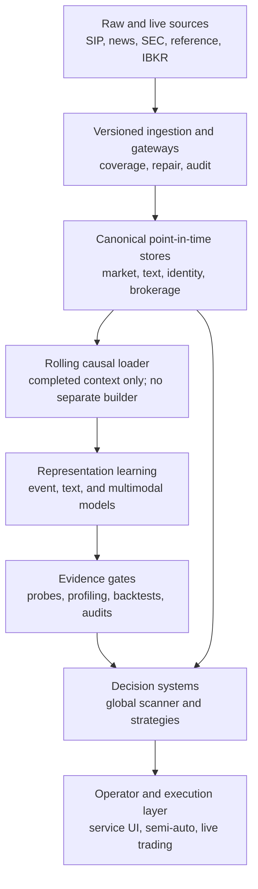

# Task History

This is the chat-independent view of durable user-requested outcomes across
the user's 2026 Codex work. `TASK_HISTORY.csv` is the canonical editable
ledger; the table below is generated from it by
`python scripts/render_task_history.py` and must not be edited by hand.

## Current Focus

- **TASK-0184 - Restructure Codex repository instructions for scoped context efficiency**. Next: full UX review validation
- **TASK-0182 - Implement News Synthesis V1 production authority**. Next: Convert and manually review the remaining 955 labels from the 2,000-news gold authority into News Synthesis documents, certify them without weakening evidence or identity requirements, rerun full-population parity, then finish historical/live and browser cutover validation.
- **TASK-0170 - Build BarGPT v1 and its one-second training-data authority**. Next: Build and certify GOOGL condition sidecars for 2019-2020 and January-July 2026, then rerun the two GOOGL-only offline shard commands to add 31 units and reach 3,069 catalog units. Complete any remaining historical sidecar metadata repair, run the bounded offline training/evaluation/resume smoke, then run the GPU profile before full training.
- **TASK-0132 - Build certified structured news rendering and article-level embeddings**. Next: Forty-one focused renderer, transport, gateway, frontend-news, enrichment-parity, V1-retirement, and V2-coverage tests pass with Python compilation and diff checks. A real persistent ClickHouse probe previously completed 20 consecutive requests on one session, crossing the former eight-request failure boundary, and a live query-log reconciliation probe passed. The exact failed date, 2024-06-20, rerendered 803 articles in 2.344 seconds with zero failures and validated 7,438 blocks across 15 batches, 803 complete rendered rows across two batches, and 1,409 ticker links. On the last completed date, 141 of 141 article texts and 182 of 182 source texts were non-empty and every stored SHA-256 matched the complete stored text; rendered length reached 55,985 characters. Remaining operational dependency: finish the full rebuild and inspect its certification audit, synchronize the unified gateway/history code, run a bounded real ClickHouse parity smoke, then restart the gateway and launch the embedding plan.

## Overall Direction

The work is converging on a local-first, explainable quantitative research
and trading platform: reliable historical/live data and identity layers feed
reusable research, scanner, backtest, and representation-learning systems;
those systems are validated through operator-facing service, semi-automatic,
and live-trading workflows before they influence real execution.

The laptop repository remains the code source of truth. The workstation
provides heavy storage, ingestion, profiling, and training capacity.

## High-Level Flow

```mermaid
flowchart TD
    A["Raw and live sources<br/>SIP, news, SEC, reference, IBKR"] --> B["Versioned ingestion and gateways<br/>coverage, repair, audit"]
    B --> C["Canonical point-in-time stores<br/>market, text, identity, brokerage"]
    C --> D["Rolling causal loader<br/>completed context only; no separate builder"]
    D --> E["Representation learning<br/>event, text, and multimodal models"]
    E --> F["Evidence gates<br/>probes, profiling, backtests, audits"]
    F --> G["Decision systems<br/>global scanner and strategies"]
    G --> H["Operator and execution layer<br/>service UI, semi-auto, live trading"]
    C --> G
```

## Ledger Summary

- Durable tasks: 165
- In progress: 41
- Completed: 116
- Superseded: 8

Times use the Vancouver offset when an exact request timestamp is available.
Date-only values identify consolidated historical boundaries where false
timestamp precision would be misleading.

## Imported Task Table

<!-- GENERATED FROM TASK_HISTORY.csv; DO NOT EDIT THIS TABLE DIRECTLY. -->
| ID | Scope | Area | Status | Task | Started | Last updated | Completed | Description | Progress / what happened | Final result or next dependency | Program contribution |
|---|---|---|---|---|---|---|---|---|---|---|---|
| TASK-0186 | quant-research-workbench | Trading configuration | Completed | Provision secure Paper Cash and Backtest account bindings | 2026-08-05 | 2026-08-05 | 2026-08-05 | Create reusable Backtest, IBKR Paper, and IBKR Cash account bindings while preserving a strict environment-to-runtime identity boundary. | Added a simulated Backtest account and two system-managed account bindings that persist only IBKR_PAPER_ACCOUNT_ID and IBKR_CASH_ACCOUNT_ID references. The backend resolves the actual IDs only for Paper/Live runtime construction and preflight; the UI never receives them. Paper and Cash bindings start disabled so no broker mode can be published or activated without an explicit deployment mandate and verified discovery identity. | Focused configuration tests pass (16 tests) and the production frontend build passes. Browser verification on Accounts and Sessions confirmed Backtest, Paper, and Cash rows; only environment-key references are displayed and both broker bindings are disabled. No broker request, order, or account mutation was made. | Adds a secure multi-account configuration entry point while maintaining explicit Portfolio account binding, IBKR discovery, and deployment-mandate gates. |
| TASK-0185 | quant-research-workbench | Trading UX | Completed | Align Strategy Studio controls with All News toolbar filters | 2026-08-05 | 2026-08-05 | 2026-08-05 | Unify the Strategy Studio's editable fields, lookup selectors, popovers, toggles, and rule-stage controls with the compact theme-aware filter language used by All News without changing configuration behavior. | Follow-up visual review found the Guided Strategy start and clone workflows were governed by a separate stylesheet that still assigned the strategy section a blue accent. The final cascade changes that accent to the shared muted neutral and explicitly gives the Guided cards, clone list, choice cards, next-action panels, inputs, and focus indicators neutral surface and gray-border treatment; it preserves shared InventoryFilterSelect behavior. The execution-policy lookup now always exposes its complete list without a search field, while deadline values stay defaulted system/test parameters rather than Strategy inputs. | Verified production build and the Guided Strategy page after reload. Strategy execution forms no longer render an editable execution deadline; execution policy is explicitly non-searchable so its popover renders all options. Existing deadline contract values remain internal for execution and test compatibility. Task-history rendering and `git diff --check` pass. The Light theme and Guided mode remain selected. | Removes the competing Strategy Studio visual language while preserving one shared selection menu, theme authority, accessibility behavior, configuration contracts, and the boundary between Strategy intent and tested OMS timing. |
| TASK-0184 | quant-research-workbench | Agent governance | In progress | Restructure Codex repository instructions for scoped context efficiency | 2026-08-04 | 2026-08-06 |  | Reduce token consumption and irrelevant context without splitting the repository by replacing the monolithic instruction file with concise hierarchical AGENTS.md files and bounded task profiles. | Compared the compact policy against the previous 523-line policy and restored omitted frontend and terminal skill routing | full UX review validation | research launcher/workstation/reproducibility rules |
| TASK-0183 | quant-research-workbench | Project operations | Completed | Create durable chat-independent narrative history and task continuity | 2026-08-04 | 2026-08-04 | 2026-08-04 | Preserve reasoning, design changes, and task continuity outside transient chats so future sessions can recover state from durable history artifacts. | Inventory repository chat summaries, create the 20260804 repository-history summary in the required structure, update CHAT_SUMMARIES index linkage, and validate the regeneration pipeline by rebuilding TASK_HISTORY.md from CSV. | Use CHAT-20260804-UNKNOWN-repository-task-history as the continuity handoff for future reviews and continue News Synthesis task sequencing. | Created a recoverable cross-session project narrative and explicit continuity boundaries for long-running governance, News Synthesis, and gateway/model work. |
| TASK-0182 | quant-research-workbench | Text intelligence and Trading UX | In progress | Implement News Synthesis V1 production authority | 2026-08-03 | 2026-08-07 |  | Implement a clean, independent News Synthesis V1 engine and align historical/live paths and frontend consumption without importing legacy News V5/V9 labelers. | News Synthesis engine V7 and direct-trading audit V15 are shipped. Across the unchanged 1,045 certified-label authority, 490 eligible direct-trading news and 563 issuer units now produce 518 exact sentiment matches, 45 mixed-boundary mismatches, zero missing labels, zero engine failures, and zero V14-to-V15 regressions. V15 added article-local company/ticker binding, parent-versus-subsidiary IPO economics, complete per-unit prediction inventory, and 141 passing focused tests. | Convert and manually review the remaining 955 labels from the 2,000-news gold authority into News Synthesis documents, certify them without weakening evidence or identity requirements, rerun full-population parity, then finish historical/live and browser cutover validation. | Defines the production boundary for deterministic news intelligence and now provides a regression-gated path from the complete 2 |
| TASK-0180 | quant-research-workbench | Text intelligence research | Completed | Consolidate all 2,000 human News audits | 2026-08-03 | 2026-08-03 |  | Create one runtime-only Candidate-44 audit collection covering exactly N0001-N2000, preserving original provider metadata and texts, human gold, evaluator-authoritative comparisons, and deterministic rule traces. | Added a resumable bounded audit launcher and generated one indexed collection with exactly 2,000 unique Markdown audits and 2,000 valid index links. Current Gateway evidence is verified for 1,994 cases; six preserve frozen evidence with explicit unavailable/hash-mismatch reasons. | Use the unified audit index for human review; no generation work remains. | Makes the full human News authority directly reviewable without navigating separate historical acceptance folders. |
| TASK-0179 | quant-research-workbench | Text intelligence research | Completed | Reaudit 200 News cases and certify a new 500-case V9 authority | 2026-08-02 | 2026-08-03 | 2026-08-03 | Genuinely read and manually audit every N1301-N1500 Markdown; repair traceable gold and generic V9 defects; then sample, prediction-blind label, freeze and baseline a disjoint balanced N1501-N2000 authority before manually auditing all 500, implementing only generic deterministic repairs, regressing every prior authority and regenerating all audits. | Completed the reviewed 200 prerequisite, built and froze the disjoint N1501-N2000 authority with exact 125/200/125/50 session quotas, manually labeled and reviewed all 500 comparisons, applied 67 traceable gold repairs, implemented only generic Candidate-44 structure/identity/semantic repairs, and regenerated both final audit sets. Semantic equivalence proved 471/500 and 191/200 final packets unchanged from the fully read Candidate-41 pass; every changed packet was re-read. | Candidate 44 passed 68 targeted tests and the full regression matrix. Reviewed 500 extraction/ticker/role/direction/concept/forecast-E2E/history-E2E F1 are .936869/.873991/.671817/.565809/.646117/.566802/.873991; reviewed 200 are .941538/.883402/.782001/.477113/.638249/.600000/.883402; prior 1,300 extraction/ticker/role/forecast-E2E/history-E2E are .972995/.834343/.713604/.674338/.833769. Exactly 500 and 200 final Markdown audits were version-checked. | Extends deterministic News certification to 2,000 human-reviewed cases with a truly untouched 500-case generalization baseline, complete manual review trail, corrected gold authority, generic deterministic repairs, and regression-certified runtime evidence. |
| TASK-0178 | quant-research-workbench | Text intelligence research | Completed | Build and audit a fourth fresh 200-article News V9 acceptance set | 2026-08-02 | 2026-08-02 | 2026-08-02 | Select a new immutable 200-article News sample disjoint from the existing 1,300 human authority and Sol teacher corpus, balanced across 2010-2026 and New York market sessions; manually label all articles prediction-blind; freeze and evaluate unchanged V9 candidate 20 before inspecting differences; then manually audit every comparison and implement only generic fundamental corrections. | Froze N1301-N1500 with exact 50/80/50/20 premarket/regular/after-hours/overnight coverage; manually reviewed all 200; persisted 36 traceable gold corrections; implemented generic candidate 21 identity, role, origin and direction repairs; fixed stale prediction-cache reuse across calibration revisions; regenerated 200 final audits; and validated candidate 21 against the exact candidate-20 prior-1,300 baseline. Validation: 57 targeted tests passed, 125 Python modules parsed, and final runtime audit count/title/content were verified. | Candidate 21 passed the regression gate: prior-1,300 extraction/ticker/direction/forecast-direction/concept/forecast/end-to-end/history F1 all improved, role was unchanged, and source-origin macro F1 changed only -0.000115. The reviewed 200 remains a difficult evidence set with 181 residual mismatches retained for future generic development. | Adds a larger untouched generalization authority, a complete forensic review trail and version-safe deterministic prediction reuse without sample hardcoding. |
| TASK-0177 | quant-research-workbench | Text intelligence research | Completed | Build and audit a third fresh 100-article News V9 acceptance set | 2026-08-02 | 2026-08-02 | 2026-08-02 | Select a third immutable 100-article News sample disjoint from the existing 1,200 human authority and Sol teacher corpus, balanced across 2010-2026 and New York market sessions with explicit premarket and after-hours coverage; manually label all articles prediction-blind; evaluate deterministic V9; manually audit every forensic comparison; and implement only generic fundamental corrections. | Manually reviewed all N1201-N1300 source metadata, rendered text, gold and V9 outputs; persisted 100 substantive review records; applied 15 traceable gold corrections; implemented candidate 20 generic separation of observed reactions, related links, guidance, M&A and operations semantics; regenerated all predictions and 100 Markdown audits; and recertified the combined 1,300-item authority. Candidate 20 improved role/origin/direction/forecast-direction/concept F1 to 0.678496/0.524996/0.492957/0.525000/0.630807. | Use the remaining 88 article-level differences as the next generic V9 development backlog; do not optimize against source IDs or exact headlines. | Adds a third untouched temporal and session-balanced acceptance authority and a genuinely reviewed regression set for the deterministic News classifier. |
| TASK-0174 | quant-research-workbench | Trading configuration UX | In progress | Refactor all non-Canvas configuration pages | 2026-08-02 | 2026-08-03 |  | Majorly restyle Strategy Deployment Portfolio OMS Protection Accounts and Releases in Guided and Expert modes through one coherent shared configuration system while preserving canonical schema validation publication and runtime authority. | Implemented the latest Strategy acceptance refinement. Guided prompts are now header content without a blue rail or redundant Decision label; answer headers omit the redundant Your answer label. The expanded clone path is a two-stage source-selection and configuration-review workspace. One reusable NextActionArea automatically scrolls and moves keyboard focus from path selection to the required source or name control, with reduced-motion support and an explicit non-color Next action label. | The production build and source checks pass. The connected browser continued serving the prior bundle and its security policy rejected automated refresh, so a refreshed live visual and interaction pass remains the explicit acceptance dependency. | Delivers one legible configuration workflow across every non-Canvas authority without changing the canonical schema validation publication or runtime ownership boundaries. |
| TASK-0173 | quant-research-workbench | Text intelligence research | Completed | Build a fresh 100-article blind acceptance extension for News V9 and V10 | 2026-08-01 | 2026-08-02 | 2026-08-02 | Select 100 balanced News articles excluded from both the existing 1,000 human authority and the 10,000 Sol teacher corpus; manually review and persist complete issuer-scoped semantic labels without seeing V9 or V10 predictions; extend the human authority to 1,100; evaluate both candidates only on the new frozen 100; and provide complete article-level audit evidence for every result. | Added one shared transport-artifact rejection authority across URL extraction, normalization, renderer v3, historical packed-text compatibility and audits; corrected N1019/N1068 from primary events to syndicated editorial analysis; removed N1068's issuer-incorrect US AIA unit; rebuilt the 1,100 authority; reevaluated V9 candidate 8; and regenerated all 100 audits. | Completed with 27 passing Benzinga tests and 106 passing semantic-calibration tests. All 100 semantic audit sections are free of bot/JavaScript transport payloads. V9 candidate-8 metrics: extraction .925, ticker .622, role .514, origin .475, direction .414, forecast-direction .410, concepts .529, forecast E2E .747, reaction E2E .747, and history E2E .622. | Turns the fresh acceptance collection into a strict regression authority for a fundamentally scoped deterministic News classifier rather than a keyword-weight calibration layer. |
| TASK-0172 | quant-research-workbench | Text intelligence research | Completed | Train and evaluate a TF-IDF random-forest News V10 | 2026-08-01 | 2026-08-01 | 2026-08-01 | Train a reproducible bagged random-forest classifier using only the 9,997 valid Sol teacher articles, TF-IDF text features, and no human labels; evaluate it on all 1,000 disjoint human-reviewed articles under the same semantic metric contract as deterministic V9. | Implemented leakage-resistant word/character TF-IDF representations, target-entity masking, bounded bootstrap forests, separate article and issuer heads, runtime-only model persistence, full human evaluation, and an identical V9 comparison. Three focused tests and the complete semantic-calibration test suite pass. | V10 improves extraction F1 from 0.921 to 0.934, forecast eligibility from 0.697 to 0.828, and issuer-history eligibility from 0.897 to 0.959. It regresses ticker scope, role, origin, direction, and concepts; concept F1 falls from 0.458 to 0.244 because of 9,678 false positives. V9 remains the better complete semantic authority; V10 is retained only as evidence for a possible constrained eligibility auxiliary. | Establishes a learned TF-IDF bagging baseline and shows precisely which semantic decisions benefit from weak-supervision learning without authorizing a production cutover. |
| TASK-0171 | quant-research-workbench | Text intelligence research | Completed | Improve the deterministic News authority with the Sol teacher corpus | 2026-08-01 | 2026-08-01 | 2026-08-01 | Use the completed balanced Sol teacher corpus as a broad error-discovery and calibration authority, preserve the 1,000 human-reviewed V3 collection as the human benchmark, and improve the readable rule-only deterministic News classifier without a learned runtime artifact. | Implemented deterministic V9 with an immutable provider/headline-template grouped split of 7,997 development, 1,000 validation, and 1,000 locked-test teacher articles; zero group leakage; constrained structural, concept, eligibility, signed-weight, and threshold calibration; explicit rejection of teacher rules that regress human evidence; runtime-only readable constants; and split-aware evaluation. The 68-test semantic calibration suite and compilation pass. | V9 remains a reviewed candidate rather than an automatic production cutover. On the locked Sol test, role improved 0.500 to 0.509, origin 0.497 to 0.501, direction 0.396 to 0.401, concepts 0.297 to 0.323, and forecast eligibility 0.803 to 0.814. Human development evidence improved role, origin, concepts, and forecast eligibility while direction was effectively flat; neutral-direction F1 remains the principal limitation. | Uses broad semantic teacher coverage to improve a fast, explainable production-compatible authority while retaining explicit validation boundaries and human-reviewed evidence. |
| TASK-0170 | quant-research-workbench | Market representation learning | In progress | Build BarGPT v1 and its one-second training-data authority | 2026-08-04 | 2026-08-07 |  | Create BarGPT v1 over one raw event-derived, point-in-time identity-safe SIP basis with three-session daily geometry, online multiscale rollups, and anchor-relative causal handling of split unit changes for both context and targets. | The eager offline_shards_v2 catalog now contains all 3,038 units for the prior 98-identity authority across 24 training and seven 2026 validation months. The GOOGL Class A identity defect was repaired through an exact-FIGI SEC-backed point-in-time correction while preserving Massive raw events; GOOGL was removed from quarantine, increasing the eligible authority to 99 tickers and the fixed validation panel from 196 to 198 blocks. DataConfig now supports one-ticker shard compilation while training still requires at least two tickers. Condition-label preflight composes independently certified ticker artifacts, enabling a bounded GOOGL-only condition build to extend the existing cohort certification without rebuilding all tickers. Google-only dry plans resolve exactly 24 training and seven validation ticker-month units. Commits 8645dfc8 and 2e72aec7 were pushed, both workstation code layouts were SHA-256 synchronized, q_live has the corrected GOOG-to-GOOGL intervals with zero unapplied corrections, and 113 BarGPT/reference tests pass. | Build and certify GOOGL condition sidecars for 2019-2020 and January-July 2026, then rerun the two GOOGL-only offline shard commands to add 31 units and reach 3,069 catalog units. Complete any remaining historical sidecar metadata repair, run the bounded offline training/evaluation/resume smoke, then run the GPU profile before full training. | Establishes one production-compatible event-derived geometry and training contract whose transforms depend only on the example anchor and point-in-time corporate-action state. |
| TASK-0169 | quant-research-workbench | Text intelligence research | Completed | Build a balanced 10,000-article Sol teacher corpus | 2026-08-01 | 2026-08-01 | 2026-08-01 | Select an immutable reproducible 10,000-article News corpus spanning 2010 through 2026, balance historical periods and semantic/source/ticker categories, exclude every article in the existing 1,000-item human ground-truth authority, and extract structured Sol labels through the OpenAI Batch API with bounded auditable spend and restart-safe collection. | The repaired V2 execution completed all 40 partitions. It produced 9,997 validated structured labels and retained three durable request failures from the immutable 10,000-article selection, with zero overlap against the human gold collection and $99.2860135 actual Batch cost. | Completed as a broad teacher and error-discovery corpus. The three failures remain explicit and are excluded from scoring rather than hidden or fabricated; human-reviewed V3 remains the sole acceptance authority. | Expands semantic supervision beyond the human calibration set while preserving the frozen evaluation authority and enabling future deterministic authority improvement or compact-model training. |
| TASK-0167 | quant-research-workbench | Trading configuration UX | Completed | Apply a theme-aware visual system across configuration pages | 2026-08-01 | 2026-08-01 | 2026-08-01 | Use the supplied unapproved draft as visual inspiration to improve Strategy and the remaining configuration pages with colorful orientation icons clearer hierarchy and stronger Strategy Portfolio OMS cues while preserving the application's theme scale and authority contracts. | Corrected the rejected first pass by removing its 1560-pixel page cap, radial gradients, shadows, heavily tinted group headers, oversized spacing, and locally colored primary buttons. Configuration pages now fill the main workspace, retain the established three-column form grid, use flat theme surfaces and thin borders, and reserve domain color for icons, rails, guidance, journey state, and the Strategy to Portfolio to OMS handoff. The scaled sidebar is fixed to the application header boundary with explicit expanded and collapsed widths, and the main region is explicitly kept in grid column two. | TypeScript and the Vite production build passed in an isolated runtime. At the reported 2048 by 768 viewport and 125 percent scale, measured header bottom and sidebar top both equal 80 pixels for a zero-pixel gap; the configuration surface uses 1668 of the 1728 available main pixels with only the intended 30-pixel content inset and zero page overflow. Strict browser review passed 14 all-route Light scenarios, 16 Dark scale-extreme scenarios across the densest forms, and 16 Live and Service Health shared-sidebar regression scenarios with zero objective issues. Representative screenshots were inspected and the isolated preview was stopped. | Makes the full configuration family easier to navigate and understand while retaining one theme authority and the existing Strategy Portfolio OMS responsibility boundaries. |
| TASK-0168 | quant-research-workbench | Trading configuration UX | Completed | Build a guided Configuration Studio | 2026-08-01 | 2026-08-01 | 2026-08-01 | Replace the field-first starting experience with one hybrid Configuration Studio that offers recommended setup, guided decisions, approved-release cloning, and the complete expert editor over the same canonical Strategy, Deployment, Portfolio, OMS, Account, and publication draft authority. | Replaced the three-question Strategy shortcut with a lifecycle-driven 29-question default flow covering behavior, identity, initial capital and execution intent, opportunity/confirmation/blockers, add actions, reentry, every strategic exit, registered capabilities, and every published advanced parameter. Added visible section counts, section-level default approval, inline decision guidance, compact forms, and a persistent setup-so-far recap while preserving the canonical draft and Expert editor. | Completed and validated: production TypeScript/Vite build passed; browser checks covered all seven Strategy sections, dark/light themes, 80% and 125% UI scales, 1440x900 and 900x800 viewports, bounded page width, and a clean browser console. Focused Python tests could not run because pytest is not installed in the available Python environment. | Makes Strategy, Portfolio, OMS, protection, and account setup understandable as human decisions without weakening runtime authority or hiding advanced control from Expert mode. |
| TASK-0166 | quant-research-workbench | Text intelligence and Trading UX | Completed | Unify News and SEC inventories and readers with the supplied app design | 2026-08-01 | 2026-08-01 | 2026-08-01 | Translate the supplied complete React design into one shared Canvas presentation system for All News, All SEC, News Detail, and SEC Detail while preserving every server-side query filter, deterministic classification field, sortable sentiment score, point-in-time status, complete loaded evidence, and responsive behavior. | Widened the shared filter popup beyond exact glyph measurement with a 28-pixel readability-scale safety margin and a 210-pixel readability-scale minimum. This gives News and SEC Role values comfortable space instead of merely avoiding mathematical overflow. Every popup option, including the selected value, now uses regular 400 weight rather than medium 500 weight. | TypeScript and the production Vite build passed. Browser validation inspected News and SEC Role menus in Light 100 percent, Dark 80 percent, and Dark 125 percent. The popup measured 210 pixels at 100 percent, 262.5 pixels at readability-compensated 80 percent, and at least 212.5 pixels at 125 percent; every Role label was uncut and viewport-contained, the nine-value News list did not scroll, and every option computed to font-weight 400. The temporary server was stopped and Dark 125 percent All SEC state was restored. | Makes complete point-in-time News and SEC intelligence faster to scan and read without weakening backend-query, deterministic-label, or source-detail authority. |
| TASK-0165 | quant-research-workbench | Trading configuration UX and architecture | Completed | Complete Live Paper portfolio OMS and risk configuration authority | 2026-08-01 | 2026-08-01 | 2026-08-01 | Make one approved release authoritative across Replay Backtest Paper and Live; expose every implemented portfolio risk execution-policy protection-profile account-binding and effective-configuration field; preserve environment variables for secrets and external broker discovery only; and validate all configuration routes without weakening IBKR or operator safety gates. | Schema v8 now publishes full execution-policy and protection-profile catalogs and projects their exact revisions into strategy intents. Approved releases own Portfolio policies mandates groups and exact multi-account mode bindings; IBKR environment values are discovery inputs and mismatches fail closed. The guided Portfolio and OMS pages expose the complete implemented policy contracts including continuous risk bounded repricing partial-fill handling one-to-four swing or price protection slices trailing transitions and a mode-specific effective projection. Legacy portfolio JSON remains bootstrap-only when no approved release exists. | Validated Python compilation; 113 focused and adjacent Portfolio OMS strategy runtime Replay and preflight tests; the TypeScript and Vite production build; and 46 strict browser scenarios across Portfolio OMS Accounts and Approved Releases in light and dark themes normal and compact viewports and supported scale extremes with zero objective issues. The temporary preview server was stopped. Authenticated operator-authorized IBKR Paper order acceptance remains the deployment gate and no broker order was placed. | Closes the configuration-to-runtime authority gap so independently configured IBKR accounts and simulated modes share one immutable auditable policy contract from strategy intent through Portfolio OMS protection and continuous risk. |
| TASK-0164 | quant-research-workbench | Text intelligence and Trading UX | Completed | Make News and SEC detail readers responsive and readable | 2026-08-01 | 2026-08-01 | 2026-08-01 | Make the shared News and SEC detail surface use the maximized Canvas workspace effectively, place document scrolling on the page-edge Canvas surface, and provide a clear evidence-first typographic hierarchy at every supported application scale. | Moved the shared News and SEC document scroller from the fixed-height inner article to the full-width Canvas parent. The reader now uses normal document flow with visible overflow and responsive minimum height. Restyled the shared detail hierarchy with materially larger headlines, context, labels, values, issuer evidence, classification metadata, article prose, filing documents, provenance, and XBRL data; SEC metadata now wraps instead of truncating long values. | The final TypeScript and Vite production build passes. Live browser review used populated News and SEC records at Light 80 percent on 2048 by 1024, Light 100 percent on 1280 by 720, and Dark 125 percent on 1280 by 720. In every case the page-edge Canvas parent was the only vertical scroller, the inner reader remained non-scrollable, wheel input advanced the parent, horizontal overflow was zero, and runtime console errors were zero. The validated type hierarchy includes 17 pixel article text, 12 pixel evidence labels, 15 pixel classification values, and 14 pixel SEC metadata values before application scaling. No task-started service remains running. | Keeps deterministic News and SEC evidence complete while presenting it as an accessible research document in maximized Canvas workspaces. |
| TASK-0163 | quant-research-workbench | Text intelligence and Trading UX | Completed | Unwind News and SEC label filters into queryable columns | 2026-08-01 | 2026-08-02 | 2026-08-02 | Make active News and SEC query filters visibly distinct with restrained stronger text and a purple active-filter count badge. | Added an explicit default-value contract to the shared inventory filter so active styling follows query semantics rather than option position. Selected values now use a restrained higher-contrast text color, while the aggregate active count uses the theme-aware violet token with surface-contrast text. | The production TypeScript/Vite build passes. Browser validation covered News and SEC default and selected states in Light at 80 and 100 percent and Dark at 125 percent: default 7-day and Top-100 controls remained muted, active values gained contrast, the violet count badge scaled from 18 to 22.5 pixels, and no document overflow was introduced. The temporary server and validation tab were stopped after restoring Light at 100 percent. | Improves active-query recognition while preserving the compact neutral filter hierarchy and existing server-side semantics. |
| TASK-0126 | quant-research-workbench | Market data signals | Completed | Replace legacy QMD signals with composable ranked observations | 2026-07-26 | 2026-07-26 | 2026-07-26 | Remove the stale and strategy-like QMD signal catalog; implement the agreed reusable market observations with explicit clocks, causal normalized scores, lifecycle emission, and one QMD-owned rank score; replace the legacy QMD Decision action with a continuous Flow-Structure Composite and a persistent scored alignment signal; and make active and historical events directly usable in Canvas chart, Scanner, and Signal Stream. | Replaced all five legacy implemented detectors and eleven catalog-only setup concepts with directional_flow_acceleration, price_volume_expansion, vwap_transition, liquidity_dislocation, liquidity_recovery, and flow_price_divergence. Replaced the fixed 78/22 Buy/Sell/Wait QMD Decision with a confidence-weighted continuous Flow-Structure Composite, then added flow_structure_alignment as the seventh observation with indicator_derived input, indicator_update trigger, signed composite score, QMD rank score, and a 3-of-5 canonical 100 ms persistence requirement. Live bars now reach the signal engine only after being deterministically paired with their completed indicator row; historical replay uses the same path. Removed the parallel decision-event stream. Canvas exposes the composite oscillator and market-signal markers, Scanner exposes composite fields and ranks the new lifecycle, and settings migrate the retired chart indicator. Follow-ups replaced the stale QMD indicators Scanner preset with the generic Indicators taxonomy view, expanded Signals with producer and clock fields, and added a full-market QMD History replay using the shared Rust engines. Canvas now durably materializes the 100 ms QMD indicator cross-section, active ranked signals, and lifecycle events; validates non-empty cache integrity; uses explicit UTC lookup semantics; preserves base rows during the first build; and automatically refreshes the Scanner when the artifact becomes ready. | All 65 QMD library tests, 19 QMD History tests, and 28 targeted Python gateway/runtime tests pass; Rust checks and formatting and the frontend production build pass. The historical Scanner follow-up passes Python compilation, 21 targeted Python tests, all 19 QMD History tests, Rust formatting, diff checks, and the frontend production build. Real July 24 09:45 ET replay processed 70,337,016 canonical events into 9,273 distinct 100 ms indicator rows, 4,308 active signals, and 20,000 bounded lifecycle events; the Canvas payload joined 9,266 indicator rows and 2,477 securities with active signals across 12,309 base rows with no enrichment errors. Browser verification confirmed populated ranked Signals and generic QMD Indicators views. The broader UI-review harness still reports unrelated preview-clock and link-selection checks. All task-started browser and server processes were stopped. | Establishes seven reusable market observations and a generic Scanner taxonomy where Signals are grouped by domain and producer while QMD appears as an indicator type or producer rather than a separate indicator product category; historical Canvas now consumes the same causal engines through a durable cross-sectional artifact instead of presenting empty columns or UI-derived substitutes. |
| TASK-0125 | quant-research-workbench | Trading architecture | Completed | Implement composable trading taxonomy and strategy chart presentation | 2026-07-26 | 2026-07-26 | 2026-07-26 | Implement the agreed post-refactor taxonomy for typed indicators, scored market/news/SEC/model signals, explicit calculation and publication clocks, composable strategy inputs, and one strategy-agnostic Canvas chart presentation layer. | Added a shared Python taxonomy authority with indicator types, signal domains, producers, score requirements, and explicit input, calculation, evaluation, trigger, and publication clocks. Automatic strategy definitions now declare normalized indicator or signal inputs and a presentation policy. QMD catalogs project the same vocabulary; market-signal schema v2 carries domain and clock metadata; Scanner exposes taxonomy and clock columns plus Market, News, SEC, and Strategy views. Added a generic chart adapter for entries, exits, optional holds/waits, confidence labels, and invalidation levels while explicitly excluding the stale Canvas fixture. Documented the architecture and preserved legacy signal-stream settings through preset migration. | Forty-five targeted Python tests, 61 QMD tests, 19 QMD History tests, backend compilation, Rust formatting, the taxonomy API smoke check, and the frontend production build pass. Browser review reused the existing Vite listener without starting or stopping services and confirmed Canvas and Signal Stream render without browser errors or global horizontal overflow in light and dark themes, compact viewport, and 80% and 125% UI scales; the absent backend remains an explicit unavailable state. No replacement strategy or order-entry policy was introduced; strategy selection and the order-entry contract are the next design decisions. | Establishes one live/replay-compatible vocabulary and clock contract so scanners can rank reusable evidence, strategies can compose typed inputs, and presentation remains independent from strategy and order authority. |
| TASK-0109 | quant-research-workbench | News research | In progress | Test V10 time features without input LayerNorm in V12 | 2026-07-24 | 2026-07-24 |  | Create V12 as a strict single-variable ablation of corrected V10: retain its exact 11-value time vector, data, architecture, targets, loss, shuffling, split, optimizer, scheduler, evaluation, W&B project, artifacts, and resume semantics while removing only the LayerNorm immediately before the time projection. | Cloned every tracked V10 training, evaluation, diagnostic, plotting, and inference module under the V12 namespace. The V12 time branch is exactly Linear(11, d_model) then GELU; all other normalized source files match V10 after version renaming. Added an explicit architecture assertion and documented the controlled hypothesis and checkpoint incompatibility. | All 26 focused V12 tests, Python compilation, normalized source comparison, and a complete one-epoch dummy train, validation, and checkpoint smoke pass locally. Commit fb426918b is pushed; all 24 version files are SHA-256 identical in the standalone workstation runtime, which imports the V12 model as Linear(11, 384) then GELU with 2,733,513 total parameters and resolves the 50-epoch launcher successfully. V13 is now the active fusion experiment; V12 remains available as its direct baseline. | Provides a clean measurement of whether sample-wise LayerNorm helps or harms V10's bounded task-specific publication-time representation. |
| TASK-0108 | quant-research-workbench | News research | Completed | Add causal V1 publication-time context to news reaction model V11 | 2026-07-24 | 2026-07-24 | 2026-07-24 | Create V11 from the fixed latest V10 as a controlled time-representation ablation: preserve its text and point-in-time stock-state inputs, opportunity heads, targets, model capacity, loss, shuffle, chronological split, scheduler, evaluation, W&B project, artifacts, and resume behavior while replacing V10's custom 11-value time vector with the exact causal V1 timestamp features. | Introduced one shared packed-market timestamp authority and made the causal V1 event loader and V11 training/live inference paths consume its ordered 12-column contract. V11 derives UTC second, weekday, and annual cycles; years since 2000; New York session second and progress; and regular, premarket, and after-hours flags directly from published_at_utc. The saved time contract, model diagram, launchers, evaluation paths, and guide identify the ablation and unchanged V10 comparison settings. The generic workstation sync authority now also copies non-test Python modules shared at a model-family root, preventing standalone versions from omitting reusable dependencies such as the price-band P&L evaluator. | Thirty-three focused sync, shared P&L, and V11 tests plus Python compilation pass. A one-epoch end-to-end dummy train, validation, and checkpoint smoke run passes. The evaluation and guide explicitly confirm that V10/V11 use raw anchor-relative asset returns inherited from V4, not V1-V3's SPY-adjusted abnormal returns; the chronological split does not transform targets. The missing shared price_bucket_pnl module and corrected sync utility are hash-verified in the V11 workstation runtime, and the exact isolated workstation package now imports and renders run_train --help successfully. Run python -m research.news_reaction_model.v11.run_train from the workstation V11 folder. | Provides a directly comparable test of whether causal calendar and exchange-session timing adds predictive information beyond fixed V10 without confounding text, fundamentals, learning task, optimization, or data split. |
| TASK-0107 | quant-research-workbench | News research | In progress | Train three-class opportunity news reaction model V10 | 2026-07-24 | 2026-07-24 |  | Train and evaluate V10's per-horizon no-opportunity, upside-dominant, and downside-dominant task, then correct the five training-system defects found by the full audit: incomplete resume state, month-only shuffling, label-count-weighted horizon loss, single-batch training metrics, and missing causal publication-session context. | Preserved the three-class target contract and OpenAI plus point-in-time stock-state inputs. Corrected V10 now adds an 11-value causal exchange-time channel; bounded deterministic 32,768-article shuffling; equal per-horizon cross entropy; rolling, epoch, horizon-macro, and label-micro metrics; validation-loss-only best checkpointing; exact model, optimizer, scheduler, scaler, RNG, cursor, accumulator, and checkpoint-manager restoration; dataset and training-contract resume validation; and forced latest-checkpoint ordering behind pending asynchronous writes. The default launcher is the aligned 50-epoch, 49-restart cosine schedule with a 3e-4 initial peak, 0.98 cycle decay, and 1e-6 minimum under a new time-balanced run name. | The earlier baseline remains valid historical evidence but is not resume-compatible with corrected V10. Twenty-five focused tests, compilation, deterministic shuffle/resume checks, a bit-exact next-dropout-forward restore test, and a two-stage end-to-end dummy train/resume smoke pass locally. The corrected files are synced and hash-matched to the workstation; retrain with python -m research.news_reaction_model.v10.run_train, then evaluate the new best validation checkpoint. | Makes the next V10 comparison attributable to the intended learning task instead of loader order, horizon availability, misleading batch metrics, missing session context, or broken continuation semantics. |
| TASK-0106 | quant-research-workbench | News research | Completed | Train four-class opportunity-only news reaction model V9 | 2026-07-24 | 2026-07-24 | 2026-07-24 | Create V9 as a controlled V8 learning-task ablation: retain the exact OpenAI embedding and point-in-time stock-state representation, encoder, chronological split, capacity, optimizer, scheduler, W&B project, artifacts, and workstation workflow; remove all ending, high, and low range heads; and predict only no meaningful opportunity, upside dominant, downside dominant, or two-sided ambiguous for each horizon. | Implemented, trained for 15 epochs on 2019 through 2025, and evaluated one four-logit opportunity head per horizon on 44,301 articles and 236,962 valid 2026 horizon labels. The best checkpoint was epoch 10 with log loss 1.1059, 43.78 percent accuracy versus a 37.73 percent majority baseline, 36.25 percent balanced accuracy, and 34.81 percent macro-F1. It predicted the 6.85 percent ambiguous class zero times at every epoch. The descriptive midpoint proxy produced 3,578.50 dollars across independent one-share horizon positions with a 50.11 percent win rate, but it is not executable because it uses realized extrema and ignores path, costs, and repeated news across horizons. | Fourteen focused tests, compilation, dummy training, workstation hash verification, full training, and automatic evaluation completed. V9 demonstrated modest three-class separation but proved the separate ambiguous label ineffective under this decision task. V10 supersedes only that class contract by assigning meaningful two-sided moves to their larger absolute excursion while retaining no-opportunity abstention. | Tests whether a decision-aligned opportunity task is materially more learnable than V8's 30 independent range heads without confounding the result with a new representation, larger encoder, or changed training schedule. |
| TASK-0102 | quant-research-workbench | Market data signals | Completed | Consolidate QMD flow and structure into one canonical decision | 2026-07-23 | 2026-07-23 | 2026-07-23 | Retire the stale 25, 100, and 500-event forecast surface; make Generic Structure auditable by scale and complete causal event history; replace overlapping architecture and structural-pressure oscillators with one strategy-readable Buy, Sell, or Wait decision; and present the same decision as both an oscillator and a sparse price-chart signal. | Indicator schema v16 replaces the event-horizon fields with qmd_decision_signal, confidence, action, and reason. The timeframe-native microstructure trigger is gated by minimum directional evidence and causal Generic Structure context; material disagreement produces WAIT instead of a misleading averaged direction. Live and historical gateway rows, persistence, catalogs, backend clients, and Canvas consume the same contract, while the obsolete standalone forecast routes and rolling horizon implementation were removed. QMD History now projects the complete persisted structure-event stream, and Canvas renders up to 100 causal BoS and CHoCH pivot-to-confirmation connectors with independent micro, tactical, and context legend controls. Current zones remain the compact live-edge default; auction and regulatory references moved to a separate package. The decision oscillator shows signed action plus confidence. The optional price presentation emits a green Buy or red Sell state-change marker on the next candle, which is the first actionable point after the source candle closes; marker text is only the confidence percentage, while WAIT and decision shading are intentionally absent. Fixed symmetric chart gutters keep every pane legend on one x coordinate. A bounded sampled-event fallback supports rolling gateway upgrades without becoming a second structure authority. | All 55 shared QMD gateway tests and all 14 QMD History tests pass, including focused decision gating and interval-merge algebra. Backend Python compilation and the frontend TypeScript plus Vite production build pass. A strict Light 100 percent 1440 by 1000 AAPL 10-second browser review completed 12 mixed chart interaction cycles with finite rendering, zero scale recoveries, zero console or page errors, aligned pane legends, complete per-scale structure controls, and zero objective issues. The causal marker follow-up also passed the frontend TypeScript and Vite production build. A focused Light 100 percent 1440 by 1000 AAPL 10-second browser capture confirmed green Buy and red Sell arrows, percentage-only labels, and no decision shading; the harness reported one expected overlay-legend assertion because this marker-only package has no line-series legend. The existing user-managed QMD History process was not restarted, so populated qmd_decision values require its next restart onto schema v16; the compatibility path kept structure controls available during that transition. | Establishes one causal, timeframe-native QMD decision contract for strategies and two non-duplicative chart views while preserving the underlying diagnostic indicators for explanation rather than manual voting. |
| TASK-0101 | quant-research-workbench | News research | In progress | Create V8 OpenAI text-representation ablation from V7 | 2026-07-23 | 2026-07-24 |  | Copy V7 into a self-contained V8 experiment and change only the text representation: remove all TF-IDF-derived word, character, and numeric channels, replace them with the durable 3,072-value OpenAI embedding, and preserve V7 point-in-time stock state, targets, heads, losses, training defaults, evaluation, artifacts, and W&B comparison authority. | Implemented the complete two-channel V8 ablation, trained it on 2019-2025, and evaluated the best checkpoint on the same 44,301-article 2026 population as V7. V8 now also supports a selection-only confidence and directional-edge threshold sweep without retraining or changing its baseline plan. Plan confidence is the weaker winning-class probability from the high and low heads because both determine direction; directional edge is the absolute difference between conservative predicted upside and downside. The evaluator exports the underlying confidences and excursions, produces horizon and anchor-price sweep reports with coverage, long/short P&L, win rate, profit factor, mean/median active return, and uncertainty intervals, and fails if the zero-threshold row does not exactly reproduce the original ledger. | The OpenAI authority and V8 materializer completed exact coverage for 486,178 articles. Training completed for 15 epochs; the best held-out checkpoint was epoch 10 with log-loss 1.7235 versus V7 1.7336, while the unchanged one-share evaluation produced +$692.15 versus V7 -$713.24 before costs. Eighteen focused V8 tests and Python compilation pass locally. The committed evaluator, inference contract, tests, and guide were synced to the workstation V8 runtime and match the laptop source by SHA-256. Remaining dependency: rerun the existing best checkpoint and analyze the threshold grid; any selected rule remains exploratory until confirmed on a later untouched period. | Provides a controlled representation-quality experiment and a reproducible selection-quality analysis that isolates OpenAI embeddings while retaining causal fundamentals and identical forecasting semantics. |
| TASK-0097 | quant-research-workbench | Trading UX | Completed | Turn standalone XBRL Facts into causal financial evidence analysis | 2026-07-22 | 2026-07-22 | 2026-07-22 | Redesign the standalone XBRL Canvas container around classified SEC evidence, actionable derived metrics, evidence-weighted scores, and filing-to-filing change rather than a flat raw-facts table. | Upgraded the analysis authority to an explicit v2 closed-form contract. Every profitability, growth, cash-quality, balance-sheet, and capital-discipline component now exposes its raw value, unit, normalization bounds and direction, component and category weights, normalized score, coverage, effective weight, and contribution points. The composite excludes withheld low-coverage categories and remains causal. Reported evidence now retains every comparable causal observation filed from January 2019 through the selected clock, period-over-period change, a defensible semantic direction, freshness, and filing audit fields. Rebuilt the container around a large overall decision, selectable overall or category gradient trajectories, readable weighted category cards, an inspectable calculation panel, larger derived metrics, reported-evidence cards with per-field gradient histories, and expandable source details. The time-proportional chart now uses an external Y-axis gutter, seven date ticks, purple gradient analytical context, and green or red only for favorable or unfavorable evidence. The comprehensive guide and architecture document explain the objective, exact formulas, every category and range, coverage rules, history, colors, causality, audit trail, and limitations. | Sixteen focused ticker-facts backend tests pass, including the v2 score contract, 2019 query boundary, revision-safe historical selection, coverage withholding, causal filing states, comparable reported history, and semantic change tone. The frontend TypeScript and Vite production build passes. Browser validation against a representative 2019-to-2026 causal fixture confirmed Jan 2019 and six additional time ticks, an external non-overlapping Y-axis, purple composite line and gradient, semantic green histories, and zero horizontal overflow at normal and compact widths. Live ClickHouse was unavailable, so prior live AAPL findings are not reused as validation for this follow-up. | Turns canonical SEC XBRL history into an explainable, point-in-time financial quality system whose scores are reproducible by strategies and whose conclusions remain readable and auditable in Canvas. |
| TASK-0100 | quant-research-workbench | News research | In progress | Build durable OpenAI embeddings for the V7 news experiment corpus | 2026-07-22 | 2026-07-23 |  | Batch the exact single-ticker article population used by the V7 experiment, extract reusable OpenAI embeddings, persist vectors and provenance in ClickHouse, and enforce a hard job-level ceiling of no more than 50 dollars with durable usage accounting and quota-aware stopping. | Added a resumable OpenAI Batch pipeline for text-embedding-3-large with the unchanged V5/V7 publication-text contract and exact V7 article identity. It pre-tokenizes the complete corpus before any paid request, rejects incomplete source joins or item plans, constrains every embedding request and Batch, keeps one Batch in flight, reserves queued tokens at the full synchronous price, records estimated and actual tokens and costs in durable per-item and per-batch ClickHouse tables, stops on quota or billing-limit responses, retries only bounded correctable failures, streams large output files, cleans reconciled local and remote files, and never logs or copies the API key. Planning preserves typed DateTime64 filters, encodes source text literally even when it spells tokenizer control tokens, validates API authentication before expensive work, writes native ClickHouse UTC timestamps, and explicitly aliases planned-source projections so ClickHouse JSON keys remain stable for batch construction. Read-only ClickHouse operations now survive transient connection timeouts through eight bounded reconnect attempts with exponential backoff; durable writes remain single-attempt so ambiguous responses are reconciled from versioned table state instead of being blindly replayed. | Thirteen focused tests and Python compilation pass, including transient ClickHouse timeout recovery and non-retry of deterministic query errors. After a WinError 10060 occurred during a post-reconciliation status SELECT, the live workstation audit proves retained progress: 448,158 of 486,178 embeddings are durable, 32,122 items remain planned, 5,898 belong to the already-submitted active batch, zero items failed, zero duplicate identities exist, and zero vectors have invalid dimensions. Durable actual usage is 169,959,243 tokens and USD 22.094699; the active batch reserves 2,498,969 tokens and USD 0.649732. Remaining dependency: sync the retry fix and rerun the same execute command so it reconciles the active batch before submitting remaining work. | Creates a reusable semantic feature authority for fair representation ablations while making external embedding spend bounded, auditable, resumable, and safe under interruption or exhausted quota. |
| TASK-0096 | quant-research-workbench | Trading UX | Completed | Add the Canvas market-screening package | 2026-07-22 | 2026-07-23 | 2026-07-23 | Complete Canvas configuration with a shared, point-in-time market Scanner, a newest-first strategy-aware signal list, and reusable user- or strategy-owned watchlists; make dense market tables understandable, configurable, and consistent across live, replay, and backtest modes. | Completed Scanner, Signal Stream, and Watchlist UX with explicit provider identity, ticker intelligence, linked-chart handoff, and a shared grouped field catalog. The scanner batch-projects 74 financial fields through the canonical Stock Facts/XBRL calculations and exposes eleven formula-aware technical definitions. Interval is now a parameter only for genuinely interval-based measurements such as return, volume, counts, high, low, and range. Standard anchored VWAP exposes session anchor and price source instead: extended or regular session plus HLC3 one-minute source bars or exact trade prices. Relative volume uses cumulative extended-session volume against the same elapsed fraction of a 20-completed-session baseline. Customized definitions persist their applicable parameters and appear under Custom; static fields show the latest point-in-time value without an irrelevant interval. One set-based market-wide query and a versioned causal cache serve Scanner, Signal Stream, and Watchlist without per-symbol QMD fan-out. | Eleven focused backend tests pass, covering full-universe materialization, canonical financial/reference projections, exchange-session interval and anchor boundaries, HLC3 and exact-trade VWAP formulas, and source-specific projection keys. Python compilation and the frontend production build pass. Real-browser validation confirmed generic technical catalog entries are not duplicated by timeframe; VWAP exposes only Anchor and Source, interval metrics expose only Interval, and relative volume explains its fixed extended-session 20-session baseline. Strict UI review reported zero objective issues at Light 80% wide and Dark 125% compact. Live numerical ClickHouse validation could not be repeated because the configured local authority refused connections; contract, query construction, tests, build, and UI were validated without claiming live population. The formula and parameter contract is documented in docs/trading/CANVAS_MARKET_SCREENERS.md. | Adds the final market-discovery layer to Canvas while keeping column semantics, causal clocks, strategy persistence, user-managed membership, chart handoff, and explainable financial and technical evidence explicit and reusable across trading modes. |
| TASK-0091 | quant-research-workbench | Reference data | Completed | Correct Reference Gateway publication failure semantics | 2026-07-21 | 2026-07-21 | 2026-07-21 | Resolve the Reference Gateway degraded error caused by permanent counting of superseded retries, nonuniform SEC fails-to-deliver archive URLs, the January 9 2025 FINRA exceptional market closure, and transient ClickHouse schedule-checkpoint resets. | Changed source health to collapse attempts by logical source window and distinguish frontier failure from older unresolved windows. SEC FTD now uses exact official page links, missing historical links fail loudly, and the FINRA special closure is catalogued. A targeted repair resolved one FINRA and eight SEC windows and wrote 383,028 SEC rows with zero failures. The next child loaded the fix and completed 36 catch-up windows, but a ClickHouse reset on the final source-schedule checkpoint exposed an inadequate retry boundary and opaque captured-output payload. Schedule control-plane queries now use bounded exponential retry, while checkpoints persist only structured cadence fields and leave command/output tails in runtime logs. | Seventeen reference-data tests, gateway smoke, compilation, live ClickHouse state checks, workstation hash/test verification, and an explicitly forced-due production child cycle pass. The final cycle completed the deep coverage-aware fill, persisted its compact checkpoint, returned exit code 0, and retained only known nonfatal identity-review warnings. Commits a25c97ee9, 359e2f12e, and the final compact-checkpoint correction were pushed. | Makes publication health retry-aware and source-authoritative while ensuring a transient control-plane reset or diagnostic output cannot discard a successful cycle or stop the gateway. |
| TASK-0092 | quant-research-workbench | News research | Completed | Compare deterministic, v1, and v2 news-reaction P&L | 2026-07-21 | 2026-07-21 | 2026-07-21 | Evaluate the deterministic language model, embedding classifier v1, and regression v2 on one identical 2026 article-horizon ledger and report separate one-share long, short, flat, and total gross P&L by horizon. | Added a reusable comparison evaluator and workstation launcher. Exact identity includes canonical news ID, ticker, publication timestamp, and horizon. V1 uses class-head argmax, v2 uses the 0.25 training-scale flat band, and deterministic v2.1 uses persisted classes while explicitly counting unavailable predictions as flat. JSON and CSV artifacts retain long and short counts and P&L independently plus totals across horizons. | Seventeen focused tests and Python compilation pass. The live comparison matched all 236,938 v2 ledger rows; deterministic predictions existed for 217,571 rows and 19,367 unavailable predictions were explicitly flat. Across independently treated horizons, deterministic gross one-share P&L was plus 1,086.89 dollars, v1 was plus 4,346.17 dollars, and v2 was minus 1,176.02 dollars. These are descriptive signal ledgers before costs, overlap, capital constraints, and execution effects. | Creates a common evidence base for comparing model direction quality without changing labels, entry prices, horizons, or validation membership between methods. |
| TASK-0090 | quant-research-workbench | Trading UX | Completed | Add a global live performance summary to Canvas | 2026-07-21 | 2026-07-21 | 2026-07-21 | Keep the five most important live account and trading-performance metrics visible beside Canvas market status without crowding individual containers or deriving inconsistent values in the browser. | Added one canonical performance_snapshot contract to live, replay, and backtest state. It defines New-York-session net P&L as realized flat-to-flat episodes closed today plus current unrealized P&L, counts nonzero positions, retains realized and unrealized components, and publishes broker available funds with a total-cash fallback and explicit basis. Canvas requests a compact canonical snapshot with a version-tolerant normalization path, uses completion-based single-flight refreshes, pauses while hidden, and retains the last trustworthy account-matched snapshot across reloads with an explicit stale state until refresh. Independent IBKR reads execute through bounded concurrency. The Performance lead-in sizes to its content, while five adjacent equal compact metric cells use larger primary numbers; the remaining toolbar track stays empty and expands before Canvas actions. | Fifteen canonical trading tests pass, including a concurrency regression test; Python compilation and the frontend TypeScript/Vite production build pass. Exact browser timing reproduced 18.46 seconds of empty metrics before the fix. A current-code endpoint returned the five canonical values in 2.84 seconds, and browser reload review immediately retained +$50 Net P&L, one open position, +$50 unrealized, $0 realized today, and about $715K available cash while marked stale, then refreshed to ready. Browser geometry verified five contiguous 110-pixel metric cells, flexible empty toolbar space, and 14-pixel primary values; the longest exercised value, $714.8K, matched its available text width without clipping. The production build passes and no task-started service remains running. | Makes account risk and performance continuously visible across every Canvas arrangement while keeping one cross-mode calculation authority, eliminating cumulative broker-read latency, surviving reload and deployment boundaries, and leaving room for future global metrics. |
| TASK-0089 | quant-research-workbench | Reference data | Completed | Retire stale Reference Gateway fact and alert layers | 2026-07-21 | 2026-07-21 | 2026-07-21 | Remove abandoned generic fact-table and unconsumed database-alert production from the active Reference Gateway while preserving canonical mapping issues, audit/runtime artifacts, tradability blocking, and durable provider schedule state; require the active SEC v3 bridge and issuer relationships in strict audits. | Removed fact and alert imports, schema creation, writes, terminal state, audit groups, smoke assertions, and active documentation. Separated market_reference_source_schedule_v1 into its own required operational group and changed the SEC mapping contract to id_issuer_relationship_v1 plus id_sec_market_bridge_v3. Existing stale ClickHouse tables are intentionally untouched. | Compilation, Reference Gateway smoke test, nine reference-data tests, production config diagnostics, and a live read-only q_live audit pass; all error-severity checks pass and hard tradability violations are zero. Commit 08fb12520 was pushed. The workstation runtime was fully synchronized, 107 files matched by SHA-256, retired modules were absent, the remote launcher loaded workstation configuration, and workstation-copy smoke plus six relationship tests passed. Operational start remains intentionally gated on the user-started authenticated IBKR Client Portal service. | Restores one clear authority for reference integrity and SEC identity while eliminating unconsumed derived layers and making daemon restart cadence independent of abandoned alert infrastructure. |
| TASK-0088 | quant-research-workbench | Trading analytics UX | Completed | Add a canonical cross-mode trading performance journal | 2026-07-21 | 2026-07-21 | 2026-07-21 | Create a Tradervue-style journal that measures strategy decisions consistently across live, paper, replay, and backtest while preserving broker executions and operational run logs as separate authorities. | Added a deterministic flat-to-flat TradeEpisode contract so scale-ins and partial exits remain one decision and reversals close then reopen. Canonical execution attribution carries strategy id and revision, run, setup, exit reason, planned risk, and optional signal and arrival prices. The report derives net P&L, expectancy, profit factor, payoff, drawdown, streak, R, MAE/MFE coverage, slippage, venue concentration, and revision-separated strategy comparisons. Episodes persist in a rebuildable ClickHouse projection, and crash-safe review annotations persist by deterministic episode id. Canvas provides Overview, Strategies, Trades, Execution, and Risk views plus a labeled cumulative-net-P&L axis and New-York-time cumulative realized P&L candles at 30-minute, 1-hour, 1-day, and 1-month resolutions. The performance header uses a flat theme surface rather than a decorative gradient. | Thirty canonical trading and runtime tests pass, Python compilation passes, and the frontend TypeScript/Vite production build passes. Real browser review validated dollar-axis labels, semantic candles, OHLC and change readouts, 30-minute and 1-hour switching, compact overflow, responsive Light/100-percent and Dark/125-percent layouts, and the solid header treatment in both representative themes. The original Dark/125-percent appearance was restored and no task-started service remains running. The architecture and candle calculation contract is recorded in docs/trading/TRADING_PERFORMANCE_JOURNAL.md. | Adds one decision-grade performance and review layer above canonical IBKR-aligned evidence without confusing fills, FIFO realization fragments, run diagnostics, account equity, or tax-lot records with strategy trades. |
| TASK-0087 | quant-research-workbench | SEC and reference data | Completed | Map non-listed SEC filing issuers to evidence-backed listed parents | 2026-07-21 | 2026-07-21 | 2026-07-21 | Add a fundamental validity-dated issuer relationship authority so subsidiary SEC filings can resolve to the correct listed parent without accession-prefix or fuzzy-name inference; integrate it across reference maintenance, historical fill, live XBRL reconciliation, and targeted embedding selection. | Added four official-SEC-evidence relationships, deterministic CIK-to-issuer validation, a versioned ClickHouse relationship table, direct-listing precedence, U.S. USD common-stock or ADR parent selection, stale bridge deletion, stale XBRL context remapping, a complete unmapped-CIK audit, and a CIK-bounded embedding selector. Historical fill publishes relationships before rebuilding the bridge; Reference Gateway does the same on its normal schedule; SEC Gateway consumes new bridge rows and repairs stale or pending context. | Live validation resolved HSBC USA to HSBC, Barclays Bank to BCS, UBS AG to UBS, and Nomura America Finance to NMR. The bridge validated at 14,750 logical rows, all 14 pending accessions reconciled, 202 initial test context rows were corrected to the four intended U.S. symbols, and no curated pending mapping remained. Focused relationship, SEC archive, and XBRL sync tests pass. Historical text embedding remains a separate explicit GPU job; the repair report supplies its bounded command. | Extends the canonical identity graph across legal issuer boundaries while preserving source CIK, point-in-time evidence, U.S. tradable symbol semantics, and restart-safe downstream SEC context. |
| TASK-0085 | quant-research-workbench | Trading UX | Completed | Consolidate portfolio, position, order, and execution management in Canvas | 2026-07-21 | 2026-07-21 | 2026-07-21 | Redesign the canonical trading containers around actual portfolio and position-management decisions; relate orders to executions, distinguish everyday workflows from audit evidence, add searchable and sortable tables, and show linked open positions on the price chart. | Replaced the disconnected everyday Positions, Orders, Executions, and Closed Trades presentation with a Position Manager and Orders & Fills workflow. Position Manager provides Open, Closed, and Timeline tabs, position-level summary metrics, semantic P&L and direction, sortable/searchable/filterable rows, symbol linking, and expandable working-order and recent-fill evidence. Orders & Fills provides Working, All orders, and Fills tabs, status summaries, typed sorting, search, semantic filters, and per-order execution expansion. Standalone Execution Audit and Round-trip Audit remain available only for advanced reconciliation. The linked chart projects the same canonical position as a TradingView-style average-entry line with direction, quantity, average price, and unrealized P&L. Layout v8 migrates legacy everyday execution and closed-trade windows to their consolidated replacements, and new Canvas defaults open only scanner, chart, portfolio, positions, and orders. | Frontend TypeScript and Vite production build pass. Populated isolated browser review reports zero objective issues and visually confirms the position line, consolidated workflow, semantic metrics, filters, tabs, and compact overflow at 1440 by 1000 Light/default and 900 by 720 Dark/125 percent. The architecture guide records the information hierarchy, audit boundary, interaction contract, chart projection, and layout migration. No task-started service remains running. | Turns the canonical IBKR-aligned data model into one usable trading workflow while preserving immutable execution evidence and derived round-trip auditability without duplicating normal operator surfaces. |
| TASK-0084 | quant-research-workbench | Trading architecture | Completed | Unify IBKR-aligned portfolio, order, execution, position, and trade lifecycle | 2026-07-21 | 2026-07-21 | 2026-07-21 | Replace the drifting live, replay, backtest, and Canvas trading schemas with one canonical IBKR-aligned domain; retain lossless broker evidence; add immutable v2 persistence, current-state projections, reconciliation, unified APIs, dedicated trading containers, and a durable design guide. | Implemented one canonical command, event, state, snapshot, account, ledger, position, order, execution, commission, round-trip, and activity contract. IBKR CPAPI translation is isolated at the broker boundary while simulated replay and completed backtest artifacts adapt into the same schema. Source-time projectors, complete-versus-partial position manifests, websocket deltas, periodic reconciliation, deterministic round-trip derivation, lossless raw broker evidence, immutable ClickHouse v2 facts, current projections, unified live/paper/backtest APIs, and dedicated Portfolio, Positions, Orders, Executions, Closed Trades, and Activity Canvas containers are in place. The architecture and migration contract is recorded in docs/trading/CANONICAL_IBKR_TRADING_ARCHITECTURE.md. | Twenty-five canonical and legacy trading-runtime tests pass, Python compilation passes, and the frontend TypeScript/Vite production build passes. Isolated API validation returned schema version 2 with populated positions and executions, derived exposure, and preserved execution identity. Deterministic Canvas review passed with zero objective issues at 1440 by 1000 Light/default and 900 by 720 Dark/125 percent; fit-content tables retain horizontal overflow in compact layouts. No task-started service remains running. | Creates one auditable broker-neutral trading truth with IBKR-compatible boundaries for live, paper, replay, backtest, strategy use, persistence, reconciliation, and operator UI. |
| TASK-0076 | quant-research-workbench | Market data signals | Completed | Add causal QMD structural-pressure likelihood indicator | 2026-07-20 | 2026-07-20 | 2026-07-20 | Add one support field and one resistance field around current price, combine them into a conservative directional likelihood, preserve the existing QMD indicators, and expose the result to strategies and Canvas charts. | Added a bounded causal structural-pressure calculation to the canonical GenericStructureEngine. Every active zone on its valid side contributes freshness-decayed strength, confidence, scale reliability, and exponential distance proximity. Overlapping levels are clustered; same-scale duplicates and cross-scale overlap receive independence discounts; each side combines at most twelve nearest clusters. The gateway emits support field, resistance field, signed pressure bias, directional confidence, and a deterministic implied up likelihood that shrinks to 50 percent when evidence is weak or conflicted. Indicator schema v15 and qmd-derived-v15 propagate the same fields through live rows, ClickHouse persistence, historical replay, indicator catalog, and strategy-facing payloads without replacing QMD Generic Structure or any other indicator. Canvas adds an optional QMD Structural Pressure oscillator with semantic support/resistance lines, sign-colored bias, implied likelihood, optional confidence, full legend configuration, and a guide that explicitly distinguishes the score from a calibrated probability. The value-tag follow-up replaces the shared Field series title with distinct Support and Resistance titles so the green and red oscillator-axis labels identify their actual measures. | All 63 shared QMD Gateway tests pass, including three new focused tests for bullish and bearish asymmetry, balanced-field uncertainty, distance decay, and duplicate-cluster discounting. All 14 QMD History tests pass, Rust formatting passes, and the frontend TypeScript/Vite production build passes. Real in-app browser review confirmed the new Price Action catalog entry, independent pane, five configurable legend series, pane threshold controls, and complete guide; the test selection was restored afterward. The value-tag correction passes the frontend production build, and populated browser inspection confirms green Support and red Resistance labels instead of two Field labels; the temporary indicator selection was restored. Existing user-managed services were left untouched. | Provides one efficient and strategy-readable summary of the full causal support/resistance map while retaining exact level overlays for diagnosis and avoiding false certainty from duplicated or conflicting structural evidence. |
| TASK-0077 | quant-research-workbench | Market data signals | Completed | Document the complete QMD liquidity and structure indicator contract | 2026-07-20 | 2026-07-20 | 2026-07-20 | Add complete service and application guides for every active QMD liquidity, support/resistance, generic-structure, and structural-pressure indicator, including calculations, interpretation, availability, causality, persistence, chart packages, and strategy-safe field selection. | Added a canonical service calculation guide covering interval sufficient-statistic aggregation, trade classification, Level-1 OFI, queue and microprice, arrivals, resiliency, the four-part signal architecture, session-anchored flow, adaptive three-scale generic structure, zone lifecycle and role reversal, strength/confidence, active levels, references, structural-pressure clustering, history semantics, endpoints, persistence, and compatibility fields. Added a complementary frontend application guide that inventories every QMD chart package and explains each line, histogram, overlay, relationship state, configuration boundary, data failure state, and strategy-safe field family. Linked the service guide from the QMD documentation index and corrected the stale bar-indicator contract from schema 12 to schema 15 and from the retired horizon-blend definition to the active timeframe-consistent combined signal. | Documentation links and referenced workspace paths were checked, all active QMD indicator package ids and serialized QMD field families were cross-checked against the guides, task history was rendered, and git diff checks passed. No runtime code changed and no services were started. | Establishes one discoverable calculation authority for backend and strategy users plus one presentation authority for app developers, eliminating stale or ambiguous descriptions of the current schema-15 QMD signal and structure contracts. |
| TASK-0075 | quant-research-workbench | Market data signals | Completed | Replace timeframe structure overlays with event-native QMD structure | 2026-07-20 | 2026-07-20 | 2026-07-20 | Replace the candle-timeframe liquidity-support and market-structure implementations with one causal, strategy-readable structure authority derived from ordered NBBO and eligible trades, retain crucial history efficiently, and integrate a clearer configurable chart package. | Added a shared deterministic GenericStructureEngine that processes each ordered symbol event exactly once before any timeframe sampling. NBBO midpoint drives adaptive directional-change pivots at micro, tactical, and context price-response scales; eligible trades confirm accepted breaks and build exact trade-volume POC. The engine emits causal pivot and confirmation timestamps, BoS, CHoCH, touch, hold, and break events, active multi-scale support and resistance zones, unified direction, strength, confidence, scale agreement, and signed score. Live and historical bars now sample the same snapshot at aligned bar ends. Confirmed events persist idempotently in qmd_structure_events_v1 and one full versioned engine checkpoint per changed symbol persists in qmd_structure_state_v1 by default, coalesced once per bounded writer flush and independently of optional full bar-indicator persistence. The checkpoint retains adaptive EWMAs, pending directional state, zones, session references, exact eligible-trade volume-at-price, and the last causal event so restart continuation is exact. QMD History performs a symbol-bounded, 90-day, 5,000-event causal warm start and never reads confirmations after the requested window. Removed the active legacy liquidity, candle-structure, and confluence implementations and replaced their Canvas migration, legend, guide, oscillator, zones, reference levels, and settings with one QMD Generic Structure package. Visualization retains current zones plus only bounded strong durable historical zones, limits BoS and CHoCH connectors, keeps full history in the database, uses confidence for line opacity and width and strength for region density, exposes compact right-axis tags, and remains independently configurable by scale, side, event, and reference group. Updated contracts, configuration, architecture, history documentation, and the browser-review assertion to the new package. A presentation follow-up makes Current support and resistance the sole default zone map, renames Decision zones to the opt-in Selected structure zones diagnostic, leaves micro, tactical, and context zones opt-in, and renders swing, break, session, auction, LULD, completed-period, and round-price references as true lines. Their style, width, history, historical labels, label limit, axis tags, and final 0-100 percent opacity now control the actual primitive instead of multiplying a hidden low-opacity base. Current support and resistance price-axis tags now use the same confidence-adjusted semantic color and configured opacity as their chart regions; zero opacity removes the tag as well as the region. A follow-up traced Lightweight Charts 5.2.0 discarding alpha while generating price-axis contrast colors and replaces unsupported RGBA with theme-aware precomposition through the supported axisLabelColor contract, so partial settings such as 30 percent visibly affect the tag. | All 56 shared QMD gateway tests and all 14 QMD History tests pass after Rust formatting. The event-native regression proves aligned 100 ms, 1 second, and 5 second endpoints receive identical structure; focused tests cover causal pivots, out-of-order rejection, one-time accepted breaks, opposing-scale agreement, trade-volume POC, compact visible-state restoration, and a full checkpoint JSON round-trip with exact continuation. The frontend TypeScript and Vite production build passes. A real AAPL 10-second history request returned 1,273 indicator rows with a nonzero signed structure score, confidence, support, resistance, and event state; a warm bounded request completed in 1.781 seconds with QMD History cache hits and no eviction. Strict browser review passed with zero objective issues at Light 100 percent 1440 by 1000 after 30 mixed interaction cycles, Dark 80 percent 1100 by 760, and Graphite 125 percent 1600 by 1000. Every run retained 29 canvases, finite rendering, zero scale recovery, and a readable decluttered structure view. The line-configuration follow-up production build also passes; live-browser checks confirmed the recommended default hierarchy, complete swing and opening-range configuration controls, opaque line rendering behind candles, and clean presentation in Light 125 percent and Dark 80 percent with no console warnings or errors. The axis-tag opacity follow-up also passes the production build and a live Dark 100 percent browser review with populated current zones and no console warnings or errors. Source inspection confirmed the third-party renderer converts label backgrounds to opaque RGB; the corrected build passes after supplying a precomposed axis-label color, and the live chart remains error-free. A latest-event follow-up fixes compact BoS and CHoCH tags that were discarded when a causal pivot and confirmation mapped into the same selected candle: the connector retains its true event endpoints while the tag uses the nearest collision-free lane beside the confirmation candle. The latest-event follow-up also passes the production frontend build; the July 17 AAPL 10-second browser reproduction rendered recent BoS and CHoCH tags, and the strict dark-theme Canvas review reported zero objective layout or blank-page issues. All task-started validation services were stopped. | Establishes one persistent, causal, timeframe-independent market-structure authority that strategies and charts can share while preserving full historical evidence without making the interactive chart render every transient state. |
| TASK-0074 | quant-research-workbench | Trading UX | Completed | Clarify chart level labels and encode liquidity confidence | 2026-07-20 | 2026-07-20 | 2026-07-20 | Reduce current-bar obstruction from QMD liquidity and market-structure overlays and make genuine confidence visible in the level treatment without inventing confidence for deterministic structure. | Shortened every current liquidity and market-structure label to its compact tag plus fixed-precision price while preserving the full evidence label as accessible hover text. QMD liquidity strength now controls region density, while genuine support or resistance confidence independently controls border weight, opacity, and semantic color saturation. Market-structure levels retain neutral configured styling because their deterministic contract exposes no confidence field. Updated both indicator guides to explain compact tags, the independent strength and confidence channels, and the distinction between evidence quality and forecast probability. The price-axis follow-up adds persistent native compact tags for current important levels without adding another overlay layer. SUP and RES, premarket H/L, opening-range H/L, and POC enable the tags by default; session, swings, estimated LULD, 52-week, prior-month, and round-price groups expose the same independent legend setting with conservative defaults. Native price-line runtimes are keyed, updated only when price, title, theme color, or visibility changes, and removed when their level or indicator leaves the active selection. The candle-clear annotation follow-up removes the redundant current in-plot detail-label renderer, its legend toggle, collision layout, and unused CSS so current values are read from the native price axis. Historical marker anchors now derive from the source candle's actual high, low, and wick geometry: resistance, swing-high, and bullish-break evidence is placed above; support, swing-low, and bearish-break evidence below; and neutral or edge-constrained evidence to the left. Compact historical tags follow the same directional anchor and are omitted when the reserved outside-candle box cannot fit safely. The line-attached annotation follow-up replaces boxed marker-side tags with borderless semantic text positioned along the evidence span. BoS and CHoCH labels now sit between the confirmed swing and breaking bar, while swing and QMD liquidity labels sit on their historical level segments. Candidate positions are tested from the span midpoint outward and rejected when they intersect candle bodies, wicks, or another line label; recent BoS and CHoCH events remain eligible because they describe a completed relationship rather than a current price level. Current levels continue to use only native right-axis tags. The final marker-removal follow-up deletes the price-zone candle-anchor subsystem, including swing triangles, BoS squares, CHoCH X marks, liquidity hooks, marker-size settings, and their draw routines. Liquidity and market structure now use only evidence lines or regions, inline historical labels, confidence styling where available, and native current price-axis tags; the chart's independent trade-marker facility is unchanged. The price-axis coordinate follow-up disables Lightweight Charts label collision alignment on both right and left scales so indicator tags remain at their true value coordinate during vertical price panning and scaling instead of being stacked into screen-stable slots. | The frontend TypeScript and Vite production build passes. Populated AAPL 100 ms browser review confirmed SUP, RES, OR H, SwH, SwL, and CHoCH compact current tags with fixed price precision and genuine liquidity confidence and strength metadata. Light at 80 percent desktop and Graphite at 125 percent compact reviews reported zero objective issues, with readable semantic emphasis and no fabricated market-structure confidence. The price-axis review confirmed native RES, SUP, OR H, POC, and other enabled tags remain aligned with their right-axis prices beside VWAP in Light and Graphite at 100 and 125 percent scales. The persisted QMD support setting removed and restored the SUP axis tag immediately without disturbing its chart zone or price scale. The deterministic harness aborted its seeded history request, so populated verification used the live in-app chart instead. A populated AAPL 10-second regression in Graphite at 100 percent and Light at 125 percent confirmed there are no current detail-label DOM nodes, native right-axis tags remain intact, resistance and bullish markers sit above candle wicks, support and low markers sit below them, and compact tags preserve clear candle bodies in both dense and compact layouts. The line-attached annotation review used populated AAPL 10-second history in Graphite at 100 percent and Light at 125 percent across 1280 by 720 and 1920 by 1080 viewports. It confirmed BoS and CHoCH text reads within connector spans, SwH and SwL plus SUP and RES text attaches to historical level spans, dense conflicts are omitted, and the browser console remained free of warnings and errors. The final populated AAPL 10-second regression in Graphite at 100 percent and Light at 125 percent confirmed all liquidity and structure candle markers are absent, lines and inline labels remain readable, the marker-size legend control is absent, current right-axis tags remain intact, and the browser console is free of warnings and errors. The price-axis follow-up reproduces the pinned-label behavior on populated AAPL 10-second data, then confirms repeated vertical pan and scale gestures keep price, overlay, structure, and oscillator tags at their actual coordinates in Dark and Light at 100 percent with no browser warnings or errors; the frontend production build passes. The user's Graphite 100 percent appearance was restored, and existing user-managed services were left running and untouched. | Makes dense chart levels faster to scan and communicates evidence quality through redundant visual channels while preserving the semantic boundary between probabilistic liquidity evidence and deterministic price structure. |
| TASK-0072 | quant-research-workbench | Market data pipelines | Completed | Add safe automatic flatfile event append discovery | 2026-07-19 | 2026-07-19 | 2026-07-19 | Make the normal flatfile event updater discover the next remote source days automatically, preserve local download reuse, require operator approval, and prevent out-of-order ordinal appends without changing the established event conversion or audit core. | Bare invocation now reads the valid ClickHouse continuity and manifest frontier, discovers complete remote quote and trade pairs through today, reports suggested dates plus cached and required downloads, and requires interactive y or yes before any table or file mutation. Explicit dates retain manual mode but cannot skip the next complete remote source day. Insertion stops at the first failed download or incomplete day, and every new append rechecks the database frontier immediately before run_day. Event SQL, ordinal assignment, downloader internals, source audits, indexes, and bar builders remain unchanged. Durable chat summary: CHAT-20260719-0928-safe-automatic-flatfile-event-updates. | Eight dependency-free unit tests and Python compilation pass. CLI help confirms date omission selects auto mode. Three live read-only runs against the configured ClickHouse and Massive inventory found the valid 2026-07-14 frontier and proposed 2026-07-15 through 2026-07-17, six uncached files and 35.5 GiB; dry-run exited before approval, the non-interactive normal run cancelled before mutation, and a manual July 17 request was rejected because July 15 is the required next source day. No production download or insert was executed. The updater, focused test, and operational runbook were synchronized to D:\TradingML\codes\quant_research_workbench_pipelines on the workstation through the Workstation-D share; all three SHA-256 hashes match the laptop source, and the synced copy passed the same eight tests plus its CLI help/default-mode check. | Makes historical SIP extension safe and routine while preserving the tested ingest authority and per-ticker ordinal continuity contract. |
| TASK-0070 | quant-research-workbench | Trading UX | Completed | Add a point-in-time Stock Facts container to Canvas | 2026-07-18 | 2026-07-20 | 2026-07-20 | Create a compact single-symbol Canvas container that organizes canonical ticker, issuer, listing, capitalization, share supply, volume, short positioning, IBKR borrow, fundamentals, corporate actions, identifiers, classifications, and source availability without estimating missing facts. | Added one bounded point-in-time backend contract anchored to the canonical US tradable identity and concurrent reads from q_live identity and market-publication tables, SEC XBRL facts, FINRA short volume, persisted IBKR borrow, and QMD completed daily bars. The responsive Stock Facts surface provides six high-level facts, detailed short and borrow evidence, dated SEC fundamentals, issuer and listing context, provider taxonomy, safe external company links, identifiers, corporate actions, explicit data notes, and table-level provenance. It follows Canvas ticker-link ownership and the shared clock, keeps missing float and borrow fields unavailable rather than inferred, distinguishes short interest from short-sale volume, and includes a large complete interpretation guide. A follow-up adds numeric movement arrows against the immediately prior reported observation, lazy per-metric history charts with time on the x-axis, and issuer country derived first from canonical domicile and otherwise from a recognized SEC US incorporation jurisdiction. History queries reuse the authoritative point-in-time tables, deduplicate source revisions, preserve report or observation dates, and are bounded to 10,000 points per requested series. The metric-trend follow-up moves each arrow immediately before its value, keeps the history-chart action beside the metric label, and maps numeric increases to the shared success green and decreases to the shared danger red. Metric values now inherit the same numeric direction color as their adjacent arrows, and the guide explicitly distinguishes numeric movement from bullish or bearish interpretation. The header now places the canonical issuer country immediately after the company name and preserves that primary identity line when compact responsive rules hide secondary listing metadata. | Four focused backend tests, Python compilation, and the frontend TypeScript/Vite production build pass. A real AAPL point-in-time response returned canonical Apple identity, 4.37T market cap, 14.7B shares, 57.8M latest daily volume versus an 81.2M 20-session average, 144.2M short shares, dated FINRA ratios, eight SEC facts, IBKR and provider classification context, corporate actions, identifiers, and explicit missing-float warnings. Browser validation confirmed the populated compact 487-pixel container, guide overlay, non-overlapping default Canvas placement, Light and Dark themes, and 100 and 125 percent UI scales. The follow-up expands focused backend coverage to seven passing tests, the production frontend build passes, and live AAPL checks returned 16 comparison metrics, United States from the California incorporation jurisdiction, 1,332 daily-volume history points from 2019-01-02 through 2026-07-16, and 35 revenue observations. The history overlay and dense fact controls were inspected in the live browser; a shared modal portal removes clipping caused by the scaled Canvas ancestor. The strict dark-theme Canvas review completed with zero objective issues. A live populated AAPL Stock Facts review confirmed every trend arrow precedes its value and remains inside its metric cell; Dark and Light themes resolve up/down to their semantic green/red tokens, and the layout remains contained at the maximum 125 percent UI scale. The latest browser validation confirmed populated AAPL metric values and arrows share readable success or danger colors in both Light and Dark themes, neutral values retain normal contrast, and the production TypeScript/Vite build passes. A live populated AAPL Canvas review confirmed the header renders `Apple Inc. · United States` above the MEMX, security-class, currency line without crowding the ticker or actions; the production build passes. No task-started service remains running. | Adds an auditable company and security context surface beside intraday price, news, and microstructure tools while preserving point-in-time and source-authority boundaries. |
| TASK-0071 | quant-research-workbench | Trading UX | Completed | Add point-in-time SEC filing inventory, ticker feed, and reader containers | 2026-07-18 | 2026-07-20 | 2026-07-18 | Create All SEC, Ticker SEC, and SEC Detail Canvas containers modeled on the corresponding news surfaces, with filing-specific content, accepted-time freshness, and an initial explainable label taxonomy. | Added a bounded point-in-time SEC product API over canonical filing, document, rendered-text, XBRL fact, and security-identity tables. Content coverage filters execute before stable accepted-time pagination. A shared form-rule taxonomy classifies results, material events, insider and large-holder ownership, offerings, governance, M&A, registrations, compliance notices, fund disclosures, and other filings with visible evidence. Canvas now provides a searchable All SEC inventory, linked-symbol Ticker SEC feed, and dedicated reader with source-document selection, readable text, XBRL facts, safe SEC.gov links, and hot, cold, or old accepted-time states. The selected-document state now uses a theme-safe tinted surface and explicit foreground text instead of the foreground-strength accent token; a shared selection contract also keeps native highlighted text readable across themes. | Three focused backend tests, Python compilation, frontend TypeScript, production build, and diff checks pass. In-browser semantic validation confirmed the All SEC query controls and label options, linked AAPL filing sections, and dedicated detail loading path. The local ClickHouse endpoint on port 8123 was unavailable, so populated filing rows and document rendering could not be revalidated in this run; the UI exposed point-in-time loading or empty states without fabricated data. A follow-up audit found exactly two direct solid accent-background consumers in the frontend and replaced both with theme-safe selected surfaces. A populated AEON Biopharma SEC Detail filing with 18 documents was inspected in Light and Dark themes; its active document remained visually distinct and readable. The production TypeScript/Vite build passes. The task-started Vite server on port 4175 was stopped; no service was started for the follow-up. | Establishes filing-specific discovery and reading surfaces on the same point-in-time, link-ownership, and freshness model as news while preserving SEC source provenance and avoiding raw operational schemas in the product UI. |
| TASK-0059 | quant-research-workbench | News research | Completed | Build deterministic news phrase and causal reaction reference tables | 2026-07-17 | 2026-07-18 | 2026-07-18 | Extract one canonical phrase-presence fact per article without retaining repetition counts, label causal post-news price reactions at fixed and session-boundary horizons, and aggregate 2019-2025 phrase probabilities while keeping 2026 held out. | Retained the 81-concept and 277-variant language dictionary, article-level phrase presence, XNYS-aware horizons, auditable quality evidence, restart checkpoints, and 2019-2025 statistics split. Replaced the incorrect fixed-clock one-second-bar authority with exact canonical compact events: anchors are the last eligible trade strictly before publication, and terminal/high/low observations use every exact eligible event inside each news-relative interval. The query applies the same condition-token update-last, update-high-low, and extended-hours Form-T rules as QMD. Removed resolution fields and the intraday-bar prerequisite, aligned SPY adjustments to asset-extrema timestamps, versioned physical v2 outputs, and documented the event-relative contract. Publication months build shared exact-event caches from deterministic ticker shards, so each requested ticker's event days and SPY are read once per month. A separate bounded monthly news/ticker cache now materializes canonical publication and availability inputs once; event-cache builders, day workers, and overlap checks reuse it instead of rebuilding multi-million-row joins in every shard. Four bounded day workers reuse both caches, dynamically shard news links at 100 per query with a 64-query ceiling, skip event work for empty days, and preserve completed day checkpoints while rebuilding only incomplete days. Event authority and every chunk are clamped to the configured publication range, so the default build requires only events_2019 through events_2026. Coverage uses active ClickHouse part metadata instead of scanning event payloads. Phrase extraction evaluates each canonical rule once per source field and directly emits its source mask instead of materializing repeatedly expanded global position arrays. Day workers decode only active ticker and exact horizon-date cache rows, retain a continuous SPY benchmark spine, assemble each article/ticker event set once through its maximum horizon, and apply exact horizon caps during metric calculation. Memory-limit failures clear the incomplete day and retry with finer deterministic news shards up to the configured bound. | Sixteen targeted tests and Python compilation pass. The resumed build preserved and advanced 453 completed days and 2,981,900 rows through 2020-03-29 before exposing repeated full-news joins on March 30-31. The exact previously failing 2020-03-31 initial shard now writes 930 rows under the unchanged 6 GiB cap with 2.12 GiB peak memory; selected rows fell from about 10.5 million to 119 thousand and join-build rows from about 10.2 million to 32,898. The 16,210-row bounded news cache matched its canonical source in both EXCEPT directions, and an independent reaction comparison produced 20 rows from each path with zero differences across every persisted field except finalized timestamp. All temporary validation tables were removed and production rows/checkpoints were not mutated by validation. The full 2019-2026 write remains resumable rather than rerun. | Creates a reproducible, leakage-controlled language/reaction reference layer directly from causal market events, without fixed-grid boundary loss or a redundant historical bar build. |
| TASK-0058 | quant-research-workbench | Trading UX | Completed | Standardize Canvas ticker identities and market times | 2026-07-16 | 2026-07-16 | 2026-07-16 | Render authoritative presentation-table logos beside ticker identities throughout Canvas and standardize market timestamps as exchange time with Vancouver context without repeating dates. | Added one batched ticker-presentation API backed by linked universe assets with deterministic presentation-table fallback contracts. Shared ticker identity and time components now cover chart titles, scanner and preview tables, linked-container summaries, All News, Ticker News, News Detail, and Canvas telemetry. Missing or failed logos render no placeholder. Ticker News removes the redundant Details action and opens the shared News Reader directly from the headline row. | Frontend production build, six targeted backend/news tests, Python compilation, and diff checks pass. Live browser checks confirmed presentation logos in scanner, chart, and news surfaces; exchange-time primary and VAN secondary labels; a single displayed date; no Details control; and clickable ticker-news headlines. | Creates one reusable presentation and time authority for current and future Canvas containers, reducing duplicated logo queries and inconsistent timezone formatting. |
| TASK-0001 | massive-flat-files | Market data | Completed | Massive flat-file downloader application | 2026-01-06 10:57 -08:00 | 2026-01-06 | 2026-01-06 | Turn Massive flat-file examples into a Streamlit application for browsing, selective download, and resumable bulk download to a user-selected data root. | Added file browsing, destination selection, bulk traversal, existing-file checks, automatic destinations, and visible download progress. | Delivered the first operator-facing historical market-data acquisition tool; later ingestion systems replaced this standalone app. | Established resumable local-first acquisition and the separation of code roots from large external data roots. |
| TASK-0002 | stock-news-analysis | News data | Superseded | Agentic historical news discovery and document extraction | 2026-01-08 16:46 -08:00 | 2026-01-17 | 2026-01-17 | Build an agentic Ollama-assisted workflow to discover, group, deduplicate, download, and preserve Benzinga/Massive news plus linked PDF content. | Fixed structured agent outputs, added grouping/deduplication, PDF download and text/image extraction, asynchronous probes, versioned discovery modules, raw JSON conventions, retries, and incremental date-partitioned storage. | The experiments produced the acquisition and document-handling conventions later consolidated into the news pipeline and gateway. | Introduced raw-source preservation, document enrichment, agentic text processing, and restartable historical news collection. |
| TASK-0003 | stock-scanner | Scanner platform | Superseded | Standalone live stock scanner and local data application | 2026-01-17 10:34 -08:00 | 2026-01-23 | 2026-01-23 | Create a configurable multi-page scanner that combines Massive snapshots with locally persisted news, filings, financials, corporate actions, market calendars, derived metrics, and readable live tables. | Built settings, scheduler, live scanner, snapshot storage, market-hours/last-snapshot behavior, postprocessing, derived columns, filter groups, dual timezones, news freshness, financial/filing download pages, data-root conventions, and table styling. | Delivered a working standalone scanner; its data, UI, and scanner lessons were superseded by the current workbench and service architecture. | Proved the value of joining real-time market state with locally maintained event/fundamental context and operator-friendly tables. |
| TASK-0004 | ibkr-order-placement | Brokerage | Completed | IBKR Client Portal order and session library | 2026-02-02 16:51 -08:00 | 2026-02-10 | 2026-02-10 | Create Python abstractions for IBKR Client Portal authentication, keepalive, contract lookup, bracket/trailing orders, serialization, unique order IDs, exchange-hours behavior, and durable order bookkeeping. | Diagnosed gateway authentication, added periodic tickles, order dataclasses and enum-safe serialization, outside-RTH logic, unique parent IDs, trailing/bracket semantics, status tracking, and persisted order records. | Delivered the broker/order foundation later reused conceptually by the live-trading workspace and IBKR supervisor. | Established broker-authoritative order lifecycle and persistence requirements before live trading was integrated into the larger platform. |
| TASK-0005 | ibkr-order-placement | Trading UX | Superseded | IBKR trading frontend and service prototype | 2026-02-10 10:47 -08:00 | 2026-02-13 | 2026-02-13 | Design a frontend/backend application around the IBKR order library with scanner inputs, connection state, order entry, order book, portfolio visibility, and service abstractions. | Developed API/service boundaries, scanner repository/mapping, broker services, order-management views, and application workflow concepts over several design and implementation iterations. | The standalone prototype was superseded by the workbench's semi-automatic and real-live trading modules. | Supplied early live-trading application patterns and clarified that broker, scanner, portfolio, and UI concerns need explicit service boundaries. |
| TASK-0006 | quant-research-workbench | Strategy research | Superseded | QuantConnect momentum strategy prototype | 2026-05-06 16:25 -07:00 | 2026-05-08 | 2026-05-08 | Repair and iteratively improve the original QuantConnect momentum strategy using saved backtests, logs, charts, and exact entry/exit rules. | Iterated breakout, quote-triggered entry, failure exits, scanner quality, ORB, MACD/TEMA confirmation, ranking, re-entry, and order telemetry; repeatedly compared code behavior with individual trades. | Superseded by the local-first Python research workflow after platform execution and strategy behavior became too difficult to disentangle. | Established the evidence-first strategy-debugging method and the need to separate research logic from brokerage execution. |
| TASK-0009 | quant-research-workbench | Visualization | Completed | Reusable TradingView-style chart system | 2026-05-08 | 2026-05-12 | 2026-05-12 | Build a standalone, reusable candlestick component with synchronized oscillator panes, indicators, exchange-time axes, extended hours, legends, styling, fit controls, and fullscreen behavior. | Iterated pane synchronization, crosshair behavior, axis labels, indicator styling, viewport fill, date ranges, extended-session shading, dynamic series, and closeable panes. | Delivered a configurable chart component shared by run, review, and later trading surfaces. | Provides a common visual verification surface for data, supervision, signals, and executions. |
| TASK-0007 | quant-research-workbench | Research platform | Completed | Local-first strategy research and backtest foundation | 2026-05-08 10:38 -07:00 | 2026-05-08 | 2026-05-08 | Move strategy development into modular Python over local Polars market data, then translate only approved logic to execution platforms. | Added reusable backtest modules, strategy folders, saved reproducible run artifacts, local data adapters, result summaries, and initial frontend access. | A runnable Phase 1 local backtester and documented research workflow were delivered. | Became the base on which later scanners, strategies, simulations, and model research operate. |
| TASK-0008 | quant-research-workbench | Product UX | Completed | Backtest run workspace and explainable results | 2026-05-08 11:21 -07:00 | 2026-05-09 | 2026-05-09 | Give each run a clear identity, live progress, one consistent results view, parameter inspection, deletion controls, and time-indexed scanner debugging. | Reworked run navigation, live dashboards, compact headers, overview metrics, daily results, orders, trades, positions, rankings, signals, rejections, and cached artifact loading. | Delivered a compact run-oriented workspace in which completed and active runs use the same inspection surface. | Makes strategy results and missed trades inspectable instead of reducing research to a PnL number. |
| TASK-0010 | quant-research-workbench | Market data | Completed | Canonical market data provider and supervision store | 2026-05-09 06:18 -07:00 | 2026-05-14 | 2026-05-14 | Create one authority that builds and serves complete multi-timeframe bars, indicators, features, labels, and supervision for UI and backtests. | Added offline builds, online reads, manifests, versioned artifacts, vectorized Polars expressions, feature catalogs, supervision horizons, resource guards, staged jobs, progress, pause, and review tooling. | Delivered the canonical provider architecture with resource-bounded builds and persisted reusable artifacts. | Prevents calculation drift across consumers and supplies research-ready features from one source. |
| TASK-0012 | quant-research-workbench | Data verification | Completed | Market-data catalog, review, and supervision validation | 2026-05-10 | 2026-05-13 | 2026-05-13 | Make built data, schemas, formulas, intermediates, lookahead labels, and supervision understandable and visually verifiable. | Added overview, preview, charts, coverage, artifacts, schema cards, formula descriptions, grouped display items, separate supervision controls, visual styles, filters, and validation affordances. | Delivered a searchable catalog and review workspace that distinguishes causal indicators from lookahead supervision. | Makes the feature store auditable before it is trusted by strategies or models. |
| TASK-0011 | quant-research-workbench | Frontend platform | Completed | Replace Streamlit with the React workbench | 2026-05-10 11:11 -07:00 | 2026-05-12 | 2026-05-12 | Replace the temporary Streamlit UI with React while preserving useful workflows and adopting a compact financial design system. | Ported navigation, themes, tables, charts, run setup, data build/review, responsive controls, popovers, filters, column selection, and API-backed loading. | React became the main operator frontend with reusable table and chart components. | Supplies the durable UI shell for research, services, and trading workflows. |
| TASK-0013 | quant-research-workbench | Backtesting | Completed | Provider-driven modular backtest engine | 2026-05-12 20:47 -07:00 | 2026-05-15 | 2026-05-15 | Redesign backtesting so strategies consume already-built provider data through a common event contract with realistic state and strong observability. | Added version routing, preflight validation, daily context, strategy actions, portfolio/order/fill tracking, step debugging, action histories, rejection reasons, warmups, and performance work. | Delivered a provider-backed backtest path with inspectable strategy state and reusable strategy modules. | Bridges canonical historical data to reproducible strategy evaluation and later live execution. |
| TASK-0014 | quant-research-workbench | Strategy research | In progress | Long-momentum strategy family | 2026-05-15 | 2026-05-21 |  | Develop and compare versioned small-cap/long-momentum scanners, entries, exits, sizing, re-entry, stops, and filters using real backtest evidence. | Iterated scanner context, relative volume, spread/liquidity, VWAP/MACD/TEMA rules, stop entries, profit pockets, re-entry, watchlists, debug fields, and versions through the v11-era experiments. | Strategy infrastructure and many versions exist; no archived evidence establishes a final approved profitable strategy. Further work depends on renewed experiment selection and evaluation. | Remains the principal path from the research platform toward a validated trading policy. |
| TASK-0015 | quant-research-workbench | Trading UX | Completed | Semi-automatic trading workspace | 2026-05-21 07:08 -07:00 | 2026-05-23 | 2026-05-23 | Create a compact operator canvas for human-confirmed momentum trading using historical replay first and live-compatible concepts. | Built session setup, scanner, signals, charts, portfolio/trade panels, action controls, seek/run behavior, synchronized clocks, resizable containers, and cached replay data. | Delivered a functional semi-auto/replay workspace and reusable trading UI patterns. | Established the human-in-the-loop workflow later adapted for real live trading. |
| TASK-0016 | quant-research-workbench | Live trading | In progress | Real live trading workspace with Massive data and IBKR execution | 2026-05-21 07:53 -07:00 | 2026-06-03 |  | Build a live-only module that visually follows the semi-auto workspace but uses real exchange time, Massive market data, broker-authoritative portfolios, and real order/fill semantics. | Added a connection/account gate, paper default, multi-account concepts, separate live modules, broker-aware order schemas, real-time market gateway, universe validation, scanner setup, chart caches, and safety corrections after unintended order behavior. | A substantial live foundation exists, but brokerage session hardening, multi-account routing, and end-to-end production validation remain dependent on the IBKR supervisor and live service work. | Connects research/scanner outputs to controlled human-supervised market execution. |
| TASK-0017 | quant-research-workbench | News UX | Completed | News-aware scanner and trading panels | 2026-05-23 | 2026-05-24 | 2026-05-24 | Surface news recency and content inside scanner, signal, and trade workflows without cluttering the trading canvas. | Added ticker icons and filterable recency, company/market categorization, non-flickering panels, internal readable article/PDF views, scrolling/zoom, and table integration. | Delivered reusable news indicators and readable in-app news inspection. | Brings event context into human trading decisions and scanner filtering. |
| TASK-0018 | quant-research-workbench | Forecasting research | Completed | Chronos 2 applicability and evaluator | 2026-05-24 08:15 -07:00 | 2026-05-24 | 2026-05-24 | Determine how Chronos 2 can consume bars, quotes, spread, and volume without future covariates, then test it as a forecasting baseline. | Reviewed the paper and implementation, mapped multivariate inputs, added evaluation code, and explored fine-tuning and window behavior. | Chronos was established as a useful baseline/evaluator, not the final representation-learning architecture. | Provided an external baseline against which in-house market models can be judged. |
| TASK-0019 | quant-research-workbench | Model research | Superseded | In-house supervised transformer baseline series | 2026-05-24 13:42 -07:00 | 2026-05-28 | 2026-05-28 | Build progressively richer transformer baselines to verify learnability and study targets, time features, microstructure, and overfitting. | Implemented and profiled multiple versions, W&B metrics, binary targets, clock bars, microstructure inputs, notebooks, and training diagnostics. | Useful lessons and tooling were retained, but the architecture path was superseded by event-language and masked-event pretraining. | Established model/version conventions and showed which supervised formulations were too brittle or narrow. |
| TASK-0020 | quant-research-workbench | Training operations | Completed | Workstation-native reproducible training workflow | 2026-05-26 22:19 -07:00 | 2026-05-29 | 2026-05-29 | Move heavy model work from Colab to the 96 GB GPU workstation with self-contained launchers, runtime copies, outputs, manifests, and clear progress. | Added workstation packages, environment/path discovery, chunked preprocessing, launchers, profiling, W&B integration, cache sharing, and runtime sync conventions. | Delivered the workstation-first training pattern later standardized in `agent.md`. | Makes large experiments reproducible without treating runtime copies as source code. |
| TASK-0021 | quant-research-workbench | Representation learning | Superseded | Event-language transformer and preprocessing | 2026-05-28 07:26 -07:00 | 2026-05-30 | 2026-05-30 | Represent market activity as an event language with canonical chunking and train a transformer over that sequence. | Added v22 event vocabulary/preprocessing, chunk verification, training horizons, shared caches, profiling, and canonical event preparation. | The event representation survived, while the original supervised transformer objective was superseded by masked-event learning. | Created the token/event substrate used by later self-supervised and multimodal models. |
| TASK-0022 | quant-research-workbench | Representation learning | In progress | Masked-event model family and probes | 2026-05-29 11:31 -07:00 | 2026-06-28 |  | Learn reusable market-event embeddings through masked reconstruction, then test what price, time, semantic, and temporal information the representation captures. | Progressed through many architecture and objective versions, bottlenecks, decoders, tokenwise embeddings, fixed/random masks, stability fixes, long training, W&B reporting, caches, linear/temporal probes, ablations, and v29-era experiments. | Training and probing infrastructure is extensive; the latest archived analysis still found experiment and metric questions, so representation selection remains open. | This is the core learned-representation path intended to support downstream prediction and trading research. |
| TASK-0023 | quant-research-workbench | Data encoding | Completed | Compact canonical market-event codec | 2026-05-31 | 2026-06-07 | 2026-06-07 | Reduce canonical quote/trade event storage and preprocessing cost while preserving reconstruction fidelity and training semantics. | Added block quantization studies, compact byte/event formats, round-trip validation, storage benchmarks, merge discovery, ClickHouse ingest, compression, and simplified compact table naming. | Delivered a validated compact event representation and ingestion path with materially reduced storage/IO. | Makes long-horizon event-model datasets practical at SIP scale. |
| TASK-0024 | quant-research-workbench | Market data infrastructure | In progress | ClickHouse SIP historical ingestion and maintenance | 2026-06-01 | 2026-07-12 |  | Ingest quotes, trades, bars, and derived event data from workstation flatfiles into efficient ClickHouse tables with manifests, repair, audit, and bounded resource use. | Built file ingest, compact schemas, storage policies, codecs, manifests, benchmarks, daily/yearly repair, path mapping, progress, concurrency tuning, archive rebuild, and audit tools. | Core ingestion works, but archive rebuild, repair performance, and continuing data-integrity audits remain active. | Supplies the durable historical event store used by loaders, scanners, services, and models. |
| TASK-0025 | quant-research-workbench | Market data services | In progress | QMD live market-data gateway | 2026-06-04 | 2026-07-15 |  | Maintain a live whole-market connection, persist quotes/trades and required live state, fill recent gaps, and expose reliable operational telemetry without dropping data. | Replaced yearly live event tables and ordinals with one rolling q_live.events contract; aligned numeric, tape, and condition encoding with download_update_events DB references; added structured overflow audits, Rust Massive calendar and signed flatfile discovery, remote-identity-triggered v2 coverage, guarded rolling retention, and laptop/workstation updater handoff. Replaced the optional microbar plus three-table persistence split with required q_live.intraday_family_bars_v2: sparse trade, quote_bid, and quote_ask 100 ms bars roll up through 1h with Float64 size aggregates and unsigned keys/counts. Added the shared market_products core for fixed-grid family, condition, and macro rows; live products now consume the decoded sanitized compact contract after canonical encoding, expose full/update snapshots and streams, reconcile chart OHLC to trade-family authority, and use bounded sharded whole-partition LRU caches. The official Massive trade-condition rules remain authoritative for OHLC and volume, including extended-hours Form T. | Twenty-six QMD Live Rust tests and ten QMD History Rust tests pass, both crates pass cargo check --all-targets and cargo fmt --check, and scripts/run_qmd_gateway.ps1 -CheckOnly passes. A real AAPL 2026-07-10 history probe returned 45 causal one-second family rows ending exactly at as_of, reused one build across family/condition/macro requests with one miss and two hits, and reported 131456 bytes against the 1 GiB ceiling. Earlier official validation still showed the same 788 one-minute bars as Massive with zero missing, extra, or OHLC mismatches. Production startup still needs the broader rolling-retention smoke already tracked by this task. | Provides schema-consistent rolling events and price-valid training-aligned intraday bars for live scanners, charts, and production models while complementing read-only historical SIP ingestion. |
| TASK-0026 | quant-research-workbench | News data | Completed | Historical Benzinga acquisition, normalization, enrichment, and ClickHouse pipeline | 2026-06-05 | 2026-06-11 | 2026-06-11 | Consolidate historical news download, normalization, enrichment, article/PDF extraction, canonicalization, validation, and database ingestion. | Added archive/orchestrated download, enrichment lanes, PDF policy metadata, canonical schemas, ClickHouse file ingest, manifests, progress, performance work, and sample/model-serving experiments. | Delivered a historical pipeline and canonical database path for news and enriched text. | Creates the event-text source needed by trading UI, supervision, embeddings, and multimodal models. |
| TASK-0028 | quant-research-workbench | News intelligence | In progress | News model serving and supervision | 2026-06-05 | 2026-07-09 |  | Evaluate local/served language models over news, define prompts and labels, and connect useful intelligence to canonical news and market supervision. | Added model catalog/serving experiments, combined full-text supervision, benchmarks, sample caches, event linking, and later service/workplan refinements. | Components exist, but the final model choice and production intelligence contract remain under evaluation. | Aims to convert canonical news text into measurable signals and reusable embeddings. |
| TASK-0029 | quant-research-workbench | SEC data | Superseded | Historical SEC download, extraction, normalization, and ClickHouse pipeline | 2026-06-08 | 2026-06-21 | 2026-06-21 | Consolidate filing parents, documents, readable text, XBRL/company facts, submissions, timestamps, validation, and repair into one reproducible historical path from 2019 onward. | Added archive/feed downloaders, bulk ingest, acceptance repair, canonical schemas, stale-table cleanup, document/text extraction, XBRL integrity fixes, manifests, catch-up tooling, and workstation-ready orchestration. | The v2 historical SEC pipeline was delivered, but its stored text/timestamp products are being superseded by the non-destructive v3 rebuild in TASK-0046. | Supplies structured fundamentals and filing text to services, embeddings, and multimodal research. |
| TASK-0031 | quant-research-workbench | Training data | Completed | Event sample cache and shard-based training system | 2026-06-10 | 2026-06-20 | 2026-06-20 | Make very large event-model datasets fast and restartable through validated sample caches, shards, deterministic splits, and observable training loops. | Added batch-query benchmarks, cache builders, heartbeats, partial validation, shard cycling, long launchers, rich progress, failure recovery, validation caches, and prefetching. | Delivered reusable cache/shard infrastructure supporting long masked-event experiments. | Decouples expensive raw event retrieval from repeatable model training. |
| TASK-0027 | quant-research-workbench | News services | In progress | Live news gateway and gap/coverage management | 2026-06-18 | 2026-07-27 |  | Build a Python service that continuously polls news, detects and fills gaps, enriches in the background, keeps memory/database state coherent, and reports understandable progress. | Implemented first-run coverage, merged intervals, startup catch-up, workstation/manual large-gap policy, polling schedules, background enrichment, async structured logs, graceful-stop recovery, terminal dashboards, repair, and canonical integration. Live background enrichment now uses the same durable URL-artifact acquisition authority as historical provider and raw-file gap fills; incomplete enrichment is recorded in V2 quality state before database rows are built. Coverage bootstrap and preflight now use the certified V2 event/render authority instead of legacy V1 tables. | The source path is unified and validated; remaining operational dependency is to finish and certify the full V2 rebuild, synchronize this gateway revision, then run check-only and a bounded live/historical smoke against ClickHouse. | Provides current event text and reliable historical continuity for trading and model inputs. |
| TASK-0030 | quant-research-workbench | SEC services | In progress | SEC live gateway and coverage/backfill lifecycle | 2026-06-18 | 2026-07-21 |  | Build a Python SEC gateway whose live polling and historical gap fills produce identical schemas for filings, documents, text, and XBRL with restart-safe coverage. | Implemented polling, market-aware schedules, coverage bootstrap and steps, bulk prerequisites, generated full-argument workstation runs, progress/logging, XBRL catch-up, reference linkage, canonicalization, and repair workflows. Added accession-scoped live maintenance of market_sip_compact.sec_xbrl_context_v3 with event-valid bridge joins, durable pending manifests, bounded crash reconciliation, target-key idempotency, and operator metrics. Replaced document-presence deduplication with sec_filing_live_ingest_manifest_v3 as the exact source-revision completion authority; partial same-revision writes now replay until canonical text, skips, XBRL, and context transitions succeed. Cached submissions and Company Facts refresh once on accession miss, negative Company Facts entries expire, delayed sources receive a durable retry time, inline-XBRL detection does not depend on submissions freshness, and active schema bootstrap no longer clones v1/v2 layouts. Python compilation and all 136 SEC tests pass, including crash replay, cache refresh, negative-cache expiry, source deferral, timestamp precision, and compact terminal state. The real q_live preflight created the revision-aware manifest on live_market_ssd and passed canonical integrity, artifact, SEC feed, and market-status checks. Eighteen runtime files were synchronized to the workstation with zero SHA-256 mismatches; 19 focused tests pass directly from that copy, and its check-only launch passes with the live manifest enabled. Renderer v9 removes the canonical structured-fund XML exclusion across live and historical row production, full-corpus rebuild, tokenization, and live embedding queries; the live completion manifest is renderer-version-aware so current-feed rows completed under v8 replay after restart. The exact previously skipped NPORT-P source (0002000324-26-002949) renders from 108,379 source characters to 89,971 tagged characters. Added a metadata-first sparse repair that snapshots missing source/render identities, exports and renders bounded month/hash units in parallel, resumes from exact manifests, verifies source lineage, updates document state, and removes only revision-matched legacy XML exclusion skips. Its live dry-run found 402,791 missing XML derivatives across 402,791 accessions and 195,763,438,646 source characters; five representative N-MFP2/NPORT-P sources rendered nonempty under v9, and all 146 SEC tests pass. | Stop the SEC gateway and execute sec_missing_render_repair.py, then verify zero missing derivatives and restart live ingestion. | Keeps the SEC/fundamental leg current after the historical pipeline establishes the base. |
| TASK-0032 | quant-research-workbench | Model evaluation | In progress | Temporal and market-behavior probe suite | 2026-06-21 | 2026-07-01 |  | Test whether learned embeddings contain future-return, extrema, temporal, and market-state information without confusing representation quality with decoder capacity. | Added temporal return horizons, linear/probe trainers, confusion and extrema metrics, conservative continuation experiments, documentation, and temporal v2/v3 iterations. | Probe infrastructure exists; interpretation and model selection continue alongside newer representations and loaders. | Provides the evidence gate before embeddings are trusted in predictive or trading systems. |
| TASK-0035 | quant-research-workbench | Reference data | In progress | Security reference and identity service | 2026-06-22 | 2026-08-07 |  | Create source-backed issuer/security/ticker/exchange dimensions and a service that resolves identities consistently across market, SEC, news, brokerage, and historical market data. | Massive ticker-event ingestion remains Composite-FIGI-first with lossless raw events, half-open canonical intervals, coverage/retry/revision state, deterministic sharding, scheduled refresh, and fail-closed conflict handling. Commit 8645dfc8 added a versioned exact-FIGI correction authority with official evidence, provider-signature drift checks, provenance publication, unapplied-correction audit, and routine source-conflict retry. The reviewed GOOGL correction preserves Massive's incorrect raw event while publishing Class A GOOG through 2014-04-02 and GOOGL from 2014-04-03; it was applied to q_live, synchronized to the workstation, and verified with zero unapplied corrections. The remaining global current-ticker mismatch is independently diagnosed: CNSY inventory is current, but its stored event snapshot was last reconciled August 2 and contains only PSTV dated April 2; Massive now returns the additional correct CNSY event dated August 3, matching Cerenome's announced PSTV-to-CNSY change. No new curated exception is required. | Run one targeted executed CNSY reconciliation after approval to ingest the new August 3 provider event, close PSTV on August 3, open CNSY, and clear the remaining current-ticker mismatch; then rerun the full ticker-event audit. Continue normal scheduled maintenance and review the remaining provider-conflict warnings independently. | Supplies the point-in-time entity spine that prevents ticker changes and ticker reuse from joining unrelated instruments across market, SEC, news, brokerage, and model data. |
| TASK-0041 | quant-research-workbench | Service reliability | Completed | Gateway outage, shutdown, and terminal-layout review | 2026-06-24 18:12 -07:00 | 2026-06-25 | 2026-06-25 | Determine whether news, SEC, and QMD gateways were restart-safe after ClickHouse/Windows maintenance and fix the unreadable QMD terminal. | Reviewed exact logs and shutdown behavior, separated recoverable ClickHouse interruption from code risks, and fixed the Rich layout for normal and compact console heights. | Gateways were judged restart-safe with targeted caveats; the QMD messages panel became visible at compact heights. | Improves confidence that long-running services survive infrastructure maintenance and remain operable. |
| TASK-0033 | quant-research-workbench | Multimodal loading | In progress | Rolling event/text/market loader and profiler | 2026-06-25 11:21 -07:00 | 2026-07-11 |  | Build an efficient causal loader that rolls backward from decision time across event, text, reference, and bar context using the same implementation for profiling and training. | Added loaders, date pruning, prefetch, streaming/materialized caches, context assembly, Qwen text embeddings, replay/frontier profiling, memory fixes, and integration with multiple model versions. | The loader is functional and heavily profiled; current work is integrating global scanner bars and the v1 trainer while bounding startup and memory. | Becomes the common causal input layer for multimodal training and eventually live inference. |
| TASK-0034 | quant-research-workbench | Training data | In progress | Ticker-month indexed cache and intraday context | 2026-06-28 | 2026-07-08 |  | Build an efficient ticker/month-oriented cache for labels, sparse events, daily/intraday bars, corporate actions, and text so training avoids repeated wide ClickHouse reads. | Added vectorized gathers, compact labels, daily indexes, backward intraday bars, sparse conditions, ordinal fetches, audits, coordinated fetches, and text-embedding caches. | Core cache paths and audits exist; performance, source completeness, and integration with rolling/model loaders remain active. | Provides the indexed multimodal substrate needed for scalable per-ticker training examples. |
| TASK-0040 | quant-research-workbench | Market data repair | Completed | Macro-bar builder and New York session semantics | 2026-06-28 11:36 -07:00 | 2026-06-28 | 2026-06-28 | Repair the macro trade-bar build path, verify supported timeframes, and ensure session boundaries and post-market events are handled deliberately. | Restored the builder path, verified New York-time filtering, 04:00-20:00 session behavior, daily-bar semantics, full rebuild behavior, and separation from legacy staging tables. | Delivered a validated macro-bar build/rebuild path and documented safe run command. | Ensures longer-horizon causal bar context is available to research and loaders. |
| TASK-0036 | quant-research-workbench | Brokerage services | In progress | IBKR Client Portal Gateway supervisor | 2026-07-02 | 2026-07-06 |  | Automate Client Portal Gateway startup/login, maintain authentication, expose stable telemetry, persist meaningful status changes, and support multiple brokerage accounts. | Added Playwright login automation, paper/account selection, retries, timeout diagnostics, Rich panels, graceful Ctrl+C, status-change-only persistence, error-history recovery, and multi-account API research. | The supervisor works for tested login recovery; full HTTP service endpoints and production multi-account order routing remain dependencies for live trading. | Provides the reliable broker-session control plane required by real live trading. |
| TASK-0037 | quant-research-workbench | Text services | In progress | News and SEC text embedding gateway | 2026-07-02 | 2026-07-13 16:52 -07:00 |  | Keep news and filing embeddings current with gap discovery, mode-specific coverage, efficient batching, understandable terminal state, and a hard historical lookback floor. | Added source reports, coverage/gap panels, active work focus, last-extraction telemetry, historical/live modes, polling schedules, weekend behavior, repair, and a minimum 60-day lookback. SEC v3 now reads rendered documents directly, excludes date-only event-time fallbacks, preserves every 1024-token chunk without a tail cap, and widens chunk indexes for long filings. | Run the incremental July 10 recovery and acceptance repair, confirm the exact-time source population, then launch the combined v3 token/embedding build and measure sustained GPU/database throughput. | Produces reusable text vectors for search, event linking, and multimodal models. |
| TASK-0038 | quant-research-workbench | Service platform | In progress | Standard service APIs, dashboards, and operational UX | 2026-07-06 | 2026-07-10 |  | Give gateways and workers consistent health/config/metrics/status interfaces plus compact frontend pages that separate errors, logs, status, and controls. | Audited services, added standard snapshots and several endpoints, built/refined service pages, consolidated error surfaces, improved tables/modals, and used rendered UX checks. | Several services and pages are standardized; reference/IBKR endpoint parity and designated TBD services remain. | Creates one operator plane for understanding and controlling the platform's many long-running services. |
| TASK-0039 | quant-research-workbench | Scanner platform | In progress | Global scanner service and persistent causal scanner bars | 2026-07-08 | 2026-07-11 |  | Build a service that ranks the whole market from completed bars and can feed both live scanning and model training without current-bar leakage. | Added scanner service/dashboard work, market-state tables, profiling, 1-second base-bar benchmarks, a 15-minute scanner window design, completed-bar reads, per-session retention decisions, and loader integration work. | Scanner bars now have a defined causal/session contract; full loader/trainer integration and final operational profiling remain active. | Connects whole-market opportunity discovery to both human trading and learned models. |
| TASK-0043 | quant-research-workbench | SEC integrity | Completed | Inline-XBRL HTML classification and repair path | 2026-07-08 | 2026-07-11 | 2026-07-11 | Diagnose why readable inline-XBRL filing primaries were classified as sidecars and skipped, then prevent and repair the issue. | Reproduced a real accession, corrected format/role precedence for HTML-like filings, added targeted smoke validation, and defined scoped backfill and stale-skip cleanup. | New inline-XBRL HTML primaries follow the readable extraction path; historical repairs have a bounded workflow. | Protects filing-text completeness for SEC search, embeddings, and model training. |
| TASK-0042 | quant-research-workbench | SEC UX | Superseded | Readable SEC filing detail and document inventory | 2026-07-10 | 2026-07-11 | 2026-07-11 | Make the SEC detail page suitable for reading and verifying all stored filing text and document coverage rather than exposing only truncated technical rows. | Fixed detail/header errors, table freshness, backend and frontend text caps, `FINAL` detail queries, complete readable text parts, document inventory, identity context, and technical fallback tables. | The readable v2 detail milestone was delivered, but v2 data is stale; the page must follow the audited v3 source/rendered tables after TASK-0046 completes. | Gives operators a trustworthy verification surface for SEC extraction and model inputs. |
| TASK-0046 | quant-research-workbench | SEC data | In progress | Rebuild SEC source and rendered text into audited v3 tables | 2026-07-11 04:36 -07:00 | 2026-07-30 |  | Non-destructively rebuild SEC data from 2019 through current archives into v3 source/document/filing/XBRL/bridge/rendered tables, preserving text-bearing source formats and then regenerate v3 embeddings/tokens from audited rendered text. | Delivered the non-destructive SEC v3 rebuild, complete source text preservation, versioned rendered-text storage, corrected UTC semantics, authoritative bulk mirrors, embedded-CIK relationships, revision lineage, PAC handling, bridge/context refresh, and live/historical schema parity. Added sec_filing_entity_v3 plus a source-versioned sec_filing_archive_accession_v3 inventory that records embedded CIKs, archive occurrence, document counts, acceptance strings, hashes, revision rank, and PRIVATE-TO-PUBLIC evidence. Historical finalization now uses that inventory to repair only archive-backed missing documents through the shared parser, repair only date-based timestamps with exact SGML acceptance values, perform verified cross-partition replacement, refresh affected derived products, and fail on repairable residuals while reporting genuine source omissions. The SEC gateway writes the same entity and accession inventory for live filings. Schema generation validates at 31 statements, Python compilation passes, and 77 focused SEC tests pass, including accession-prefix mismatch and targeted archive extraction without broad parent queries. Fifteen historical/live runtime files were synchronized to the workstation with zero SHA-256 mismatches. The first operator finalizer run exposed two orchestration defects before data mutation: a filename allowlist omitted --execute for new write-gated stages, and ClickHouse 26.3 rejected FINAL before an alias in current-view SQL. Execution propagation is now an explicit per-stage contract, both views use AS alias FINAL, the live server accepts the corrected syntax, and 78 focused SEC tests pass. Added pipeline and live-gateway lifecycle references that document source authority, stage ordering, table boundaries, identity/timestamp/revision rules, operational recovery, and every historical defect/remedy traced to the active v3 code. The documentation also records the remaining packed-renderer integration gap instead of treating rendering as accepted. The completed finalizer then exposed five Form 144 document identities still keyed to reporting-person CIKs. Added a targeted archive identity repair that reparses only mismatched members, verifies complete subject-company document/source/rendered lineage before mutation, invalidates stale v3 model rows, deletes child rows before the stale document key, preserves multi-entity relationships, and remains recoverable after interruption. The audit now retains every stored CIK for one archive member instead of overwriting candidates. All five real archive cases validate as one correct and one stale identity. The first identity-repair execution exposed that the shared Parquet writer inferred v3 lineage and archive-inventory fields as strings. The shared schema authority now encodes every affected integer, timestamp, date, and array field, maps legacy empty numerics to NULL, and performs field-type preflight before any ClickHouse insert. The retained failed run contains 75 type mismatches across 30 parts and is now rejected locally with exact field diagnostics. The next execution exposed an ambiguous parent-resolution contract: an intentionally empty targeted parent set triggered five parallel `sec_filing_v3 FINAL` window scans and exhausted 218 GiB of ClickHouse memory. Parent resolution is now explicit: normal rebuilds use `database_window`, targeted repairs use `supplied_only`, and missing targeted parents are built from authoritative SGML without database fallback. A real affected Form 144 member completed against an unreachable database endpoint with one corrected parent, one document, two entity rows, one source-text row, and zero errors. The following execution exposed a process-pool directory race: after one archive inserted, worker cleanup removed shared dataset directories while another worker was opening a shard. Worker cleanup now owns only its exact files, empty directories are pruned once after the pool exits, and the Parquet writer reasserts its directory at file-open time. The next finalizer repaired all five identities, deleted 15 stale rows, verified all five stale keys absent, passed the 1,150-relationship archive audit with zero mismatch or missing rows, rebuilt the 14,746-row bridge, and rebuilt filing/XBRL contexts. Its only failure was an integrity rule requiring SGML entities for 124,537 metadata-only filings absent from the archive inventory. Entity integrity now requires complete relationships only for archive-backed accessions and reports metadata-only coverage separately. The finalizer then completed every stage, wrote all historical coverage intervals through 2026-07-16, and reported 37 pass, 2 warn, 0 fail. A final code audit found source-text layout drift between generic/live creation and the completed monthly-partitioned table. Partition and sorting keys now have one shared authority used by rendered DDL, live table creation, historical validation, and integrity audit. Fresh DDL renders monthly archive partitions, the completed table passes the new layout check, the live audit reports 38 pass, 2 warn, 0 fail, and all 89 SEC tests pass. The renderer audit then profiled 24,378,949 logical source rows and 8.80T source characters, traced the live/historical producer to the stale extractor-local normalizer, and unified both paths on sec_packed_text_renderer_v8. The renderer now packs repeated XML records with tag-derived fields, preserves eligible XML in the rendered product, resolves HTML colspan/rowspan grids before header labeling, keeps internal empty-cell positions, removes only structurally proven separators/page artifacts, retains the exact 200-character duplicate policy, and avoids production intermediate-text duplication. Large real HTML, XML, plain-text, 10-K, 10-Q, 8-K, N-PX, and EX-102 samples were iterated until a fresh-sample loop found no further safe generic reduction. The audit report records distributions, before/after examples, field-accounting evidence, and rejected lossy rules. Ninety SEC tests and 12 market-SIP event tests pass. Added the only full-corpus v3 rendered-text rebuild path: monthly bounded workers, per-run staging, authoritative filing-form joins, immutable metadata-hash resume watermarks, shared-file-root preflight, durable partition checkpoints, explicit structured-XML accounting, non-structured empty-render failure, full length/hash/key validation, and atomic backup-preserving cutover. The live dry run confirms 91 partitions, 24,378,949 rows, and 8,796,397,697,809 source bytes; 97 SEC and 13 SEC market-event tests pass. The first renderer rebuild failed before any partition checkpoint: each worker combined a full filing join with cross-partition FINAL over large text and reached the 32 GiB query limit after reading 26-30 GiB. The rebuild now creates one indexed, watermarked SQLite authority for filing forms and current source versions, streams physical monthly partitions without FINAL, selects cross-partition authority locally, and performs no text join or sort. Live query validation reduced the July source scan from a 32 GiB failure to 5.24 MiB. Historical, live, repair, identity, market-SIP, and embedding paths now import the SEC-owned renderer; all SEC minimum-length and rendered-cap arguments and branches were removed. The failed empty staging table and run directory were cleaned. Ninety-nine SEC and 13 SEC market-event tests pass. The first Windows lookup build completed all 24,378,949 authority rows but cleanup failed because live PyArrow readers still held the temporary Parquet files. Readers now close before unlink, and a committed watermarked `.sqlite.tmp` lookup is validated and atomically promoted on same-run resume instead of being discarded and rebuilt. The resumed renderer transport exposed seven oversized Parquet page failures and one server-wide memory-overcommit cancellation before any staging insert. The export now checks page size after every source row, uses byte-bounded row groups without parallel encoding or bloom filters, and pipelines one ClickHouse export into a bounded four-process renderer pool. New work stops at the first failed stage, active workers drain, and the exact error is persisted in the manifest and partial result file. A full live export of previously failing partition 202002 completed 370,932 rows and 104.6 GB of source text into a fully scanned 4.48 GB Parquet file while peak query memory fell to 4.36 GB. All 102 SEC and 13 SEC market-event tests pass. The next same-run retry reached rendering and correctly failed two image-only HTML exhibits rather than silently omitting them: a 19-page EX-10.3 agreement and a two-page EX-5 legal opinion whose submitted HTML consists only of JPG references. The canonical renderer now emits a deterministic image-document inventory containing the HTML title and every non-tracking image source, alt/title label, and declared dimension, while explicitly flagging that image content was not OCR-extracted. Both exact production rows now render nonempty outputs of 587 and 251 characters; truly empty non-structured documents remain fatal. All 103 SEC and 15 SEC market-event tests pass. The next full-corpus resume exposed six ABS-EE EX-103 XML exhibits whose complete asset-related narrative lived in XML comments and one malformed S-3 legal-opinion HTML document that opened BODY before closing HEAD. The shared renderer now preserves substantive XML comments in source order, ends explicit head state when body begins, and rendered all seven exact failed production rows to 8,559-20,714 characters without OCR or truncation. Rebuild partition exports now have atomic run-bound receipts, validated Parquet footer/schema/row/file identity, same-run legacy-export adoption, renderer-failure reuse, and read-corruption invalidation after handle closure. All 105 SEC and 17 market-event tests pass. The next resume reached a genuine empty-source semantic case: Form C accession 0001670254-19-000538 has a valid 9,581-character primary XML document plus an EX-99 documents_list.htm whose complete source is the 26-character empty HTML wrapper. The renderer now distinguishes structural emptiness from parser loss, emits deterministic metadata-bearing presence records without fabricated content, and still returns an empty fatal result when visible characters were observed but dropped. The 200 most frequent short-HTML patterns covered 9,380 physical rows with 4,621 presence-only and 4,759 normal renders and zero unexpected empties. All 105 SEC and 21 market-event tests pass. The next resume exposed legacy SEC fixed-width tables that use S/C markers without TR/TD and may omit the closing CAPTION; the exact failed 485BPOS exhibit now renders all SERIES and EFFECTIVE DATE pairs. The rebuild now commits deterministic eight-row-group bundles, resumes from a durable bundle manifest, deduplicates crash-window retries with stable ClickHouse tokens, reconstructs authoritative seen keys from metadata-only projections, and stops all workers cooperatively at bundle boundaries. Live ClickHouse confirmed retry deduplication. Corrupt source re-exports now reset only the affected month because replacement row-group boundaries are not assumed stable. The exact failed exhibit produces 16 labelled series/date rows, and 109 SEC plus 22 market-event tests pass. The first bundle-mode resume then failed before any output insert because source_read_error was initialized in export validation instead of the bundle reader. Initialization now lives at the read boundary, successful bundle reads have a regression test, and worker-returned failures update both bundle and partition manifests. The failed attempt wrote zero rendered rows; 111 SEC tests and 22 market-event tests pass. The following resume committed 96 bundles and 717,890 source rows before 16 simultaneous Parquet inserts drove ClickHouse to 212 GiB RSS and triggered the 226 GiB global limit. Render concurrency is now independent from a shared cross-process insert gate that defaults to two lanes; a six-process Windows spawn smoke test observed exactly two concurrent slots. Existing bundle checkpoints remain reusable, insert lifecycle is visible in progress output, and 112 SEC plus 22 market-event tests pass. The two-lane resume committed 562 bundles covering 3,499,452 source rows and completed 20 months, but ClickHouse part logs proved that each small insert still scattered parts across all 64 CIK partitions; dozens of 0.4-1.5 GiB background merges exhausted the 226 GiB server limit while individual inserts remained bounded. The rebuild now separates layouts: a monthly ReplacingMergeTree(source_revision_rank) work table prevents the merge storm, then cutover builds the canonical 64-way CIK table one validated partition at a time. Existing hash staging is migrated server-side with exact logical count/checksum validation, atomically retained as a stopped-merge legacy copy, and all bundle checkpoints remain valid without rerendering. The migration stops legacy hash-table merges before any preflight or copy, preventing the original merge storm from recurring during recovery. Live ClickHouse smoke tests preserved exact count/checksum through both migrations, and all 114 SEC tests pass. The next resume failed on 67 source-authority filing IDs absent from the parent table. Row-level audit proved the parents existed and exposed the deployed sec_filing_text_v3 engine as stale ReplacingMergeTree(inserted_at), so FINAL selected database insertion order instead of SEC revision rank. A full metadata audit found 54,086 document winners across 7,637 filings where insertion and revision authority diverged, plus 142 authoritative documents with 12 noncanonical child IDs; 45,518 physical source rows across 9,810 accessions carry historical parent IDs. The renderer now performs a resumable upstream engine repair: monthly partitions are attached without text retransmission into ReplacingMergeTree(source_revision_rank), physical rows/bytes/hashes are validated, parent IDs are corrected against canonical CIK/accession relationships, and the old table is retained with merges stopped. Only affected rendered months, exports, lookup rows, and checkpoints are reset; unaffected completed work remains. Integrity audit now fails on the stale engine. Live ClickHouse smoke tests matched a 49,494-row attached partition exactly and proved equal-rank parent corrections replace the stale ID. All 117 SEC tests pass. The first production migration startup was rejected before mutation because system.tables.engine_full includes partition, ordering, and settings clauses while validation compared it to a bare engine expression. Shared engine introspection now parses only the ReplacingMergeTree version column; regression coverage uses exact live metadata and all 117 SEC tests pass. Production migration then exposed an 8.8 TB broad parent-correction scan, aggregate alias shadowing, equal-rank winner ambiguity, retained insert-deduplication state after partition reset, and projection-alias shadowing in WHERE. Parent repair now resolves 142 authoritative document keys across 12 filings, performs exact primary-key-pruned reads, assigns a deterministic rank increment, disables insert deduplication only for the resumable correction insert, and filters before replacing version fields. The live migration completed: the active 24,535,237-row table uses ReplacingMergeTree(source_revision_rank), the 24,535,095-row insertion-ranked backup is retained with merges stopped, authoritative parent mismatches are zero, and all 118 SEC tests pass. The resumed renderer completed all 91 partitions and 3,800 bundles, but its monolithic final validation combined global FINAL, exact key cardinality, and full-text hash checks, driving ClickHouse to 218.8 GiB RSS and the 226.28 GiB server limit. Final validation now hashes and verifies text in eight bounded monthly lanes and checks cross-month uniqueness in 64 final-layout CIK buckets; each lane uses one thread and at most 8 GiB. Whole-table cutover checksums are likewise aggregated through 64 bounded buckets. The live staging audit completed in 441 seconds with 23,976,233 rows, equal global FINAL rows and unique keys, and zero stale-version, empty-text, byte-count, character-count, or hash defects. Source/filing watermarks, 91 manifests, 24,378,949 source rows, 23,976,233 rendered rows, and 402,716 explicit exclusions all reconcile; all 120 SEC tests pass. The next cutover attempt failed at bucket 7 because source FINAL plus a global ORDER BY materialized an entire CIK partition and exceeded the 32 GiB query limit. Cutover now streams physical monthly rows into 2,048-row destination blocks under an 8 GiB ceiling, compacts only partitions containing physical revisions, validates logical count/checksum, and drops/rebuilds a partial partition with insert deduplication disabled. An exact production-staging smoke copied bucket 7's 375,581 rows with checksum 14158962764992567782 in 568 seconds while observed memory remained below 1 GiB; all 122 SEC tests pass. The next resume reached bucket 9 but its fixed 2,048-row source block requested an 8 GiB text-column allocation because SEC text width varies by orders of magnitude. Cutover now derives max_block_size from the corpus maximum text_byte_count against a 1 GiB source-byte budget, independently caps destination blocks at 1 GiB, and explicitly enables adaptive 10 MiB MergeTree granules. The current 254,521,551-byte maximum selects four-row blocks. An exact bucket-9 production-staging smoke completed 407,229 physical and logical rows with checksum 1437036227408557971 while observed memory stayed at or below 3.25 GiB; the independent audit passed, the smoke table was removed, and all 123 SEC tests pass. The byte-bounded run completed all 64 partitions, atomically exchanged the new target, and retained the old target, then failed only because ClickHouse's 50 GiB drop guard rejected the 205.45 GB staging cleanup. Server DDL logs prove exchange and rename completed. A fresh bounded audit matched target and staging at 23,976,233 rows and checksum 547712102994194876356. Cutover now writes an atomic cutover.json between post-exchange validation and cleanup, detects the run-specific backup on resume, verifies run identity and source/filing watermarks, and performs cleanup without rebuilding or exchanging again. The large-drop override is restricted to renderer staging-name syntax and was syntax-tested on an empty probe table. All 125 SEC tests pass; production cleanup recovery remains to be executed after workstation sync. The synchronized recovery path then completed production cleanup in 145 seconds without rebuilding or exchanging again. Durable cutover state is complete with equal target/staging statistics of 23,976,233 rows and checksum 547712102994194876356. Both run-scoped staging tables are absent; the canonical 23,976,233-row v8 target and 31,742,254-row prior-target backup remain. A July 21 operational audit confirmed canonical filing/document/entity/source/rendered coverage through 2026-07-13, matched the workstation runtime to the reviewed source, and validated a bounded July 14-20 catch-up plan. Routine historical XBRL repair no longer invokes destructive legacy-table cleanup; legacy deletion remains explicit-only. The SEC bulk gap-fill launcher now forwards its bounded ingest batch size; snapshot refresh gives recent submissions priority over overlapping fragments and accepts only semantically identical repeated archive rows while rejecting conflicting payloads. | Focused SEC suites pass (71 tests), Python compilation passes, and a live ClickHouse read-only syntax probe accepts the semantic-conflict aggregate. The newest workstation failure is exactly one repeated physical filing identity among 26,985,374 rows; rerun remains required to certify that its payload is equivalent and complete the downstream stages. | Repairs the authoritative filing-text/fundamental substrate so temporal embeddings and downstream models do not learn from clipped, distorted, mis-timestamped, or collapsed SEC data. |
| TASK-0044 | quant-research-workbench | Training integration | Completed | Integrate persistent scanner bars into the v1 loader/trainer | 2026-07-11 10:33 -07:00 | 2026-07-12 | 2026-07-12 08:45 -07:00 | Feed only completed global 1-second scanner bars backward into the packed ticker-stream loader, unblock training after initial causal coverage, and profile the combined loader/model path. | Benchmarked bar queries, selected 1-second bases and a 15-minute scanner window, defined daily retention through after-hours, integrated scanner context into the packed ticker-stream loader and v1 trainer, applied the ClickHouse performance fix, and successfully profiled the combined path. Later consolidation moved reusable multimodal context helpers into the same packed-market package. | Profiling confirmed that the packed ticker-stream loader works for causal model training, so the superseded temporal chronological loader and a separate causal-model data builder are unnecessary and were removed from the architecture. | Completes the direct bridge from canonical global market context into causal multimodal model training without a redundant intermediate builder. |
| TASK-0045 | quant-research-workbench | Repository process | Completed | Chat-independent task history and maintenance rule | 2026-07-12 07:42 -07:00 | 2026-07-12 08:45 -07:00 | 2026-07-12 08:03 -07:00 | Create a durable high-level record of user-requested outcomes so any agent can understand completed work, active work, and the overall direction without reading prior chats. | Reviewed all 121 active-session files plus 13 archives, excluded 83 guardian/approval transcripts, reconciled 5,281 real user messages into 46 durable tasks, corrected the current SEC lifecycle, added January/February project lineage, converted the ledger to canonical CSV, generated Markdown focus/table output, expanded agent guidance from repeated instructions, and added a generated high-level program flow. | Delivered a validated CSV-backed task ledger, an explicit current-focus summary, a deterministic renderer, a high-level architecture flow, and same-commit maintenance requirements for future work. | Preserves continuity across independent chats and projects and makes the evolving program legible to future agents. |
| TASK-0047 | quant-research-workbench | Repository architecture | Completed | Align root README and document the final-version roadmap | 2026-07-12 | 2026-07-12 | 2026-07-12 | Audit the repository against the integrated automatic, manual, simulation, backtest, and live-trading product definition; document the current architecture, identify stale code for approval before removal, and define the remaining product-level outcomes. | Mapped the routed UI, backend APIs, strategy/backtest/data boundaries, gateways, pipelines, ClickHouse event contracts, active packed-model research, shared MLOps imports, and cross-family research dependencies. Replaced the stale momentum-only README, supported the approved research-stack cleanup, then re-audited the surviving UI, data, model-serving, strategy, and brokerage paths to add a concise final-version roadmap. | Delivered an evidence-based architecture baseline and a high-level roadmap covering authoritative data cutovers, shared market and trading contracts, operator integration, production forecasts, broker execution, text intelligence, and full-system acceptance. | Defines both the current product boundary and the remaining outcomes needed to reach a safe, integrated working version. |
| TASK-0048 | quant-research-workbench | Repository architecture | Completed | Remove superseded research and loader architecture | 2026-07-12 | 2026-07-12 | 2026-07-12 | Migrate the packed model off temporal rolling-loader helpers, delete approved stale research and data-loader abstractions, repair downstream references, validate the active paths, and synchronize the cleaned workstation code copy. | Moved month-window, multimodal context-query, and intraday bar helpers into research/mlops/packed_market/context.py; removed masked and temporal model families, the chronological rolling loader, the unused mlops/data stack, and the empty frontend placeholder; updated stale workstation paths and architecture docs; validated all remaining Python compilation, packed dummy training, real one-block ticker-stream, strict full-modality, and model profiles, plus 15 available unit tests. Pushed the source cleanup and synchronized the packed model/MLOps runtime code to the workstation copy. | Delivered one packed loader/model authority in both laptop source and workstation code. Verified 22 workstation packed Python files compile, required v1 launchers/defaults are present, and stale rolling_loader/mlops/data directories are absent; historical runtime outputs remain as provenance. | Consolidates active causal research around one packed loader/model authority and removes nearly 277,000 lines of superseded architecture without breaking operational pipelines. |
| TASK-0049 | quant-research-workbench | Agent UX | Completed | Personal frontend and terminal UI design skills | 2026-07-13 | 2026-07-13 | 2026-07-13 | Create distinct reusable skills that make Codex reason from product responsibility, authoritative data, semantics, importance, update rate, and operating context when designing browser and terminal interfaces. | Created portable frontend and terminal skill sources with data-driven design reasoning, explicit diagnosis-first full-review behavior, theme-first visual authority, independent global-scale coverage, rendered iteration, and durable feedback promotion. Added a deterministic Playwright launcher that uses the existing ml4t Conda environment when needed and captures bounded or exhaustive route/theme/scale/viewport matrices. Updated AGENTS.md and README, validated both skill packages and matching installed copies, built the frontend, and passed a strict 12-scenario targeted browser matrix with visual inspection. | Installed both validated skills under C:\\Users\\g835l\\.codex\\skills and delivered repository commands for targeted and full frontend visual review without installing another Playwright copy. | Raises UI work from style-rule compliance to repeatable product, data, interaction, theme, scale, and operational design reasoning across projects. |
| TASK-0050 | quant-research-workbench | Frontend architecture | Completed | Make the canvas-container workspace the shared trading UI authority | 2026-07-13 | 2026-07-13 | 2026-07-13 | Review the live trading canvas and container model for reusable UX and modular design, then revise navigation around the shared workspace authority. | Extracted shared canvas, container, manager, geometry, keyboard interaction, and summary primitives; migrated Live and Replay off duplicated implementations; separated their child-canvas namespaces; preserved user-controlled global scale; widened the default trading split; and reduced primary navigation to Live, Replay, and Service Health. | Delivered the shared workspace foundation and verified seeded Portfolio and Scanner containers in 24 strict browser scenarios across Live and Replay, light and dark themes, compact and normal viewports, and 80, 100, and 125 percent UI scales. | Establishes the reusable canvas-container contract that Backtesting and Market Intelligence can adopt before they are promoted into primary navigation. |
| TASK-0051 | quant-research-workbench | Trading runtime | In progress | Unify IBKR-shaped live, replay, backtest, and debug authorities | 2026-07-13 | 2026-07-15 |  | Make historical events the replay/backtest source of truth and use one IBKR Client Portal-shaped strategy, risk, broker, order, execution, account, portfolio, and persistence contract across simulated, paper, and live trading. | Implemented the shared IBKR request/resource schema, deterministic event-driven simulated broker, live Client Portal adapter, central risk validation, immutable strategy revisions, crash-safe SQLite journal/outbox, typed q_live tr_* schemas and mirror service, and historical anchor-date orchestration. Replaced the Python historical source with a read-only Rust qmd-history-gateway that depends directly on live QMD's qmd_core compact decoder and derived engines, cannot connect to Massive, and cannot write live state. QMD History now builds every configured intraday resolution once per revision-aware window, provides family/condition/macro products, full/update derived delivery, replay stepping and fast-forward, and bounded single-flight caches. Long windows use bounded concurrent ClickHouse time-chunk prefetch with causal ordered consumption; product horizons clamp to as_of before acquisition, and a shared atomic byte reservation prevents active or evicted leases from crossing the configured cache ceiling. | Ten QMD History Rust tests, cargo check --all-targets, cargo fmt --check, and a real service probe pass. The probe returned no family bar beyond the 13:44:15Z as_of boundary, rejected an invalid resolution with HTTP 400, reused one cold build for three product views, and released the exact probe process afterward. Earlier AAPL 2026-07-10 validation processed 1,913,913 events into 788 bars and indicators, reduced an identical request from 30.98 seconds cold to 334 milliseconds hot, and resumed sequences without duplication. Next: migrate feature-dependent strategies and legacy /api/backtests routes to the shared event-derived broker/runtime, then validate authenticated IBKR paper websocket/reconciliation behavior. | Establishes the common brokerage and audit substrate required to move a backtested automatic strategy unchanged into replay, paper, or live multi-account trading. |
| TASK-0052 | quant-research-workbench | Trading UX | In progress | Build the historical-first source-aware trading workspace | 2026-07-13 | 2026-07-30 |  | Make the shared canvas a source-aware container platform, design Replay and Backtest as the first complete consumers, and migrate Live only after the historical workspace contracts and workflows are stable. | Defined source-aware container contracts and routed dedicated Replay and Backtest setup pages. Added real Rust QMD History readiness, day coverage, and bounded event-derived bar APIs. Replaced mode-specific canvas configuration with one global persisted default layout, per-container presentation settings, and a central canvas registry. The Canvas page renders chart, scanner, portfolio, orders, executions, strategy, news, SEC, XBRL, and journal content at a default 09:45 New York clock; QMD/ClickHouse data is point-in-time and run-only resources are explicit IBKR-shaped fixtures. Container definitions now own an explicit single-symbol link capability: Chart currently supports linking, while generic Scanner, News, Orders, SEC/XBRL, portfolio, execution, strategy, and journal containers remain independent. Seven persisted neon groups share context only between eligible containers, and previously stored assignments for ineligible containers are normalized away. The title bar stays neutral; only the chain control carries the group accent. The former compact source-status dot is replaced by a marker rendered only on linked containers and colored from the same group token; link popovers dismiss on outside pointer interaction. Its popover selects a group and lists each same-color container with its current ticker and source status, while container settings such as Scanner Rows remain in a separate internal settings overlay. Containers may still move between canvases or open as linked copies in chromeless focus tabs. New managed canvases inherit the saved default or current layout instead of opening empty, and registry names open their pages directly. Title-bar minimize/restore and fullscreen maximize/exit use distinct icons. The QMD History launcher detects the expected healthy service on its resolved bind and exits successfully instead of starting a duplicate; unrelated or unhealthy port owners produce an actionable conflict. Real-browser Replay validation opened the verified day, loaded 15 event-derived bars, and advanced from 04:00 to 04:01. The global preview header now shows larger color-distinguished read-only ET, browser-local, and UTC timestamps through seconds, with Set default and the management toggle grouped at the far right; it has no ticker, date/time editor, refresh/status clutter, or duplicate Main context row. Canvas registry, the compact container library, and layout reset live in a collapsible right sidebar. The canvas now owns an isolated stacking context so dynamic container z-layers cannot cover the management sidebar. Application sidebar chrome is also promoted above the workspace context so its boundary collapse arrow remains fully visible and clickable over container title bars. Document-level horizontal overflow is clipped while the canvas retains independent horizontal scrolling. A shared market-status badge now distinguishes pre-market, regular open, after-hours, closed, and unavailable with semantic theme colors and icons: Canvas and historical modes use their ET clocks, active Replay follows its cursor, and Live polls QMD's Service Core snapshot. The redundant visible pan glyph was removed from every shared container title bar; the title bar itself retains the move cursor and drag/keyboard behavior, while action controls remain independent. Chart now mounts its real controls and loading/empty lifecycle immediately instead of waiting for the combined preview response. Linked-copy focus URLs carry the requested container identity, and TradingWorkspace accepts an explicit initial state so a focus page restores the intended container without depending only on a localStorage side effect. Horizontal overflow ownership is now enforced at the shared shell: document, body, page cache, main content, and focus shell are clipped, while the canvas alone scrolls horizontally. Window movement and resizing no longer clamp to the visible canvas width, so the canvas surface can grow in both axes. The Canvas chart now exposes the full historical-QMD timeframe contract (1s, 10s, 30s, 1m, 5m, and 1h), compact controls, every implemented canonical bar indicator, and selectable oscillator panes. Historical indicator rows are calculated by the shared Rust live-QMD indicator state and passed through the runtime preview, avoiding a parallel formula implementation. The Canvas header now uses a compact telemetry-strip hierarchy: three icon-led ET, local, and UTC cells show seconds as the primary value and the full date beneath, Market retains semantic status color, and Set default/Manage remain grouped as right-edge actions without colored cards or gradients. The telemetry cells are left-packed rather than stretched, followed by a dedicated flexible mode-context slot for Replay and Backtest Debug controls; global layout actions remain anchored at the far right. Market now owns an explicit left divider so the UTC-to-session boundary remains visible even though UTC correctly drops its terminal border. Canvas now bootstraps its 09:45 ET preview from QMD History's latest canonical covered session instead of the computer's previous weekday. QMD History exposes /coverage/latest from events_ordinal_continuity, each preview carries day coverage, and the chart distinguishes an uncovered date, a covered date with no ticker bars, and a source error. Chart period bounds remain derived from the preview response rather than a hard-coded start date. The frontend build passes; targeted browser validation passed 12 scenarios for second-precision clock presentation, document/canvas overflow ownership, collapsible management behavior, link eligibility, neon button-only accent, membership status rows, unlink/relink, separate settings, and window controls, and the exhaustive Canvas matrix passed 60 scenarios across all 10 themes, compact/normal viewports, and 80/100/125 percent scale. Documentation explicitly keeps the existing Live canvas marked as legacy until its planned migration to the global profile. Canvas containers can now be selected into persistent hierarchical compound groups: groups may contain groups or new containers, render one shared title bar with zero member-title height, and move, resize, minimize, fullscreen, transfer, pop out, detach, and ungroup as one surface. The grouping tray now explains the next selection step, names the exact merge result for containers, additions, and parent groups, exposes a prominent confirmation action, and supports Enter to confirm or Escape to cancel. The strict Canvas interaction review now creates two groups, nests them, adds another container, validates the guided completion states, shared controls, zero-title member chrome, reloads persistence, and reports zero issues; light 80% wide and dark 125% compact captures also report zero issues. Grouped layouts now reuse their spatial leader as the sole owner of ticker identity and shared context. Every secondary member receives a concise definition-owned data heading, while its redundant first-level identity strip is removed through the shared Canvas content-wrapper contract; SEC and News therefore render as SEC filings and Ticker news without repeated ticker, change, clock, or guide controls. The frontend production build passes. Targeted real-browser checks reproduced the Stock Facts plus SEC plus News group and passed exact DOM assertions in light at 80 percent on 1280 by 1000 and compact dark at 125 percent on 900 by 720. Scanner, Signal Stream, and Watchlist now project canonical linked logos in the set-based reference batch, use source-correct recency icons, keep compact filterable News and SEC label badges at the right edge, and preserve absent logos as blank cells. The scanner asset endpoint now shares the reference gateway presentation-asset root instead of the obsolete trading-dashboard root; the verified workstation share contains 5,429 logo binaries and the exact failing TRUG asset. The Symbol column now contracts to about 80 px without overflow, and company-news recency uses a filled flame. Real-browser checks confirmed loaded intrinsic logo dimensions and the compact column in Light 125% and Dark 100% themes. Scanner row-open now exits a conflicting fullscreen surface before creating or focusing its linked Chart, preventing a successful Chart creation from remaining hidden behind a fullscreen Scanner. Canvas management now separates Canvases, Groups, and Containers in an independently scrolling body with fixed title and reset controls. Real-browser checks confirmed both linked-Chart reuse and close/recreate paths, plus orderly management layouts in Light 125% and Dark 80%. Market-list rows now keep a fixed 42 px logical height across Scanner, Signal Stream, and Watchlist; provider logos use a 6 px leading inset within the 38 px identity cell while remaining 28 px, and company-News and SEC recency glyphs are 15 px. Scanner row-open link allocation now counts only containers active on the current Canvas, so retained assignments from closed containers no longer exhaust the seven colors and silently block Chart creation; true active-color exhaustion is reported explicitly. The production build and rendered CSS contract checks passed. Replay now uses a durable backend run controller over QMD canonical events, the shared TradingRuntime and simulated broker, cloned account-bounded strategy assignments, causal warmup and derived observations, event-time transport controls, manifests/journals, WebSocket state, and canonical Canvas payloads. The Replay setup snapshots the approved global Canvas profile, performs dependency preflight, and opens that same CanvasWorkspaceSurface with integrated controls rather than a copied layout. Browser validation on real July 24 coverage confirmed blocked and approved setup states, the approved five-container Canvas snapshot, explicit Replay sources, event-clock portfolio freshness, play/pause, exact one-second step, recent-run resume, and no document overflow in Light and Dark at 80, 100, and 125 percent scales across 1440, 1280, and 900 pixel viewports. A real playback bottleneck was corrected by bounded QMD batches and coalesced durable checkpoints; forced transport-boundary publication and monotonic client updates prevent stale running state. Follow-up diagnosis reproduced two Replay regressions from the active implementation: Replay explicitly hid the shared Canvas management surface and selected the focus-only layout preset, while a six-symbol warmup failed after 274,000 events because a continuously pushed QMD History websocket could outlive its keepalive while Replay was paused or applying backpressure. The UI then obscured the terminal error behind the generic Saved clock badge. Replay now exposes the shared management surface and approved global layout as a session-local workspace, including Groups and all 22 Containers, while preventing Replay-only changes from rewriting Canvas defaults or escaping into other canvases. Historical events now use a bounded cursor-paged QMD History HTTP source, so pause creates no saturated long-lived transport; the backend yields cooperatively during heavy batches, the frontend coalesces nonterminal state updates at two seconds, and terminal errors remain immediate and explicit. A real six-symbol run warmed 672,285 events to 09:45 ET, remained ready through a 45-second pause, played 2,979 events, and paused without error; a second run returned play in 532 ms and pause in 24 ms. Browser validation confirmed the Replay management panel, populated Quotes and Tape, a newly added VEEE chart with data, usable controls, no horizontal overflow, and Light 80 percent plus Dark 125 percent layouts. Nineteen Rust tests, 30 Python tests, and the production frontend build pass. Follow-up browser reproduction found Replay point-in-time request starvation: at 09:45 Scanner populated 12,309 rows and Quotes/Tape populated 1,024 updates and prints, but Max playback changed the cutoff faster than the historical requests could finish; each React effect cleanup aborted the active request and cleared the last result, leaving Scanner on Building and Quotes/Tape at zero despite a healthy run. Replay data refresh now uses single-flight latest-target pumps for Scanner and historical market events: active requests finish, newer clocks coalesce, and the last trustworthy rows remain visible during refresh. The scanner backend returns the latest causal same-session snapshot on an exact-clock cache miss, materializes the requested snapshot asynchronously, preserves the actual snapshot clock through all enrichment joins, and avoids a ClickHouse aggregate-alias collision in fallback lookup. Focused validation passes 42 Python backend/runtime tests and the production frontend build. Real-browser Max playback advanced from 10:07 to 10:14 ET while Scanner refreshed from 12.3K to 11.9K rows and Quotes/Tape retained 1,024 updates and 1,024 prints; Canvas management remained available and pause completed normally. A fresh Replay-entry follow-up reproduced a separate layout-authority defect: App mounted Replay in the normal expanding page shell while Canvas configuration alone used the viewport-bound compact shell. The Replay workspace expanded to about 3,000 px high, moved most approved containers below the visible viewport, and stretched the management sidebar through the off-screen canvas. Setup also preferred a saved default even when it was empty or stale instead of the populated current Main Canvas. Replay now uses the same viewport-bound compact application shell as Canvas configuration, while the setup page owns its own vertical scrolling. Fresh-run snapshot selection prefers the populated current Main Canvas, falls back to a populated saved default, strips transient fullscreen/minimized presentation through one shared Canvas snapshot helper, and blocks approval with an explicit required check when both sources contain zero containers. Real-browser fresh entry kept the Canvas at the 720 px viewport boundary instead of extending beyond 3,100 px; Scanner populated 12.3K rows; Manage stayed fully visible at 80, 100, and 125 percent scales in Light and Dark; and adding a Chart from Manage created the container and dismissed the panel normally. A second Replay interaction follow-up restored the shared fullscreen focus action for containers and groups through a replay-scoped cross-tab handoff that reconnects the focused page to the durable run event stream without mutating the approved Canvas profile. Generic Scanner, Signal Stream, and Watchlist surfaces are normalized out of the link-color system; selecting a market-list row now opens one maximized Charts & Quotes focus Canvas with the ticker applied across its main, daily, and monthly charts plus quote/tape context. The obsolete in-canvas open-request path was removed. Real-browser validation confirmed external-link controls in Replay, no Scanner link control or color marker, a populated 12.3K-row Scanner, and usable Dark 80 percent plus Light 125 percent layouts; the production frontend build passes. Replay focus actions now use shared move semantics, transport disconnects reconnect without becoming runtime failures, and approved run snapshots carry every configured Canvas layout into Replay management. Real-browser validation confirmed all four configured canvases plus all 22 container defaults, source removal after successful pop-out, the complete persisted profile in the run API, and bounded management at Dark 80 percent and Light 125 percent; the production frontend build passes. Configuration now has separate Strategies, Assignments, Portfolio and Risk, OMS and Protection, Accounts and Sessions, and Approved Revisions pages backed by one validated draft and immutable hashed publication authority. Replay no longer reads mutable Canvas, strategy-assignment, environment portfolio, or mode-local OMS configuration: preflight and run creation pin the approved revision, build the shared strategy, portfolio, OMS, simulated account, and complete Canvas profile from it, and record the full revision in the run journal and manifest. Initial cash remains simulated broker funding only. Focused runtime/configuration/scanner tests and the production frontend build pass; browser validation covered blocked and approved Replay states plus all configuration routes in compact Dark 125 percent without document overflow. The bounded full Python discovery suite exceeded five minutes without emitting a result, so user Replay acceptance remains the next gate. | Run user acceptance on the published Replay configuration flow; after Replay passes, migrate Backtest Debug and Live to the same approved-revision authority. | Establishes one explicit UI data-source contract and one canvas authority across live and historical modes without misrepresenting configuration fixtures as executed trading state. |
| TASK-0053 | quant-research-workbench | Service UX | Completed | Unify gateway terminals around height-bounded operational views | 2026-07-14 | 2026-07-14 | 2026-07-14 | Redesign the SEC, News, Text Embed, and Reference Gateway terminals so current work, durable progress, freshness, integrity, and active failures remain visible in normal and compact consoles. | Added a shared priority shell; replaced generic panel stacks with service-specific filing, news, embedding, and reference-integrity views; added durable-success timestamps and SEC worker focus; made Text Embed recovery mode-aware; made the Reference daemon preserve the child cycle's complete status snapshot; and replaced fixed recent-row limits with measured viewport allocation across all four terminals. | Delivered and validated compact bounds, explicit active/recovered error behavior, redirected-output defaults, Reference snapshot continuity, existing Reference smoke behavior, and adaptive recent histories that fill 44-row and 60-row viewports within one line while showing strictly more records at greater heights. | Makes four operational gateways readable and trustworthy from one shared terminal contract without hiding service-specific lifecycle or integrity state below the viewport. |
| TASK-0054 | quant-research-workbench | Service UX | Completed | Redesign Service Health as a live gateway responsibility monitor | 2026-07-14 | 2026-07-14 | 2026-07-14 | Redesign Service Health so every gateway exposes live status, meaningful objective-specific work, database health, today's durable output, overall primary-product volume, freshness, and operator attention in a compact monitoring surface. | Refined the objective-specific gateway cards into a transparent high-density monitor with restrained structural chrome. Each service has a neutral theme-driven outline, aligned section and column dividers, and a theme-aware light-gray database footer band that extends to the lower card edges while preserving the database separators. Four progress signals remain on one row with concise operational evidence such as remaining URLs/filings, unwritten rows, queue or sync failures, missing tables, late repairs, and caught-up coverage. Paired progress values now carry explicit current and total parts: the updating numerator receives a stable metric-specific theme accent while the separator and denominator retain primary foreground contrast. Routine metric accents have their own orange-free green, cyan, violet, and blue theme palette. Offline fleet capacity, missing database contracts, failed checks, unavailable sources, and partially unhealthy database contracts use neutral primary foreground rather than orange or red; their labels and counts communicate the condition while service badges retain severity. A pending zero-contract snapshot is also neutral instead of incorrectly green. Light-theme warning treatments now use centralized high-contrast violet instead of brown, orange, black, or red across Service Health, Canvas telemetry, Live startup, Replay, and Backtest; the dark warning treatment remains gold. A shared paired-metric renderer accents only the updating numerator while retaining the slash, denominator, and suffix in primary foreground, including fleet, database, service-work, and Live startup ratios. Fleet polling still refreshes database state every 30 seconds while preserving five-second live status updates; continuous work remains count-based with no progress bars or completion percentages. | Frontend build passes. Screenshot-matched Light captures for Service Health, Canvas, Live startup, Replay, and Backtest all report zero objective issues and were visually inspected for violet warning treatment and the absence of brown/orange leakage. Additional Light compact captures at minimum and maximum UI scale and a Dark compact maximum-scale Backtest capture report zero objective issues; paired numerator accents and primary-color denominators remain legible without overflow. | Makes each gateway's operational objective and durable database outcome immediately legible in a compact, clearly segmented card without false finite progress. |
| TASK-0055 | quant-research-workbench | Trading UX | Completed | Make the Canvas chart render and stream QMD data in real time | 2026-07-14 | 2026-07-16 | 2026-07-16 | Fix the blank and lagging Canvas chart, stream it from the live market-data authority, and retain useful recent context with lazy older-session loading. | Traced the white canvas to lightweight-charts rejecting unresolved semantic CSS variables and traced the lag to the chart waiting on a one-time QMD History preview. The chart resolves semantic theme tokens, retains trustworthy series during interruption, and reconnects with bounded backoff. Recent context loads from the read-only QMD History authority and lazily prepends older covered sessions; current-session updates use QMD Live. Official trade-condition eligibility prevents invalid prints from changing OHLC. The Canvas now enforces its shared point-in-time clock: historical bars whose end exceeds the selected cutoff are withheld, the in-progress QMD current bucket is never merged, and current-session live candles become visible only after their timeframe closes. Historical previews no longer open unnecessary live sockets and identify QMD History honestly. Theme-authoritative session regions shade 04:00-09:30 premarket light orange and 16:00-20:00 after-hours light blue. The history API now uses a lean point-in-time candle projection with exact session/as-of identity and exclusive intra-session cursors, while timeframe changes reuse one bounded Rust cache entry instead of cloning or re-requesting the complete derived payload. Canvas supports the full 100ms, 1s, 5s, 10s, 30s, 1m, 5m, and 1h grid, cancels obsolete requests, stops rerunning unrelated preview work on timeframe changes, and exposes indicators only where the enriched contract actually supplies them. Live 100ms and 5s use filtered canonical trade-family snapshots and revision streams normalized to the same chart candle contract. Corrected the 100ms chart projection so size-only trade-family buckets remain available to the canonical training cache but are removed before live or historical chart limits; subsecond axes now show seconds and tenths, and fixed-grid whitespace uses exact integer-millisecond stepping. Follow-up chart-system correction gives Canvas exclusive scroll ownership through an inner workspace plane; maximized containers fit the Canvas viewport, suppress Canvas and document scrolling, and reserve the right management sidebar. Extended-session shading is clipped to plot geometry rather than axes; crosshair timestamps now match subsecond, second, and minute granularity; the candle current-price line is disabled; and MACD is a default attached oscillator with a sign-colored histogram, bottom-only shared time axis, and persisted legend style and color controls. Every Canvas container now has a visible 22-pixel mouse and keyboard resize target; user pan and zoom survive older-bar prepends; fixed 100ms and 5s indicators use the shared QMD engine; histogram polarity inherits candle colors; extended-session regions cover all plots without covering axes; indicator editors are nearly opaque; attribution and value-guide clutter are removed. Final chart configuration adds a centered loading state, persisted mouse and keyboard oscillator-pane sizing, 180-day daily and 24-month monthly macro views, stable one-shot latest-session and centered-latest controls, and multiple independently persisted chart instances with readable timeframe-derived titles. Same-color chart instances share ticker context while preserving their own timeframe, indicators, pane sizes, appearance, and layout. Repaired the two chart range commands as strictly one-shot actions: subsequent user pan and zoom own the viewport, ordinary streamed updates preserve exact logical coordinates, only true history prepends use time anchoring, and price/oscillator synchronization suppresses echoed programmatic ranges. Replaced the ambiguous calendar-range and target icons with trading-day calendar and horizontal-centering icons, with explicit one-shot accessible labels and tooltips. Macro fit actions now use the loaded timeframe horizon instead of collapsing to one calendar bucket, a separate all-loaded-bars reset is explicit, and every fit writes through the price chart once so pane synchronization cannot echo an older range back after user interaction. Indicator editors render through a viewport-clamped portal with a lightly translucent theme surface, and oscillator series use deterministic histogram-before-line construction so lines remain above bars. The price chart now remains the range authority outside an active oscillator interaction, so delayed pane events cannot reverse Fit session, Center latest, or Reset view. Reset view explicitly restores the persisted candle spacing and right offset, while the indicator editor uses a readable 90 percent theme surface with backdrop blur. The full Indicators and Supervision menus now render through a shared viewport portal instead of inside the clipped chart container, with scale-aware anchor placement, viewport clamping, and the application overlay layer. Indicator style settings now include persisted per-series opacity for lines and histograms. Price is the sole passive horizontal-range authority and synchronizes oscillator ranges plus extended-hours redraws without replaying stale pane events. Grouping preserves each mounted container subtree through stable portal hosts, reserves shared title chrome outside member geometry, retains every chart pane and time axis, and keeps every grouped member stretched through an explicit full-height persistent content chain. The derived splitter capability was removed after browser validation showed nondeterministic resizing and a content-sizing regression. Workspace groups now persist an explicit open or closed lifecycle alongside their hierarchy, geometry, and editable purpose name. Root title bars expose a close action that hides the compound surface without deleting its members or configuration; Manage lists root and nested groups, supports inline rename, identifies open, closed, and nested state, and restores closed groups. Hidden group content is unmounted so closed charts and data containers do not keep invisible subscriptions running. Chart pane layout now treats persisted pane heights as shrinkable preferences, renders each lightweight chart at its actual allocated height, and keeps the bottom time axis inside the pane at the minimum container height. Grouped chart instances now have semantic per-instance render boundaries, local request and viewport state, and instance-keyed appearance storage, so one chart's data, timeframe, indicator, or interaction update cannot redraw an unrelated sibling; explicit color linking continues to share only ticker context. QMD indicator schema v2 separates canonical per-candle trade VWAP from TradingView-compatible cumulative HLC3 VWAP, isolates premarket accumulation, and resets the regular-session benchmark at the exchange's 09:30 New York open. | All 28 qmd_core Rust tests, all 10 QMD History Rust tests, 12 Python trading-runtime tests, Python compilation, and the frontend production build pass. A release-mode AAPL cold build through 09:45 ET processed 135,742 events in 1.46 seconds; cached timeframe switches took 30-275 ms, a 1s response was about 1.5 MB, and non-overlapping 100ms backward pages returned in about 190 ms. The real Canvas rendered 250 1m, 1,921 1s, 5,000 paged 100ms, and 2,287 5s bars through the cutoff with no console warnings. The strict bounded UI matrix captured 12 of 12 light/dark, 80/100/125 percent scale, normal/compact scenarios with zero objective issues. The failing AAPL sample contained 2,029 zero-OHLC rows among 5,000 returned 100ms rows; the corrected release returned 5,000 price-valid rows with zero invalid OHLC, a 313.21-316.40 source range, and correct pagination. Targeted real-browser checks showed a tight 313.5-316.5 visible scale, tenths-of-second labels, and no chart or console errors in light/dark, 80/100/125 percent scale, and compact viewport checks. The follow-up frontend build and Python compilation pass; a strict 24-scenario Canvas and Focus matrix across light and dark themes, compact and normal viewports, and 80, 100, and 125 percent UI scales reported zero issues, including the new fullscreen, sidebar-reservation, and vertical-scroll assertions. Latest validation passes 29 qmd_core tests, 10 QMD History tests, 13 Python trading-runtime tests, and the frontend build. The strict 24-scenario matrix again reports zero issues and exercises two-axis container resizing. An isolated updated QMD History instance returned 4,442 bars with 4,442 indicators for 100ms and 180 bars with 180 indicators for 5s; a real Canvas render showed one MACD pane, one session region in each plot, no page errors, an effectively opaque editor surface, and zero TradingView links. Final validation passes the frontend production build, 17 Python runtime/client tests, 8 shared QMD market-product tests, and 11 QMD History tests. Real endpoints returned 61 available AAPL daily trade bars inside the 90-day request and 20 available monthly bars inside the 36-month request, each with all three bar families; live browser checks confirmed persisted pane sizing, linked charts with independent 1m and monthly configurations, stable fit controls, and no chart error. The exhaustive reviewer captured 100 theme, scale, and viewport scenarios; the corrected per-instance interaction baseline passes with zero issues. The one-shot range follow-up passes the frontend production build and strict Canvas review with zero objective issues. In the real Canvas, both commands changed the range once, a subsequent manual horizontal pan changed it independently, the panned session-region coordinates remained exactly stable after waiting, and the browser reported no warnings or errors. The follow-up production build and 15 trading-runtime tests pass. Live macro endpoints returned 114 daily AAPL bars from the exact 180-day request and 20 monthly bars from the exact 24-month request. A deterministic real-browser Canvas review passed grouping guidance, viewport-clamped indicator configuration, daily/monthly fit labels, explicit reset, and pixel-stable manual pan after a one-shot fit with zero issues; an eight-scenario light/dark, 80/125 percent, compact/normal matrix also reported zero issues. The final frontend production build and Python reviewer compilation pass. A targeted real-browser interaction review and a 12-scenario light/dark, 80/100/125 percent, normal/compact matrix reported zero objective issues, including first-click stability for all three viewport actions and the translucent indicator editor. The portal follow-up passes the frontend production build and Python reviewer compilation. A fresh targeted capture and 12-scenario light/dark, 80/100/125 percent, normal/compact matrix reported zero issues and verified that the Indicators menu is a viewport child, stays inside every viewport, and remains the top layer above Canvas containers. The latest frontend build and Python reviewer compilation pass. Targeted light normal and dark 125 percent compact browser runs report zero objective issues; the populated grouped-chart run verifies preserved mount state, matching extended-hours coordinates across price and oscillator panes, retained time axes, first-click fit stability, persisted opacity input, and exact full-width/full-height propagation through every grouped member's persistent content host. The group lifecycle browser review creates and nests three groups, renames the root, closes it from the title bar, verifies the stored closed state, restores it from Manage, and confirms the name and five-member hierarchy after reload; the light normal run and dark 125 percent compact capture report zero objective issues. The production build and reviewer compilation pass; real-browser checks at Light 80% and Dark 125% confirmed the bottom oscillator and its time-axis table remain contained at the 240-pixel window minimum. The deterministic interaction review's new resize assertion passed; the broader strict run was blocked later by unrelated existing Canvas API 500 errors and fullscreen-state contamination. The latest frontend production build passes, qmd_core passes 34 tests, QMD History passes 11 tests, and the strict light normal Canvas interaction review reports zero objective issues. A fresh isolated QMD History build returned 284 AAPL one-minute bars and 284 schema-v2 indicator rows through 09:45 ET; the final regular-session VWAP was 313.6298796 versus the incorrect last-candle VWAP of 314.769409, with the exact 09:30 New York reset enforced across daylight-saving time. The validation gateway was stopped and port 8891 verified down. | Makes the primary chart a low-latency current-session surface and an exact point-in-time historical surface with closed-timeframe updates, no lookahead, official bar semantics, demand-loaded context, honest source authority, clear extended-session orientation, and reusable independently configured chart instances. |
| TASK-0056 | quant-research-workbench | SEC data | Completed | Build an approved SEC disclosure taxonomy and embedding workload policy | 2026-07-16 | 2026-07-16 | 2026-07-16 | Scrape official SEC form definitions, reconcile them with every observed v3 filing document type, manually approve market-impact labels and model policy, publish versioned authorities, and report the actual source and rendered embedding workload. | Added a rate-limited SEC Forms Index and conformance scraper, normalized exact and ordered-word title evidence, manually curated EDGAR submission aliases absent from the Forms Index, and kept fuzzy matches candidate-only. Published 240 approved rules, 44,405 observed candidates with real database distributions, and an uncapped Qwen policy to v3 ClickHouse tables through validated staging and atomic exchange. Generated a complete taxonomy report with per-rule source and rendered row counts, distinct filings, characters, P50/P90/P99/P99.9, maxima, embedding decisions, and unresolved statistics. | Tests and compilation pass. Live ClickHouse audit confirms 240 unique approved rules and policies, zero renderer/token/chunk caps, 23,992,352 resolved source rows covering 8.787T characters, 21,018,802 resolved rendered rows covering 728.402B characters, 4,609,777 eligible rendered rows covering 305.919B characters, and 745 explicit unresolved groups covering 9.472B source characters. Temporary v1 development tables were removed after v3 publication. | Creates the manual semantic authority and measured workload gate required before the first SEC v3 token and embedding extraction run; per-taxonomy rendered quantiles now support the next tokenizer audit and presence-chunk decision. |
| TASK-0057 | quant-research-workbench | Trading UX | Completed | Build database-backed All News, Ticker News, and News Detail containers | 2026-07-16 | 2026-07-17 | 2026-07-17 | Replace the generic Canvas news preview with three compact purpose-specific containers: a searchable database table, a symbol-linkable recent feed, and a readable article detail surface. | Added a bounded point-in-time news API with server-side text, ticker, time-window, content, and classification filters plus stable timestamp-and-ID pagination. All News provides a dense searchable table, classification tags, top-level type filtering, and older-page loading. Ticker News uses one product-wide temperature contract: hot through four hours is neon red, cold through 24 hours is neon blue, and old is neutral gray. The versioned deterministic classifier now combines normalized provider tags, channels, author, source links, article language, and ticker scope into explicit kind, origin, format, topic, confidence, evidence, and company-news fields. Classification precedence distinguishes issuer announcements and regulatory filings from analyst actions, generated Insights, AI stories, why-moving coverage, macro releases, multi-company coverage, and ordinary editorial reporting; ticker count is scope evidence only and never makes a single-ticker article company news. Every headline opens one persistent News Reader canvas and reuses its single News Detail container without mutating or closing containers on the originating canvas. News Detail renders the same temperature and classification metadata row as Ticker News together with readable text, provider tags, and source links; per-instance filters and teaser preferences remain persisted. Ticker News now separates newest-first company-specific stories into a priority stream above newest-first analyst, AI, multi-ticker, and market coverage. The news read query now uses the ticker table's ordered ticker/time index only to select matching article identities, derives display tickers from each normalized article, and applies published-date primary-key pruning instead of aggregating every ticker link in the requested window. News content reads have a separate bounded timeout and translate ClickHouse timeout/unavailable states into HTTP 504/503 rather than unhandled ASGI 500 errors. All News now keeps its query-window timestamp on one line, gives date, ET, and VAN time a compact hierarchy, increases ticker and headline readability, and shows the Vancouver date in the Canvas telemetry strip. A separate live contract proxies News Gateway revisions through the backend and refreshes the canonical database query without changing point-in-time Replay, Backtest, or configuration previews. Product news APIs now return explicit presentation DTOs that exclude database/table names, storage paths, raw ingestion diagnostics, and internal implementation fields; Canvas status copy reports only live, reconnecting, or point-in-time freshness. News Detail now identifies explicit monetary prices and rate expressions in headlines and article text without mutating the source, renders prices in semantic blue and percentages/basis points in semantic violet, and adds tabular-number typography so meaning does not depend on color. Years, dates, and ordinary counts remain unaccented; decimal-safe sentence splitting preserves values such as $29.10 and price ranges. | Frontend production build, nine targeted news tests, Python compilation, and diff checks pass. Live ClickHouse-backed queries returned the expected company, multi, analyst, AI, and market classifications. Real-browser validation confirmed source-canvas isolation when opening and closing the reader, reuse of the same reader for a second story, registry visibility in Canvas management, and compact light and dark rendering without horizontal document overflow. The priority-layout follow-up rendered 4 company stories above 16 other stories, verified descending company timestamps, and resolved the dark-theme hot token to neon red #ff3b5c. Exact ml4t reproduction returned the AAPL 72-hour page in 0.102 seconds and the all-news 6-hour page in 0.057 seconds, eliminating the prior 1.8-second timeout path. The latest browser review confirmed All News classification filters and controlled topics, the company-versus-other Ticker News split, News Detail classification evidence, and exact light-theme tokens hot #ff1744, cold #007dff, and old #717182. The exact HCA why-moving article 9b980742dab83b66030b5ac4db529b05 now resolves as editorial why-moving coverage with is_company_news=false in both the SQL list query and Python detail contract, while a verified issuer announcement resolves as company news. A database audit found 204,299 articles carrying bzi-* provider tags, including 180,541 single-ticker articles; the exact b2185e66008f39d6875a8f4449f82b7f article now resolves as Insights in both SQL and detail contracts, renders under Other coverage with bzi-ia visible, and exposes no low-level database or implementation text. The financial-value follow-up passed the production build and strict UI review at light 80%/1600x1000 and dark 125%/1180x760 with zero objective issues. Real-browser checks on HCA and ERAS articles verified intact decimals, ranges, percentages, headline prices, and theme-correct semantic colors. | Establishes one reusable canonical market-intelligence read path with gateway-driven live invalidation and stable point-in-time semantics across live, replay, and backtest canvases. |
| TASK-0060 | quant-research-workbench | Trading UX | Completed | Add Tape and NBBO Quotes containers to Canvas | 2026-07-17 | 2026-07-18 | 2026-07-17 | Create separate symbol-linkable Canvas containers for trade prints and consolidated quotes using canonical QMD events, with a Level-2-like monitoring layout that does not misrepresent NBBO as venue depth. | Enhanced Tape and Quotes to retain their latest 1,024 decoded rows from a 5,000-event source window. Standardized prior-close badges with explicit dollar or cent deltas and responsive wrapping; removed redundant header copy and Regular Sale chips. Rebuilt grouped quote expansion as ordinary aligned table rows with one shared timestamp, semantic summary colors, clearer spread treatment, and fully explained signed pressure tracks. Added semantic metric colors, a top-layer guide modal, and native DOM window activation that raises portaled Canvas content after any click without consuming the control action. A follow-up hardened optional ticker branding against ClickHouse memory pressure and restored primary-key pruning in the presentation query so logo lookup cannot make Canvas surfaces fail. Added readable quote-event and tape-metric guide tables, larger top-level share sizes, a raw-transition quote-strength path that accumulates aligned price and size pressure, and an executed-volume-at-price profile with at-bid and at-ask volume separated around the price ladder. Replaced the single unexplained visual with selectable comparison galleries: six Quote views (price/microprice, pressure, imbalance, spread, activity, and event mix) and seven Tape views (volume profile, cumulative delta, price/flow, aggressor mix, size distribution, activity, and delta/response). Every view now carries an always-visible four-part interpretation guide and honest axes; the gallery collapses to restore table space and short containers automatically prioritize the event table. The latest header redesign removed duplicated 25/100/500-event cards and now consumes the gateway's canonical interval and unified QMD architecture: Quotes owns displayed-liquidity evidence and reliability, while Tape owns aggressive flow, response, confidence, and the final strategy action. Redundant status, context, quote-pressure, lean, and secondary tape diagnostic rows were removed; remaining facts are compact and complementary. The Quote liquidity-event column is bounded and wraps, while narrow tables and architecture strips scroll independently without widening the container. | Frontend production build and 14 Python gateway/runtime tests pass. Real-browser verification confirmed 1,024 Tape rows, zero Regular Sale chips, identical 118-pixel change badges with -$3.07 notation, 12 expanded quote children using the same four columns with blank repeated times, first-click quote expansion, body-click z-order promotion from 2 to 5, and a guide layer at z-index 10080 above Canvas windows. The exhaustive Canvas matrix captured all 100 theme, scale, and viewport combinations; its five strict flags are pre-existing baseline clock, grouping, library, and popup-review assertions rather than defects in these containers. The branding follow-up adds a degraded-response regression test, passes four focused tests and Python compilation, and the exact live AAPL ticker-presentations request now returns HTTP 200 with the Apple logo payload instead of the reported memory-limit 500. The visualization follow-up passes the production build and two strict Canvas scale/theme checks with zero objective issues. Populated browser validation exercised all 13 chart selectors, retained 401 Quote groups and 1,024 Tape rows, verified semantic charts and four guide points per view, found no document overflow, and recovered 304 pixels of table height on collapse. Strict light 80% wide and dark 125% compact Canvas checks reported zero objective issues. The header redesign passed the production build, populated paired-container inspection with live AAPL QMD values, 325-pixel narrow-width containment checks, and 12/12 strict light/dark UI scenarios across 80%, 100%, and 125% scales at desktop and compact viewports with zero objective issues. Existing user services on 8801, 8000, and 5173 were left running. | Gives the shared Canvas compact, explainable short-horizon liquidity and execution-flow diagnostics while making single-ticker context immediately comparable with the previous extended-session close. |
| TASK-0061 | quant-research-workbench | Market data signals | Completed | Add canonical deterministic microstructure forecasts to QMD | 2026-07-17 | 2026-07-17 | 2026-07-17 | Add a deterministic quote-and-trade forecast inside QMD so live and historical strategies and Canvas diagnostics consume the same short-horizon signal contract. | Added deterministic_microstructure_v1 to the shared QMD Rust core with 25-, 100-, and 500-event horizons. The score combines quote-flow imbalance, microprice lean, eligible trade-flow imbalance, directional persistence, and realized midpoint response; confidence separately accounts for sample completion, component agreement, locked or crossed quotes, and absorption. Both live and historical gateways expose the same versioned route, Python clients and the strategy-facing backend proxy preserve the contract, and Canvas consumes the gateway result without duplicating the algorithm. Tape now reports price change over the latest 500 milliseconds in cents or dollars instead of basis points. Tape and Quotes show all horizons with score, direction, strength, confidence, observed duration, and regime, while chart interpretation guidance moved from the main page into accessible Guide dialogs. A presentation follow-up replaced the bar-like outlook with a shared forecast-card hierarchy: fast, confirmation, and context roles; a large directional verdict; separately labeled signal magnitude and evidence confidence; readable quality descriptions; and secondary score, regime, and quote/trade sample context. Responsive cards keep stable internal alignment and add horizontal scrolling only when the container cannot preserve useful column widths. | All 38 shared QMD Rust tests pass, QMD History compiles and its test suite passes, 16 targeted Python client/runtime tests pass, and the frontend production build passes. An isolated historical gateway returned byte-identical repeated AAPL forecasts with all three horizons; the backend Canvas payload retained 5,000 source events and the canonical forecast. Populated browser checks verified three horizon cards, 500-millisecond cent formatting, help-dialog interpretation content, no document overflow, and readable Light 80 percent and Dark 125 percent layouts. The restyled populated Quotes and Tape surfaces exposed six aligned forecast cards with no card overflow or console errors at Light 80 percent and Dark 125 percent scales. The final frontend build passes, and strict Light wide plus Dark compact Canvas captures each reported zero objective issues. Task-started isolated services were stopped without touching existing user services. | Creates one reproducible and strategy-usable microstructure forecast authority across live QMD, QMD History, backend consumers, and Canvas presentation. |
| TASK-0062 | quant-research-workbench | Market data signals | Completed | Add a unified QMD microstructure oscillator package to Canvas charts | 2026-07-18 | 2026-07-18 | 2026-07-18 | Plot the canonical short-horizon microstructure scores and confidences in one chart pane and derive one strategy-usable unified buy, sell, or wait signal without double-counting the duplicate Quotes and Tape cards. | Promoted the canonical forecast to schema v2 with a confidence-weighted unified result across the three unique 25-, 100-, and 500-event horizons using 50%, 30%, and 20% priors. Cross-horizon disagreement discounts confidence; action remains wait below 35% confidence or 0.15 absolute score. Extended shared live and historical IndicatorRow to schema v4. QMD now samples the rolling forecast once per closed 100 ms event bucket and reduces higher timeframes from those samples with constant-memory sufficient statistics: signals are confidence weighted and confidence is penalized by within-bar variance. Historical derived builds calculate only the requested chart timeframe plus the 100 ms authority, publish bars before a bounded indicator worker, and expose separate ordered bar and indicator streams under cache version qmd-derived-v4. Canvas opens both historical streams concurrently, retains the completed snapshot for pagination, and reserves identical left and right scale widths across price and oscillator charts so their time axes share the same plot geometry. Historical WebSocket rows are now buffered outside React state and committed atomically after both finite streams close, while live snapshots remain incremental. The chart-facing package intentionally exposes only one unified signal line and one confidence line; the 25-, 100-, and 500-event diagnostics remain available through QMD for strategy and API use. BUY and SELL signal segments use the configurable neon candle palette, WAIT is neutral, and the redundant unified histogram was removed. | All 42 qmd_core tests, all 12 QMD History tests, and 16 targeted Python gateway/runtime tests pass; Python compilation, Rust formatting, diff checks, and the frontend production build pass. An isolated AAPL history run through 09:45 ET returned 250 one-minute bars and 250 schema-v4 indicators with nonzero timeframe-aggregated horizon and unified confidence. On the same representative window, the prior binary completed in 20.187 seconds; the asynchronous path displayed its first bar in 0.374 to 0.702 seconds while the schema-v4 full aggregation completed in 15.582 seconds. Separate bar and indicator WebSockets returned matching bar identities. The follow-up frontend production build passes. A populated 1720 by 1220 light-theme browser check rendered the complete historical chart in one finished state, showed only Signal and Confidence in the QMD pane, used neon green and red directional segments with neutral WAIT sections, removed the histogram and horizon traces, and visibly aligned the pane time axis with the price chart. The repository UI-review launcher could not start its separate headless Chromium under the managed sandbox, so its strict capture was not rerun. No task-started service required cleanup. | Gives charts and strategies one causal microstructure signal authority while preserving detailed horizon diagnostics in QMD and presenting a single fast decision surface on the chart. |
| TASK-0063 | quant-research-workbench | Market data signals | Completed | Implement timeframe-native QMD microstructure signal architecture | 2026-07-18 | 2026-07-18 | 2026-07-18 | Replace higher-timeframe averaging with an efficient streaming signal architecture and expose transaction imbalance, signed-volume imbalance, Level-1 OFI, queue imbalance, microprice lean, recent returns, aggressor persistence, arrival-intensity imbalance, and liquidity resiliency to strategies and Canvas charts. | Implemented mergeable timeframe-native QMD statistics, the weighted signal architecture, strategy and Canvas contracts, atomic historical chart delivery, directional rendering, and shared indicator guides. The anchored-flow follow-up found that historical replay created zero-initialized cumulative fields but never advanced cumulative state. BarIndicatorCalculator now owns the session cumulative microstructure state used by both live and history paths; each completed interval advances cumulative Level-1 OFI and signed trade-volume delta after interval aggregation. Indicator schema v7 and qmd-derived-v7 invalidate stale zero-valued historical cache entries while preserving session-date resets and confirmation or absorption relationship semantics. | All 46 shared QMD tests and all 12 QMD History tests pass. An isolated release gateway reproduced AAPL history at 1m with 284 of 284 nonzero anchored OFI and trade-delta rows, ending at 45,760 OFI and 431,373 signed-volume delta; 5s produced 1,225 of 1,225 nonzero rows and both bullish-confirmation and bearish-absorption states. The corrected gateway, backend, and Canvas loaded successfully in the browser, and all task-started services and isolated build artifacts were removed. | Establishes one streaming, timeframe-native microstructure authority for live strategies, historical replay, persistence, unified forecasts, and explainable chart diagnostics without duplicating or averaging overlapping signals. |
| TASK-0064 | quant-research-workbench | Trading UX | Completed | Add combined QMD architecture signal and oscillator thresholds | 2026-07-18 | 2026-07-18 | 2026-07-18 | Expose the canonical final QMD architecture signal alongside its component blocks, give every oscillator pane a configurable threshold baseline, and snap hovered oscillator values to the primary series on the y-axis. | Confirmed that qmd-gateway already calculates the canonical unified score as 45% Aggressive Flow, 35% Displayed Liquidity, and 20% Response and Resiliency, with Regime Reliability controlling evidence confidence rather than adding another directional vote. Reused microstructure_unified_signal as the architecture pane's primary fifth series instead of duplicating the formula in the frontend. Added a persisted pane-level threshold contract with visibility, numeric value, color, line style, line width, and reset controls inside every oscillator legend editor; defaults are zero except RSI's neutral 50 line. Threshold labels are visible on the value axis. Crosshair synchronization now selects each pane's declared primary series, snaps hover to the actual point value, renders a visible marker, and highlights that value on the y-axis while preserving aligned time crosshairs across panes. Added an explicit sign-color rendering contract to all five QMD Architecture traces so every point and connecting segment is neon green above zero, neon red below zero, and neutral gray at zero; fixed legend color overrides can no longer break this semantic mapping. | Frontend TypeScript and production build pass, and diff checks pass. Populated browser validation added QMD Signal Architecture to the AAPL 100 ms chart, confirmed the Combined Signal plus four explanatory properties, exercised the threshold editor in dark theme at 125% UI scale, persisted a 0.25 test threshold, reset it to the default, and verified the threshold axis label and primary combined-signal value label. The legend editor overlay was raised above application chrome after the scale check exposed clipped upper controls. Sign-color validation on populated AAPL history confirmed negative and positive line segments and legend values use the configured neon red and green chart colors in Light and Dark themes at 80%, 100%, and 125% UI scales; the semantic editor displays the same green, red, and gray palette and does not expose a misleading fixed series-color control. Task-started port 5174 was confirmed closed. | Keeps the gateway as the only QMD signal authority while making oscillator decision thresholds and point-level values explicit, configurable, and consistent across chart panes. |
| TASK-0065 | quant-research-workbench | Trading UX | Completed | Combine Quotes and Tape into one synchronized microstructure container | 2026-07-18 | 2026-07-18 | 2026-07-18 | Replace the independently laid out Quotes and Tape windows with one clear market-microstructure container whose quote and trade evidence stays horizontally aligned while retaining the specialized charts, event tables, condition detail, status, and guidance. | Replaced the separate workspace definitions with one Quotes & Tape container and one shared QMD event subscription and decode path. The new hierarchy has one ticker, change, trading, LULD, connection, and Guide header; synchronized quote and tape snapshots; aligned chart lanes; and independently scrollable quote-event and trade-print tables. Quotes pairs size imbalance with midpoint plus microprice, while Tape overlays executed volume by price with aggressor mix. The compact-header follow-up reorganizes Buy share, Net flow, Pace, and Absorption into a stable two-column by two-row Tape grid beside Last print. It removes the old 280-pixel flow minimum, adds semantic row and column separators, and preserves the Quotes metric divider contract so each Tape cell retains usable width as the container narrows. The Tape table alignment follow-up makes the Condition header, cells, and inline condition-code list share one left edge while preserving numeric right alignment for Price and Size. | The frontend production build and populated AAPL browser review pass. The Tape summary rendered the requested 2-by-2 structure with 1,024 prints at normal width and after five large keyboard width reductions. DOM measurements confirmed no content overflow in any of the four cells at both 80% Light and 125% Dark UI scales; the narrowest exercised cells remained readable at approximately 94 rendered pixels. The populated Tape table reports computed left alignment for both the Condition header and first condition cell at Dark 80 percent and Light 125 percent, including the compact container layout. The latest frontend TypeScript and production build pass; task-started port 5174 was stopped. | Creates one efficient, clock-consistent operator surface for reading displayed liquidity and executed flow together, removes duplicated QMD frontend work, and prevents the structural drift that separate windows could not solve. |
| TASK-0066 | quant-research-workbench | Market data signals | Completed | Add session-anchored OFI and trade-delta relationship oscillator | 2026-07-18 | 2026-07-18 | 2026-07-18 | Accumulate raw Level-1 OFI and signed executed volume from a stable anchor, expose the result to strategies, and visualize confirmation versus absorption relationships in one oscillator pane. | Promoted IndicatorRow to schema v6 and exposed raw per-bar OFI and signed-volume deltas plus O(1) session-cumulative values. The canonical gateway classifies each point as bullish confirmation, bearish confirmation, bullish absorption, bearish absorption, or neutral with a strategy-readable signed relationship score. Higher timeframes preserve the existing sufficient-statistic merge authority, so aligned endpoints carry the same economic cumulative total rather than sums of normalized ratios. Canvas adds one optional QMD Anchored OFI + Trade Delta package with solid cumulative OFI, dashed cumulative trade delta, a zero baseline, and a four-color relationship ribbon. The zero-output follow-up found that QMD History created the cumulative fields but never advanced their state. The shared BarIndicatorCalculator now owns cumulative microstructure state for both live and historical paths and advances it after each interval is finalized. The session-anchor follow-up replaces the ambiguous UTC session-date reset with one DST-aware 04:00 New York baseline shared by live and historical calculation, explicitly preserves continuity at 09:30, and advances schema and cache authority to v8. Canvas session-overlay follow-up now uses the exact rendered chart timeline, including synthetic gap-preserving points, derives session edges between adjacent plotted points, and uses raw chart coordinates with both price-axis gutters so the 09:30 boundary remains exact at every UI scale. The anchored-pane scale follow-up locks cumulative OFI and Trade Delta to one zero-inclusive scale spanning all loaded points, so viewport panning cannot vertically remap the lines; only genuinely new loaded or streamed extrema can expand the scale. The candle-scale regression follow-up restores strict scale ownership: reconfigured price overlays remain excluded from candle autoscaling, while only independent oscillator charts receive zero-inclusive or loaded-series providers. | All 47 qmd-gateway tests and all 12 QMD History tests pass; Rust formatting and the frontend production build pass. An isolated schema-v8 gateway returned 2,405 AAPL one-second rows from exactly 04:00 through 09:44:59 ET. The first cumulative values equal the first interval deltas from a zero pre-04:00 baseline, while the 09:30 rows equal the prior cumulative totals plus the opening interval deltas, proving there is no regular-session reset. The session-overlay follow-up passes the frontend production build and real-browser checks on 1s, 5s, and 1m charts in Dark 80 percent, Light 100 and 125 percent, normal and compact viewports; the premarket shade ends at the plotted 09:30 transition in the price chart and every oscillator pane. A real 1-second Canvas reproduction panned across 09:30 with the opening Trade Delta jump both outside and inside the viewport; the same pre-open segment remained at the same vertical level in Dark 80 percent and Light 100 percent, while only the actual jump rose. The frontend production build passes. The candle-scale regression fix was traced to the price-overlay reconfiguration path and restores the same autoscale exclusion used at overlay creation. The user's existing port 8801 gateway was not touched and must be restarted to load schema v8. | Adds a causal, timeframe-consistent bridge between displayed-liquidity pressure and executed aggression that both strategies and operators can use to distinguish confirmation from possible absorption. |
| TASK-0067 | quant-research-workbench | Trading UX | Completed | Make single-ticker inputs follow Canvas link ownership | 2026-07-18 | 2026-07-18 | 2026-07-18 | Give every single-symbol Canvas container its own ticker input while unlinked, then retain exactly one editable ticker on the first container assigned to each color-link group. | Promoted the Canvas registry to version 3 with a persisted link owner per color and migration for existing assignments. Chart, Quotes & Tape, and Ticker News now expose editable ticker identities while unlinked; linked children render a read-only identity and inherit the parent symbol. The first color member remains authoritative, and unlinking that parent deterministically promotes the earliest remaining member. A shared ticker input preserves logo, prior-close change badge, uppercase normalization, keyboard submission, focus styling, and supported theme tokens. | The frontend TypeScript/Vite production build passes. The deterministic browser interaction suite verified all three unlinked inputs, child-input removal, original-parent retention, MSFT propagation from parent to child, parent promotion, and ownership retention when a container joins an established group. Normal Light at 100 percent scale completed with no ownership issues; compact Dark at 80 percent and compact Light at 125 percent each reported zero objective issues. The task-started Vite server on port 5173 was stopped. | Establishes one explicit symbol authority per linked Canvas group while preserving independent ticker control for every unlinked single-symbol workflow. |
| TASK-0068 | quant-research-workbench | Trading UX | Completed | Align extended-session VWAP and explain anchored-flow visuals | 2026-07-18 | 2026-07-18 | 2026-07-18 | Match the Canvas one-second VWAP to TradingView extended-session semantics and make every QMD Anchored OFI plus Trade Delta visual primitive interpretable. | Traced the VMAR mismatch to the gateway resetting cumulative HLC3 VWAP at 09:30 even though TradingView Session VWAP continued from the extended-session open. Replaced the split premarket and regular anchors with the shared DST-aware 04:00 New York market-session date, preserved accumulation through 09:30 and after-hours, and advanced indicator schema plus historical cache authority to v9. Updated VWAP guidance to state the HLC3 source, eligible volume, 04:00 anchor, and timeframe dependence. Expanded the reusable indicator guide with a What is drawn section. The anchored-flow guide now explains the solid cumulative OFI line, dashed cumulative Trade Delta line, relationship-state bars, zero baseline, left and right scales, confirmation, absorption, slope, sign, limitations, and price-response confirmation. Replaced both ambiguous Net shares axis titles with Cum. OFI and Trade Delta. | Using the same 15,570 VMAR one-second bars through 09:44:59 ET, the old 09:30-anchored result was 2.0228605 while the corrected 04:00-anchored HLC3 result is 2.1628303, matching TradingView's displayed 2.16. Schema-v9 runtime output remains continuous across 09:30, moving from 2.1979745 before the open to 2.1971887 on the opening second. All 47 QMD gateway tests, all 12 QMD History tests, Rust formatting, frontend TypeScript, and the production build pass. Browser review verified distinct Cum. OFI and Trade Delta labels plus the complete guide in Dark at 80 percent and Light at 125 percent. All task-started services and isolated build artifacts were removed. | Restores an externally comparable extended-session VWAP benchmark and makes displayed-liquidity pressure, executed aggression, and their confirmation or absorption relationship readable without relying on ambiguous color or labels. |
| TASK-0069 | quant-research-workbench | Market data signals | Completed | Add causal QMD liquidity levels and market structure indicators | 2026-07-18 | 2026-07-20 | 2026-07-18 | Derive strategy-readable support, resistance, and important price-structure levels from canonical QMD quotes, trades, and bars; integrate them into Canvas with complete guides. | Advanced the shared indicator contract to schema v11 and historical cache authority to qmd-derived-v11. The canonical calculator now maintains timeframe-aware, 15-minute half-life Level-1 liquidity evidence from OFI, same-side recovery, absorption, and price rejection; emits support and resistance prices, strength, confidence, and pressure; tracks 04:00 session and premarket extremes, the five-minute opening range, causally confirmed five-bar swings, BOS and CHoCH closes through confirmed pivots, bar-volume POC, adaptive round prices, and locally estimated LULD bands; and combines liquidity with nearby independent structure into support, resistance, and signed level-bias scores. One shared causal daily-bar query supplies trailing 52-week high/low and prior-calendar-month high/low/close to both live and historical runtimes; live QMD loads the symbol map once and refreshes it hourly without rescanning intraday events. Exact clock-window anchors are emitted only when the selected bars fit wholly inside their windows, preventing larger bars from contaminating premarket or opening-range levels. Live, historical replay, ClickHouse persistence, backend responses, strategies, and Canvas share the same fields. Canvas adds liquidity and structure price-zone packages plus a level-confluence oscillator, uses theme-resolved zone colors, and includes full calculation, component, reading, bullish, bearish, timeframe, and limitation guidance. Price-zone overlays are first-class legend packages with persisted visibility, stroke style, stroke width, opacity, label visibility, and label text-size controls. Collision-aware label placement reserves other labels and the chart legend, while off-screen higher-timeframe references no longer clamp misleading labels onto the visible plot edge. Canvas now retains the causal evolution of every market-structure level, BOS, and CHoCH over the latest 100 selected-timeframe bars by merging consecutive equal states into bounded historical segments rather than projecting the newest state backward. The interaction-performance and presentation follow-up replaces per-level historical DOM rectangles and labels with one device-pixel-ratio canvas overlay, removes the twelve-frame redraw burst, and changes price-zone coordinate lookup from a full candle scan per zone to binary search. Current levels retain collision-managed detail labels; history uses bounded SUP, RES, SwH, SwL, BoS, and CHoCH tags. BoS and CHoCH draw causal connectors from the time the broken swing became confirmed to the breaking close. QMD support, QMD resistance, session, premarket, opening range, swings, BoS, CHoCH, LULD, 52-week, prior-month, POC, and round-price groups now have independent persisted visibility and presentation configuration. The blank-page follow-up fixes the remaining compositor path: range changes reuse one persistent overlay bitmap, clip every canvas and DOM span to the visible plot, group settings once per frame, and constrain navigation to loaded data edges so panning cannot submit enormous off-screen primitives or leave an empty chart. The cumulative-interaction follow-up fixes the deeper data and chart lifecycle failure: QMD History now reverse-selects bounded tails, projects only visible indicator fields, and limits each page to 5,000 rows; the frontend performs stable linear merges, incrementally updates series tails, retains one range and crosshair synchronization topology, and replaces unsafe spread-based extrema calculation. The final blank-page correction fixes the renderer contract itself: backend and frontend ordering now compare parsed RFC3339 instants rather than serialized timestamp text, preventing whole-second values from sorting after fractional-second values on dense subsecond charts. Total retained rows are bounded according to projected indicator width, and every ChartPanel is isolated by a retryable renderer error boundary so a future chart fault cannot unmount the application. The definitive interaction fix now makes strict chronological output a QMD History cache invariant, rejects duplicate or descending derived bars before they can be cached or streamed, prevents synchronous visible-range propagation from re-entering sibling panes, validates every propagated logical range, coalesces independent live bar and indicator sockets into one animation-frame update, and evicts live rows in bounded chunks so a full multi-series setData is no longer forced on every 100 ms tick after capacity. The repeated-interaction root-cause correction replaces callback-to-callback pane range writes with one animation-frame coordinator: only the pane owning the user gesture may publish, programmatic peer callbacks can never become authoritative, and normalized peer ranges are never written back from inside a subscription callback. A shared post-gesture numerical guard also compares each rendered price transform with cached loaded-data bounds and returns only non-finite, collapsed, or more-than-10,000-times pathological manual scales to autoscale before canvas coordinates overflow. The fundamental renderer follow-up removes the multi-chart topology entirely: Lightweight Charts 5.2 now owns candles, volume, and every oscillator as native panes in one chart with one time scale, one crosshair, and one interaction lifecycle. Price and oscillator legends, session overlays, persisted pane heights, thresholds, and close/configure controls are positioned over the native pane elements without range or crosshair mirroring. The pane-layout and presentation follow-up removes the competing custom resize layer and makes Lightweight Charts native stretch factors the single persisted authority. A pane-element ResizeObserver keeps each HTML legend attached to its owning pane during drag, including the price pane. QMD structure now defaults to decision and tactical zones, opening range, and POC; hides lower-priority groups until requested; clips active evidence to recent spans; removes stale controls; and uses confidence-weighted sign color. The price-overlay canvas excludes candle bodies and wicks so every zone, connector, and annotation remains visually behind candles. The current-edge structure contract now exposes a bounded canonical active-level candidate set from QMD rather than only one winner per scale: up to eight nearest active supports and resistances plus the strongest candidate when it is farther away. Canvas ranks that latest causal snapshot by distance, displays a configurable one to six nearest zones per side with a default of three, always includes the strongest support and resistance when outside that set, marks strongest additions with an asterisk, and encodes confidence through borderless fill intensity plus an internal percentage label. Historical segments now split whenever the causal confidence or strength decile changes, so later evidence cannot repaint an earlier segment. The role-correction follow-up advances the structure algorithm to version 3, indicator schema to 14, and historical cache authority to qmd-derived-v14. Every zone now follows an explicit persisted lifecycle: active, boundary-breach candidate, awaiting retest, retest contact, rejection candidate, or retired. A zone containing current price is omitted as in play; exposed support requires the full zone below reference and exposed resistance requires the full zone above reference. A scale-specific break needs midpoint persistence plus an eligible trade beyond the far boundary, retires the original role, and emits a durable level_break event. The opposite role is created only after a later retest from the broken side and a separately confirmed rejection, emits a durable role_reversal event, and starts with fresh evidence rather than inherited confidence. Event replay retires the original lineage before restoring the flipped side, preventing duplicate future reversals. The chart-artifact follow-up separates conservative candle label-collision bounds from compositor geometry: price-zone overlays now exclude only the exact open-to-close body and narrow high-to-low wick, eliminating the tall background-colored holes previously cut through dense support and resistance regions. The one-minute regression proved that any destructive transparency on the foreground overlay still exposed chart background for wide or tall candles, so that mask-based correction is superseded. QMD zone fills and structure connectors now render as a native Lightweight Charts series primitive at bottom z-order; the chart library paints candles afterward, while the existing overlay canvas is limited to collision-managed text labels and never erases chart pixels. | The 12 focused QMD indicator tests and all 12 QMD History tests pass; both Rust crates compile, Rust formatting passes, and the frontend TypeScript/Vite production build passes. An isolated freshly built qmd-derived-v11 history gateway returned five aligned AAPL one-minute bars and indicators with schema 11, 52-week high 331.7827, 52-week low 181.46, prior-month high 324.0977, prior-month low 246.63, prior-month close 289.00, and estimated LULD bands 282.9889-345.8753. The BOS/CHoCH unit contract verifies bullish and bearish continuation versus opposite-direction character changes and a no-break case. Canvas browser review confirmed the complete guide in the default light presentation and in dark mode at a compact 900 by 700 viewport with maximum-scale typography; the original light theme and 110 percent scale were restored. The historical-label follow-up production build passed; a populated AAPL one-minute browser replay generated 69 bounded causal structure segments and remained readable at default 1280 by 720 and compact 900 by 720 widths with collision-managed labels. The guide explicitly distinguishes selected-timeframe structure from session and completed-daily references. The overlay redesign passes the frontend production build and populated AAPL browser review in Light at 80 and 110 percent plus Dark at 125 percent, at normal and compact widths. Two 50-command range-change stress passes retained one canvas overlay, zero historical DOM price-zone nodes, six current detail labels, and a responsive main application without a black-page failure. The legend exposed independent 10-500 bar history, 0-30 tag limit, current-label, historical-tag, marker-size, connector, stroke, opacity, and visibility controls for the applicable groups. The blank-page follow-up frontend build passes; a 240-event zoom-and-pan stress run retained exactly one price-zone canvas, four bounded session nodes, five to six detail labels, one live main application, and zero browser warnings or errors. A second 240-event run with loaded-edge constraints active retained the same bounded object counts and kept candles visible. The isolated gateway was stopped, the pre-existing gateway on port 8801 was untouched, and the task-started Vite review service was stopped. The cumulative-interaction follow-up passes 13 QMD History Rust tests, the targeted Python history contract, frontend TypeScript and production build, and a real Chromium regression with 24 repeated wheel, pan, price-axis, and time-axis interaction cycles; the chart remained visible with zero page errors or objective issues. The final correction reproduces the prior 100 ms failure as 475 descending transitions in a 5,000-row AAPL response, adds a chronological-order regression test, passes all 16 trading-runtime unit tests and the frontend production build, and survives 100 dense-chart interaction cycles plus a final 30-cycle reload pass with five panes, 51 canvases, and zero new browser warnings, errors, or renderer-boundary activation. The definitive follow-up verifies 5,000 AAPL 100 ms rows are strictly chronological both directly from QMD History on port 8801 and through the frontend proxy; all 14 QMD History tests, all 16 trading-runtime tests, Rust formatting, diff checks, and the frontend production build pass. A fresh browser run with eight configured indicators survived 420 mixed plot and axis wheel/scale interactions plus 180 pan gestures without a blank page, renderer boundary, chart failure, or browser error. The final investigation reproduced the previously missed precursor: unbounded price-axis gestures drove AAPL labels to approximately 1e44 while five pane callbacks synchronously propagated normalized ranges. After the coordinated-range and scale-stability correction, 1,350 mixed interactions at 100 percent, 810 at 125 percent, 675 in Dark at 80 percent, 600 consecutive pathological price-axis gestures, a further reset cycle, and a final 540 mixed regression all retained one chart shell, five panes, 51 canvases, and one price-zone canvas with zero browser errors. The pathological sequence visibly recovered to a normal AAPL scale instead of scientific notation, and the frontend TypeScript/Vite production build plus diff checks pass. The native-pane migration production build passes. A populated AAPL 1-minute Canvas rendered candles, MACD, and QMD signal/confidence on aligned native panes; the repository stress review completed 24 repeated wheel, horizontal-pan, price-axis, and time-axis cycles plus grouping and fullscreen while retaining the chart with no page error or blank-render finding. Eight additional light/dark, 80/125 percent, normal/compact captures rendered the native chart without page errors. The 10-second failure was then reproduced under 300 cumulative same-direction wheel, pan, price-axis, and time-axis gestures: the native QMD transform escaped to approximately plus or minus 2e24 even though the application had not yet raised a page exception. Native candle and oscillator scales now validate coordinate transforms during active interaction against cached finite loaded-series bounds and restore autoscale only for non-finite, collapsed, or more-than-10,000-times runaway ranges. A permanent pathological stress mode waits for real chart data and asserts that this recovery boundary was exercised. The corrected 17,857-point AAPL 10-second chart completed all 300 cumulative cycles with finite QMD axes near minus 15 to plus 15, visible candles and panes, a live application shell, and zero Playwright page errors. The pane follow-up passes TypeScript and the production Vite build. Repository browser review in Light 100 percent and compact Dark 125 percent retained loaded candles, native pane resizing, pane-owned legends, persisted stretch factors, finite rendering through repeated chart interactions, and zero objective issues; visual inspection confirmed QMD evidence does not overpaint candle bodies or wicks. The active-level follow-up passes eight focused generic-structure tests, all 14 QMD History tests, frontend Python review compilation, the TypeScript/Vite production build, and diff checks. An isolated schema-13 gateway returned 17 current AAPL candidates at 09:45 ET, comprising nine supports and eight resistances, including distant strongest candidates. Real browser review passed with zero objective issues in Light at 80 and 100 percent scales and compact Dark at 125 percent; visual inspection confirmed readable candles, borderless confidence regions extending into reserved future space, nearest-level labels, and starred distant strongest levels. The role-correction follow-up passes all 60 QMD Gateway tests, all 14 QMD History tests, and 11 focused structure lifecycle tests covering crossed and in-play omission, confirmed break without automatic flip, retest-rejection reversal, durable replay, and exact checkpoint continuation. A freshly built isolated schema-14 and algorithm-3 gateway replayed 375 AAPL ten-second rows through 09:44:50 ET with zero primary, scale, or active-zone boundary violations; at reference 314.81 the nearest support was 314.7308 and nearest resistance was 314.865. The frontend production build passes, and browser guide review reports zero objective issues in Light at 80 percent and compact Dark at 125 percent. The task-started isolated gateway was stopped and the existing gateway on port 8801 was untouched. The chart-artifact follow-up passes the frontend TypeScript/Vite production build and strict populated Canvas browser review with zero objective issues in Light at 100 percent and compact Dark at 125 percent; visual inspection confirms continuous QMD zone fills with only the true candle body and wick footprint exposed. The native-compositor correction reproduces the remaining defect on a populated AAPL one-minute chart, where wide candles exposed large white rectangles, then removes it completely in the same replay. The frontend production build passes; strict browser review reports zero objective issues for one-minute Light at 100 percent, one-minute compact Dark at 125 percent after 24 mixed chart interactions, and ten-second compact Light at 80 percent. Visual inspection confirms uninterrupted zone fills with candles naturally rendered above them and no destination-out artifacts. | Adds one causal, reusable level-evidence authority for strategies and charts while separating NBBO-derived liquidity candidates, deterministic price structure, estimated regulatory bands, and completed-daily-bar context without claiming true depth, official SIP bands, or guaranteed support and resistance. |
| TASK-0073 | quant-research-workbench | Trading UX | Completed | Prevent background Canvas container failures from blanking the workspace | 2026-07-19 | 2026-07-20 | 2026-07-20 | Reproduce the persistent blank-page failure using the user's real 10-second Canvas state, trace it across the active frontend and backend lifecycle, and fix the actual source without another chart-specific workaround. | Copied the user's Chrome localStorage into an isolated Playwright profile and reproduced the full application disappearing on interaction 12 with the exact AAPL 10-second fullscreen chart and background Canvas containers. The captured page exception identified the source: the SEC list service returned scalar item values for four rows, while the SEC table treated every value as a string array and called join; because background containers remained mounted, the uncaught late render exception unmounted the entire workspace during otherwise unrelated chart interaction. The SEC backend now enforces list-valued items before classification and response serialization, while the frontend normalizes array, scalar, JSON-array, comma-delimited, null, and unknown wire values at its API boundary. Every Canvas container portal is also isolated by a retryable error boundary so any future container-specific rendering defect remains local instead of destroying the workspace. The browser review harness now captures renderer crashes and page errors, supports exact indicator seeding and 10-second focus stress, reports bounded render state during interaction, and can force left-edge history paging. The right-edge follow-up removes the contradictory fixed-right-edge constraint from the shared native time scale while keeping the historical left edge bounded. Traders can now drag the latest bar left to reserve future space, and the explicit new-bar shift policy preserves that working offset as live bars arrive. The browser harness now asserts the future-space gesture in both Canvas and chart-focus routes. | The SEC unit suite passes, the frontend TypeScript/Vite production build passes, and the live SEC endpoint returned 100 of 100 rows with array-valued items after backend restart. The exact copied-profile run that failed on interaction 12 before the correction completed 40 mixed pan, zoom, price-axis, and time-axis cycles afterward with the application and chart present and no page errors or renderer crash. Fault injection of an invalid SEC field activated three local container boundaries while the full-screen chart remained usable through another 40 cycles. A compact Dark 125 percent regression also retained 12 chart canvases and the application through 40 cycles without a page exception or crash. The added right-edge browser regression failed before the correction because a 160-pixel left drag produced no chart change, then passed after the correction in a populated AAPL 10-second chart. Light 100 percent and compact Dark 125 percent captures retained visible candles, future space, aligned panes, and no page error or renderer crash; the production build and diff checks pass. | Establishes explicit SEC wire-schema ownership and a workspace-wide fault-isolation boundary so asynchronous background data cannot turn a local data-contract defect into an apparently chart-induced blank application, while preserving intentional future chart space for streaming bars. |
| TASK-0078 | quant-research-workbench | News research | Completed | Finalize and evaluate deterministic news reaction references | 2026-07-21 | 2026-07-21 | 2026-07-21 | Create one safe resumable script that source-certifies the completed reaction build, repairs stale slices, excludes corporate-action contamination, builds robust phrase statistics, evaluates the 2026 holdout, and prepares a supervised review sample. | Added a read-only-first finalization workflow with settled-news and canonical-event watermarks, source freshness and exact key-count repair planning, a bounded repair safety gate, targeted delegation to the existing exact-event extractor, and removal of unfinalized future checkpoints and rows. Added a versioned stock-split and extreme-return quality overlay without rewriting raw reaction evidence, robust 2019-2025 phrase probabilities with medians and 1%-trimmed means, an interpretable support-weighted phrase classifier for the stable 2026 holdout, confusion/accuracy/balanced-accuracy/macro-F1 reporting, and a deterministic blinded human-review CSV with a separate reaction answer key. Corrected empty benchmark-anchor handling so boundary history yields auditable missing-reference states instead of zero labels and made joined CTE schemas explicit for the ClickHouse analyzer. Feature certification now aggregates source and output rows independently, avoiding one default empty tuple per monthly outer join, and refuses certification when per-chunk metadata disagrees with the final audit. Human review now samples one unique news/ticker article, hides phrase IDs, model scores, predictions, horizons, and realized reactions, retains every matching horizon only in the locked answer key, and rejects duplicate or incomplete review identities. Completed a blind Codex expert-adjudication pass over all 750 articles using publication-time text, tags, channels, and issuer identity, explicitly resolving ticker collisions, roundup contamination, ETF context, mixed analyst actions, dilution, regulatory milestones, and offsetting events before locking labels by hash. Kept this provenance distinct from independent human ground truth and evaluated model agreement only after the label file was locked. | Twenty-nine focused extractor/finalizer tests and Python compilation pass. Live ClickHouse planning confirmed 91 independent feature certification months totaling the exact 483,668 feature keys. The guarded real evaluation/certification refresh completed in 39.2 seconds with zero planned repairs and 190,950 holdout predictions. The public review CSV contains 750 unique news/ticker rows, 750 nonempty excerpts, and zero hidden fields; its locked answer key contains 2,690 unique review/horizon rows with complete review-ID coverage. Persisted certification reports 483,668 feature outputs and 25,681,670 reaction outputs through the exclusive stable bound 2026-07-17. The locked Codex review contains 186 positive, 159 negative, 372 neutral, and 33 mixed labels plus 266 company-specific, 334 ticker-related, and 150 not-relevant judgments; all identities, enums, and notes passed audit and the CSV SHA-256 is 7c6fe35610f19b940107f33d3495f339dca07d022e43fd5ef3663aacfbc20266. Post-lock exact prediction agreement on relevant three-class rows is 49.1% at 1m, 46.7% at 5m, 40.9% at 10m, and lower at longer horizons; company-specific 1m agreement is 62.6%. Review artifacts and the interpretation-safe post-lock report were copied beside finalize_20260721_124909 on the workstation with verified hashes. | Turns the completed causal label corpus into a source-aware, corporate-action-safe, reproducibly evaluated reference product while preserving valid historical work and keeping language validation blinded from future returns; the reviewed evidence now exposes material short-horizon classifier disagreement without misrepresenting Codex adjudication as human ground truth. |
| TASK-0079 | quant-research-workbench | Trading UX | Completed | Synthesize Stock Facts into an auditable trading profile | 2026-07-21 | 2026-07-21 | 2026-07-21 | Reorganize available issuer, float, share, short, borrow, settlement, liquidity, fundamental, and valuation evidence into decision-oriented metrics with explicit estimates, detailed guides, and causal historical health labels. | Added one point-in-time synthesis authority that emits tradable supply, short crowding, trading liquidity, share-base pressure, financial trajectory, valuation regime, and a coverage-gated stock-health score. Reported float remains the headline when available while an independent SEC-public-float estimate and market-cap-implied outstanding-share cross-check remain visible; absent float becomes a labeled range or shares-outstanding upper bound. Short crowding combines short interest relative to tradable supply, days to cover, borrow cost and availability, fails to deliver, and Reg SHO status, while FINRA short volume remains separate flow evidence. The responsive Stock Facts header now presents a large health score, semantic badge, confidence, coverage, and six explicitly named weighted component scores with semantic bars. Its shaded historical health trajectory is timestamp-spaced and exposes start, midpoint, and end dates; one-month, three-month, and one-year checkpoints are compact comparison cards with observation date, historical score and state, plus semantic change to the current score. Health components are explicitly sorted from highest to lowest weight and their three rows stretch across the available header height, eliminating the unused lower block without weakening priority. Six large icon-led cards expose semantic badges, confidence, formulas, source dates, detailed evidence, and complete guides. Short and borrow, fundamentals, company and listing, identifiers, and provenance now each provide a metric-by-metric guide; valuation regimes remain direction-neutral because a multiple alone is not a good or bad outcome. Historical health is loaded independently from the current snapshot and recalculated monthly only from evidence knowable at each date, preventing later filings or backfills from repainting earlier labels. | Eleven focused backend tests pass, including reported-versus-estimated float reconciliation, six-factor short-crowding scoring, causal availability-date history, and direction-neutral premium valuation. The production TypeScript/Vite build passes. Populated deterministic browser review verified the header and metric guides at 1440 by 1000 light/default, 760 by 900 compact, and 1440 by 1000 dark/125% scale; the history modal exposes five horizontal and five vertical time gridlines. The composition-spacing follow-up rendered at 1260 by 700 light/default and 1000 by 700 dark/125% with weight order 25, 20, 20, 15, 10, and 10 percent and no unused block below the final row. The trajectory-card follow-up used the live AAPL API history with 64 observations spanning May 2019 through July 2026 and verified populated rendering at 1280 by 720 in dark/default, light/125%, and light/80% scales with no horizontal document overflow or browser errors. No task-started service remains running. | Turns disconnected reference facts into an explainable, point-in-time stock profile for trading context while preserving the distinction between reported facts, deterministic derivations, estimates, bounds, confidence, and directional forecasts. |
| TASK-0080 | quant-research-workbench | News research | In progress | Build deterministic news intelligence and calibrated reaction model v2 | 2026-07-21 | 2026-07-21 |  | Replace the inadequate flat phrase classifier with a modular, non-redundant pipeline for issuer relevance, structured publication-time language, volatility-normalized reaction targets, interpretable empirical-Bayes probabilities, and locked-review plus 2026 holdout evaluation. | Added isolated versioned schemas and one read-only-first runner. V2.1 corrects ticker identity to retain all publication-valid USD non-derivative issuer aliases instead of nondeterministic worldwide argMax selection, distinguishes direct issuer news from analyst, multi-ticker, and broad secondary coverage, and improves mixed-language composition while preserving independent positive and negative evidence. Reaction targets use training-only ticker/global MAD shrinkage, and the empirical-Bayes model learns horizon/session event effects and expected terminal/high/low abnormal returns without an LLM or embedding dependency. Evaluation now counts not_applicable predictions as uncovered misses, reports coverage and unexpected classes, compares probability scores with a uniform baseline, and reports support-weighted calibration. Every run writes range-scoped certification plus event-support, effect-reliability, robust-scale, and prediction-distribution diagnostics. The loaded normalized-news table remains the full-text authority; failures remain durable and sanitized. | Forty-four focused extractor, finalizer, and v2.1 tests plus Python compilation pass. Real ClickHouse extraction passed for seven bounded 2026 months; a complete June-July run certified both expected months with 50,925 matched relevance/language rows, 118,801 holdout predictions, all 750 locked reviews, and no failed months. On the immutable review set, relevance accuracy improved from 58.93% to 65.33%, balanced accuracy from 49.08% to 64.95%, macro F1 from 47.49% to 64.01%, and not-relevant recall from 14.00% to 69.33%. Honest end-to-end language accuracy is 55.00% at 82.83% coverage because 103 not_applicable outputs remain counted as misses; mixed recall improved from 0% to 56.25% with 81.82% precision. The bounded reaction model beat uniform log loss by 0.0459, but full 2019-2025 training diagnostics remain required before production certification. Next: run the synced default v2.1 workflow on the workstation and audit certification and model diagnostics. | Creates one interpretable publication-time news intelligence authority and keeps it rigorously separate from causal future-return evidence, enabling fast live labeling now and model-ready evaluation without waiting for causal-v1 or a large language model. |
| TASK-0081 | quant-research-workbench | Trading UX | Completed | Expand Stock Facts fundamentals and recent-data intelligence | 2026-07-21 | 2026-07-21 | 2026-07-21 | Expand the Stock Facts fundamentals into a concise decision surface backed by all usable SEC XBRL concepts, expose the remaining facts and formulas on demand, identify recent database updates without slowing the app, recover TRIB issuer country, and redesign company and identifier presentation to use available space. | Expanded the point-in-time SEC selector across US-GAAP and IFRS revenue, margin, cash-flow, working-capital, receivable, payable, inventory, expense, tax, intangible, financing, debt, and share concepts. Added a five-facet financial-strength authority plus nineteen possible derived metrics with exact formulas, evidence-weighted coverage, and safeguards for nonpositive equity. The default Fundamentals section now leads with a larger financial-strength summary and four prioritized decision metrics, while all reported anchors live exclusively behind Show all fundamentals. The complete modal presents a dominant operating-profile hero, five discrete circular strength-facet cards, and every available semantically interpreted derived metric before the supporting reported facts; the facet grid wraps responsively without horizontal scrolling. All Facts and Fundamentals time-series surfaces now use one shared area-chart language: a precise line and points over a theme-aware vertical gradient that fades toward the baseline. Corrected debt reconciliation so current and noncurrent components are preserved instead of collapsing by fiscal period. Added five-minute visibility-gated database refresh, stable historical-health dependencies, and subtle New or Recent badges driven by publication or observation dates. TRIB's SEC incorporation jurisdiction L2 now resolves to Ireland without conflating issuer domicile with US listing country. Company identity now uses four responsive columns with wider name and classification cells and wrapping values; identifiers are grouped into issuer and security keys and fill the available width without truncation. Guides explain the expanded XBRL scope, strength facets, formulas, freshness semantics, and the current limitation that dimensional segment and geographic contexts are not present in the canonical company-fact table. | Fourteen focused backend tests and Python compilation pass, including IFRS selection, TRIB jurisdiction mapping, freshness windows, causal history, float reconciliation, and current plus noncurrent debt preservation. The frontend TypeScript and Vite production build passes. Live ClickHouse responses returned TRIB as Ireland with 31 reported fundamentals, 17 derived metrics, Fragile 25.8 out of 100 strength at 87 percent evidence coverage, and no misleading debt-to-equity value for negative equity; AAPL returned 36 reported facts, 19 derived metrics, Strong 77.9 out of 100 at full coverage, and corrected 0.78 debt-to-equity. Browser review verified the decision-first Fundamentals hierarchy, five distinct circular facet scores without horizontal overflow, removal of duplicate reported anchors from the main surface, metric-specific semantic tones and text labels, and responsive 1280 and compact 760 pixel dark-theme presentation; the browser console remained free of warnings and errors. The area-chart follow-up production build passes, and live AAPL browser inspection confirmed both the header health trajectory and the shared full-history chart render their gradient fills without obscuring grids, points, labels, or comparison summaries. No task-started server remains running. | Turns SEC filings and reference updates into a compact, explainable operating-strength surface while keeping reported values, derived formulas, recency, evidence coverage, and issuer-versus-listing geography explicit. |
| TASK-0082 | quant-research-workbench | Trading UX | Completed | Align Canvas SEC readers with the canonical v3 data contract | 2026-07-21 | 2026-07-21 | 2026-07-21 | Correct the reviewed Canvas SEC integration so filing availability, entity attribution, disclosure taxonomy, readable text, and XBRL facts use the canonical v3 point-in-time contract without making the UI slow or unbounded. | Replaced ingestion-time replay filtering with filing acceptance and XBRL filing availability; selects document, text, and filing-entity revisions by the latest eligible source revision. Ticker filtering and display use issuer and subject-company roles plus point-in-time bridge validity. Approved database taxonomy supplies disclosure category, title, impact, rationale, and filters; category styling is independent from explicit Hot, Cold, Old, or Date only recency. Exact acceptance times use four-hour and 24-hour thresholds; date-only sources never receive fabricated precision. Detail reads remain metadata-first and bounded: Rendered text opens by default, Original exposes the canonical sec_filing_text_v3 source payload in a separate tab, and both page at 32K characters. Filing relationships, dates, classification, document format, extraction quality, source revision, archive member, and hashes are available alongside paged XBRL facts. The XBRL Canvas remains a linked single-symbol container backed by persisted company facts. | Eight focused SEC service tests, Python compilation, and the frontend TypeScript/Vite production build pass. Live ClickHouse and isolated API validation returned one AAPL document, one 5,835-character rendered view, one 7,704-character original XML view, issuer plus reporting-owner relationships, and zero partial-detail errors; invalid document-view names are rejected. Browser review confirmed Rendered is selected by default, Original displays stored XML, the guide explains taxonomy, recency, impact, and document views, All SEC shows explicit Hot badges, and the reader has no horizontal overflow at 1280 pixels in Dark at 125 percent scale. The task-started backend and frontend were stopped after validation. | Makes SEC data causal, entity-correct, bounded, explainable, and reusable across live-looking and historical Canvas clocks while retaining the database as the one UI read authority after gateway ingestion. |
| TASK-0083 | quant-research-workbench | News research | Completed | Train embedding-only single-ticker news reaction model v1 | 2026-07-21 | 2026-07-21 | 2026-07-21 | Create a fast first-phase production model that consumes only frozen Qwen embeddings for genuinely single-ticker news and forecasts ticker price reaction across all agreed intraday and session-close horizons, using an exact news-ID, ticker, and publication-time match to certified reaction labels and a strict 2019-2025 train versus 2026 evaluation split. | Added an isolated news_reaction_model/v1 package with a versioned resumable monthly ClickHouse preparation stage, bounded concurrent keyset loader, masked two-chunk embedding pooler, horizon-conditioned residual shared encoder, three-class and abnormal target/high/low heads, joint loss, calibration and per-horizon metrics, sample-clock training, asynchronous checkpoints, W&B and redacted manifests, model artifacts and cards, production inference, diagram and metric notebooks, and a model-size plus batch-size throughput profiler. The network input is strictly the frozen article embedding and chunk-presence mask; publication session remains label-construction metadata and is not a model feature. The expensive exact source join is materialized once; training reads only the prepared versioned table. Exact range manifests prevent partial rows from being mistaken for completed months. Terminal output keeps durable JSONL detail while presenting compact progress, ETA, throughput, failures, and completion state. Masked chunk pooling uses negative infinity rather than the finite dtype minimum so bf16 AMP cannot overflow during scalar conversion; profiler failures are retained per configuration instead of aborting without a summary. The default 96 GB GPU sweep now measures batches from 512 through 32,768 against the full prepared 2019-2026 range. Its source sampler assembles the requested article count across the training loader's bounded monthly batches and rejects a genuinely undersized range instead of silently profiling a truncated batch. Training compilation follows the proven temporal-v3 capability contract: CUDA without Triton is reported and runs eager PyTorch with otherwise identical semantics instead of failing lazily on the first batch. Resume keeps PyTorch's restricted weights-only loading, narrowly allowlists legacy WindowsPath metadata, and writes future checkpoint configs with string paths. | Ten focused unit tests and Python compilation pass, including explicit bfloat16 autocast, profiler source-capacity, cross-month exact-sample, missing-Triton compilation, and legacy secure-resume regressions. A bounded real ClickHouse build produced 6,888 exactly matched January 2026 articles in 10.5 seconds with zero invalid chunks, targets, split leakage, or duplicate article identities; the user completed the full preparation with 486,078 exact articles and no failed months or invalid rows. A live preflight assembled exactly 32,768 distinct-shaped profile rows across monthly batches with the expected two-by-1,024 embedding contract. The full workstation profiler completed 84 of 84 configurations without OOM; the throughput maximum was d128-l1-b32768, while d384-l4-b2048 was selected as the capacity-aware training candidate. The completed d384-l4-b2048 run trained three epochs over 441,793 articles per epoch, wrote 1,325,379-sample latest/best/archive checkpoints, and beat uniform 2026 holdout log loss by 0.0285. The first 50-epoch resume attempt was blocked before training because PyTorch 2.6 restricted loading rejected legacy WindowsPath metadata; the corrected loader read the actual 21 MB checkpoint and restored epoch 3, sample 1,325,379, optimizer, and scheduler state without unrestricted pickle. Forty source and shared MLOps files were synced to the workstation runtime with zero SHA-256 mismatches and no copied .env; the runtime is refreshed after each correction. The remaining action is operational: resume to the chosen total epoch target and compare holdout progression against the d256-l2 baseline. | Creates the small, fast semantic reaction forecaster needed for single-ticker production news while keeping source identity, future labels, chronological evaluation, artifacts, and operational observability explicit and reusable. |
| TASK-0086 | quant-research-workbench | News research | Completed | Train regression-only single-ticker news reaction model v2 | 2026-07-21 | 2026-07-21 | 2026-07-21 | Replace the underperforming mixed classification-regression v1 objective with direct regression over the extracted abnormal terminal, high, and low returns while preserving the validated single-ticker embedding pipeline and engineering workflow. | Created an isolated news_reaction_model/v2 package that reuses the exact 486,078-article prepared dataset without rematerialization, removes every classification head and probability response, adds three independent regression heads per horizon, and optimizes plain MSE over actual extracted abnormal returns. V2 retains the selected d384-l4-b2048 capacity, bounded loader, bf16 AMP, W&B, manifests, artifacts, inference, and asynchronous checkpoints. The 10-epoch sample-clock cosine schedule has two restart events across three equal training segments. Added a checkpoint evaluator with compressed per-label predictions, configurable training-scale flat bands, long/flat/short classification, return and exact one-share P&L, excursions, break-even cost, profit factor, cost sensitivity, and per-label ledger evidence. Corrected its ClickHouse 26.3 grouped join-key contract. The completed best checkpoint is epoch 10 at 4,417,930 samples. | Sixteen focused tests, compilation, diff checks, and workstation hash validation pass. The January 1 through July 10, 2026 evaluation covers 44,285 unique articles and 236,938 article-horizon labels. Using the smallest 0.25 training-scale flat band and one share per active prediction, gross P&L is negative for 1m, 5m, 10m, 30m, 1h, premarket close, regular close, and extended close; only 2h at plus 296.62 dollars and 3h at plus 561.49 dollars are positive before costs. The combined independent-horizon gross result is minus 1,176.02 dollars. Larger flat bands reduce the combined loss to minus 750.40 and minus 438.28 dollars, but do not establish broad profitability. | Provides an exact share-based verdict: v2 does not produce a generally profitable one-share news strategy on the available 2026 holdout, though its selective two-hour and three-hour predictions warrant execution-aware follow-up. |
| TASK-0093 | quant-research-workbench | News research | In progress | Train hierarchical single-ticker news reaction model v3 | 2026-07-21 | 2026-07-21 |  | Copy the validated v1 embedding pipeline into an isolated v3 and replace its flat three-class head with the agreed hierarchical decision structure: actionable versus flat, direction conditional on actionable, and reaction magnitude; train for at most 15 epochs with three cosine restarts and automatically evaluate the best checkpoint as independent timeframe positions. | Created news_reaction_model/v3 while intentionally reusing the exact prepared v1 dataset and d384-l4-b2048 capacity. V3 composes one production position from an actionable head and conditional direction head, trains nonnegative target/high/low magnitudes only on actionable labels, caps runs at 15 epochs, and plans exactly three cosine restart events across four sample-clock cycles. Training automatically evaluates the best validation checkpoint on the 2026 split and writes per-timeframe long, short, flat, side-separated one-share P&L, total P&L, accuracy, confusion, and optional compressed prediction evidence. | Fourteen focused tests, Python compilation, CLI resolution, a four-cycle dummy training smoke, and a real January 2026 ClickHouse evaluation smoke over 6,888 articles and 37,461 timeframe labels pass. Commit 3725cc78a is pushed. Thirty standalone workstation source files have zero SHA-256 mismatches and no copied environment file; the same fourteen tests pass from the workstation runtime. Remaining dependency: launch the 15-epoch GPU run; its best validation checkpoint will be evaluated automatically before the run completes. | Tests the hierarchical modeling change in isolation while preserving exact news identity, chronological evaluation, reusable embeddings, artifact conventions, and the aligned timeframe-position comparison contract. |
| TASK-0094 | quant-research-workbench | News research | Completed | Create percentage-range single-ticker news reaction model v4 | 2026-07-22 | 2026-07-22 | 2026-07-22 | Create V4 from V3 with horizon-specific categorical ranges for anchor-relative ending, high, and low returns; infer direction from the dominant conservative high/low excursion, abstain on ties or insufficient span, and evaluate target-touch exits with ending-price fallback while intentionally deferring ordering and risk management. | Created an isolated news_reaction_model/v4 package with a new resumable raw-return prepared dataset, horizon-specific percentage ranges including symmetric 20-50, 50-100, and positive above-100 tails, per-horizon ending/high/low heads, cross-entropy plus ordinal-CDF loss, range metrics, dominant-excursion inference, and a one-share target-touch/ending-fallback evaluator. The model retains V3 capacity, 15 epochs, three cosine restarts, artifacts, manifests, checkpoints, W&B integration, notebooks, profiler, and the exact V3 W&B project for comparison. | Twelve focused tests, Python compilation, dummy training, profiler, real January 2026 preparation, real-data training, and evaluation smoke pass. The new table contains 6,890 January articles with zero duplicate identities, invalid chunks, invalid targets, or split leakage; the evaluation runnable processed all 6,890 articles and 37,463 horizon labels. Commit 08cbbd3e4 is pushed. The 36-file standalone workstation runtime has zero SHA-256 mismatches, contains no copied env file, and passes the same twelve tests. Next operational step: run the full 2019-2026 preparation and then the GPU training command. | Tests an interpretable range-only alternative without mixing regression and classification, preserves causal publication-time inputs and exact news identity, and keeps later ordering and risk management explicitly out of scope until a robust model exists. |
| TASK-0095 | quant-research-workbench | News research | Completed | Compare lexical TF-IDF features against V4 Qwen embeddings | 2026-07-22 | 2026-07-22 | 2026-07-22 | Create V5 as a controlled representation ablation that replaces only V4's frozen Qwen input with word and character TF-IDF features while preserving the V4 range heads, targets, loss, split, training schedule, W&B project, and evaluation policy. | Replaced the initial corpus-wide TF-IDF plus 1,024-component SVD design after operational review showed that it created two very large matrices, was CPU-bound, lacked fit-stage progress, and added an unwanted unsupervised semantic bottleneck. V5 streams 2019-2025 in bounded batches, freezes train-only word and character TF-IDF, stores only nonzero IDs and weights, and learns supervised weighted EmbeddingBag adapters before the retained V4 encoder and unchanged ending/high/low heads. | The full V5 run improved held-out 2026 validation loss from V4's 1.81155 to 1.79674, exact range accuracy from 32.95 to 33.37 percent, and within-one-bin accuracy from 57.42 to 58.92 percent. Its unchanged one-share evaluation moved from minus 297.22 dollars to plus 471.98 dollars, although the paired bootstrap interval crossed zero, so the predictive improvement is stronger evidence than the P&L point estimate. Tests, compilation, preparation, profiling, training artifacts, evaluation, and workstation runtime validation completed. | Establishes that exact sparse lexical evidence is a stronger representation baseline than the frozen Qwen embedding under the same targets, heads, split, and evaluation contract. |
| TASK-0098 | quant-research-workbench | News research | In progress | Add a financial-numeric channel to news reaction model V6 | 2026-07-22 | 2026-07-22 |  | Create V6 from V5 as a controlled ablation that adds explicit financial-number structure while retaining the exact frozen V5 lexical rows, prediction heads, targets, loss, chronological split, training schedule, W&B project, and evaluation policy. | Implemented a checksummed publication-time numeric contract with typed sparse features for currency, percentage, basis-point, multiple, magnitude, financial context, direction, comparisons, from-to changes, and ranges plus 24 bounded continuous statistics. V6 reuses persisted V5 word and character arrays without refitting TF-IDF, adds a compact 64-dimensional weighted numeric EmbeddingBag and dense projection, materializes resumable monthly V6 rows with exact V5 population parity, and applies the same encoder in live inference. Basis points are normalized to percentage points in continuous extrema. Evaluation loads all three channels and now reports per-horizon and combined one-share P&L across four exact anchor-price bands with separate long and short statistics. The compact adapter limits the parameter increase to 2,132,272, or 4.1 percent over V5, instead of the initial 24 percent capacity confound. | Nineteen focused V6 and shared evaluation tests, Python compilation, the read-only 96-month preparation plan, and two end-to-end dummy training smokes pass with validation, artifacts, and checkpoints. The standalone workstation runtime is synced without environment files. Next: complete V6 training/evaluation and compare held-out 2026 metrics and price-band P&L directly with V7. | Tests whether explicit, scale-aware financial numbers add predictive information beyond V5 lexical TF-IDF without changing the forecast or evaluation objective. |
| TASK-0099 | quant-research-workbench | News research | In progress | Add causal point-in-time stock state to news reaction model V7 | 2026-07-22 | 2026-07-22 |  | Create V7 as a controlled V6 ablation that adds raw company and market state available at publication while excluding undated, current-only, derived, and issuer-identity features. | Added an 85-value checksummed fourth channel with 18 SEC XBRL concepts selected strictly by filing time, exact pre-news anchor price, prior completed daily close and volume, and prior-session short volume selected by New York exchange date. Each SEC concept carries a mechanical value transform, presence, age, and fiscal-period code. V7 retains the complete V6 lexical and article-number representation, range heads, targets, loss, split, schedule, W&B project, evaluation policy, and live encoder. Ticker, company identity, country, sector, market cap, float, short interest, derived fundamentals, and health scores are explicitly excluded. Monthly preparation uses bounded workers, validity-dated SEC identity, one pre-month SEC state plus in-month updates, bounded market lookbacks, resumable manifests, and exact V6 population parity. Restart handling now compares the canonical persisted JSON data model rather than in-memory tuples against loaded arrays. Preparation defaults to 16 workers and tracks every ClickHouse query ID so Ctrl+C cancels active queries, queued months, and records an interrupted resume point without deleting completed work. Evaluation now reports per-horizon and combined one-share P&L across four exact anchor-price bands with separate long and short statistics under the unchanged V6 exit policy. | Twenty-three focused V7 and shared evaluation tests, Python compilation, a complete dummy training run with artifacts and checkpoints, live ClickHouse monthly queries, canonical manifest round-trip, and query cancellation tests pass. The interrupted workstation run retained 58,478 unique rows and 20 completed monthly manifests with no orphaned active queries. V7 adds only 33,578 parameters, 0.062 percent over V6, so the validated d384-l4-b2048 configuration can be reused without mandatory reprofiling. Next: finish V7 materialization, train, and compare held-out 2026 metrics and price-band P&L against V6. | Tests whether causal raw issuer state adds predictive context beyond the news language itself without letting the model memorize issuer identity or consume hindsight-derived attributes. |
| TASK-0103 | quant-research-workbench | Market data signals | Completed | Make QMD Decision timeframe-independent | 2026-07-23 | 2026-07-23 | 2026-07-23 | Use the canonical 100 ms QMD Decision as the sole actionable signal stream so larger chart bars cannot delay or replace a signal; retain efficient streaming aggregation only for higher-timeframe presentation. | Indicator schema v17 emits timestamped Buy, Sell, and Wait transitions from every causal 100 ms evidence bucket. Live higher-timeframe rows now summarize those canonical states with confidence-weighted consensus while retaining their existing interval diagnostics. Historical QMD computes the same 100 ms stream for every requested chart timeframe, including quote-only buckets carried against the last valid price context, and returns bounded decision events independently of chart bars. Canvas maps actionable transitions in linear time and now attaches a transition from a quote-only bucket to the first subsequent price candle instead of discarding it; percentage-only semantic markers and the guides retain the distinction between strategy timing and display aggregation. | All 56 shared QMD tests, all 14 QMD History tests, Python compilation, and the frontend TypeScript/Vite production build pass. An isolated schema-17 VEEE replay returned 424 byte-identical decision transitions for both 100 ms and 10-second requests; 214 were actionable in the inspected 100 ms window, and correcting sparse-candle mapping increased representable markers from 46 to 207. The backend contract returned 1,079 timestamped decision events with 912 aligned 10-second bars. Browser inspection confirmed restored VEEE 100 ms markers. All task-started gateway, backend, frontend, and browser services were stopped; the user-managed gateway on port 8801 was untouched. | Establishes one low-latency strategy signal authority independent of chart timeframe while preserving efficient display summaries and causal historical replay. |
| TASK-0104 | quant-research-workbench | Market data signals | Completed | Add causal QMD decision episodes and chart presets | 2026-07-23 | 2026-07-23 | 2026-07-23 | Consolidate canonical 100 ms Buy and Sell transitions into configurable Micro, Tactical, and Context episodes for strategies and higher-timeframe chart presentation while retaining every raw signal on the 100 ms chart. | QMD episode algorithm v2 now models persistent directional regimes instead of confidence- or time-limited prints. A QMD decision arms the last confirmed eligible-trade swing and entry still requires its later causal break. Higher-high and higher-low sequences sustain Long while lower-low and lower-high sequences sustain Short. Neutral QMD, confidence decay, elapsed time, and ordinary pullbacks cannot close a regime. Explicit exits are persistent opposite QMD, structural invalidation, a newly emitted opposing BoS or CHoCH, or a failed/protected swing confirmed by preset-native MACD using 1-second Micro, 5-second Tactical, and 15-second Context clocks. A pre-existing opposing structure state cannot immediately close a new regime. Events expose the algorithm version, event and reference prices, MACD state, and exact resolution. Canvas retains raw 100 ms transitions, renders the selected regime on every chart timeframe as one continuous non-repainting shaded range plus fixed breakout rail, and annotates historical entry and exit markers with compact causal reasons. Both guides document the lifecycle and every close reason. | All 66 shared QMD tests, all 14 QMD History tests, an isolated optimized QMD History build, and the frontend TypeScript/Vite production build pass. A real isolated VEEE replay for 09:25-09:46 ET returned 739 one-second bars and algorithm-v2 events for all three presets; stale opposing-state exits fell from 27 to zero before event-native BoS/CHoCH gating, and unconfirmed protected-swing pullbacks no longer close a regime. The final replay produced 57 starts and 55 completed regimes with exact close resolutions. The backend returned algorithm-v2 events through the production Canvas API. Browser review captured the real historical chart in light and dark themes at normal and compact viewports, completed 20 interaction cycles without a scale recovery or page crash, and confirmed entry/exit annotations; remaining harness findings concerned existing clock styling and an unrelated All News group-control assumption. | Provides one strategy-usable causal regime authority shared by live and historical paths, preserves 100 ms timing across chart timeframes, and makes each historical entry, active range, and close decision auditable without hindsight repainting. |
| TASK-0105 | quant-research-workbench | Market data signals | Completed | Replace adaptive QMD swings with an immediate trade-level book | 2026-07-24 | 2026-07-24 | 2026-07-24 | Remove the unusable adaptive Micro/Tactical/Context swing extractor and implement delay-minimized eligible-trade swing books, causal structure breaks, and traded-volume footprints for strategies and charts. | Generic Structure algorithm v7 replaces shared level aging with independent causal books for 100 ms, 1 s, 5 s, 10 s, 30 s, 1 m, 5 m, and 1 h. Each timeframe aggregates exact eligible-trade highs and lows, confirms a local three-bucket pivot only after the following bucket completes, resets disconnected sparse neighborhoods, and allows only its latest confirmed high or low to produce that timeframe's crossing, Break, BoS, or CHoCH. The immediate global level book remains the support/resistance and volume-footprint authority but no longer generates timeframe structure. Canvas now gives every timeframe separate persisted Swing levels and Structure breaks layers. Each layer independently controls bullish and bearish colors, stroke shape, width, opacity, history, and labels; breaks alone own the connector toggle. Break connectors now run cleanly from the originating pivot time to the accepted break time, mask any overlapping swing reference, and inset a plain BoS or CHoCH label at the invariant time midpoint so the causal relationship reads as one line instead of detached annotations or mixed-color strokes. The coordinate follow-up routes all timeframe swing and break timestamps through one containing-candle-center mapper; swing spans and pivot-to-break connectors now start and end at candle centers, and inline labels use the exact same endpoints for their invariant midpoint. The label-layout follow-up replaces input-order placement with one deterministic shared priority: current levels, newest structure breaks, swing references, then supporting annotations. Break labels retain the causal midpoint, use semantic vertical lanes, reject candle and label collisions, reserve clearance from later swing tags, and are omitted when no valid lane exists. The zoom-anchor correction removes the remaining pixel-width-dependent inline mode: every break label now remains horizontally centered on the causal swing-to-break midpoint, stays above bullish or below bearish connectors, and scales typography smoothly with current bar spacing without changing its semantic anchor. The native-render correction eliminates the separate asynchronous DOM label canvas: connector geometry and labels now share two views of one chart primitive, receive the same time-scale transform in the same render cycle, and cannot diverge during initial fit, pan, or horizontal zoom. The timeframe-control follow-up locks Swing levels and Structure breaks to the active chart timeframe, removes competing label-history caps, applies one 20-to-1,000-bar history authority to geometry and labels, restores pivot-anchored swing tags, defaults structure strokes to one-pixel dashed lines, and adds a separately configurable right-aligned eligible-trade volume footprint from the immediate active level book. | All 58 QMD Gateway tests and all 15 QMD History tests pass, including exact intrabucket-high, sparse-gap reset, and timeframe-local break-isolation cases. Rust formatting, diff checks, and the frontend TypeScript/Vite production build pass. An isolated VEEE replay through 09:45 ET returned QMD v25 data and 362 confirmed 1-second local swings with 55 BoS and 42 CHoCH events in the 09:20-09:45 window, including the screenshot-marked 46.90 high. Browser validation on an isolated service stack confirmed distinct 1-second swing and break configuration editors, correct break-only connector controls, and a responsive chart after zoom and pan. The inline-label follow-up passed another frontend production build and populated VEEE reviews at 1-second and 5-second chart intervals; BoS and CHoCH text stayed centered inside pivot-to-break connectors and dashed breaks no longer exposed the swing line's second semantic color. The candle-center follow-up passed another frontend production build and populated VEEE 10-second and 1-second browser review; endpoints aligned to candle centers, labels remained at connector midpoints after timeframe reflow, and no renderer error or loading state remained. The deterministic-layout follow-up passed the frontend production build and populated VEEE browser review at 1-second, 5-second, 10-second, 30-second, and 1-minute intervals, wide and close zoom states, Light and Dark themes, and 80%, 100%, and 125% UI scales. The reproduced CHoCH/SH collision disappeared, break labels stayed at their causal x-midpoint with semantic vertical fallback, and the repository chart-stress runner completed four mixed pan/zoom cycles with zero objective issues. The zoom-anchor correction passes another frontend production build and populated VEEE 1-second and 10-second browser review through repeated close and dense zoom cycles. Labels retained their causal midpoint, semantic side, and collision clearance while shrinking at dense bar spacing; Light and Dark themes at 80%, 100%, and 125% UI scales produced no browser errors. The strict repository interaction review completed five mixed chart-stress cycles with zero objective issues. The native-render correction passes a clean frontend production build and populated VEEE clean-load reviews at 1-second and 10-second intervals. Repeated wheel zoom and bidirectional pan cycles kept every visible label coupled to its connector, preserved semantic vertical placement, and left zero legacy overlay canvases in the DOM. The timeframe-control follow-up passes another clean frontend production build and live AAPL browser review at 1-second and 5-second intervals. Only the matching swing and break layers rendered at each interval; every timeframe visibility control was locked, both editors showed dashed one-pixel defaults and a single 20-bar History control bounded at 1,000, the settings panel had no horizontal overflow, historical swing tags rendered, and the level-volume footprint populated 28 active price bins. | Makes structure genuinely local to each strategy/chart timeframe while preserving one exact eligible-trade source, independently auditable presentation, and causal non-repainting confirmation semantics. |
| TASK-0110 | quant-research-workbench | Trading UX | Completed | Add historical and swing-level volume footprint modes | 2026-07-24 | 2026-07-25 | 2026-07-24 | Extend the QMD level-volume footprint with a complete encountered-level price profile and an alternative normalized buy/sell footprint at every causal swing occurrence. | A fundamental history-contract defect was corrected: QMD History now publishes a bounded structure_level_history union across every selected causal indicator row instead of exposing only the final row's active levels, and the backend/frontend preserve that causal identity by creation time, side, and exact price. All encountered levels now renders a TradingView-style profile inward from the right price axis across the visible price distribution, combines exact prices only when the current scale maps them to the same screen row, and uses a visible 95th-percentile display reference so one outlier cannot flatten the profile. Swing buy/sell rails now reserve a scale-aware lane beyond SH/SL labels, originate at the exact center of the causal swing candle, extend rightward, and clip only their far end at the viewport boundary. Buyer and seller colors plus opacity remain configurable, while the guide and service contract document the calculations and visual normalization. A follow-up eliminated cross-session footprint drift: every structure-level candidate now carries its footprint session and causal snapshot time, QMD History isolates the latest selected session before bounding history, and the frontend keeps only the newest complete snapshot per session and price instead of independently maximizing component fields across pages. | All 16 QMD History tests and all 17 trading-runtime tests pass, and the frontend TypeScript/Vite production build passes. A direct and proxied 500-bar AAPL 30-second snapshot returned 923 encountered levels and 535 exact price bins spanning 331.04 through 335.03. Clean populated-browser validation confirmed the right-axis profile, exact swing-candle rail origins, zoom behavior, and zero console warnings or errors. A new strict 12-scenario Light/Dark, 80/100/125-percent, normal/compact UI matrix captured every scenario; its sole flagged scenario concerned pre-existing clock-label/theme requirements and a missing All News interaction target, not the footprint. The session-isolation follow-up passes 66 QMD Gateway tests, 19 QMD History tests, and the frontend production build. Corrected isolated runtime queries for VEEE returned only 2026-07-17 candidates for the selected July 17 window and only 2026-07-16 candidates for July 16, with zero missing session or as-of fields; repeated browser left-panning produced no console warnings or errors. | Makes executed-flow concentration auditable across the complete loaded price distribution and at each causal swing without inventing missing price bins, while keeping the footprint readable under chart scaling. |
| TASK-0111 | quant-research-workbench | Trading UX | Completed | Allow optional cross-timeframe structure overlays | 2026-07-24 | 2026-07-24 | 2026-07-24 | Keep the matching QMD Swing levels and Structure breaks visible by default while allowing traders to opt into any populated nonmatching timeframe layer for comparison. | Fixed cross-timeframe structure retention end to end. Chart history now carries active slower-timeframe swing promotions into later short-timeframe pages, filters the chart contract to renderable structure events, and retains bounded events independently per source timeframe so dense 100 ms/1 s crossings cannot evict sparse 5 m/1 h layers. Frontend history is measured in each layer's own bars, manual visibility remains persisted, and Swing levels now default to solid maximum-width lines at 50 percent opacity. Updated the guide and deterministic UI assertions. | Rust formatting and all 17 qmd_history_gateway tests pass; the frontend TypeScript/Vite production build and Python UI-review compilation pass. Real-browser AAPL validation on a 1 s chart showed populated 5 m Swing levels and Structure breaks, persisted both manual choices through reload, and confirmed the Swing dialog defaults to Solid, width 4, opacity 50 percent, and 20 source-timeframe bars. The final dark-theme 1440x1000 repository UI review captured successfully with zero objective issues and no console or page errors. | Preserves readable timeframe-native defaults while making optional cross-timeframe structure comparison complete, causal, and resistant to dense lower-timeframe event volume. |
| TASK-0112 | quant-research-workbench | News research | In progress | Add horizon-specific modality cross-attention in V13 | 2026-07-24 | 2026-07-24 |  | Create V13 from V12 as a controlled fusion ablation: preserve the prepared dataset, bounded causal time features without input LayerNorm, modality projections, residual horizon encoder, three-class heads, loss, chronological split, shuffling, optimizer, scheduler, evaluation, artifacts, and W&B project while replacing the one shared scalar modality gate with horizon-specific multi-head cross-attention. | Implemented ten learned horizon queries and projection-free six-head cross-attention over the three already projected text, point-in-time stock-state, and publication-time tokens. The existing channel mask excludes missing modalities. Reusing the learned modality projections as keys and values keeps the default V13 model at 2,736,968 parameters, only 3,455 or 0.126 percent above V12, instead of confounding the experiment with a full 595,000-parameter attention block. Added explicit head divisibility, architecture, masking, and V12-equivalence tests plus updated model artifacts, profiler, launchers, and guide. | All 29 focused V13 tests and Python compilation pass. A complete one-epoch dummy train, validation, latest checkpoint, and best-validation checkpoint smoke passes. A normalized source audit confirms every non-experimental V13 module matches V12. Commit 4e9899574 is pushed. All 24 version files are SHA-256 identical in the standalone workstation runtime; the isolated package imports the workstation model with six heads, ten queries, 2,736,968 parameters, the shared news-reaction-model-v3 W&B project, and the correct D:\TradingML V13 output root. Its default launcher resolves with exit code zero. Next: train V13 and compare its complete 2026 metrics directly with V12. | Tests whether each reaction horizon benefits from its own text/state/time mixture without changing the target, evaluation policy, or material parameter capacity. |
| TASK-0113 | quant-research-workbench | News research | In progress | Add sparse TF-IDF token transformer in V14 | 2026-07-24 | 2026-07-24 |  | Create V14 from corrected V10 while replacing the single OpenAI article vector with the completed V7 sparse word, character, and financial-number TF-IDF representation and horizon-conditioned token attention; retain V10 opportunity targets, causal state and time, split, equal-horizon loss, shuffling, scheduler, evaluation, artifacts, and W&B project. | Implemented deterministic strongest-feature token packing with dedicated padding and masks, learned feature/weight/type encodings, 10 horizon queries, six-head cross-attention, and the unchanged V10 residual opportunity stack. V14 directly reuses the checksummed V7 table and V5/V6 live feature bundles without rebuilding or duplicating data. Corpus evidence changed the default caps from an initial 128/128/64 to 256 word, 512 character, and 64 numeric tokens, retaining approximately 92.3, 82.6, and 97.8 percent of squared TF-IDF weight mass. Added real-data training and evaluation reads, live encoding, profiling, launchers, model diagrams, documentation, and focused contract tests. | Fifteen focused tests plus three shared evaluation tests, Python compilation, a full default-width launcher smoke with validation and checkpoints, the 44,301-row 2026 V7 integrity audit, and real ClickHouse training/evaluation batch forward paths pass locally. All 24 V14 files are SHA-256 identical in the standalone workstation runtime, which includes V5/V6 live-encoder dependencies and imports in isolation with 65,218,830 parameters and the intended launcher defaults. Next: profile real-data batch sizes on the 96 GB GPU, then train and compare V14 against V10 and V13. | Tests whether token-level sparse lexical evidence resolves the information bottleneck of one compressed article embedding while preserving the corrected opportunity-learning experiment. |
| TASK-0114 | quant-research-workbench | News research | Completed | Add strictly causal prior-news context in V15 | 2026-07-24 | 2026-07-25 | 2026-07-25 | Create V15 from the best OpenAI baseline while adding a bounded sequence of prior same-ticker news from the current and prior sessions; expose only reaction horizons complete before the current publication time and preserve the existing opportunity task for a controlled comparison. | Implemented a resumable indexed V15 dataset that stores each OpenAI embedding once and references up to four strictly earlier same-ticker articles from a seven-day window. Each ordered context token combines the shared embedding projection with 49 causal fields covering available terminal/high/low reactions, per-horizon masks, publication gap, calendar and exchange-session distance, same-day/session flags, and prior session identity. Same-timestamp news is excluded, market-session distance uses the canonical reaction calendar, and missing or future reactions remain explicitly masked. Added shared-projection six-head current-to-prior attention with exact cold-start bypass; all training, profiling, memorization, evaluation, and live-encoding paths consume the same context contract. The full 50-epoch workstation run selected epoch 7: held-out 2026 loss 0.874732, accuracy 0.491990, macro F1 0.508273, and balanced accuracy 0.528228. Relative to V12, context improved loss by 0.007570, accuracy by 0.005355, macro F1 by 0.006088, and balanced accuracy by 0.007869, but later epochs overfit sharply. Fixed checkpoint config type restoration and a ClickHouse timestamp-alias collision so end-of-training evaluation is reliable and relocatable. | Thirteen focused V15 tests and Python compilation pass. The live anchor query returns 1,407 July 1 identities. The repaired best-checkpoint evaluation completed 44,301 held-out articles and 236,962 labels in 24.7 seconds, reproducing macro F1 0.508386 and balanced accuracy 0.528379; its descriptive realized-extrema midpoint proxy totals $881.74 over independent one-share horizon positions and is not executable P&L. Corrected V15 files are SHA-256 identical in the workstation runtime. | Shows that strictly causal recent-news context adds a small but consistent held-out improvement over V12, while the severe epoch-7-to-50 overfit establishes that stronger regularization or earlier stopping is required before expanding context. |
| TASK-0115 | quant-research-workbench | Market data signals | Completed | Separate reusable QMD market signals from strategy decisions | 2026-07-24 | 2026-07-24 | 2026-07-24 | Establish one causal signal architecture in which QMD owns reusable market observations while each strategy owns its final enter, exit, hold, wait, risk, and order intent; expose the same signal contract to live, historical, charts, scanners, and strategy runtimes. | Added a versioned Rust MarketSignalEvent lifecycle with stable signal identity, unique event identity, causal observed/effective timestamps, working and confirmation timeframes, direction, score, confidence, reasons, prices, expiry, and exact evidence. QMD now emits active snapshots, bounded event history, and websocket lifecycle events; compatibility scanner routes project the same authority. Historical QMD runs the identical engine and includes market_signal_events in chart responses. Stateful detectors now verify actual prior-bar/session transitions for VWAP reclaim, liquidity recovery, and high-of-day breaks rather than relabeling current-bar state. The backend joins active signals into the scanner universe without replacing it, exposes lifecycle history to Signal Stream, carries signal events into chart history, and provides ticker-bounded application snapshot and websocket proxies without recreating QMD rules. Strategies consume typed MarketSignal inputs, persist separate typed StrategySignal decisions with strategy revision and source ids, and cannot receive implicit QMD orders. Canvas renders triggered market-signal markers at their causal effective time and identifies working timeframe and confidence; Signal Stream no longer invents frontend-only price/news events. Added an architecture guide and updated service, scanner, and data-contract documentation; removed the obsolete deterministic microstructure forecast schema reference and stale tests. | Four focused live-QMD market-signal tests, all 17 QMD History tests, 38 Python gateway/runtime/service tests, Rust formatting, frontend TypeScript, and the production Vite build pass. Browser review loaded the real light and dark Canvas shells with no page or console exception; the selected historical request did not complete within the review window because the local data build returned no bars, so populated marker appearance is supported by the frontend contract/build checks rather than claimed as a successful real-data visual validation. Every temporary frontend, backend, and QMD History process was stopped. | Creates one reusable causal market-signal authority for scanners and strategies while preserving strategy ownership of decisions, risk, and execution and preventing frontend/backtest/live semantic drift. |
| TASK-0116 | quant-research-workbench | Trading UX | Completed | Align native chart legends inside the fixed left gutter | 2026-07-25 | 2026-07-25 | 2026-07-25 | Use the intentional fixed left chart gutter for price and oscillator legends, so all legends share one readable left alignment without changing candle or pane geometry. | Replaced the shared legend offset that began after the reserved left price-scale gutter with a small consistent inline padding inside that gutter. The price chart, every oscillator pane, and modal chart context now inherit the same anchor and usable width. | Frontend TypeScript and Vite production build pass. Browser checks at the normal viewport and a compact 1100 by 760 viewport report the price legend at a computed 10px inset from its pane overlay; fixed pane overlay geometry is unchanged. Task-started frontend and backend validation services were stopped. | Keeps chart legends readable and vertically aligned across the main chart and all oscillator panes while retaining stable axis and plot geometry. |
| TASK-0117 | quant-research-workbench | Trading UX | Completed | Normalize QMD reference-level controls and LULD rendering | 2026-07-25 | 2026-07-25 | 2026-07-25 | Audit every QMD reference-level chart group, expose the applicable persisted presentation controls consistently, render estimated LULD as a continuous line plot rather than disconnected regions, and make the current extended-session extrema trade-grounded and unambiguous. | Made semantic reference colors editable for directional high and low pairs while preserving a dedicated neutral color for POC and close references. Every reference group now shares the applicable line shape, width, label size, history, opacity, price-axis tag, and historical-label controls. Expanded the reference source window to match the supported 1,000-bar history. Estimated LULD upper and lower estimates render as continuous causal stepped lines with true gaps only when QMD has no active estimate. A follow-up removed the separate premarket high/low contract and replaced midpoint-driven extrema with one eligible-trade Session H/L pair bounded to 04:00-20:00 New York: premarket seeds it, regular and after-hours trading continue it, and the next 04:00 session resets it. Generic Structure checkpoint version 8 prevents prior semantics from being restored. | Frontend TypeScript and Vite production build pass. A real-browser AAPL 1-second chart loaded 1,770 estimated-LULD observations; its settings exposed bullish and bearish colors plus shape, width, label size, history, opacity, axis-tag, and historical-label controls. The neutral trade-volume POC settings exposed one color and the same applicable controls. Browser console and page-error streams remained clean; the repository strict screenshot script captured the shell but timed out its historical request before the populated chart, so that capture was not treated as visual proof. The extended-session follow-up passes all 12 focused Generic Structure tests, including quote-outlier exclusion, premarket/regular/after-hours continuity, the 04:00 and 20:00 boundaries, and next-session reset; the frontend production build also passes. | Makes the QMD reference package configurable through one coherent contract and presents changing regulatory estimates and current-session extrema without fragmented, impossible, or visually misleading levels. |
| TASK-0118 | quant-research-workbench | News research | In progress | Add causal market-attention context in V16 | 2026-07-25 | 2026-07-25 |  | Create V16 from V15 as a controlled experiment that adds the current ticker's pre-news market state, the latest 100 strictly earlier cross-market single-ticker news items with causally observed reactions, and up to 20 anonymous market leaders while preserving V15 targets, heads, loss, split, scheduler, evaluation, and W&B project. | Implemented the bounded condition-aware events-to-minute-state builder, causal caches, typed ClickHouse transfer, bounded concurrency, finite signed-log return encoding, interrupted-safe array migration, training, evaluation, and systematic error analysis. The error study found a fundamental field-order defect in the original prepared representation: SQL emitted open, close, high, low while DayMarketData consumed open, high, low, close. This corrupts the V16-only current-market, market-news, and leader channels but does not affect event-derived labels or inherited V8 article and stock-state inputs. Corrected the shared transfer to open, high, low, close; recorded the order in the representation contract; and moved future V16 preparation to a non-destructive market_attention_v2 dataset/version. The already-started V17 experiment remains explicitly pinned to the legacy v1 representation so its resume state cannot silently drift. | All 41 targeted V16/V17 tests and Python compilation pass after the correction. The complete legacy-checkpoint study covers 44,301 held-out 2026 articles and 236,962 horizon predictions, with exact-reranked embedding neighbors and condition-aware minute paths for a 600-case stratified review. Because the trained checkpoint consumed corrupt V16 market channels, its 42.23% hard-vote accuracy and 49.30% active direction accuracy are diagnostic only. Next: rebuild market_attention_v2 from source events, profile and retrain V16, then rerun the identical study for a controlled comparison. V17 may finish as a documented legacy-input ablation but must not be presented as evidence for the corrected market representation. | Tests whether broad causal market attention and contemporaneous leadership explain reaction opportunity beyond the current article, issuer state, time, and short same-ticker history. |
| TASK-0119 | quant-research-workbench | Trading UX | Completed | Add Charts & Quotes multi-horizon Canvas container | 2026-07-25 | 2026-07-25 | 2026-07-25 | Create a separate single-ticker Charts & Quotes Canvas surface that combines a one-row NBBO and tape header, a persistent 10-second MACD chart, compact tape intelligence, one-month and daily context charts, and a reserved future module without replacing the existing Chart or Quotes & Tape containers. | Added a dedicated full-width container with a persistent four-way adjustable layout: the upper/lower row boundary, main-chart/tape boundary, and both sides of the lower-row Reserved module support pointer and keyboard resizing with bounded proportions and double-click reset. The lower row is now ordered Monthly, Reserved, Daily, and settings-version migration preserves prior layouts while assigning the new center module a safe default width. One shared bounded QMD event subscription supplies the combined header, executed-volume-by-price view, size-imbalance view, and internally scrolling 1,024-print tape. The three chart slots keep independent persisted symbols, timeframes, indicators, pane layouts, and appearance; the main slot defaults to 10 seconds with MACD while the context slots default to one month and one day. Chart settings render through a viewport-bounded body portal and expose independently persisted left and right legend-gutter reservations. The combined market header remains a fixed 56px horizontal decision strip but now follows market-reading priority: the Trading and LULD state block sits directly before Last, then Bid, Spread, and Ask; Guide and transient connection state remain in the right action area. Every metric cell uses the same fixed label, 27px bottom-aligned value, and detail row geometry, so headings stay at the top while every price and supporting value is visibly lower on one shared baseline even when supporting cells have no detail. Those four market cells receive dedicated width, Bid and Ask retain solid theme-authoritative neon fills with white prices, Bid and Ask size plus venue remain visible, Last uses a 22px value, and Bid, Spread, and Ask prices use a 24px tabular treatment. Supporting quote and tape metrics use 18px values and 10px labels with near-edge cell spacing, the exact same theme-derived neutral surface as Last, semantic value colors, and subtle bottom accents, making Microprice, Imbalance, Quote rate, Buy share, Net flow, Pace, and Absorption read as one coherent decision strip without mismatched white or tinted cells. The vertical dividers between ticker change and Trading and between Absorption and Guide are removed while internal metric boundaries remain. The Charts & Quotes Trade prints table uses 24px body rows and reduced venue and condition typography while retaining the established 12.5px price treatment, allowing materially more prints in the same tape height. Ticker branding is prevalidated before rendering, so a missing asset produces no image element or transient white placeholder. Monthly history admits QMD History's explicitly partial current-calendar-month row when its source bar end is at or before the selected point-in-time clock; open intraday bars remain excluded. | Frontend TypeScript and the Vite production build pass after the centered Reserved layout, persisted dual-divider controls, reordered market-state, Last, and NBBO hierarchy, fixed three-row metric alignment with a dedicated 27px bottom-aligned value row, compact 24px trade rows, reduced venue and condition typography, unified Last-matching neutral metric surfaces, seamless header edge transitions, larger 18px supporting values, 22px Last, 24px Bid, Spread, and Ask prices, reduced supporting-cell padding, solid neon quote styling, white Bid and Ask prices, and missing-logo rendering changes. Targeted Rust and Python macro-history contract tests pass. Earlier real-browser review with populated historical data validated the adjustable layout and gutter controls; the latest frontend follow-up was reviewed against the supplied populated screenshot and received deterministic code/layout review but was not browser-captured because the interrupted Windows background-service launcher was deliberately not retried. At the July 17, 2026 09:45 ET preview clock, the API returned 20 causal monthly bars with July marked partial and ending at July 17 00:00 UTC; the monthly context chart rendered July as its final candle at 334.75 instead of stopping at June. | Adds a compact multi-horizon decision surface whose fixed one-row semantic header returns substantially more vertical space to the chart, whose centered future module and surrounding context charts can be independently resized and restored, and whose monthly context includes the latest causally available partial month. |
| TASK-0120 | quant-research-workbench | News research | In progress | Train V17 market-response archetypes over V16 causal inputs | 2026-07-25 | 2026-07-25 |  | Create V17 as a non-redundant response-archetype experiment over the exact completed V16 causal representation. Reuse V16 embeddings, issuer state, time, prior-news, current-market, cross-market-news, and leader arrays read-only; add only event-derived direction, path, flow, and persistence targets for event phases, the next complete session, and the next five complete sessions. | Implemented a representation-bound V17 target sidecar, resumable month checkpoints, training-only threshold fitting, chronological 2019-2025/2026 split, V16 shared encoder entry point, and V17 direction/path/flow/persistence heads. The target builder reuses exact anchor/extrema/terminal evidence from news_reaction_labels_v2, fetches only missing future path and quote-test flow evidence, performs server-side as-of quote joins, transfers eligible trades as bounded typed arrays, and preserves ordered paths through a six-session rolling cache. Replaced the initial ticker-day fan-out with bounded 64-ticker session batches: one partition-pruned query now serves every relevant ticker in a batch, windows are evaluated when their final session arrives, and calendar slicing uses binary search. Progress exposes batches, tickers, queries, returned events, elapsed time, and ETA. Added cooperative interrupt handling: each worker query has a build-specific ID, the first Ctrl+C sets a shared cancellation flag before any new query can register, queued batches are cancelled, active V17 queries are killed by exact ID, the bounded executor joins, arrays close, and the incomplete month is recomputed on resume. The three-class neutral/upside/downside direction contract, separate path/flow/persistence targets, V16 encoder, model heads, loss, split, and evaluation remain unchanged. | The failed performance audit found 20,148 event queries in roughly 65 minutes, averaging 693 ms and collectively scanning 867.5 billion rows or 13.8 TB; only three months had checkpointed. The annual-table single-source branch had omitted event_date, defeating monthly partition pruning, while one worker still queried up to six sessions independently for each of roughly 800 monthly tickers. Python compilation and all 35 V16/V17 tests pass, including exact rolling-batch target equivalence, query-contract, and cancellation-controller checks. Real ClickHouse validation returned byte-identical ordered arrays for batched versus individual AAPL, MSFT, and AMZN requests. Partition-pruned queries reduced observed average reads from 60.3 million rows and 980.7 MiB to 10.5 million rows and 86.6 MiB despite returning more tickers. A representative 64-ticker session returned 753,899 eligible events in 3.36 seconds and occupied 46 MiB of numeric arrays. A real ten-second ClickHouse query was terminated by its registered ID in 0.156 seconds, the worker unwound with zero active IDs, and no unrelated query predicate was used. The interrupt-safe workstation files have exact SHA-256 parity, the standalone workstation suite passes all 13 V17 tests, and launcher preflight resolves the bounded 4-worker, 64-ticker defaults after removing a workstation-only 32-worker drift. The durable state is intact at April 2019 with no V17 extraction query active. Next: rerun the launcher to resume from April 2019, then inspect class distributions, profile, and train. | Tests whether causally encoded text and V16 market attention can predict economically interpretable response shape and supply/demand dominance more reliably than exact multi-horizon returns. |
| TASK-0121 | quant-research-workbench | News research | Completed | Implement a systematic V16 prediction-error study | 2026-07-25 | 2026-07-25 | 2026-07-25 | Build a reproducible study that identifies which V16 predictions fail, distinguishes direction, timing, two-sided movement, and horizon disagreement, and supplies enough text, context, neighbor, calibration, and market-path evidence for systematic human review. | Added an official-prediction article audit, hard-vote and realized-outcome contracts, six-class error taxonomy, orthogonal ambiguity flags, per-head and consolidated calibration, Wilson-guarded slices, deterministic 600-case stratified review sampling, 2019-2025 OpenAI-embedding candidate search with exact 3,072-dimensional cosine reranking, ClickHouse news metadata and canonical deterministic classification enrichment, prepared-feature context decoding, and condition-aware ticker plus SPY/QQQ minute paths. Added a documented review protocol and bounded switches for diagnostic-only runs. The run manifest hashes authoritative inputs and records representation identity, enabled stages, integrity warnings, settings, and output inventory. | The full study completed in 108 seconds over 44,301 held-out articles and 236,962 horizon predictions. It matched news metadata for every article, matched all 2,955 unique requested training neighbors, generated 3,000 neighbor pairs, and reconstructed eligible-trade paths for 596 of 600 review cases. Results are 42.23% hard-vote accuracy, 49.30% active direction accuracy at 65.09% coverage, 0.376 consolidated vote-share ECE, 40.74% nearest-neighbor horizon-label agreement, and mixed outcomes in 97.5% of reviewed neighbor sets. The study also exposed the legacy V16 OHLC transfer defect, so these metrics remain diagnostic pending a corrected v2 rebuild and retraining. | Turns aggregate validation metrics into reproducible error evidence and prevents model changes from being chosen without examining label quality, timing, market contamination, contextual confounding, calibration, and close-text counterexamples. |
| TASK-0122 | quant-research-workbench | Trading architecture | Completed | Retire stale strategies and align QMD scanner authority | 2026-07-26 | 2026-07-26 | 2026-07-26 | Remove every pre-refactor strategy implementation and legacy strategy/backtest execution surface while preserving historical run evidence readers and the shared trading runtime; retire the rejected QMD Micro/Tactical/Context regime engine; and make streaming QMD indicators and scored market signals directly reviewable and rankable in Scanner without moving strategy decisions into QMD or Canvas. | Removed all 134 stale strategy files, all 22 legacy backtest-engine files, legacy strategy/backtest APIs, dead presentation helpers, and orphaned Strategy and Research pages. Removed the QMD episode/regime engine end to end from live QMD, historical QMD, backend contracts, Canvas state, overlays, defaults, and documentation. Preserved immutable saved-run projection with a standalone metadata reader. Added a bounded cross-sectional indicator snapshot over already-maintained sharded streaming state, score-first active-signal ordering, live Scanner Signals and QMD indicators presets, and an in-app implemented-signal catalog guide. Corrected the Canvas Scanner request lifecycle so an initial or failed historical build can no longer masquerade as an empty market. | Backend compilation/import and route-authority checks pass; 38 targeted Python tests pass; QMD has 59 passing library tests including score-ranking coverage; QMD History has 19 passing tests; both Rust cargo checks and formatting checks pass; the frontend production build passes. The bounded browser matrix captured 12 of 12 Canvas scenarios with no blank page or global horizontal overflow. A July 24 09:45 ET browser reproduction now shows an explicit build state and then 12.3K populated rows; the matching endpoint returned 12,309 rows. The next design dependency is explicit alignment on the composable strategy definition, indicator and signal clock contract, taxonomy, and order-entry contract; no replacement strategy or Canvas fixture authority was introduced. | Restores one post-refactor strategy boundary and makes QMD evidence efficiently discoverable without letting market-data calculations, frontend state, or stale strategy code become an order authority. |
| TASK-0123 | quant-research-workbench | News research | In progress | Certify reaction labels and rebuild corrected V16/V17 data | 2026-07-26 | 2026-07-26 |  | Create an ordinal-correct, corporate-action-aware reaction-label authority; rebuild targets without recomputing embeddings; and gate corrected V16 v2 and V17 v3 preparation behind exhaustive identity, value, and causal-event audits. | Implemented label v4 and table v3 with timestamp-plus-SIP-ordinal event ordering, canonical compact-price scaling, split-crossing evidence, complete row-count and return audits, an embedding-independent certified target sidecar, the corrected bounded V16 reader benchmark, V16 sidecar joins, and V17 full-identity binding, exact-event quote ASOF ordering, split rejection, exhaustive array audits, and safe restart. Added a fail-closed orchestration launcher that never profiles or trains. | A real July 10, 2026 smoke build certified 11,630 expected unique horizon rows with zero missing ordinals and correctly excluded 10 split-crossing rows. The target sidecar certified all 255 matching V8 identities and 1,482 clean targets; the V16 page join retained all target fields. The representative V16 reader returned 1,736,473 completed-minute rows across 11,777 tickers in 51.84 seconds at 33,496 rows/second with 889 MiB Python peak memory. Seventy targeted tests, compilation, actual V17 AAPL event reads, and SQL/write-path audits pass. Next: sync the committed runtime, run the full 2019-2026 authority and sidecar builds, then build/audit V16 v2 and V17 v3 before any profiling or training. | Restores a single certified exact-event target authority and prevents stale, split-contaminated, misordered, or row-misaligned products from entering future news-reaction experiments. |
| TASK-0124 | quant-research-workbench | News research | In progress | Build single-ticker episodic news-response model V18 | 2026-07-26 | 2026-07-26 |  | Replace independent fixed-horizon examples with causal single-ticker episodes rooted below $20; retain follow-ups after price crosses $20; use material-update expiry over two subsequent exchange sessions; exclude multi-ticker news from model inputs while using it as causal censor evidence; reuse V15 inputs without duplication; and predict V17-style direction, path, flow, and actual interval returns. | Implemented the V18.3 episodic representation and bounded article-interval event aggregation, then reopened certification after the V21 error audit found that V18's calendar query admitted non-session rows. Corrected the source query to require is_session = 1 and added regression coverage. The existing prepared artifact is intentionally preserved for audit and must be rebuilt rather than silently relabeled. | The completed artifact contains 108,411 valid targets, but 19,405 generated 20:00 ET expiries fall on weekends; 1,866 of 10,002 valid 2026 targets are affected. Holiday expiries add further exposure. The corrected calendar source passes the focused V18/V21 suites, but the existing artifact and all models trained from it are diagnostic until a non-destructive rebuild passes identity, interval, and target audits. | Rebuilds the episodic response authority around actual exchange sessions so follow-up context and target intervals can support certified model comparisons. |
| TASK-0127 | quant-research-workbench | News research | Completed | Train a non-redundant multitask episode model V19 over V18 | 2026-07-26 | 2026-07-26 | 2026-07-26 | Use the completed V18.3 and V15 arrays read-only; improve representation fusion, minority-class learning, coherent excursion prediction, task interference, checkpoint selection, and validation diagnostics without building another dataset. | Implemented a six-current-token plus eight-prior-node transformer, explicit price/session/context regime inputs, separate residual direction/flow/regression/path towers, direction-and-excursion-conditioned path prediction, effective-number class weighting, price-regime by publication-session regression normalization, structurally coherent high/low/terminal output, gradient-conflict audits, and joint then per-task specialization with independently selected task checkpoints assembled into one inference checkpoint. Added read-only profiling with width-compatible attention heads, manifests, model diagram, W&B continuity, exact resume checkpoints, per-class and cohort metrics, confidence sweeps, and descriptive all-versus-sustained P&L evaluation. Corrected checkpoint selection fundamentally by making the selected joint direction, flow, and regression towers explicit specialization baselines, retaining the assembled upstream path tower unless path specialization improves it, and finishing W&B on the restored assembled metrics. Preserved the original run artifacts and resumed from best_joint.pt so only specialization and conditioned path training were repeated. | The repaired workstation run retained the stronger joint regression head with mean MAE skill 0.06531 instead of the inferior specialized 0.06273 candidate. The rebuilt best_val checkpoint has direction, path, and flow macro-F1 of 0.50602, 0.26852, and 0.50548; high, low, and terminal MAE of 6.5280, 4.8963, and 7.1092 percentage points; and zero regression-coherence violations. Relative to the preserved pre-fix assembly, path and flow improved, low and terminal MAE improved, and the regression skill rose by 0.00258. All nine V19 tests and compilation pass, the workstation source hashes match, the repaired run completed successfully, and W&B run cnlvaerm records best_val.pt as the selected assembled checkpoint. | Provides one efficient model experiment that tests all agreed V19 improvements while holding the completed V18 dataset and chronological split fixed. |
| TASK-0128 | quant-research-workbench | News research | Completed | Train coherent return-distribution model V20 over V18 | 2026-07-26 | 2026-07-26 | 2026-07-26 | Use the completed V18.3 and V15 arrays read-only; replace V19's separate classification and regression heads with one coherent directional return distribution; and test a materially more expressive hierarchical mixture-of-experts architecture without rebuilding data. | Implemented a dedicated-neutral plus symmetric signed-return bucket contract that exactly reproduces V18 excursion-dominance direction labels; training-only bucket representatives and unsupported-class masks; one output distribution yielding neutral, upside, and downside probabilities plus unconditional and direction-conditional return percentages; gated current-state encoders; separate current and causal-prior transformers; current-to-prior cross attention; sparse top-2 learned regime experts; weighted distribution, ordinal, direction, expected-return, and routing objectives; distribution calibration diagnostics and direction/return metrics; cohort and confidence evaluation; resumable checkpoints; model diagram; bounded profiling; W&B continuity; and a self-contained workstation runtime. Corrected the profiler's missing observability contract: each configuration now appends and fsyncs a durable JSONL row, summary and manifest writes are atomic, interrupted runs are resumable under strict environment/argument validation, OOM allocations are released, and fixed-architecture batch selection is separated from the fastest smaller architecture. | The completed 50-epoch workstation run selected epoch 5 before severe subsequent overfitting. On 10,002 chronological 2026 rows, V20 reached direction accuracy 0.51250, balanced accuracy 0.52490, macro-F1 0.51265, return-bucket accuracy 0.33623, and distribution log-loss skill 0.05698. Expected signed-return MAE was 11.6069% versus the 11.5060% median baseline, for negative 0.00877 skill. V20 therefore modestly exceeded V19 direction performance but did not produce useful expected return percentages; this measured result motivates V21's hierarchical direction-conditional magnitude contract. | Established that additional encoder capacity alone is insufficient and isolated the flat signed-return output formulation as the next experimental seam. |
| TASK-0129 | quant-research-workbench | News research | In progress | Train hierarchical direction-conditional return model V21 | 2026-07-26 | 2026-07-26 |  | Keep the certified V18.3/V15 inputs and V20 encoder fixed; replace the flat signed-return head with P(direction) multiplied by P(magnitude bucket conditional on upside or downside); and stop training when the chronological validation objective ceases improving. | Implemented a direct neutral/upside/downside head, separate nine-bin upside and downside magnitude distributions, an exactly normalized reconstructed 19-state signed-return distribution, unconditional and conditional excursion estimates, training-only direction and side-specific priors/weights/centers, hierarchical direction/magnitude/ordinal/expected-magnitude/router losses, direction/magnitude/joint calibration and skill metrics, cohort and confidence evaluation, resumable early-stopping state, atomic selected/latest checkpoints, W&B continuity, model diagram, launchers, and documentation. No source arrays are rebuilt or modified. | Eight focused tests and compilation pass. A bounded real-array lifecycle traversed all 98,409 training identities, completed 25 training batches and validation over 10,002 rows, wrote best/latest checkpoints, and the standalone evaluator produced the complete hierarchical evaluation artifact. Temporary smoke outputs were removed. Next: sync the self-contained V21 runtime to the workstation, train with the default batch 2,048 and early stopping, then compare its selected checkpoint with V20 epoch 5. | Tests whether separating opportunity existence from conditional magnitude improves both direction confidence and actionable return percentage without changing data or representation. |
| TASK-0130 | quant-research-workbench | Trading architecture | Completed | Implement the configurable long momentum campaign and Canvas controls | 2026-07-26 | 2026-07-26 | 2026-07-26 | Implement the agreed long-only strategy as an immutable timeframe-aware definition; add its deterministic engine, assignment lifecycle, risk-aware IBKR order planning, durable decision and assignment history, Canvas Strategy definition and parameter presentation, chart decision overlay, and assignment-aware order entry in the reserved Charts and Quotes cell. | Added long-momentum-campaign v1 with manual, managed-after-fill, and automatic authorities; causal entry, confirmation, veto, add, full profit-pocket and re-entry, failed-breakout, QMD and MACD exit, volatility and structure protection, LULD target, and hyperparameter contracts. Added semantic intents, shared runtime planning, strategy-owned protection cancellation, IBKR bracket and OCA construction, standalone OCA parity in simulation, durable assignment and decision APIs, saved-log-only chart history, Strategy parameter tables, chart overlay registration, and the reserved-cell order-entry controls. Removed the last stale ORB and liquidity-reversal Canvas fill evidence. A saved Canvas clock now remains usable when latest-session discovery is temporarily unavailable. | Python compilation, 57 targeted runtime, strategy, taxonomy, service, Canvas, and scanner tests, and the frontend production build pass. Browser validation confirmed the full immutable definition and parameters, saved-log-only decision state, reserved order-entry panel, light and dark themes, 80, 100, and 125 percent scales, and a 1024 by 700 compact viewport without document overflow or console errors. QMD History was unavailable during the final browser pass, so live candle and marker rendering was not visually exercised; the chart correctly reported that dependency. Order payloads were checked against current IBKR Client Portal bracket and OCA rules and were corrected so only the parent bracket carries cOID and internal strategy metadata is not sent as an IB Algo field. | Establishes the first executable post-refactor strategy over the composable indicator and signal taxonomy while keeping strategy policy, runtime execution, broker orders, durable evidence, and Canvas presentation under separate authorities. |
| TASK-0131 | quant-research-workbench | News research | Completed | Audit V21 episode-level false predictions | 2026-07-26 | 2026-07-26 | 2026-07-26 | Create at least 20 stratified false-positive and false-negative episode dossiers containing full model inputs, normalized news text, extracted targets, predicted labels and probabilities, and exact ticker events plotted across the publication session plus the next two exchange sessions; then review the sample for systematic defects. | Added a reproducible V21 audit launcher that selects 25 unique highest-confidence error episodes round-robin across four V18 root families and six error modes, decodes every current and prior input channel, fetches full normalized article text and deterministic labels, retrieves canonical timestamp-plus-ordinal SIP events, derives one-minute candles, and writes a Markdown dossier and plot per episode plus index and JSON manifest. The review distinguishes model errors from target, episode, and taxonomy failures and marks stored generated expiries on non-session dates. | Twenty-nine V18/V21 tests and Python compilation pass. The generated audit contains 25 dossiers, 25 plots, 75 verified exchange-session dates, six sampled calendar-defective targets, and a cross-case review. Visual inspection covered missed, reversed, and false-direction examples. The audit also quantified 19,405 weekend generated expiries across 108,411 valid V18 targets and 1,866 across 10,002 valid 2026 targets. | Turns aggregate V21 metrics into auditable article, feature, target, prediction, and exact-event evidence and reveals that calendar expiry, excursion direction, variable future-dependent horizons, and reactive-news supervision must be corrected before increasing model capacity. |
| TASK-0132 | quant-research-workbench | News data | In progress | Build certified structured news rendering and article-level embeddings | 2026-07-27 | 2026-07-27 |  | Replace the lossy Benzinga v1 text normalizer with one shared historical/live structured renderer; rebuild into non-destructive versioned tables; produce stratified original-versus-rendered Markdown audits; gate the news gateway on certified v2 data; and embed every article once while linking one vector to all tickers. | Implemented the v2 event/source/block/rendered/ticker and authority contracts, current SEC v9-based HTML table/list renderer, image and PDF page/block preservation, metadata mojibake repair, explicit provenance for unrecoverable legacy flattened enrichment, bounded resumable daily rebuild with complete-product resume checks, whole-corpus certification checks, stratified Markdown samples, live gateway v2 writes and fail-closed preflight, backend/UI v2 reads and classification, and a budget-bounded OpenAI Batch pipeline with one item per article plus vector-free ticker links. Replaced offset-bearing generated timestamps with one strict timezone-aware ClickHouse DateTime64 serializer shared by historical and live v2 row creation. Historical and live v2 writes now share one prevalidated JSONEachRow contract bounded by row count, encoded body bytes, and a hard single-row limit, so deterministic oversize failures occur before any table is written and never log article text. The recurrent ninth-batch workstation-to-WSL disconnect was traced to one new urllib connection per request. Renderer and live v2 writes now use persistent HTTP with synchronous ClickHouse acknowledgement; every batch has a full-content-derived query ID, and the rebuild reconciles lost responses through system.processes and system.query_log before deciding whether an identical retry is safe. Partial days remain incomplete until all five products, including the complete rendered text, pass the daily audit. The post-cutover historical repair now routes provider and retained-raw gap fills through the same durable external HTML/PDF acquisition and V2 render implementation as live; the former V1 historical orchestrator redirects to the V2 package path, coverage derives from V2 events, and historical/live output parity is enforced by tests. | Forty-one focused renderer, transport, gateway, frontend-news, enrichment-parity, V1-retirement, and V2-coverage tests pass with Python compilation and diff checks. A real persistent ClickHouse probe previously completed 20 consecutive requests on one session, crossing the former eight-request failure boundary, and a live query-log reconciliation probe passed. The exact failed date, 2024-06-20, rerendered 803 articles in 2.344 seconds with zero failures and validated 7,438 blocks across 15 batches, 803 complete rendered rows across two batches, and 1,409 ticker links. On the last completed date, 141 of 141 article texts and 182 of 182 source texts were non-empty and every stored SHA-256 matched the complete stored text; rendered length reached 55,985 characters. Remaining operational dependency: finish the full rebuild and inspect its certification audit, synchronize the unified gateway/history code, run a bounded real ClickHouse parity smoke, then restart the gateway and launch the embedding plan. | Creates a single auditable text authority for UI, labeling, embeddings, and reaction-model analysis while eliminating redundant multi-ticker embedding requests. |
| TASK-0133 | quant-research-workbench | News research | In progress | Develop and audit local gpt-oss semantic news taxonomy | 2026-07-27 | 2026-07-27 |  | Create the first versioned taxonomy and prompt for labeling all rendered news with local gpt-oss-20b and gpt-oss-120b, preserving deterministic identity and source evidence while separating semantic event, article role, company-announcement status, component sentiment, novelty, and reported market reaction from future price response; compare both models fairly for speed, reliability, agreement, and reviewed semantic accuracy. | Implemented a 24-family extensible event taxonomy, strict source-role and issuer-relationship contract, nine fixed sentiment dimensions, modality/time/novelty/quality labels, JSON-schema constrained gpt-oss prompt, semantic cross-field and verbatim-evidence validator, certified-v2 fail-closed stratified sampler, exact Harmony-token context fitting, text/model/prompt drift-safe resumability, bounded concurrent local inference, per-item durable progress, and distribution and article-level Markdown audits. Added explicit 20B and 120B profiles, one immutable shared sample, separate model roots, resumable benchmark segments, per-request latency and token throughput, strict cross-run hash audits, field and event agreement metrics, optional reviewed-answer accuracy, and ranked disagreement dossiers without treating 120B as its own ground truth. Repaired the workstation vLLM structured-output boundary by deriving a grammar-compatible transport schema that omits unsupported uniqueItems while retaining duplicate-quality enforcement in the canonical Python validator; permanent HTTP 4xx contract errors now stop after one request instead of being retried three times. | Fifteen focused taxonomy, validator, prompt, transport-schema compatibility, permanent/transient retry, stratification, exact-token context, model-profile, runtime-root, and frozen-comparison tests pass; all package modules parse; 120B WSL command generation and prepare/compare launcher help paths execute. The original sample attempt produced 16 deterministic schema failures and zero labels before the repair. Next: synchronize the repaired client/schema, rerun the frozen 20B sample, then run 120B with identical settings and inspect disagreements before creating the reviewed answer key. | Provides an auditable semantic authority candidate for app labeling, reaction-error analysis, and a future standalone sentiment model without contaminating language labels with post-publication price outcomes. |
| TASK-0134 | quant-research-workbench | Trading architecture | In progress | Implement exclusive low-latency IBKR order management | 2026-07-27 | 2026-07-27 |  | Make order management the exclusive broker-command authority for strategy and manual trading; add bounded urgency tactics, broker-warning policy, shortability gates, protected profit pocketing, state recovery, durable evidence, and Canvas presentation without adding application-side order delay. | Implemented the OrderManagementEngine command lane and state machine; prohibited strategy-emitted broker requests; retired direct order HTTP routes; added cached pre-trade risk, persistent IBKR HTTP transport, order/trade websocket state, explicit warning suppression and confirmation allowlists, shortability checks, sub-second bounded limit repricing, bracket order-role feedback, full profit-target modification with fill-gated re-entry, immutable long-momentum revision 2, and Canvas order-management evidence. | Eighty-seven focused trading, strategy, taxonomy, Canvas, and service tests pass; all changed Python modules compile; the frontend production build passes. Deterministic tests cover urgency schedules, sequential warning chains, unknown-warning denial, short denial, target modification, protective-child fills, and outcome-unknown reconciliation without duplicate submission. Automated UI review passed light 80 percent, dark 100 percent, and parchment 125 percent compact captures with zero objective issues; focused browser inspection confirmed revision 2 and the order-management section with no console errors. Authenticated IBKR paper orders were not submitted. | User deferred the remaining authenticated paper acceptance tests. Resume that matrix later, then wire the continuous live strategy run controller to the normalized observation bus. |
| TASK-0135 | quant-research-workbench | Agent governance | Completed | Define authoritative laptop and workstation artifact roots | 2026-07-27 | 2026-07-27 | 2026-07-27 | Make storage responsibilities explicit so durable source remains in the laptop repository while every locally or remotely generated operational artifact goes to the runtime root of the machine that executes the work. | Added a top-level storage-authority contract to AGENTS.md with the exact laptop repository and runtime roots and the workstation TradingML codes, runtimes, and secrets roots. Distinguished durable source-controlled deliverables from generated test, audit, profiling, training, cache, log, checkpoint, W&B, screenshot, and intermediate artifacts; prohibited repository fallback when runtime-root access is blocked; and replaced ambiguous workstation code/runtime wording in the research workflow. | Instruction review and Markdown formatting checks confirm both execution-location rules and all exact roots are stated consistently. No runtime data was moved as part of this policy-only change. | Prevents generated artifacts from inflating the source repository or mixing with code and establishes machine-local runtime output authority for future agent work. |
| TASK-0136 | quant-research-workbench | Repository hygiene | Completed | Relocate repository runtime artifacts to the laptop runtime root | 2026-07-27 | 2026-07-27 | 2026-07-27 | Inventory every tracked, untracked, and ignored repository file; identify generated runtime, test, audit, build, dependency, cache, model, and temporary artifacts; and move safe candidates outside the source tree into the authoritative laptop runtime root. | Reviewed 1,196 tracked files and 26,608 ignored files and found no tracked runtime or unrelated files. Relocated repository-generated build, dependency, cache, audit, model, data, log, test, and temporary artifacts. Replaced the repository-relative IBKR log default and added a guarded external frontend launcher for npm dependencies, Vite caches, builds, and review evidence. Terminated two confirmed stale npm/Vite/esbuild process trees before moving their locked dependency tree. | Relocated 26,648 files totaling 17,647,310,582 bytes or 16.435 GiB. No generated frontend or IBKR files remain in the repository; the external frontend production build passed and remains runnable from D:\TradingML\runtimes. Git reports no ordinary untracked files. The ignored .env and .vscode settings remain intentionally because they are local configuration rather than runtime artifacts. | Prevents frontend builds and IBKR logging from recreating repository artifacts, preserves generated material outside source control, and restores a clean source-only repository boundary. |
| TASK-0137 | quant-research-workbench | Agent governance | Completed | Add durable chat and task continuity guidance | 2026-07-27 | 2026-07-27 | 2026-07-27 | Create reusable repository guidance that lets every agent recover relevant long-chat decisions and unfinished work while keeping the canonical task ledger, current focus, and cumulative summary index accurate and bounded. | Added docs/codex/CHAT_SUMMARY_PROMPT.md with timestamped, titled, year-sharded per-chat files, a flexible 3,000-word maximum, a 150-word index-entry limit, evidence and privacy rules, chronological narrative guidance, durable decisions, outcomes, unfinished work, and handoff structure. Added an AGENTS.md startup protocol requiring every agent to read current task focus, inspect the canonical relevant task rows, review the chat-summary index and relevant detailed summaries, reconcile them with the latest user clarification, and avoid indiscriminate history loading. | AGENTS.md now requires materially separate durable outcomes to be created or refreshed as In progress near the beginning of work, kept within one to three genuine current-focus rows, updated at material milestones and before commits, and rendered back into TASK_HISTORY.md. Missing summaries must be reported as context gaps rather than invented. No chat summaries or runtime artifacts were created by this governance task. | Establishes bounded cross-chat continuity while keeping current work visible and preventing stale history, duplicate task rows, or indiscriminate context loading. |
| TASK-0138 | quant-research-workbench | Agent governance | Completed | Create the first durable chat summary and summary index | 2026-07-27 | 2026-07-27 | 2026-07-27 | Apply the repository chat-summary prompt to the active Investigate ChatGPT UI freezes task by creating a timestamped and titled per-chat narrative, a concise root index, and renderer support that preserves the index in generated task history. | Created CHAT-20260727-0856-investigate-chatgpt-ui-freezes from complete access to the active 12-turn task after verifying task id 019fa44b-0973-7c81-9672-939236736821 and start time 2026-07-27 08:56:48 PDT from app metadata. Added the root CHAT_SUMMARIES.md index and extended scripts/render_task_history.py to validate and embed the bounded index as a generated Long Chat Summaries section. | The detailed summary contains 2,125 body words against the 3,000-word limit; the index entry contains 94 words against the 150-word limit. The detailed link resolves, renderer syntax passes, two consecutive renders are byte-identical, and the rendered task history contains both the generated section and detailed-summary link. | Makes the new cross-chat continuity design operational with its first evidence-grounded summary and regeneration-safe index. |
| TASK-0139 | quant-research-workbench | Agent governance | Completed | Summarize the Canvas strategy and order-management chat | 2026-07-27 | 2026-07-27 | 2026-07-27 | Create a bounded durable narrative for the active Review canvas strategy options chat, preserving its taxonomy, Scanner, strategy abstraction, long-momentum campaign, order-management authority, validation evidence, and unfinished IBKR/runtime work without colliding with parallel chat-summary tasks. | Reviewed all three accessible pages and every completed turn for chat 019f9e98-eec0-73b3-a9ee-5742a1f5fc7a. Created CHAT-20260726-0624-canvas-strategy-order-management with exact app metadata, chronology from stale-strategy removal through exclusive OMS, durable decisions, delivered commits, unfinished IBKR paper validation and live-controller work, and a bounded root-index entry. Parallel SEC and Canvas/QMD summaries were preserved through serialized commits. | The detailed summary contains 2,202 body words against the 3,000-word limit and its index entry contains 80 words against the 150-word limit. Source links resolve, chronological index ordering is preserved, and two task-history renderer passes are byte-identical with the Long Chat Summaries section retained. | Preserves the complete post-refactor strategy and execution architecture across future chats while avoiding concurrent ownership of unrelated summaries. |
| TASK-0140 | quant-research-workbench | Agent governance | Completed | Summarize the SEC v3 and Reference Gateway lifecycle chat | 2026-07-27 | 2026-07-27 | 2026-07-27 | Create a bounded durable narrative for the active Review SEC gateway errors chat, preserving the complete-source contract, v3 rebuild, timestamp, identity, revision, renderer, taxonomy, embedding, bridge, and Reference Gateway decisions without conflating separately linked predecessor chats. | Created `CHAT-20260708-0921-review-sec-gateway-and-rebuild-v3` from the complete active Codex session and mapped its outcomes to TASK-0037, TASK-0046, TASK-0056, TASK-0087, TASK-0089, and TASK-0091. Separate discoverable ChatGPT predecessors were explicitly left unreviewed. | The summary contains 2,132 body words against the 3,000-word limit and its index entry contains 65 words against the 150-word limit. The link resolves, index ordering is newest-first, renderer syntax passes, and two consecutive renders are byte-identical. | Preserves the multi-week SEC data-authority decisions and remaining embedding/frontier work for future chats without loading the original conversation. |
| TASK-0141 | quant-research-workbench | Agent governance | Completed | Summarize the Canvas QMD and market-intelligence chat | 2026-07-17 | 2026-07-27 | 2026-07-27 | Create one bounded durable narrative for chat 019f70cb-ac2e-7952-b33c-f86a3312b077, preserving the evolution from separate Tape and NBBO Quotes containers through QMD signals, chart structure, facts, SEC/XBRL, trading UX, scanner surfaces, Charts & Quotes, and session-causal footprints without overwriting summaries owned by concurrent chats. | Created `CHAT-20260717-0857-design-tape-quote-and-canvas-market-intelligence` from complete access to the active chat and mapped its outcomes across TASK-0052 and the completed QMD, Canvas, facts, SEC/XBRL, trading, scanner, structure, footprint, and Charts & Quotes tasks. Concurrent SEC and strategy summary ownership was preserved through serialized commits. | The summary contains 2,239 body words against the 3,000-word limit and its index entry contains 115 words against the 150-word limit. The detailed link resolves, index ordering is newest-first, renderer syntax passes, and two consecutive renders are byte-identical. | Preserves the ten-day Canvas and QMD product-design history as recoverable context without requiring future agents to load the original very long conversation. |
| TASK-0142 | quant-research-workbench | Agent governance | Completed | Summarize the news reaction trade-label correction chat | 2026-07-27 | 2026-07-27 | 2026-07-27 | Create one bounded durable narrative for chat 019f70e5-87d3-7940-ba28-dd101ceef5aa, preserving the one-second-bar review, trade-only label correction, terminal observability work, workstation synchronization, and the final rejection of a full intraday-bar prerequisite while reconciling the later exact-event implementation recorded by TASK-0059. | Reviewed all six turns of the complete chat and created `CHAT-20260717-0925-explain-one-second-news-reaction-bars`. The narrative distinguishes the intermediate trade-bar correction and incorrect full intraday build instruction from the later exact-event implementation in commit 734cb25b1 and TASK-0059. The broader multi-topic gateway task remains separate, and the metadata-visible ChatGPT news-labeling task was not reviewed. | The detailed summary contains 1,635 body words against the 3,000-word limit; the index entry contains 95 words against the 150-word limit. Its link resolves, chronological index order is preserved alongside concurrent TASK-0143 work, and two renderer passes are byte-identical with the detailed link retained in TASK_HISTORY.md. | Preserves why fixed-grid bars were rejected and prevents future agents from reintroducing an all-intraday build requirement for news-relative reaction labels. |
| TASK-0143 | quant-research-workbench | Agent governance | Completed | Summarize the safe automatic flatfile updater chat | 2026-07-27 | 2026-07-27 | 2026-07-27 | Create one bounded durable narrative for chat 019f7b35-01f1-7862-8e51-58dc8a80b002, preserving the ordinal-gap diagnosis, minimal auto-discovery design, operator approval contract, implementation and live read-only validation, and workstation synchronization without duplicating other concurrently owned summaries. | Created CHAT-20260719-0928-safe-automatic-flatfile-event-updates from all seven completed turns plus the active summary request, linked it from the chronological root index, and added its identifier to TASK-0072. Preserved concurrent TASK-0142 and TASK-0144 work in the shared ledger and index. | The detailed summary contains 1,557 body words against the 3,000-word limit and its index entry contains 103 words against the 150-word limit. The link resolves, chronological ordering is correct, the Long Chat Summaries section is retained, and two renderer passes with the ml4t interpreter are byte-identical. | Preserves the append-order safety reasoning and operational contract so later work does not weaken ordinal continuity or bypass confirmation. |
| TASK-0144 | quant-research-workbench | Agent governance | Completed | Summarize the foundational Canvas and historical trading workspace chat | 2026-07-27 | 2026-07-27 | 2026-07-27 | Create one bounded durable narrative for chat 019f5c4c-5aa0-7552-abbf-78aaa21d6d4c, preserving the correction from page-oriented navigation to the Canvas-container authority, the shared Rust QMD History architecture, IBKR-shaped runtime foundation, global Canvas configuration, one-day Replay, linking and focus-canvas interaction, compact chart and telemetry work, validation evidence, and unfinished runtime migration. | Created `CHAT-20260713-0925-foundational-canvas-historical-trading-workspace` from every accessible completed turn, mapped it to TASK-0050, TASK-0051, and TASK-0052, and cross-referenced the later Canvas market-intelligence and strategy/order-management continuation summaries. Concurrent TASK-0142 and TASK-0143 histories were preserved through the serialized shared-file commit. | The detailed summary contains 2,106 body words against the 3,000-word limit and its index entry contains 106 words against the 150-word limit. The link resolves, chronological ordering is correct, and two task-history renderer passes are byte-identical. | Preserves the foundational product and architecture decisions that established Canvas, historical QMD, and IBKR-shaped runtime authorities before later Canvas and strategy expansion. |

## Long Chat Summaries

<!-- GENERATED FROM CHAT_SUMMARIES.md; DO NOT EDIT THIS SECTION DIRECTLY. -->
### 2026

#### [2026-08-04 (UNKNOWN time) - Durable chat-independent history for this repository and News Synthesis lineage](docs/codex/chat-summaries/2026/CHAT-20260804-UNKNOWN-repository-task-history.md)
- Chat/task ID: N/A (not provided in this stream)
- Related tasks: `TASK-0183`, `TASK-0182`, `TASK-0180`, `TASK-0179`, `TASK-0178`, `TASK-0177`, `TASK-0164`, `TASK-0163`
- Summary written: 2026-08-04 (America/Vancouver)
- Scope: repository-level task-history + chat continuity architecture and News Synthesis lineage state tracking.

#### [2026-07-28 - 2026-07-28 - Issuer-scoped News and SEC intelligence](docs/codex/chat-summaries/2026/CHAT-20260728-issuer-scoped-news-sec-intelligence.md)
- Chat/task ID: `019f...` (see file header)
- Related tasks: `TASK-0153`
- Scope: deterministic scoped issuer/news and SEC scoping corrections, persistence and authority boundaries.

#### [2026-07-27 - Investigate ChatGPT UI freezes and establish durable cross-chat continuity](docs/codex/chat-summaries/2026/CHAT-20260727-0856-investigate-chatgpt-ui-freezes.md)
- Chat/task ID: `019fa44b-0973-7c81-9672-939236736821`
- Related tasks: `TASK-0135`, `TASK-0136`, `TASK-0137`, `TASK-0138`
- Scope: desktop responsiveness, repository/runtime separation, and cross-chat governance.

#### [2026-07-27 - adaptive OMS, portfolio risk, and capital governance](docs/codex/chat-summaries/2026/CHAT-20260727-UNKNOWN-adaptive-oms-portfolio-risk.md)
- Chat/task ID: `019fa4ce-2ab7-7490-a297-e38b4e496102`
- Related tasks: `TASK-0145`, `TASK-0149`
- Scope: OMS, portfolio protection, risk, and strategy runtime handoff.

#### [2026-07-26 - Rebuild Canvas strategy, signals, and low-latency order management](docs/codex/chat-summaries/2026/CHAT-20260726-0624-canvas-strategy-order-management.md)
- Chat/task ID: `019f9e98-eec0-73b3-a9ee-5742a1f5fc7a`
- Related tasks: `TASK-0122`, `TASK-0125`, `TASK-0126`, `TASK-0130`, `TASK-0134`, `TASK-0139`
- Scope: canvas strategies, signals, scanner integration, and low-latency trading execution.

#### [2026-07-19 - Diagnose Ordinal Gaps and Add Safe Automatic Flatfile Event Updates](docs/codex/chat-summaries/2026/CHAT-20260719-0928-safe-automatic-flatfile-event-updates.md)
- Chat/task ID: `019f7b35-01f1-7862-8e51-58dc8a80b002`
- Related tasks: `TASK-0072`, `TASK-0143`
- Scope: safe ordinal and flatfile session updater with resumable failure-safe ingestion.

#### [2026-07-17 - Explain one-second news-reaction bars and correct the label authority](docs/codex/chat-summaries/2026/CHAT-20260717-0925-explain-one-second-news-reaction-bars.md)
- Chat/task ID: `019f70e5-87d3-7940-ba28-dd101ceef5aa`
- Related tasks: `TASK-0059`, `TASK-0142`
- Scope: news-reaction bar timing, trade-only labels, and authority repair.

#### [2026-07-17 - Design Tape, Quotes, and Canvas market intelligence](docs/codex/chat-summaries/2026/CHAT-20260717-0857-design-tape-quote-and-canvas-market-intelligence.md)
- Chat/task ID: `019f70cb-ac2e-7952-b33c-f86a3312b077`
- Related tasks: `TASK-0052`, `TASK-0060`-`TASK-0077`, `TASK-0079`, `TASK-0081`-`TASK-0085`, `TASK-0088`, `TASK-0090`, `TASK-0096`, `TASK-0097`, `TASK-0102`-`TASK-0105`, `TASK-0110`, `TASK-0111`, `TASK-0115`-`TASK-0117`, `TASK-0119`, `TASK-0122`, `TASK-0125`, `TASK-0126`, `TASK-0130`, `TASK-0134`, `TASK-0141`
- Scope: Tape/quotes container and shared Canvas market-intelligence architecture.

#### [2026-07-13 - Establish the foundational Canvas and historical trading workspace](docs/codex/chat-summaries/2026/CHAT-20260713-0925-foundational-canvas-historical-trading-workspace.md)
- Chat/task ID: `019f5c4c-5aa0-7552-abbf-78aaa21d6d4c`
- Related tasks: `TASK-0050`, `TASK-0051`, `TASK-0052`, `TASK-0144`
- Scope: canvas-first trading workspace, replay model, and IBKR-shaped runtime foundations.

#### [2026-07-08 - Review SEC Gateway errors and rebuild SEC v3](docs/codex/chat-summaries/2026/CHAT-20260708-0921-review-sec-gateway-and-rebuild-v3.md)
- Chat/task ID: `019f4288-d619-7731-965e-a3bbfb55cbd8`
- Related tasks: `TASK-0037`, `TASK-0046`, `TASK-0056`, `TASK-0087`, `TASK-0089`, `TASK-0091`, `TASK-0140`
- Scope: SEC/EDGAR ingestion, revision handling, taxonomy and lifecycle rebuild.

