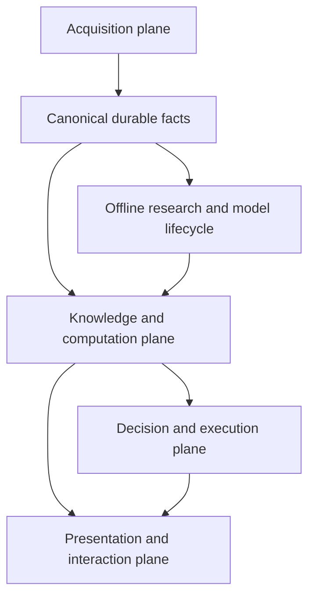

[Architecture home](README.md) · [Next: System context and services](02-system-context-and-services.md)

# Product and architectural principles

## Product objective

Quant Research Workbench is one causal market-research and trading application,
not a collection of unrelated dashboards. It must support:

- whole-market discovery;
- point-in-time issuer, security, listing, News, SEC, and fundamental research;
- smooth single-ticker charts and manual order entry;
- semi-automatic proposals with explicit operator authority;
- automatic Strategy Runs;
- Live, Paper, Replay, Backtest, and Backtest Debug modes;
- auditable portfolio, order, execution, and performance history;
- historical data construction, model research, certification, and production inference;
- observable and restart-safe service operations.

All modes consume the same semantic contracts. Source, clock, pacing, broker,
and persistence permissions may change; formulas and authority boundaries may
not silently change.

## Four runtime planes and one offline plane

1. **Acquisition plane** obtains provider data and preserves canonical source
   evidence, coverage, and lineage.
2. **Knowledge and computation plane** resolves point-in-time identity,
   enrichment, bars, indicators, signals, embeddings, and model outputs.
3. **Decision and execution plane** owns Strategy interpretation, Portfolio
   approval, OMS commands, broker state, and the trading journal.
4. **Presentation and interaction plane** composes those products in Canvas and
   configuration pages without becoming a source of truth.
5. **Offline plane** builds certified datasets and models from the same causal
   authorities, then promotes immutable artifacts through explicit contracts.

## Non-negotiable invariants

### One authority per concern

There must be one authoritative producer for each semantic fact. Derived caches
are allowed, but they identify their upstream revisions and never become a
parallel source of truth.

### Point-in-time correctness

Every join used in Replay, Backtest, research, or model training is evaluated as
of the active clock. A record is usable only when its `available_at` is not later
than that clock. Later ticker changes, filing revisions, labels, or corporate
actions cannot repaint earlier decisions.

### Stable identity before ticker

Ticker is a time-varying presentation and provider-routing attribute. Durable
joins use issuer, security, listing, symbol-interval, Composite FIGI, CIK, and
other source identifiers through the Reference authority.

### Shared formula, configurable execution scope

Calculation code is shared by live and historical modes, but sharing code does
not imply calculating it over the full universe. Every computation is registered
with eligible scopes and a default scope.

### Durable correctness, optional low-latency notification

Services reconcile durable upstream state against their own durable output.
Events and websocket notifications accelerate live delivery but are never the
only recovery path.

### Missing is not zero

Missing, stale, blocked, untrusted, and unavailable are distinct states. None is
silently converted to zero, false, neutral, or tradable.

### Fail closed at authority boundaries

Identity conflicts, stale account state, incomplete canonical coverage,
unsupported model versions, or unresolved broker outcomes block dependent
actions. Presentation may degrade; exposure-increasing trading may not bypass
the affected authority.

### Bounded resources and visible work

Queues, caches, batches, concurrency, and memory are bounded. Every long-running
path exposes active, queued, completed, skipped, retried, failed, and deferred
work with restart-safe checkpoints.

### Configuration is versioned; runs are immutable

Drafts are editable. Approved Releases are immutable and content-addressed.
Every Strategy Run pins its complete release, data/source versions, mode, clock,
accounts, Portfolio policy, OMS policy, and Canvas default.

## Configuration versus generated runtime contracts

Users configure reusable domain objects:

- Market Discovery and Watchlists;
- Strategy Profiles;
- Portfolio policies and strategy-account mandates;
- OMS and protection profiles;
- account/session bindings;
- Canvas defaults.

The backend compiles a Deployment/Run Plan. It is not normally another editable
user object. It is visible for release review, preflight, provenance, and
diagnostics.

## Current, target, and future

- **Current:** substantial canonical data, Reference, Canvas, Replay, Strategy,
  Portfolio, OMS, News, SEC, Text Intelligence, embeddings, and service-health
  implementations exist.
- **Target:** the complete composition described in this package.
- **Gap:** unified market-data source routing, dynamic Watchlist computation,
  Backtest/Live controller parity, catalog authority, and cross-process trading
  arbitration are incomplete.
- **Future:** model-dependent Market AI expansion remains governed by promoted
  model contracts rather than speculative generic infrastructure.

## Navigation

[Architecture home](README.md) · [Next: System context and services](02-system-context-and-services.md)
