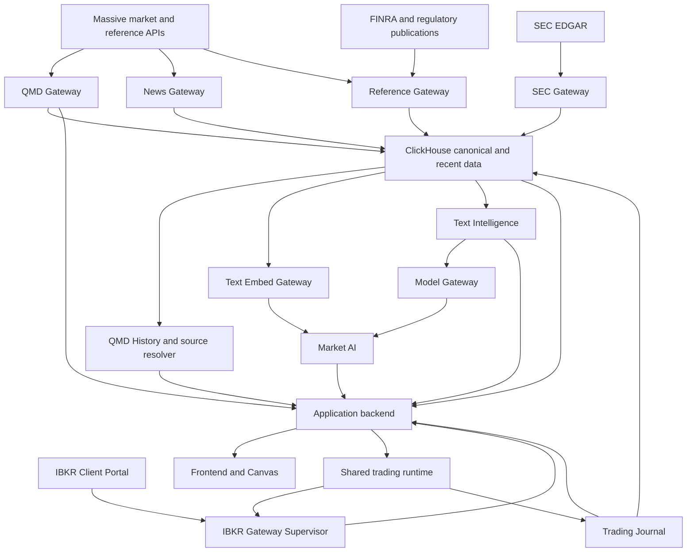

[Previous: Product and principles](01-product-and-principles.md) · [Architecture home](README.md) · [Next: Data authority and storage](03-data-authority-and-storage.md)

# System context and service responsibilities

## System context

Arrows show data or control dependencies, not permission to write another
service's tables. Each owner writes only its canonical sinks.

## Runtime service catalog

| Service | Default bind | Owns | Must not own |
| --- | --- | --- | --- |
| QMD Gateway | `127.0.0.1:8795` | Live quote/trade capture, recent event/bar retention, live market products, QMD observations | Reference identity, strategies, accounts, orders |
| QMD History | `127.0.0.1:8801` | Read-only historical/recent query execution through shared `qmd_core` | Provider acquisition or live writes |
| News Gateway | `127.0.0.1:8796` | News acquisition, raw evidence, canonical structured News and ticker links | Semantic trading labels |
| SEC Gateway | `127.0.0.1:8797` | Filing, document, source/rendered text, XBRL, SEC coverage | Market identity bridge and embeddings |
| Text Embed Gateway | `127.0.0.1:8798` | Token, embedding, and embedding-coverage reconciliation | Source acquisition or semantic decisions |
| Reference Gateway | `127.0.0.1:8799` | Identity graph, ticker intervals, conids, tradability, reference publications | High-frequency prices or orders |
| IBKR Supervisor | `127.0.0.1:8800` | Broker-process lifecycle, authentication, account/session reachability | Portfolio decisions or order ownership |
| Model Gateway | `127.0.0.1:8802` | Named structured-inference routes, budgets, fallback, idempotency, metadata audit | News or trading policy |
| Market AI | `127.0.0.1:8803` | Versioned, expiring contextual hypotheses from frozen inputs | Canonical market/text data or orders |
| Text Intelligence | `127.0.0.1:8804` | News Synthesis V1, separate SEC semantics, semantic reconciliation | Provider polling or strategy authority |
| Application backend | `127.0.0.1:8000` | API composition, configuration, run controllers, access boundary | Reimplementation of producer formulas |
| Frontend | `127.0.0.1:5173` | Presentation, interaction, local workspace overlays | Canonical data or trading decisions |
| Trading Journal boundary | embedded/service boundary | Local command durability, typed trading events, ClickHouse projection | Broker command policy |

## Historical pipeline catalog

Pipelines are owner-operated historical and repair workflows, not general
runtime services:

| Pipeline | Responsibility |
| --- | --- |
| Market SIP | Flatfile acquisition, compact events, coverage, daily-session bars, training tables |
| News | Historical acquisition, shared rendering, coverage, repair, certification |
| SEC | Archive/bulk acquisition, v3 reconstruction, renderer, XBRL, integrity and repair |
| Reference | Bootstrap/migration, historical publications, ticker-event history |

The owning live gateway must use the same normalization contracts as its
historical pipeline. Historical writes may be performed by a pipeline, but the
service remains the product owner and exposes coverage and operational state.

## Dependency classes

### Durable dependency

The consumer can recover by querying canonical tables and coverage. Examples:

- Text Embed reconciles canonical News/SEC text minus embeddings.
- Reference rebuilds the SEC-to-market bridge from SEC and identity tables.
- historical Scanner joins QMD snapshots to point-in-time reference and SEC
  facts.

### Low-latency notification

A producer may notify a consumer after a durable or causally accepted update:

- QMD streams live events/bars/signals;
- News notifies Text Intelligence;
- Text Intelligence notifies Market AI;
- broker streams update trading projections.

The consumer still reconciles durable state after restart or notification loss.

### Control dependency

A command crosses an authority boundary and requires a response:

- backend starts a Replay controller;
- Strategy asks Portfolio for approval;
- Portfolio forwards approved intent to OMS;
- OMS sends commands through the broker adapter;
- Reference queries IBKR only after supervisor health permits it.

## Service interaction rules

1. A service never writes another service's canonical tables.
2. Backend endpoints compose or proxy; they do not fork formulas.
3. Service health is not data availability. Every response carries data
   freshness/coverage independently from process readiness.
4. Notifications contain identities and versions, not unbounded source bodies.
5. Cross-service queries are bounded and bulk-oriented. No scanner path issues
   a database or HTTP request per row.
6. Every service publishes `/health`, `/config`, `/metrics`, and
   `/snapshot/status`, plus bounded domain snapshots/streams where appropriate.
7. A service owns its reconciliation, gap fill, audit, and coverage. A future
   orchestrator may schedule commands but cannot own domain correctness.

## Backend and UI relationship

The browser talks to the application backend. Direct service connections are
reserved for operational tooling or explicitly proxied local streams. This gives
one place for authentication, request limits, mode routing, provenance assembly,
and stable frontend contracts while retaining domain authority in services.

## Navigation

[Previous: Product and principles](01-product-and-principles.md) · [Architecture home](README.md) · [Next: Data authority and storage](03-data-authority-and-storage.md)
