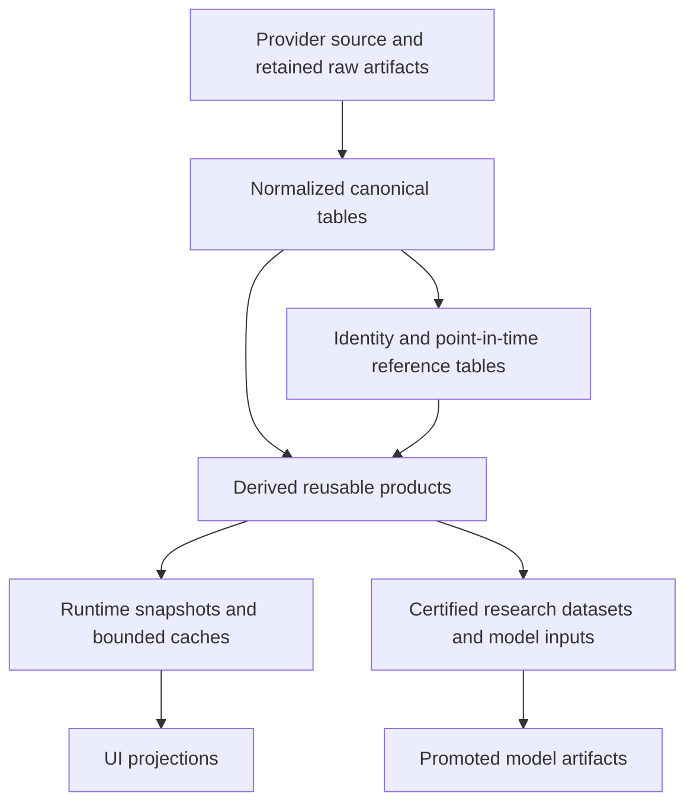

[Previous: System context and services](02-system-context-and-services.md) · [Architecture home](README.md) · [Next: QMD distribution](04-qmd-market-data-distribution.md)

# Data authorities, clocks, and storage

## Storage layers



| Layer | Examples | Mutability |
| --- | --- | --- |
| Raw/source evidence | SIP flatfiles, News JSON/HTML/PDF, SEC archives, provider snapshots | Immutable or append-only |
| Canonical normalized | compact events, structured News, SEC filing/document/text/XBRL | Versioned append/replacement with source lineage |
| Identity/reference | issuer/security/listing/symbol intervals, conids, publications | Point-in-time, fail-closed replacements |
| Reusable derived | bars, QMD signals, semantic labels, embeddings, financial scores | Rebuildable and versioned |
| Runtime state | scanner snapshots, Watchlist membership, strategy and broker projections | Bounded projections plus durable audit events |
| Research/model | certified shards, targets, audits, checkpoints | Immutable, content-addressed artifacts outside the repo |

## Database roles

### `q_live`

Application-owned current and operational data:

- rolling QMD events and intraday family bars;
- identity and reference publications;
- canonical live/historical-compatible News and SEC tables;
- semantic labels and contextual hypotheses;
- structure checkpoints and selected derived caches;
- trading events, projections, configuration journals, and operational coverage.

`q_live` does not mean that every row is ephemeral. Identity, SEC, News, and
trading histories may be durable. Retention is table-specific and registered.

### `market_sip_compact`

Historical and training-oriented authority:

- yearly compact market-event tables and continuity;
- completed daily-session market bars;
- condition/token reference tables;
- model-ready market, News, SEC, token, embedding, and context tables;
- historical coverage and certification products.

It is read-only to normal application requests. Owner pipelines update it.

### Historical SIP read boundary

After a source day passes canonical import and certification,
`market_sip_compact.events_YYYY` is the sole historical market-event read
authority. Retained SIP flatfiles are ingestion evidence, not an alternate
query tier. Only the canonical download/import updater may open them, and only
while acquiring, validating, and importing a new source day.

QMD Live, QMD History, charts, indicators, Replay, Backtest, strategies,
research jobs, structural checkpoint campaigns, and repair/backfill tools must
not read raw flatfiles or use ClickHouse `file()` as a fallback. If a required
clock, field, or provenance value was not preserved by the certified import,
the consumer fails closed. The correction is a versioned canonical migration
or an ingestion-owned, coverage-certified sidecar populated during canonical
import—not retrospective recovery from retained flatfiles.

### Runtime filesystem

Generated logs, manifests, repair plans, audit packets, caches, checkpoints, and
model artifacts belong under `D:\TradingML\runtimes` or the documented
workstation data roots. They never belong in the repository or secret storage.

## Clock contract

Every product states:

- `event_at`: when the source-domain event occurred;
- `available_at`: earliest time the application could causally use it;
- `observed_at`: time of the source observation when distinct;
- `inserted_at`: database write time, never a substitute for availability;
- `as_of`: consumer evaluation cutoff;
- source revision and calculation/schema version.

Market-event timestamps are UTC instants. Market sessions and bar membership use
`America/New_York`. Display conversion occurs only at the UI/report boundary.

## Point-in-time selection rule

For each stable entity and requested field:

```text
eligible rows = rows with available_at <= as_of
winner = newest valid source revision under the field's deterministic precedence
```

`ReplacingMergeTree FINAL` alone is not a point-in-time rule. Queries must bound
availability and resolve source revisions explicitly.

## Coverage and watermarks

Coverage distinguishes:

- complete with rows;
- complete and verified empty;
- partial;
- missing;
- stale;
- blocked by integrity;
- superseded by a newer source revision.

Every composed response exposes a source watermark set. A Scanner snapshot, for
example, may carry separate QMD, Reference, News, SEC, Text Intelligence, and
fundamental watermarks. One stale enrichment does not falsify the market clock,
but dependent columns report their own state.

## Table registry requirement

Every production table must be registered with:

```text
database and table
owner
semantic grain and primary identity
event/available/insert clocks
engine, partition, and order keys
write path
read/query paths
retention
coverage authority
source and schema versions
rebuild/audit command
downstream consumers
```

The same registry should generate service table-health views and documentation.
Hard-coded table lists in the backend, gateways, and UI are migration inputs,
not acceptable long-term parallel authorities.

## Retention and archive promotion

Deletion of a recent table is permitted only after authoritative archive
coverage proves equivalent source coverage and the overlap passes identity,
count, order, and boundary audits. Retention is a coverage-driven state
transition, not a blind age-based delete.

## Corporate actions and adjusted views

Canonical prices, sizes, filings, and source facts remain raw. Adjusted price or
share views are derived point-in-time products with action-source revision and
anchor time. A future split cannot alter an earlier training or trading input.

## Persistence decision

Persist a derived product when at least one applies:

- it is needed to recover state without replaying an impractical window;
- it is trading/audit evidence;
- calculation cost is material and a versioned cache has clear consumers;
- source data may disappear;
- certification requires immutable evidence.

Otherwise prefer reconstruction from canonical inputs. Full indicator tables
are optional versioned materializations, not default market truth.

## Navigation

[Previous: System context and services](02-system-context-and-services.md) · [Architecture home](README.md) · [Next: QMD distribution](04-qmd-market-data-distribution.md)
