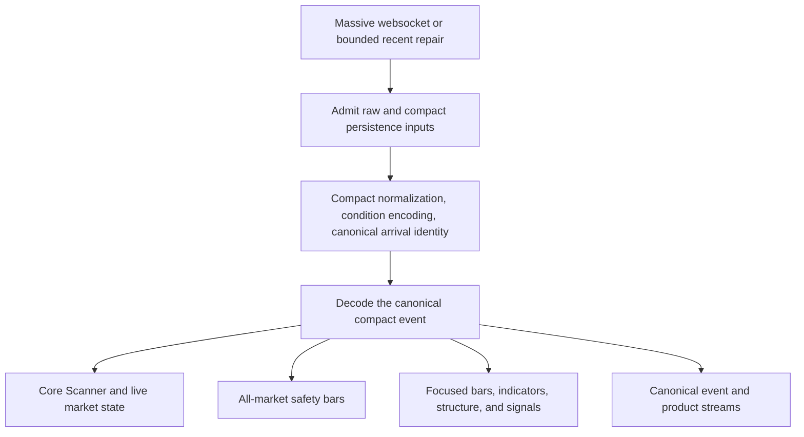
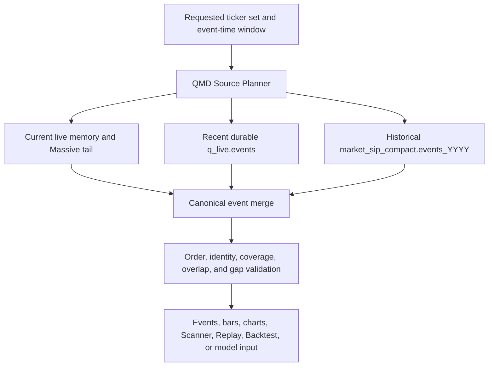
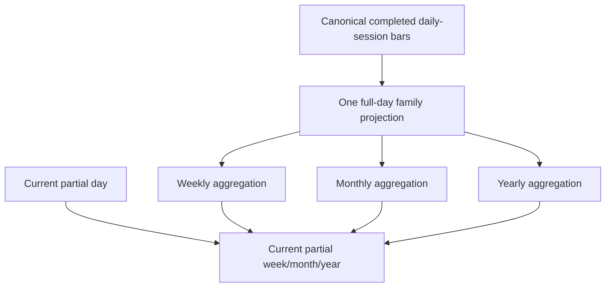
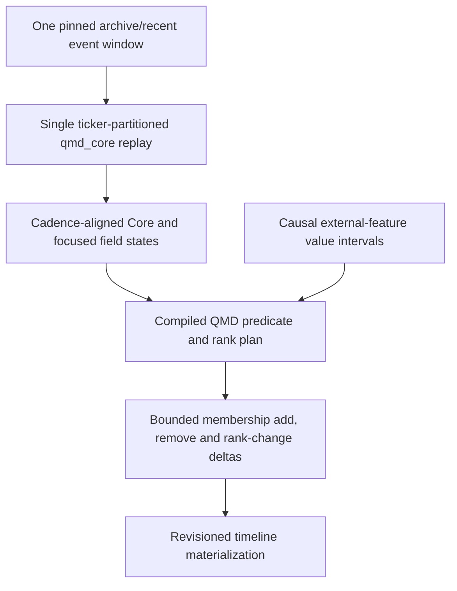
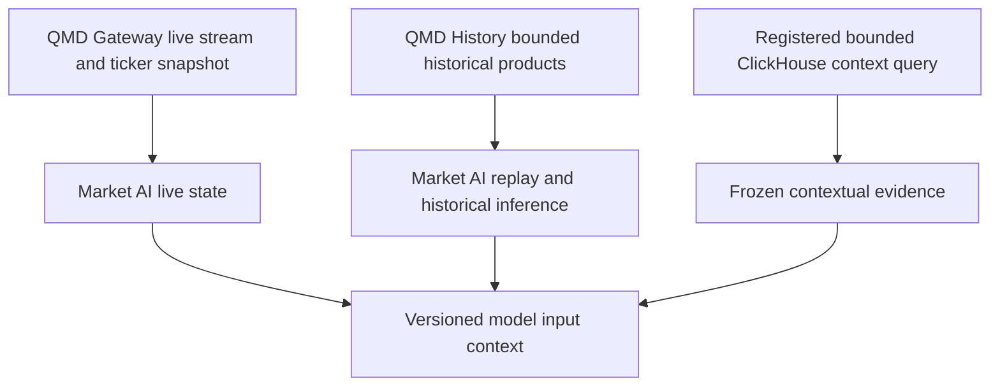

[Previous: Data authority and storage](03-data-authority-and-storage.md) · [Architecture home](README.md) · [Next: Enrichment registry](05-enrichment-and-field-registry.md)

# QMD market-data distribution

## Product boundary

QMD is one market-data product implemented by two processes and one shared Rust
library:

- `qmd-gateway`: live acquisition, current memory, recent `q_live` persistence,
  live subscriptions, and recent repair;
- `qmd-history-gateway`: read-only bounded historical/recent queries, Replay,
  Backtest, and derived-cache construction;
- `qmd_core`: event decoding, bar algebra, calculations, market signals,
  product schemas, and source-independent causal state.

Clients ask QMD for a time range and product. They do not select a database or
decide which process/table contains a date.

## Canonical live computation path



Live derived computation consumes the same decoded compact representation used
by QMD History. Raw vendor events are admitted to authoritative persistence
before downstream backpressure, but they do not independently update Scanner,
bar, indicator, or live-state engines when compact normalization is enabled.
The canonical handoff is a bounded, observable lane with reserved live capacity;
repair admission waits rather than occupying that reserve. Compact-disabled
diagnostic operation retains an explicit raw fallback and does not pretend to
provide live/history compact parity.

## Three-source event distribution



### Source tiers

| Tier | Normal range | Authority | Purpose |
| --- | --- | --- | --- |
| Current | after the newest durable QMD watermark through now | `qmd-gateway` memory plus canonical Massive tail | Partial bars, newest events, lowest-latency live state |
| Recent | current session plus configured three prior market sessions | `q_live.events` and `q_live.intraday_family_bars_v2` | Restart, warm-up, recent charts, recent repair |
| Historical | normally complete through the archive publication watermark, often day-before-yesterday or earlier | `market_sip_compact.events_YYYY` and completed bar tables | Long-range charts, Replay, Backtest, research |

Dates are operational expectations, not the routing authority. Coverage
manifests and source watermarks decide the actual boundary. If archive coverage
is late, recent data remains authoritative until the handoff audit passes.

## Source planner contract

The planner returns a `MarketSourcePlan`:

```text
request identity
normalized ticker identities and validity intervals
ordered non-overlapping source segments
source database/table/process per segment
event encoding and schema versions
coverage state per segment
archive and recent watermarks
overlap/deduplication policy
expected continuation cursor
```

Rules:

1. Split multi-year archive requests by `events_YYYY` table.
2. Split recent overlap at a verified coverage boundary, not midnight by
   assumption.
3. Prefer archive rows for a closed interval only after equivalence is proven;
   otherwise prefer recent canonical rows and report archive lag.
4. Use one stable event identity/ordinal rule to remove overlap duplicates.
5. Preserve strict `(event_time, source_sequence, event identity)` order.
6. Return explicit partial/gap evidence instead of silently shortening a range.
7. Current memory appends only events newer than the durable continuation
   watermark. Warm-up rows update state but are not emitted as new live events.

## Physical process interaction

**Target:** the backend has one QMD client. The QMD History source resolver
queries recent and archive ClickHouse tiers and consumes the QMD Gateway-owned
current event tail through a bounded continuation contract. Long-running Replay
pins a source plan and revision at creation, while Live charts may advance their
tail watermark.

**Current:** QMD History plans and reads archive plus verified recent
`q_live.events` segments. QMD Gateway now publishes a bounded cross-market
compact-event page filtered by exact SIP-time range and optional ticker set,
with an arrival cursor and conservative eviction proof. QMD History consumes
all pages through the source revision's pinned live arrival watermark, fails
closed on eviction or cursor stalls, restores canonical event-time order, and
feeds those events
through the shared decoder, chart, indicator, structure, and Scanner engines.
Its source revision includes the live arrival sequence and separately reports
durable-history completeness from request completeness. The backend therefore
does not repeat live intraday or Scanner calculations. Historical macro bars
continue to use completed daily-bar authority and append the explicitly partial
current QMD macro snapshot. A current request can be complete; it is not an
immutable Replay/Backtest revision until storage-level old-revision reads are
implemented.

Paged events now declare `revision_policy`. Replay and Backtest use the default
`pinned` policy, which requires the source-plan hash and exact revision token to
remain unchanged. Live consumers may use `advancing`: the source-plan hash is
still pinned, but the current-tail revision token and live arrival watermark may
advance between pages. A tier boundary or source-plan change remains a typed
restart conflict under both policies.

## Retention and archive handoff


`download_update_events.py` and the Market SIP pipeline own historical flatfile
publication. QMD owns the handoff audit and deletion of QMD-owned recent tables.
Neither path copies recent rows directly into archive event tables as a shortcut.

**Current:** QMD persists accepted compact events and canonical family bars in
its singular recent tables. Compact and 100 ms base-bar confirmations are
cumulative per service run but split by New York market-session date and their
physical `event_date`/`local_date` partitions. QMD reads Market SIP ordinal
continuity, requires both quote and trade handoffs, and compares count, ticker,
timestamp, schema, and stable-identity fingerprints before deleting a session.
QMD History likewise marks a streaming interval recent only when compact-event
and base-bar confirmations from the same run overlap (or when an explicit
repair/bootstrap row confirms it); it does not union one-sided writer rows.
Before either QMD-owned recent table is mutated, QMD now appends a per-session
handoff certificate to its coverage ledger. The certificate captures the full
quote/trade remote-object identities and the archive event fingerprint. If one
retention mutation succeeds and a later mutation fails, a retry may reuse that
certificate only when the current remote-object evidence and archive fingerprint
still match exactly; any upstream or archive correction forces fresh proof.
Published archive continuity remains the source-publication prerequisite, while
the retained QMD certificate is the authority for the destructive handoff step.

## Bar hierarchy

### Intraday

The base durable live bar contract is the sparse three-family table:

```text
trade
quote_bid
quote_ask
```

The production grid is `100ms, 1s, 5s, 10s, 30s, 1m, 5m, 1h`. All resolutions
use fixed `[04:00, 20:00)` New York session buckets. Higher intraday resolutions
are algebraic rollups; they do not issue independent raw-event queries.

### Daily-session authority

`market_sip_compact.daily_session_bars_by_symbol_time_v1` is the completed
historical daily authority. It contains three scheduled session segments per
ticker/date—premarket, regular, and after-hours—with sufficient statistics and
point-in-time identity.

For the current/recent tier, QMD forms the same daily-session contract from
recent family bars. A completed recent day is served from the source-revisioned
recent product cache until archive daily coverage takes authority.

### Weekly, monthly, and yearly



Weekly, monthly, and yearly bars are derived from authoritative daily rows, not
rescanned from raw events. The response states `partial`, `closed`, or
`corrected`. Calendar grouping uses New York session dates. Internal monthly
identity is `1mo`; browser presentation may use `1M`.

The legacy `macro_bars_by_time_symbol` remains a migration/training artifact,
not the application candle authority. QMD's active macro caches derive from the
daily authority, carry source/product revisions, mark open periods partial, and
invalidate by cache identity when those revisions change.

## Chart and computation products

Backend consumers now express chart, compact-event, and Scanner reads as a
typed `QmdProductRequest`. A request without a causal window resolves to QMD
live; a timezone-aware `start`/`end`/`as_of` window resolves to QMD History.
The planner owns the approved endpoint and rejects ambiguous live-plus-history
requests, so route handlers do not select `q_live` or archive tables. QMD
History remains the owner of archive/recent source planning inside the
historical service.

When that plan contains `current_live`, compact-event reads are composed only
at the typed QMD client boundary. Non-tail forward reads fail closed if QMD
Gateway reports that their live arrival cursor was evicted; callers are not
given a silently truncated result. The existing array response remains a
compatibility projection, so a future envelope still needs to return the
combined plan and continuation evidence directly.

Live compact-event consumers now use a versioned, bounded per-ticker page. Its
arrival cursor, exact per-ticker eviction watermark, buffer bounds, `has_more`,
and delivery-order declaration make truncation explicit. The backend typed QMD
client uses this contract; the old raw-array endpoint remains only as a measured
compatibility surface. QMD Gateway also publishes a versioned latest
ticker-state envelope with authority, Scanner sequence, `as_of`, age, and
explicit ready/missing state. Its older nullable-row endpoint remains only as a
measured compatibility surface.

The same source plan supports:

- compact events and Tape/Quotes;
- family and condition bars;
- enriched chart bars;
- request-scoped indicators and structure;
- live and historical scanner frames;
- market-signal lifecycles;
- Strategy warm-up and observations;
- Replay, Backtest, and Debug event streams;
- live Market AI event/snapshot inputs;
- historical Market AI replay, model input, and certification reads.

### Historical Scanner membership timeline

Cadence-level historical Watchlists require a distinct QMD History product;
they must not call the terminal full-market Scanner snapshot once per refresh.
The product contract is:



The backend compiles a consumer-neutral predicate/ranking plan from the
approved Watchlist. QMD History evaluates QMD-owned dynamic fields through one
shared replay. Point-in-time Reference and fundamental inputs arrive as bounded
value intervals carrying their owner, plan version, `available_at`, and source
revision; QMD does not query or reinterpret producer tables. Output contains an
initial membership plus only add/remove/expire/rank-change deltas, the exact
cadence, source-plan hash, calculation revision, external-feature revisions,
and continuation materialization identity. Work is chunked by a fixed event
window with state carried between chunks, rather than weakening the configured
cadence or retaining an unbounded frame-by-symbol matrix.

Each response includes the source plan hash, source revisions, product schema,
calculation versions, coverage, `as_of`, and continuation cursor.

Paged event snapshots now pin the first page's source-plan hash and revision
token at the consumer. Every continuation echoes both values; QMD History
returns a typed 409/restart instruction if either changed. This prevents a
Replay or Backtest from silently blending pages across revisions. It detects
revision drift but does not yet provide an old-revision physical snapshot, so a
conflict restarts instead of continuing against historical table state.
The event-page read itself also passes the revision's live continuation
sequence into QMD's source merge, so the response cannot admit arrivals newer
than the revision it reports.

## Market AI delivery contract



QMD now provides stable live compact-event and ticker-state snapshots. The
Scanner stream reconnects through an authoritative snapshot and replaces client
state immediately after receiver lag or a non-contiguous sequence. Compact
events, decoded events, intraday bars, live market state, and signal streams now
emit a typed terminal `stream_gap` frame with `resnapshot_required` and the
authoritative recovery endpoint whenever a broadcast receiver lags. The compact
stream also returns its last delivered arrival sequence for exact page recovery;
periodically sampled ticker/bar/indicator/product streams are already complete
snapshots rather than lossy deltas. QMD History bar, indicator, and derived
streams likewise require reconnect with the original causal window after lag
instead of silently continuing. The historical request contract uses the same
`qmd_core` encoding and source plan. Market AI chooses the
requested product and causal cutoff; it does not choose `q_live` versus
`market_sip_compact` or reproduce boundary logic.

Direct ClickHouse access remains valid for registered contextual joins and
approved bulk/offline reads. If a direct read contains canonical market events,
it must use the QMD-owned schema/decoder and carry the same coverage and source
plan semantics as QMD History. QMD-derived bars, indicators, structure, and
signals should normally be requested from QMD History rather than recalculated
inside Market AI.

## Cache rules

Historical cache identity includes ticker set, event window, source-plan hash,
source revision, product schema, and calculation manifest. A cold build may
construct all configured bar resolutions once, but only explicitly requested
calculations are added. Live caches are bounded and ticker-sharded. Late events
increase revision and invalidate dependent cache entries.

## Failure behavior

- Archive lag: continue from verified recent coverage and report lag.
- Recent persistence lag: live trading may use accepted memory state only while
  explicit durability lag remains within configured policy; automatic entry
  fails closed beyond it.
- Current stream disconnect: report stale time and use REST repair only through
  the canonical ingestion path.
- Source overlap mismatch: do not delete recent data or blend inconsistent
  rows; quarantine the boundary.
- Missing segment: return partial coverage and block modes requiring complete
  history.

## Navigation

[Previous: Data authority and storage](03-data-authority-and-storage.md) · [Architecture home](README.md) · [Next: Enrichment registry](05-enrichment-and-field-registry.md)
