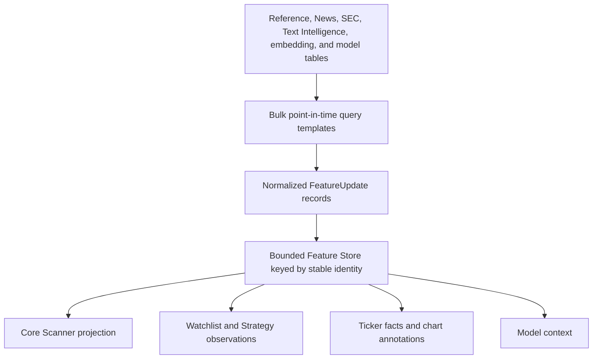

[Previous: QMD distribution](04-qmd-market-data-distribution.md) · [Architecture home](README.md) · [Next: Market Discovery](06-market-discovery-and-computation.md)

# Enrichment and field registry

## Purpose

Every field available to Scanner, Watchlists, charts, ticker facts, Strategies,
Canvas, models, and exports must be registered before use. The registry defines
where the field comes from, how it is queried, its causal clock, and whether it
is safe for each mode.

The registry replaces duplicated backend constants, UI catalogs, service table
lists, and ad hoc SQL knowledge.

## Registry model

Each `FieldDefinition` contains:

```text
field_id, label, group, value_type, unit and format
semantic entity grain
owner service
source database/table/endpoint
source columns
query_template_id and implementation path
join identity and cardinality
event_at and available_at expressions
source precedence and fallback policy
freshness/TTL and expected publication cadence
historical support and mode eligibility
raw/derived/estimated provenance
coverage query
required indexes/order keys
security classification
schema and calculation version
```

Query templates are registered code, not arbitrary SQL stored in UI drafts.
Configuration selects fields and parameters; the backend compiler resolves the
approved query implementation.

## Enrichment acquisition and projection



The live application bulk-loads the eligible universe and incrementally applies
source changes. It never queries ClickHouse or another service once per scanner
row. Historical requests use set-based point-in-time queries bounded by the
Canvas/run clock.

## Baseline registered field namespace

This is the complete baseline of currently known application enrichment
families. New physical source columns are not automatically exposed; they need a
registered semantic field.

### Identity, listing, and tradability

| Field IDs | Primary authority | Query path |
| --- | --- | --- |
| `identity.issuer_id`, `identity.security_id`, `identity.listing_id`, `identity.symbol_id` | Reference identity graph | Reference projection by point-in-time symbol interval |
| `identity.symbol`, `identity.company_name`, `identity.security_name` | `id_symbol_v1`, `id_security_v1`, `id_issuer_v1` | `reference.identity_for_symbol` |
| `identity.composite_figi`, `identity.share_class_figi`, `identity.cik`, `identity.conid`, `identity.cusip`, `identity.isin` | identifier and mapping tables | deterministic identifier lookup |
| `listing.exchange`, `listing.primary_exchange`, `listing.currency`, `listing.asset_class`, `listing.security_type`, `listing.ticker_type` | listing/reference dimensions | listing projection |
| `identity.valid_from`, `identity.valid_to_exclusive`, `identity.previous_symbol`, `identity.current_symbol` | `id_symbol_interval_v1` and ticker-event tables | interval ASOF query |
| `tradability.is_tradable`, `tradability.block_reason`, `tradability.issue_count` | `feature_tradable_universe_v1`, mapping issues | latest causal universe publication |
| `country.listing`, `country.issuer_legal`, `country.headquarters`, `country.issue`, `country.effective` | `market_security_country_v1` | latest assertion at cutoff |
| `presentation.logo_url`, `presentation.asset_status` | `market_presentation_asset_v1` | bounded asset projection |

### Market and share-supply reference

| Field IDs | Primary authority | Query path |
| --- | --- | --- |
| `reference.market_cap`, `reference.shares_outstanding` | `market_security_market_snapshot_v1` | latest observation before cutoff |
| `reference.float_shares`, `reference.float_source`, `reference.float_quality` | `market_security_float_v1`, SEC public-float fallback | source-precedence projection |
| `reference.short_interest`, `reference.short_interest_pct`, `reference.days_to_cover` | `market_short_interest_v1` plus point-in-time float | publication-aware short projection |
| `reference.short_volume`, `reference.short_volume_pct` | `market_short_volume_v1` | latest FINRA trade date before cutoff |
| `reference.fails_to_deliver`, `reference.ftd_value` | `market_fails_to_deliver_v1` | settlement/publication-aware query |
| `reference.reg_sho_threshold` | `market_reg_sho_threshold_v1` | latest published list state |
| `reference.borrow_status`, `reference.borrow_shares`, `reference.borrow_fee` | `market_security_borrow_v1` | latest broker observation; live only where history is unavailable |
| `classification.sector`, `classification.industry`, `classification.market_cap`, `classification.float` | classification tables and configured thresholds | versioned classification projection |

### Corporate events

| Field IDs | Primary authority | Query path |
| --- | --- | --- |
| `event.split.execution_date`, `event.split.from`, `event.split.to`, `event.split.factor` | `market_stock_split_v1` | publication-aware event window |
| `event.dividend.ex_date`, `event.dividend.amount`, `event.dividend.currency` | `market_cash_dividend_v1` | publication-aware event window |
| `event.ipo.date`, `event.ipo.status`, `event.ipo.days_to_event` | `market_ipo_v1` | point-in-time event window |
| `event.ticker_change.*` | ticker-event and symbol-interval tables | Composite-FIGI-bound history |

### Source coverage, quality, and publication state

| Field IDs | Primary authority | Query path |
| --- | --- | --- |
| `quality.mapping_issue_count`, `quality.mapping_issue_types`, `quality.mapping_blocked` | `id_mapping_issue_v1` | active issues by stable identity and cutoff |
| `quality.source_mapping_state`, `quality.source_mapping_evidence` | `id_source_mapping_v1` | compact accepted mapping evidence |
| `relationship.issuer_type`, `relationship.valid_from`, `relationship.valid_to` | `id_issuer_relationship_v1` | validity-dated issuer graph query |
| `sec.bridge_state`, `sec.bridge_reason`, `sec.bridge_version` | `id_sec_market_bridge_v3` | active event-valid bridge publication |
| `reference.scanner_publication_version`, `reference.scanner_published_at` | `feature_scanner_static_v1` | latest causal scanner publication |
| `coverage.reference_source`, `coverage.window_start`, `coverage.window_end`, `coverage.state` | `market_reference_publication_coverage_v1` | source/window coverage lookup |
| `coverage.ticker_event_entity_state` | `market_ticker_event_entity_coverage_v1` | per-event/entity resolution coverage |
| `schedule.source`, `schedule.next_due_at`, `schedule.last_completed_at`, `schedule.state` | `market_reference_source_schedule_v1` | daemon/restart scheduling projection |

Coverage, scheduling, and issue fields are primarily diagnostic and eligibility
inputs. They are registered so configuration and UI can explain why a business
field is absent; they are not ordinary user-facing Scanner columns by default.

### News fields

| Field IDs | Primary authority |
| --- | --- |
| `news.latest_at`, `news.count`, `news.recency`, `news.latest_title` | canonical company-News ticker projection |
| `news.document_id`, `news.source_id`, `news.publisher`, `news.url` | News canonical event/source tables |
| `news.topic`, `news.event_type`, `news.entities`, `news.relationships` | News Synthesis V1 |
| `news.direction`, `news.score`, `news.confidence`, `news.impact`, `news.uncertainty`, `news.horizon`, `news.eligible` | versioned Text Intelligence output |
| `news.semantic_model_*`, `news.hypothesis_*`, `news.expires_at` | optional Model Gateway/Market AI outputs |

Only company-relevant, point-in-time ticker links may mark a scanner ticker.
Broad market/editorial News remains available in News views without being
misrepresented as issuer-specific evidence.

### SEC fields

| Field IDs | Primary authority |
| --- | --- |
| `sec.latest_at`, `sec.count`, `sec.recency`, `sec.latest_form` | canonical filing plus event-valid SEC-market bridge |
| `sec.cik`, `sec.accession`, `sec.form`, `sec.accepted_at`, `sec.filed_at`, `sec.period_end` | SEC filing v3 |
| `sec.document_id`, `sec.document_type`, `sec.source_hash`, `sec.renderer_version` | SEC document/source/rendered v3 |
| `sec.topic`, `sec.event_type`, `sec.direction`, `sec.score`, `sec.confidence`, `sec.impact`, `sec.uncertainty` | separate versioned SEC semantic authority |
| `sec.entity_relationships`, `sec.market_bridge_state` | SEC entity and Reference bridge authorities |

### Fundamental and XBRL fields

Current reported-field IDs:

```text
fundamental.revenue
fundamental.gross_profit
fundamental.operating_income
fundamental.net_income
fundamental.diluted_eps
fundamental.operating_cash_flow
fundamental.capital_expenditure
fundamental.cash
fundamental.current_assets
fundamental.current_liabilities
fundamental.accounts_receivable
fundamental.accounts_payable
fundamental.inventory
fundamental.assets
fundamental.liabilities
fundamental.stockholders_equity
fundamental.long_term_debt
fundamental.current_debt
fundamental.research_development
fundamental.sga_expense
fundamental.stock_based_compensation
fundamental.interest_expense
fundamental.income_tax_expense
fundamental.effective_tax_rate_pct
fundamental.goodwill
fundamental.intangible_assets
fundamental.deferred_revenue
fundamental.debt_issued
fundamental.debt_repaid
fundamental.common_stock_issuance
fundamental.common_shares_outstanding
fundamental.weighted_average_basic_shares
fundamental.weighted_average_diluted_shares
fundamental.sec_public_float_value
fundamental.dividends_per_share
fundamental.share_repurchases
fundamental.repurchased_shares
```

Current derived-field IDs:

```text
fundamental.free_cash_flow
fundamental.gross_margin_pct
fundamental.operating_margin_pct
fundamental.net_margin_pct
fundamental.free_cash_flow_margin_pct
fundamental.return_on_assets_pct
fundamental.return_on_equity_pct
fundamental.working_capital
fundamental.current_ratio
fundamental.debt_to_equity
fundamental.net_debt
fundamental.interest_coverage
fundamental.revenue_growth_pct
fundamental.earnings_growth_pct
fundamental.share_growth_pct
fundamental.dilution_pct
fundamental.cash_conversion
fundamental.research_intensity_pct
fundamental.sga_intensity_pct
fundamental.latest_filing_at
```

Current score and interpretation IDs:

```text
xbrl.quality_score
xbrl.quality_label
xbrl.quality_coverage_pct
xbrl.profitability_score
xbrl.growth_score
xbrl.cash_quality_score
xbrl.balance_sheet_score
xbrl.capital_discipline_score
fundamental.trajectory_score
fundamental.trajectory_label
fundamental.profitability_score
fundamental.cash_generation_score
fundamental.balance_sheet_score
fundamental.share_base_pressure_pct
fundamental.share_base_discipline_score
fundamental.valuation_pe
fundamental.valuation_label
```

All reported facts retain taxonomy, tag, unit, fiscal period, accession,
availability, and source revision. Derived values retain input field identities
and formula version.

### Embedding and model-context fields

| Field IDs | Primary authority |
| --- | --- |
| `embedding.news.*`, `embedding.sec.*` | Text Embed Gateway by source/model/chunk version |
| `model.market_hypothesis.*` | Market AI by frozen context hash and expiry |
| `model.market_prediction.*` | future promoted market model contract |

Embedding arrays are generally not Scanner columns. Registry entries make them
available to authorized model consumers and diagnostics without exposing large
payloads to tables or browsers.

## Query-template registry

Initial templates should consolidate the current implementations:

| Template ID | Current implementation seam |
| --- | --- |
| `reference.universe_snapshot.v1` | Reference Gateway tradable/scanner publications |
| `reference.scanner_asof.v1` | `historical_scanner_reference_projection` |
| `reference.ticker_facts.v1` | `ticker_facts_service` identity/reference queries |
| `sec.fundamentals_asof.v1` | `historical_scanner_fundamental_projection` and shared ticker-facts formulas |
| `news.company_asof.v1` | bounded canonical News ticker aggregation |
| `sec.filing_asof.v1` | event-valid bridge plus filing aggregation |
| `intelligence.news_asof.v1` | News Synthesis V1 projection |
| `intelligence.sec_asof.v1` | SEC semantic projection |

These become generated, tested implementations behind the registry. The UI sees
field metadata and coverage, never database credentials or raw SQL.

## Freshness and update behavior

- Identity/tradability: startup plus Reference publication events.
- Market cap/float/presentation: provider schedule and daily/revision updates.
- Short interest/FTD/Reg SHO: publication-driven.
- Fundamentals: filing/XBRL-driven.
- News/SEC labels: event-driven plus reconciliation.
- Borrow: broker-observation TTL; never fabricated historically.
- Model hypotheses: explicit expiry.

Each update becomes a bounded `FeatureUpdate` for affected stable identities.
Scanner and Watchlist re-evaluate only those identities unless the update changes
a cross-sectional ranking baseline.

## Registry governance

1. Owners register fields alongside schemas and query templates.
2. CI validates unique IDs, dependencies, clocks, tables/endpoints, types, and
   mode support.
3. Backend and frontend catalogs are generated from the same registry.
4. Approved Releases pin field and query-template versions.
5. Removed fields remain readable for old runs but cannot be selected in new
   drafts.
6. Field coverage is measurable before a field is advertised as available.
7. A schema inventory check compares registered physical sources with all
   active Reference Gateway table groups, so newly added columns cannot remain
   hidden or acquire an ad hoc query path.

## Navigation

[Previous: QMD distribution](04-qmd-market-data-distribution.md) · [Architecture home](README.md) · [Next: Market Discovery](06-market-discovery-and-computation.md)
