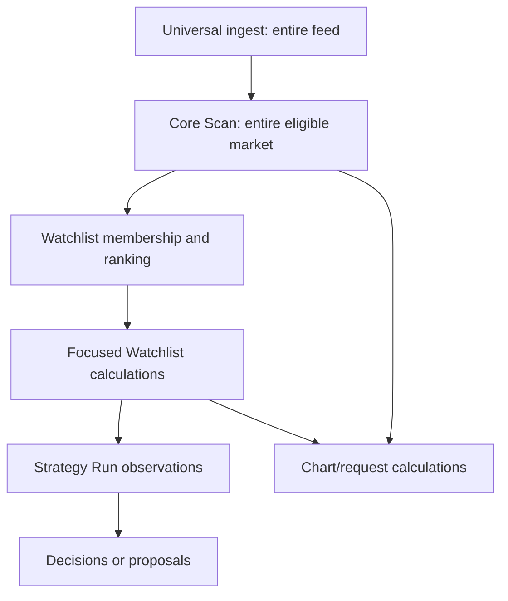
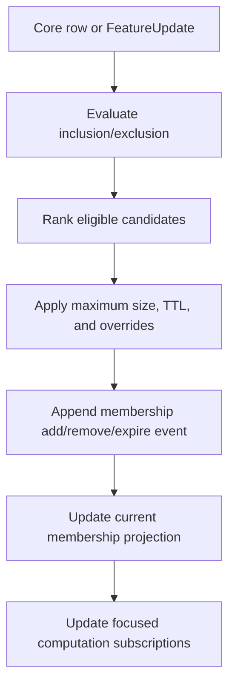

[Previous: Enrichment registry](05-enrichment-and-field-registry.md) · [Architecture home](README.md) · [Next: Canvas and charts](07-canvas-charts-and-interaction.md)

# Market Discovery and computation funnel

## Objective

Market Discovery reduces the entire eligible market into small, explainable,
causal ticker sets without calculating every possible feature for every ticker.



## Managed capability registry

Every primitive, calculation, signal, external field, and offline analytical
product is registered. Required metadata includes:

- `capability_id`, owner, input/output field IDs, formula/engine version;
- eligible and default execution scopes;
- state requirement, cadence, supported timeframes and anchors;
- estimated CPU, memory, update frequency, and persistence cost;
- causal and freshness requirements;
- mode support, implementation status, and configuration policy;
- downstream consumers and minimum required scope.

The Rust QMD catalog should generate the QMD subset. Reference, intelligence,
model, Portfolio, and analytics owners contribute their subsets. The frontend
must not maintain a manually copied authority.

## Execution scopes

| Scope | Population | Typical products |
| --- | ---: | --- |
| `universal_ingest` | all received events | normalization, encoding, order/sequence, NBBO/trade state, freshness, compact persistence |
| `core_scan` | entire eligible market | last/change, volume/dollar volume, activity, spread, halt/stale, basic liquidity/rank |
| `watchlist` | bounded ranked membership | RSI/MACD, selected averages, ATR/Bollinger, relative volume, ORB, structure, microstructure composites |
| `strategy_run` | assigned campaigns | exact union of declared Strategy observation dependencies |
| `request` | one/few active symbols | chart indicators, overlays, Tape/Quotes, ad hoc analytical context |
| `offline` | stored histories | statistics, cycles, patterns, attribution, research/model features |

The compiler may move a capability toward a smaller population when all
consumers permit it. Moving it toward a broader population requires an explicit
configuration change, dependency validation, and cost approval. Locked
integrity primitives cannot be moved.

## Universal ingest

Universal Ingest is visible as the first Market Discovery page and is normally
noneditable. It shows:

- required primitives and why they are required;
- input and output contracts;
- consuming stages;
- queue/cost/persistence evidence;
- freshness, coverage, and version;
- implementation and operational status.

Primitives include canonical event validation/encoding, point-in-time ticker
resolution sufficient to preserve source identity, event ordering, current
NBBO/trade state, market-data quality, and required durable fanout.

## Core Scanner

The Core Scanner maintains one compact row per eligible security and publishes:

- current snapshot at a universe watermark;
- incremental row changes;
- eligibility and quality state;
- rank and causal rank inputs;
- Watchlist promotion/demotion candidates.

It does not own the general indicator engine. Enrichment values are joined from
the Feature Store; their presence in a Scanner row does not make them QMD Core
calculations.

## Watchlists

A Watchlist definition contains source Core Scan, inclusion/exclusion rule sets,
ranking, maximum size, membership TTL/expiry, manual overrides, displayed
fields, and focused calculation requests.



Membership events are durable and explainable. Current membership is a derived
projection. Historical mode evaluates identical rules against point-in-time
Scanner and enrichment states. Manual inclusions are explicit overrides, not a
substitute for the resolver.

## Computation planner

The planner takes active requests from:

- Core Scan configuration;
- current Watchlist memberships;
- active Strategy Run manifests;
- open chart/container subscriptions;
- explicit offline jobs.

It computes the union by `(capability, stable identity, parameters, timeframe,
anchor, source revision)` and executes it once. Reference counts permit state to
be released after the last consumer closes, subject to warm-cache policy.

## External enrichment in discovery

Reference, News, SEC, Text Intelligence, and model fields enter through the
Feature Store. Their updates trigger targeted row and membership re-evaluation.
Cross-sectional features may trigger a bounded rerank; they do not replay the
full market event stream.

## History and materialization

Scanner history stores:

- Core snapshot or compact changes;
- universe and enrichment watermark set;
- Watchlist membership events;
- strategy decisions that consumed observations;
- optional versioned full snapshot materializations for expensive historical
  Canvas requests.

Indicator history is reconstructable unless an approved materialization policy
states otherwise. Cache identity includes source and calculation versions.

## Market Discovery UI

Navigation:

```text
1 Universal Ingest
2 Core Scan
3 Watchlists
4 Focused Calculations
5 History and Persistence
```

Status dimensions are separate:

- implementation: implemented, partial, planned, integration pending;
- execution: universal, core, Watchlist, Strategy, request, offline;
- configuration: locked, configurable, generated, retired;
- operation: ready, catching up, stale, blocked, degraded;
- coverage: complete, partial, empty, unavailable.

“Unavailable” is not a substitute for these dimensions. A request-scoped or
offline calculation is available in its proper scope.

## Current gaps

- Core Scan now uses the compact QMD Scanner row; broad indicators are opt-in.
- Drift remains below the indicator router: the live all-market bar store still
  updates `GenericStructureEngine` for every observed symbol and embeds its
  snapshot in every bar. That state must move behind focused computation leases
  without changing QMD History's shared deterministic calculation path.
- QMD's all-market state keeps one current row per observed symbol plus bounded
  per-second trade counters for the 10/60-second activity rates; it does not
  retain full trade objects for Core Scan rate calculation.
- `GET /snapshot/scanner` and `WS /stream/scanner` use the same monotonic
  sequence authority. The WebSocket sends a typed initial snapshot followed by
  typed row deltas. A lag warning requires a new snapshot instead of silently
  continuing across a sequence gap.
- Focused bar routing now admits only an explicitly leased timeframe plus the
  canonical 100 ms dependency stream used to aggregate event-native evidence.
  A one-minute chart or Watchlist lease no longer runs unrelated five-minute,
  hourly, or other finalized timeframe rows for that ticker. Legacy leases
  with no timeframe declaration retain all-timeframe behavior.
- Live/Paper scheduling resolves configured Watchlists, journals membership,
  and publishes bounded focused QMD leases. Replay resolves the same rules
  against its point-in-time Scanner and enrichment clock.
- Published Run Plans may select a Watchlist source. Live/Paper wait fail closed
  for its current runtime projection, while Replay/Backtest require historical
  membership resolution.
- The configuration service now requests QMD Gateway's capability, indicator,
  and signal catalogs together and projects the Rust-owned execution scope,
  policy, status, cost, state, inputs, outputs, and cadence into Market
  Discovery. If QMD is unavailable it uses the existing Python family snapshot
  only for review, labels it `backend_fallback_snapshot`, and reports
  `catalog_source_unavailable`; it is not treated as current runtime authority.
- The fallback snapshot remains duplicate code and should be replaced by a
  durable last-known QMD catalog artifact before the competing-catalog backlog
  item can be closed.
- Strategy-run and offline computation consumers do not yet publish their full
  target union into QMD's computation planner.
- Expired or removed live leases stop new focused routing, but retained warm
  indicator/structure state is not yet reclaimed.
- The UI now separates implementation, execution scope, configuration policy,
  operation, and coverage, and reads Watchlist membership/history from the
  runtime projection. Scanner history and enrichment null-reason views remain.

## Navigation

[Previous: Enrichment registry](05-enrichment-and-field-registry.md) · [Architecture home](README.md) · [Next: Canvas and charts](07-canvas-charts-and-interaction.md)
