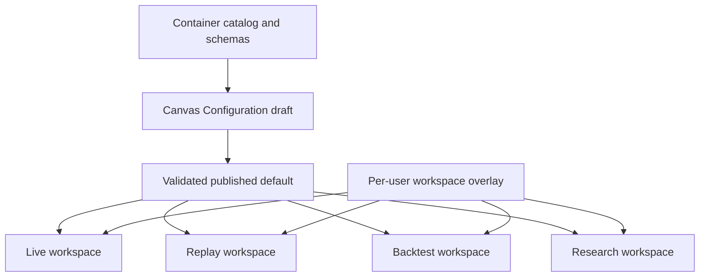
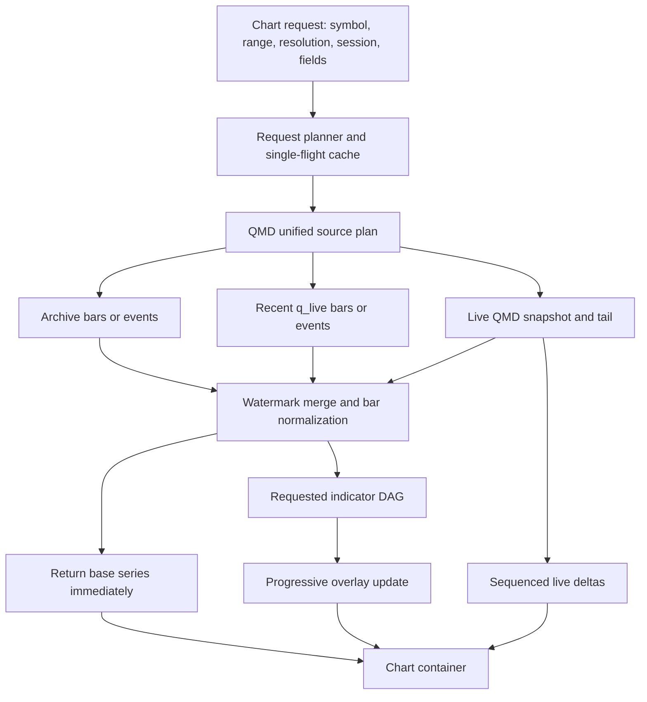

# Canvas, charts, and operator interaction

[Top](README.md) · [Previous](06-market-discovery-and-computation.md) · [Next](08-trading-control-plane.md)

## 1. Canvas has two related responsibilities

The **Canvas Configuration** page is the design lab for each container and the publisher of application defaults. It is not a separate runtime product. Live, Replay, Backtest, and research workspaces instantiate the same published container definitions.

At runtime, users may change layout, links, symbol, timeframe, columns, and display-only overlays. Those changes are persisted as a user-and-workspace overlay, without mutating the published default.

Required lifecycle operations are draft, validate, preview, publish, reset to published, rebase an overlay onto a newer published version, and save an overlay as a new named workspace.

## 2. Shared container catalog

Every container has a stable `container_type`, versioned configuration schema, input and output link contracts, capability requirements, and mode compatibility. The baseline catalog is:

- market: chart, scanner/results, watchlist, tape, quotes/order book, market breadth, sector/industry map;
- intelligence: news, SEC filings, issuer/reference facts, XBRL/fundamentals, event timeline, model hypotheses;
- strategy: strategy activity, signals/proposals, observations, diagnostics and parameter inspector;
- trading: order ticket, positions, orders, executions, account/risk, portfolio allocations and protection status;
- analysis: performance, journal, comparison, attribution and data-quality/provenance;
- operations: service readiness, feed coverage, alerts and run controls.

Containers declare what they consume, such as `SymbolSelection`, `TimeRange`, `WatchlistSelection`, `RunSelection`, or `OrderProposal`, and what they publish. Linking is typed rather than based on container names.

## 3. Smooth chart-loading path

Charts are an interactive single/few-symbol workload, not a reason to expand the all-market scanner row.

The interaction contract is:

1. return cached/base bars first;
2. calculate only requested indicators and overlays;
3. merge live updates by `(symbol, family, resolution, event_time, sequence)`;
4. cancel superseded pan/zoom requests;
5. deduplicate identical requests with single-flight execution;
6. prefetch one adjacent window in the user’s navigation direction;
7. keep bounded memory and disk caches keyed by source versions and adjustment policy;
8. expose partial-data, stale, and source-transition states rather than drawing false continuity.

Historical base bars and indicator results may be cached, but QMD/ClickHouse remain authority. The cache must not silently outlive a corrected source partition, corporate-action version, or computation version.

## 4. Indicator computation

The chart planner uses the same capability registry as Watchlists and Strategy Runs, but executes a request-scoped DAG over one or a few symbols. Nodes include bar transforms, session context, opening range/ORB state, moving averages, RSI, MACD, ATR, Bollinger values, structure, relative volume, microstructure, and strategy-specific overlays.

Each returned series carries:

- `capability_id` and implementation version;
- effective parameters and warm-up interval;
- market-source coverage and last sequence;
- adjustment/session/calendar versions;
- `observed_at`, `available_at`, and computation time;
- completeness and stale reason.

## 5. Manual, semi-automatic, and automatic trading

All three modes use the same Portfolio and OMS authority. The difference is who originates and approves an order proposal.

| Mode | Proposal origin | Required approval | Execution path |
|---|---|---|---|
| Manual | Operator order ticket or chart action | Operator submit | Portfolio check, then OMS |
| Semi-automatic | Strategy/model/operator-assisted proposal | Operator accept or edit | Portfolio check, then OMS |
| Automatic | Approved Strategy Run | Configured policy authority | Portfolio check, then OMS |

A chart-originated proposal includes a `chart_snapshot_id`, symbol identity, displayed price/sequence, data freshness, requested side/quantity/order type, and optional stop/target geometry. Submit must revalidate market freshness, account authority, position, buying power, and risk; the displayed chart is context, never execution authority.

## 6. Workspace state and mode isolation

Persist separately:

- published Canvas version;
- user layout overlay;
- link groups and selected instruments;
- display settings and requested indicator specs;
- mode/run/account bindings;
- temporary interaction state such as cursor and open menus.

Live, Paper, Replay, and Backtest workspaces must be visually explicit and cannot share an executable account binding by accident. Copying a layout between modes copies presentation, not authority.

## 7. Current drift

- The backend application registry now records every currently runnable Canvas
  container, its implementation, state-schema version, compatible modes, QMD
  products, and typed input/output links. The shared workspace now verifies that
  registry at runtime and derives visible container IDs, labels, modes and
  implementation status from it. Local TypeScript definitions remain renderer
  adapters only; unregistered adapters are not selectable, missing adapters are
  reported, and a failed registry check leaves existing workspaces visible but
  blocks unverified additions.
- The backend now exposes a Canvas-only projection of the approved release.
  Standalone Canvas and Replay instantiate that published/pinned profile, while
  revision-scoped browser overlays persist layout, links, symbols and container
  settings without writing to Configuration storage. Each workspace can
  reset its overlay to the approved profile or clone its current state into a
  separate revision-scoped workspace. Live/Paper and Backtest still need this
  same integration as part of their shared-controller migration, and rebasing
  an overlay onto a newer approved revision still needs explicit three-way
  conflict handling.
- Intraday historical charts now request a QMD `bars` stage first and render it
  before requesting the `full` indicator, signal, and structure stage from the
  same single-flight cache entry. Archive/recent source selection remains owned
  by QMD History. Indicator responses now carry engine/schema versions,
  effective parameters, response warm-up state, source-plan hash and tiers,
  source revision, completeness and stale reason through the backend to a
  compact Canvas notice. Canvas also keeps one bounded exact-cursor prefetch for
  the next earlier page and discards it when navigation changes the request.
  The remaining chart drift is the explicit watermark merge with the live tail,
  richer correction presentation, and published Canvas defaults in the
  remaining mode workspaces.
- The legacy Paper and Live processed-artifact chart workspaces now request the
  primary chart independently so it can render without waiting for secondary
  views. Daily and five-minute charts are fetched independently only while
  visible, with per-chart loading and error state. This improves the current
  manual-trading path without representing it as the target QMD/Canvas resolver;
  that migration and live-tail continuity remain open.
- The active live tape/quote Canvas path now establishes the QMD broadcast
  subscription before returning a versioned ticker snapshot. The backend
  forwards terminal control frames even though they carry no ticker, and the
  browser replaces local state from a new snapshot after `stream_gap` instead
  of continuing across a hidden hole. Historical-to-live chart-bar watermark
  merging and its correction/staleness presentation remain open.
- Replay Canvas now creates manual or semi-automatic semantic proposals from
  the visible closed-bar snapshot, point-in-time conid, price/source sequence,
  freshness, quantity, and optional stop/target. The Replay controller rejects
  future/stale snapshots and then journals the confirmation before using the
  same Portfolio admission and OMS planning path as automatic intent.
- Live/Paper proposal execution stays disabled until those modes adopt the
  shared controller. This preserves the existing broker authorization boundary;
  the UI does not fall back to the legacy direct-order helper.

---

[Top](README.md) · [Previous](06-market-discovery-and-computation.md) · [Next](08-trading-control-plane.md)
