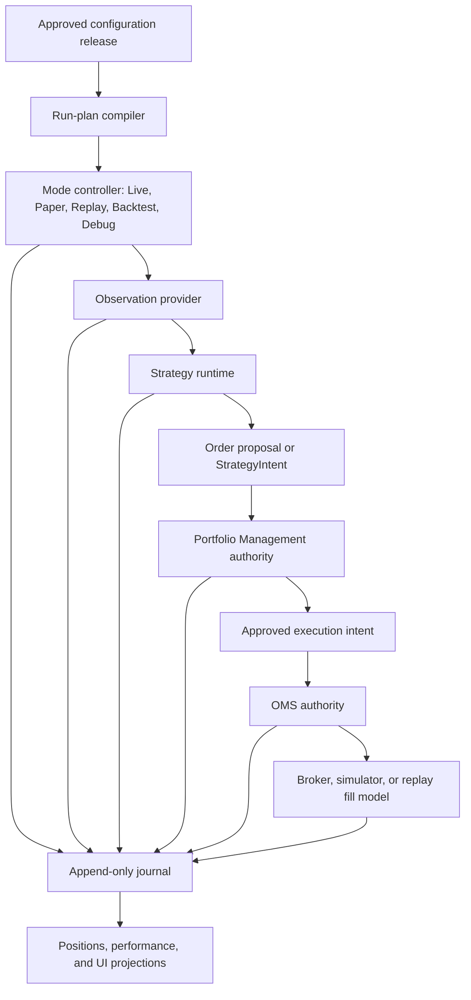

# Trading control plane

[Top](README.md) · [Previous](07-canvas-charts-and-interaction.md) · [Next](09-intelligence-and-model-services.md)

## 1. One authority chain for every trading mode

Manual and semi-automatic proposals enter at `Order proposal`; they do not bypass Portfolio Management or OMS.

## 2. Configuration objects

| Object | Purpose | User-facing? |
|---|---|---|
| Strategy Profile | Reusable logic, parameters, observation dependencies, decision schedule | Yes |
| Watchlist/Universe Profile | Membership and refresh rules | Yes |
| Portfolio Policy | Capital allocation, account/group limits, reservations, exposure and risk | Yes |
| Execution Policy | Order construction, routing, timing, repricing and cancellation | Yes |
| Protection Policy | Stops, targets, flatten, disconnect and stale-data behavior | Yes |
| Canvas/Workspace | Presentation and interaction defaults | Yes |
| Environment Binding | Broker endpoint and secret-backed account identifiers | Reviewable, not editable secrets |
| Deployment/Run Plan | Compiled binding of the above with mode and permissions | Generated; optionally reviewable |

The user should not have to hand-author a deployment if it is deterministically derivable. The compiler emits an immutable, hash-addressed Run Plan for review, audit, replay, and restart.

## 3. Mode parity and intentional differences

| Concern | Live/Paper | Replay | Backtest | Debug |
|---|---|---|---|---|
| Clock | Wall/exchange clock | Replay clock | Simulation clock | Controlled clock |
| Observations | QMD + point-in-time enrichment | Recorded market/intelligence stream | Historical source planner | Fixture or selected source |
| Portfolio | Real/shared authority | Isolated simulated ledger | Isolated simulated ledger | Isolated |
| OMS adapter | IBKR or approved broker | Deterministic fill model | Deterministic fill model | Stub/simulator |
| Journal schema | Shared | Shared | Shared | Shared |

Strategy, Portfolio, OMS state machines and journal event schemas should be shared. Source, clock, latency, and fill adapters are injected. A replay must not silently use today’s identity, fundamentals, news, or corrections for a historical decision.

## 4. Portfolio Management authority

Portfolio Management exclusively owns:

- account and account-group allocation;
- capital, buying-power, leverage and concentration budgets;
- position and exposure truth used for decisions;
- reservations for accepted but unfilled intent;
- cross-strategy and cross-run arbitration;
- portfolio-level loss, drawdown and flatten controls;
- acceptance, resize, defer, queue, or rejection of proposals.

Generic run-priority fields are not an authority or an arbitration shortcut and
are removed by configuration migration. Portfolio admission acquires
SQLite-WAL-backed account and account-group leases before reloading and
committing durable reservations. Every acquisition advances a fencing epoch,
expires after a bounded TTL, and can be released only by the exact owner/epoch;
a stale owner cannot clear a newer lease. Process-local locks remain useful for
scheduling inside one broker session but are no longer the shared-capital
authority.

## 5. OMS authority

OMS exclusively owns executable order lifecycle after Portfolio approval:

- transform approved intent into broker orders;
- idempotent client/order identifiers;
- submit, acknowledge, replace, cancel, reject and reconcile;
- parent/child, bracket, stop and target relationships;
- partial fills and remaining quantity;
- broker-state recovery after reconnect;
- execution-policy timing and protection-policy enforcement;
- emit normalized order/execution events.

The broker adapter executes OMS commands. Strategies, charts, AI services, and scanners never call the broker directly.

`submit_intent` now verifies the exact durable Portfolio decision and
reservation against account, intent, ticker, approved quantity, and active
status before planning any broker order. It also rejects an intent ID already
present in durable OMS state even when recovery has not yet populated the
in-memory projection. This makes the journal boundary authoritative for both
Portfolio admission and OMS idempotency; metadata alone is not approval.

## 6. IBKR and account bindings

IBKR Gateway/Supervisor owns connectivity, session health, market/trading permissions and broker account discovery. Secrets and actual account IDs remain environment-backed. Configuration stores stable binding keys and permitted modes, not credentials.

Readiness is stricter than an open socket: authenticated session, expected account set, market-data permission state, clock skew, order-ID synchronization, and successful reconciliation are required before executable authority is enabled.

## 7. Journal and projections

The append-only trading journal records configuration release, Run Plan hash, clock/source checkpoints, observation references, decisions, proposals, portfolio dispositions, orders, executions, position changes, protections, operator actions and failures. Mutable UI views—positions, orders, P&L, attribution and run status—are rebuildable projections.

Every event requires stable IDs, mode, environment, event/available/processing timestamps, causation/correlation IDs and payload/schema version.

## 8. Restart and failure behavior

On restart:

1. acquire the correct fenced authority;
2. load the last durable journal/checkpoint;
3. query broker or simulator truth;
4. reconcile orders, fills, cash, positions and reservations;
5. emit discrepancies;
6. resume only after policy-specific readiness succeeds.

Stale market data, QMD loss, intelligence loss, broker disconnect, reconciliation mismatch and journal failure each have explicit policies. Intelligence loss may degrade a strategy that declares it optional; loss of authoritative journaling or uncertain broker state must fail closed for new execution.

Historical run snapshots expose the latest durable checkpoint cursor, event
clock, write clock, processed-event count, and configured interval. They also
explicitly report `resume_supported: false`: checkpoint observability is
implemented, but restart reconstruction is not yet authorized as safe resume.

## 9. Current implementation

- Strategy taxonomy now separates an observation's strategy-facing key from
  its producer and producer capability. The configuration compiler groups
  those inputs into typed `observation_dependencies` on the immutable Run Plan.
  Paper/Live plans bound to QMD Watchlists use that manifest to renew an exact
  `strategy_run` computation lease; deferred News/SEC inputs remain declared
  dependencies but are not sent to QMD.
- Replay and Backtest now use the same historical controller, Strategy,
  Portfolio, OMS, simulator, and journal. Backtest runs one continuous runtime
  at maximum event speed across the selected exchange sessions and pins the
  approved configuration revision. Its setup page can create, monitor, and
  stop a run.
- Backtest Debug injects a bounded, content-hashed fixture into that same
  historical controller. Canonical quote/trade events and normalized derived
  frames use the same controlled clock, Strategy, Portfolio, OMS simulator,
  journal, and Canvas projection as Backtest; they do not call QMD History.
  The exact fixture records and hash are stored beside the run manifest under
  the external runtime root so a Debug result names reproducible input rather
  than an opaque test mock. The Backtest Debug workspace provides a bounded
  JSON fixture editor, browser-local reusable case library, preflight, run
  controls, hash evidence, and the shared read-only Canvas projection.
- Automatic historical modes expose one bounded lifecycle-command shape:
  `pause`, `play` (resume), and `stop`. Backtest and Backtest Debug pages use
  that command endpoint and show the resulting controller status; Replay-only
  step, speed, and fast-forward commands are rejected for automatic modes.
- Historical Strategy warm-up fetches the cross-sectional Scanner signal product
  once per run window and groups it by assigned ticker. Ticker/timeframe derived
  streams use a bounded semaphore (default eight, maximum 32) rather than opening
  every QMD History request concurrently.
- Replay and Backtest persist a `data_authority` manifest beside the journal.
  It pins the approved configuration hash plus QMD event, per-ticker/timeframe
  derived, and cross-sectional Scanner-signal source-plan hashes and revision
  tokens before those products can drive decisions. The same evidence is
  journaled once per source key, and a changed revision for an existing key
  fails the run. Backtest Debug uses the exact fixture content hash as both its
  plan and revision authority. This proves what an active run consumed; it does
  not yet make superseded ClickHouse revisions rereadable after restart.
- Backtest Watchlist membership is pinned at the requested first event clock
  and re-resolved causally at every later 04:00 New York weekday-session
  boundary. The shared controller journals additions/removals, prevents new
  flat-position evaluations while a synthetic Watchlist assignment is inactive,
  and continues managing an already-open position after removal. Intraday
  membership-event replay at the configured Watchlist refresh cadence remains
  incomplete; this is still disclosed partial parity. The Backtest page projects canonical performance, Portfolio,
  positions, orders, executions, and closed trades from the same run journal.
- Live still has data/UI controller-parity work, but its dormant direct broker
  submit/reply/modify/cancel helpers now fail closed. Broker what-if preview
  remains non-executing; executable intents route through Portfolio and OMS.
- Portfolio admission is fenced across backend/run processes sharing the same authoritative trading journal. A multi-host deployment would still need to move the same lease/reservation contract to a networked transactional authority.
- The canonical Portfolio projection now exposes a bounded operational metrics
  envelope derived from the durable journal and current state: disposition and
  reservation-transition counts, active reserved notional/risk, reconciliation
  issues, OMS state counts, unknown outcomes, protection deficits, and
  reconciliation failures. Canvas renders the safety-critical subset.
- Portfolio restart reconciliation is durable end to end. Runtime startup
  refreshes authoritative cash, positions, and orders before enabling entry
  authority; OMS restores nonterminal groups and reconciles stable client and
  broker IDs, with callbacks resizing or releasing reservations. Portfolio now
  also persists broker-versus-managed-attribution differences, restores them
  after journal reopen, and writes a reconciliation record only when that
  difference set changes. Legitimate external/manual positions remain explicit
  differences and continue to count in account exposure rather than being
  silently adopted as Strategy allocations.
- Configuration publishing emits immutable compiled Run Plans. Live still has
  shared-controller migration work, but no current backend route or retained
  legacy order helper can issue a broker command outside OMS.
- Paper/Live account bindings store only stable application keys, backend
  environment-key names, and session keys. Configuration schema v19 migrates
  older direct broker identifiers to the standard Paper/Cash environment keys;
  public review APIs never resolve or return the underlying broker account ID.
  Broker/account readiness and generated deployment review are not yet one
  complete flow.

---

[Top](README.md) · [Previous](07-canvas-charts-and-interaction.md) · [Next](09-intelligence-and-model-services.md)
