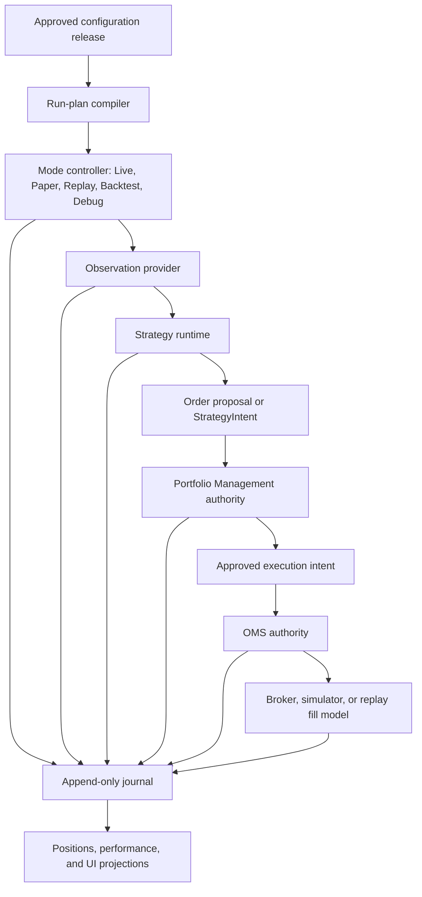

# Trading control plane

[Top](README.md) · [Previous](07-canvas-charts-and-interaction.md) · [Next](09-intelligence-and-model-services.md)

## 1. One authority chain for every trading mode

Manual and semi-automatic proposals enter at `Order proposal`; they do not bypass Portfolio Management or OMS.

## 2. Configuration objects

| Object | Purpose | User-facing? |
|---|---|---|
| Strategy Profile | Reusable logic, parameters, observation dependencies, decision schedule | Yes |
| Watchlist/Universe Profile | Membership and refresh rules | Yes |
| Portfolio Policy | Capital allocation, account/group limits, reservations, exposure and risk | Yes |
| Execution Policy | Order construction, routing, timing, repricing and cancellation | Yes |
| Protection Policy | Stops, targets, flatten, disconnect and stale-data behavior | Yes |
| Canvas/Workspace | Presentation and interaction defaults | Yes |
| Environment Binding | Broker endpoint and secret-backed account identifiers | Reviewable, not editable secrets |
| Deployment/Run Plan | Compiled binding of the above with mode and permissions | Generated; optionally reviewable |

The user should not have to hand-author a deployment if it is deterministically derivable. The compiler emits an immutable, hash-addressed Run Plan for review, audit, replay, and restart.

## 3. Mode parity and intentional differences

| Concern | Live/Paper | Replay | Backtest | Debug |
|---|---|---|---|---|
| Clock | Wall/exchange clock | Replay clock | Simulation clock | Controlled clock |
| Observations | QMD + point-in-time enrichment | Recorded market/intelligence stream | Historical source planner | Fixture or selected source |
| Portfolio | Real/shared authority | Isolated simulated ledger | Isolated simulated ledger | Isolated |
| OMS adapter | IBKR or approved broker | Deterministic fill model | Deterministic fill model | Stub/simulator |
| Journal schema | Shared | Shared | Shared | Shared |

Strategy, Portfolio, OMS state machines and journal event schemas should be shared. Source, clock, latency, and fill adapters are injected. A replay must not silently use today’s identity, fundamentals, news, or corrections for a historical decision.

## 4. Portfolio Management authority

Portfolio Management exclusively owns:

- account and account-group allocation;
- capital, buying-power, leverage and concentration budgets;
- position and exposure truth used for decisions;
- reservations for accepted but unfilled intent;
- cross-strategy and cross-run arbitration;
- portfolio-level loss, drawdown and flatten controls;
- acceptance, resize, defer, queue, or rejection of proposals.

Priority fields on individual runs are inputs to this authority; they are not themselves arbitration. Portfolio admission now acquires SQLite-WAL-backed account and account-group leases before reloading and committing durable reservations. Every acquisition advances a fencing epoch, expires after a bounded TTL, and can be released only by the exact owner/epoch; a stale owner cannot clear a newer lease. Process-local locks remain useful for scheduling inside one broker session but are no longer the shared-capital authority.

## 5. OMS authority

OMS exclusively owns executable order lifecycle after Portfolio approval:

- transform approved intent into broker orders;
- idempotent client/order identifiers;
- submit, acknowledge, replace, cancel, reject and reconcile;
- parent/child, bracket, stop and target relationships;
- partial fills and remaining quantity;
- broker-state recovery after reconnect;
- execution-policy timing and protection-policy enforcement;
- emit normalized order/execution events.

The broker adapter executes OMS commands. Strategies, charts, AI services, and scanners never call the broker directly.

`submit_intent` now verifies the exact durable Portfolio decision and
reservation against account, intent, ticker, approved quantity, and active
status before planning any broker order. It also rejects an intent ID already
present in durable OMS state even when recovery has not yet populated the
in-memory projection. This makes the journal boundary authoritative for both
Portfolio admission and OMS idempotency; metadata alone is not approval.

## 6. IBKR and account bindings

IBKR Gateway/Supervisor owns connectivity, session health, market/trading permissions and broker account discovery. Secrets and actual account IDs remain environment-backed. Configuration stores stable binding keys and permitted modes, not credentials.

Readiness is stricter than an open socket: authenticated session, expected account set, market-data permission state, clock skew, order-ID synchronization, and successful reconciliation are required before executable authority is enabled.

## 7. Journal and projections

The append-only trading journal records configuration release, Run Plan hash, clock/source checkpoints, observation references, decisions, proposals, portfolio dispositions, orders, executions, position changes, protections, operator actions and failures. Mutable UI views—positions, orders, P&L, attribution and run status—are rebuildable projections.

Every event requires stable IDs, mode, environment, event/available/processing timestamps, causation/correlation IDs and payload/schema version.

## 8. Restart and failure behavior

On restart:

1. acquire the correct fenced authority;
2. load the last durable journal/checkpoint;
3. query broker or simulator truth;
4. reconcile orders, fills, cash, positions and reservations;
5. emit discrepancies;
6. resume only after policy-specific readiness succeeds.

Stale market data, QMD loss, intelligence loss, broker disconnect, reconciliation mismatch and journal failure each have explicit policies. Intelligence loss may degrade a strategy that declares it optional; loss of authoritative journaling or uncertain broker state must fail closed for new execution.

## 9. Current implementation

- Replay and Backtest now use the same historical controller, Strategy,
  Portfolio, OMS, simulator, and journal. Backtest runs one continuous runtime
  at maximum event speed across the selected exchange sessions and pins the
  approved configuration revision. Its setup page can create, monitor, and
  stop a run.
- Backtest Watchlist membership is currently resolved at the first event clock.
  Session-varying membership activation/deactivation and strategy attribution
  remain incomplete; this is a disclosed partial implementation, not mode
  parity. The Backtest page now projects canonical performance, Portfolio,
  positions, orders, executions, and closed trades from the same run journal.
- Live still contains legacy paths and has not reached controller parity.
- Portfolio admission is fenced across backend/run processes sharing the same authoritative trading journal. A multi-host deployment would still need to move the same lease/reservation contract to a networked transactional authority.
- Several UI pages imply configuration objects without one backend compiler and immutable Run Plan contract.
- Account bindings are partly environment-backed as desired, but broker/account readiness and generated deployment review are not yet one complete flow.

---

[Top](README.md) · [Previous](07-canvas-charts-and-interaction.md) · [Next](09-intelligence-and-model-services.md)
