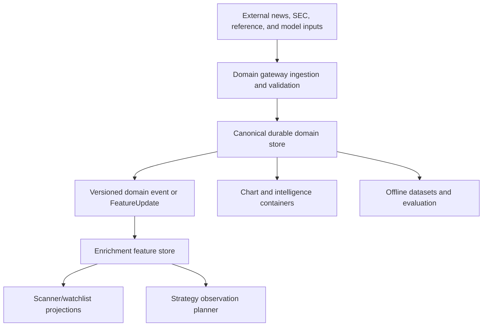
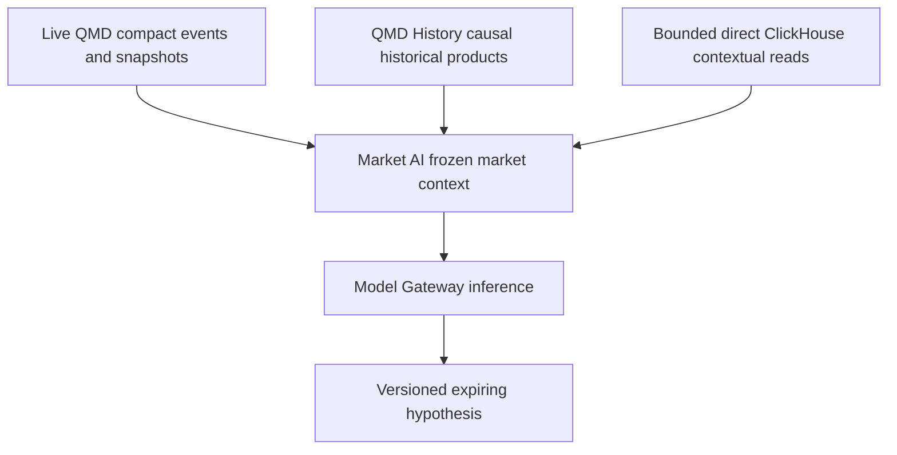

# Intelligence and model services

[Top](README.md) · [Previous](08-trading-control-plane.md) · [Next](10-backend-and-api-integration.md)

## 1. Service roles

| Service/domain | Authority and responsibility | Primary consumers |
|---|---|---|
| News Gateway | Canonical news retrieval, rendering, provenance, entities and structured outputs | UI, feature store, strategies, research |
| SEC Gateway | Filing discovery, source documents, accession/revision lineage, facts and filing events | UI, Reference, feature store, research |
| Reference Gateway | Point-in-time issuer/security/listing/symbol identity and validated publications | All market consumers |
| Text Intelligence | Deterministic/agentic text analysis products with structured validation | News/SEC workflows, UI, research |
| Text Embedding | Versioned embeddings and similarity retrieval | Search, clustering, models |
| Model Gateway | Model inventory, artifact/version loading and bounded inference | Backend, strategy observations, research |
| Market AI | Time-bounded, evidence-linked market hypotheses | Operator UI and permitted strategy inputs |

These services enrich observations. They do not own market events, portfolios, orders, or executions.

## 2. Canonical source plus event notification

Notifications carry keys and versions; they do not replace the canonical domain record. Consumers can rebuild projections from the source plus checkpoints.

## 3. News path

News identity and rendering preserve provider IDs, source timestamps, receipt timestamps, raw/source payload, canonical article version, entities and renderer/analysis versions. Structured news outputs become registered fields only after schema validation and must retain their causal `available_at`.

Ticker attribution distinguishes explicit source symbols, resolved point-in-time identity, inferred entities and confidence. Corrections create new versions; they do not overwrite the observation that was actually available to a Replay/Backtest decision.

## 4. SEC and fundamentals path

SEC stores filings by accession and revision lineage, then derives filing metadata, issuer/security mappings, XBRL facts and reported-period features. Restatements and amended filings preserve both the original availability and later correction.

Reference Gateway publishes validated identity and scanner-ready reference/fundamental tables. The enrichment registry maps fields to these publications and defines point-in-time joins. UI filing/XBRL detail may query the domain gateway directly through the backend, while scanners consume compact projections.

## 5. Labels, embeddings, and models

Labels—sector, industry, themes, compliance, news/filing classifications, event types and model tags—are registered features with provider, taxonomy version, effective interval and availability time.

Embeddings require model ID, model hash, input canonical version, dimensions, normalization and creation time. Similarity results are retrieval products, not authoritative labels unless promoted through a validated publication.

Model outputs require:

- model/artifact and feature-contract versions;
- exact as-of input references;
- score/calibration semantics and horizon;
- produced/available/expiry times;
- uncertainty, abstention and missing-input state;
- evaluation/promotion status.

## 6. Market AI boundary

Market AI may synthesize market, news, filing, reference, portfolio and model evidence into a hypothesis. A hypothesis is structured, time-bounded and evidence-linked. It is never a broker command and never bypasses deterministic risk.

QMD Gateway is the live market-data path. QMD History is the preferred
historical/replay market-product path. Direct ClickHouse access is permitted for
bounded, registered point-in-time context and approved bulk reads; it must not
fork event normalization or QMD calculations.

If a strategy is explicitly approved to consume an AI feature, that feature enters through the observation contract with declared freshness, expiry, required/optional status and fallback. Conversational text is not a strategy input.

## 7. Causal correctness across modes

Live consumers use the newest version whose `available_at <= decision_time`. Replay/Backtest consumers use the same rule against historical version history. Research may deliberately use corrected/latest data, but must label that dataset as non-causal if it would not have been available at the simulated time.

Identity resolution follows the same rule. A current ticker or current issuer mapping cannot be silently projected backward.

## 8. Current drift

- The services exist at different maturity levels, but they do not yet all emit one standard domain-event/FeatureUpdate contract into one enrichment feature store.
- Scanner code contains direct per-domain query knowledge that belongs in the registered enrichment query plans.
- Some older service documentation understates active Text Intelligence and newer AI surfaces.
- Model/AI drafts need explicit artifact promotion, expiry, evidence and strategy-observation contracts before they can participate in trading.
- Market AI already has live QMD and direct ClickHouse seams, but its historical
  replay path is not yet integrated with QMD History's unified source plan.

## 9. Scheduling constraint

Intelligence work is currently undergoing separate changes. Therefore the
immediate architecture implementation may change QMD Gateway, QMD History, the
application backend/frontend, Portfolio, and OMS. Market AI, News, SEC, Text
Intelligence, Text Embed, Model Gateway, and Reference service changes are
deferred until those authorities stabilize. Permitted consumers may add typed
clients, adapters, UI states, and observation boundaries against existing
contracts, but must not require or silently introduce changes in the deferred
producer services. Existing working services must not be refactored merely to
satisfy the target diagram.

---

[Top](README.md) · [Previous](08-trading-control-plane.md) · [Next](10-backend-and-api-integration.md)
