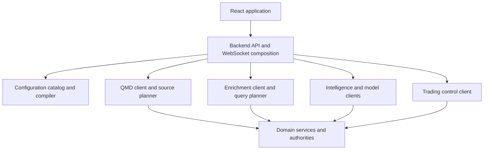

# Backend and API integration

[Top](README.md) · [Previous](09-intelligence-and-model-services.md) · [Next](11-research-and-model-lifecycle.md)

## 1. Backend role

The backend is the browser-facing composition boundary and application control API. It authenticates users, compiles configuration, plans bounded queries, calls domain services, merges read models, enforces command authorization, and exposes HTTP/WebSocket contracts.

It is not a second market-data, news, SEC, reference, portfolio, or order authority. Browser code must not know ClickHouse table names, service credentials, broker account IDs, or internal service topology.



## 2. API domains

| Domain | Representative operations |
|---|---|
| Catalog/configuration | list capabilities, fields, containers, strategies, policies; validate/publish configuration; compile/review Run Plan |
| Market discovery | universal ingest view, core scanner snapshots/deltas, watchlists, ranks, field availability |
| Charts | source-planned bars/events, indicator series, live subscriptions, provenance/coverage |
| Intelligence | news, filings, facts/XBRL, reference details, search, hypotheses |
| Trading | runs, proposals, approvals, orders, executions, positions, portfolios, protections, accounts/readiness |
| Replay/backtest | session lifecycle, clock controls, datasets, progress, results and comparison |
| Operations | service readiness, source coverage, lag, failures, audits and administrative actions |

Legacy aliases may remain during migration, but each operation has one canonical contract and owner.

## 3. Standard request and response contracts

All data requests include an explicit subject/universe, time semantics, requested fields/capabilities, adjustment/session policy, mode, and bounded paging/row limits as applicable.

Responses use a standard envelope:

```text
data
schema_version
request_id
as_of
source_coverage[]
source_versions{}
computation_versions{}
watermark / last_sequence
freshness and completeness
warnings[] and rejected/deferred counts
next_page_token
```

Errors are typed: invalid configuration, unsupported capability, missing causal data, incomplete coverage, stale source, not ready, authorization failure, resource limit, upstream unavailable and internal failure. An empty successful array is not a substitute for a failed or incomplete query.

## 4. Streaming and recovery

WebSocket/SSE streams begin from an HTTP snapshot identified by `snapshot_id` and `last_sequence`. Deltas carry monotonically ordered sequence or explicit partition sequence. Reconnect supplies the last applied checkpoint; the server either fills the gap or requires a new snapshot.

Subscriptions are reference-counted and bounded. Slow clients receive coalesced projections where valid, or a resnapshot instruction; authoritative events are not silently dropped. Heartbeats distinguish idle markets from dead connections.

QMD stream lag is now terminal and machine-readable. Scanner replaces its state
in-band; raw/compact event, intraday-bar, live-state, signal, and historical
derived streams emit `type=stream_gap`, `action=resnapshot_required`, a recovery
endpoint or original-window retry contract, and then close. Periodic product
streams send current snapshots and therefore do not accumulate an undisclosed
delta gap.

## 5. Shared clients and query planners

Backend route handlers call shared typed clients:

- **QMD client:** resolves live/recent/archive coverage and returns normalized events/bars;
- **enrichment client:** resolves registry fields into batch/PIT query plans and feature-store reads;
- **intelligence clients:** retrieve domain detail and structured products;
- **trading client:** submits commands to the authoritative run/Portfolio/OMS control plane;
- **configuration compiler:** validates references and produces immutable releases and Run Plans.

Direct ClickHouse SQL embedded across route handlers is a migration target. SQL belongs in versioned repository/query-plan definitions behind the appropriate client.

Canvas configuration context is the first completed backend SQL migration.
Bounded company-News, SEC filing, Scanner summary, and CIK-to-ticker queries now
live in `canvas_context_v1`; the application registry names each plan and its
physical sources, identity join, event/availability clocks, and coverage path.
The Canvas composition service supplies only validated cutoff/CIK inputs and
executes the selected versioned builder. Other backend SQL domains remain open
and are not implied complete by this migration.

Scanner enrichment is already set-based at the service boundary. One causal
reference query resolves the eligible universe with identity, market snapshot,
float, short interest, country, presentation assets, IPOs and splits; one
causal fundamentals query resolves SEC facts for the same population; and one
daily-bar query supplies previous close and volume baselines. The backend joins
those projections in memory and does not issue a remote request per ticker.
Both the historical and Live/Paper scanner compositions now attach a compact
registry-derived feature projection with source/query-plan ID, schema/source
revision, causal availability and freshness policy, coverage, and null reasons.
The projection avoids repeating provenance on every market row while keeping a
flat browser-friendly scanner payload.

The typed QMD client response schema v2 preserves product, authority, endpoint,
payload, completeness, warnings, coverage status and source revision. QMD Live
and History GET failures now cross the backend boundary as `QmdServiceError`
with stable code, service, operation, path, retryability and upstream status.
QMD-facing HTTP routes return that structured detail while retaining the
request correlation header; the frontend renders its message without discarding
the machine-readable error fields. PUT and DELETE lease mutations use the same
typed transport, and proxied QMD WebSockets preserve the legacy human-readable
`error` field inside a schema-v1 terminal frame with machine-readable
`error_detail`.

`GET /api/system/computation-requirements` is the read-only cross-service
planner projection. It composes QMD Gateway's structured live requirements and
QMD History's revisioned offline cache requirements without merging their
authorities or source revisions. Each side may degrade independently; the
response returns partial evidence plus typed per-authority errors rather than
failing the available side. Market Discovery consumes the same projection.

The backend's causal daily-session aggregation is the registered
`market.daily_session_bars.v1` plan. Historical Scanner, ticker facts, and
Watchlist consumers call that versioned builder directly. It requires all three
extended-session partitions, rejects ambiguous source identity, applies the
`available_at_us` cutoff, and falls back to a source ticker only when canonical
coverage for the requested ticker is absent. `daily_session_bars.py` remains a
compatibility import, not a second SQL authority.

Bounded ticker branding and issuer-name lookup is registered separately as
`market.ticker_presentation.v1`. The plan owns latest reference-snapshot
selection, linked-logo precedence, deterministic legacy-asset fallback, and
one-row-per-ticker reduction. `ticker_presentation_service.py` retains only the
request bound, optional-data degradation policy, row projection, and a
compatibility re-export of the registered builder.

The current Live market-data population and the Live/Paper tradability gate
share `market.tradable_universe.v1`. Its full projection joins the latest
published universe, scanner-static, issuer, and presentation sources; its
bounded symbol lookup returns the same universe date, tradability decision,
exclusion reason, and broker conid used by command preflight. Database selection
remains server-side and neither caller carries route-local SQL.

`reference.identity_for_symbol.v1` now points to an actual versioned query
builder rather than the ticker-facts composition service. The identity anchor
selects the newest universe publication no later than the requested day and
recording clock, applies the same clock to symbol/listing/security/issuer joins,
and deterministically prefers tradable USD stock listings. The service retains
the public builder name as a compatibility import.

The remaining non-fundamental Ticker Facts fanout is registered as
`reference.ticker_facts.v1` and built as one bounded query bundle after identity
resolution. It covers market snapshot, float, borrow, short interest/volume,
FTD, Reg SHO, identifiers, classifications, splits/dividends, and causal daily
volume. Each independent source remains separately degradable in composition.
IPO fields resolve through `reference.scanner_asof.v1`, the implementation that
actually loads point-in-time IPO data, rather than claiming Ticker Facts as a
source it does not query. SEC/XBRL facts remain in
`sec.fundamentals_asof.v1`; its versioned backend builder now owns both the
bounded current-fact query and comparison-history query used by Ticker Facts.
The same plan owns Historical Scanner's set-based all-universe XBRL query,
including the causal universe publication and filing/recording cutoffs.
This extraction does not change SEC Gateway schemas, publication, or service
behavior.

`reference.scanner_asof.v1` is likewise an executable versioned plan rather
than a pointer to the Scanner composition service. It performs one set-based
read over the causal tradable universe and reference publications. Universe,
Scanner-static, security, issuer/branding, presentation assets, country, market
snapshot, float, short interest, IPO, and split inputs all apply the workspace
availability cutoff before projection. Historical Scanner retains row shaping
and logo-URL presentation only.

All backend HTTP and request-validation failures cross one typed error boundary.
The schema carries `complete=false`, `data=null`, warnings, stable error code,
message, retryability, HTTP status, and correlation/causation identity. The
legacy FastAPI `detail` field remains present during client migration. The
shared frontend client reads the typed fields into `ApiError` while retaining
the existing human-readable exception message. Success-envelope migration is
separate because existing route payloads remain intentionally compatible.

## 6. Configuration registry and compiler

The catalog contains capability, field, container, strategy, policy, mode and service descriptors. Configuration records reference stable IDs and versions. The compiler:

1. resolves dependencies;
2. checks scope/mode compatibility and permissions;
3. constructs computation and enrichment DAGs;
4. calculates warm-up and source requirements;
5. validates account/environment bindings;
6. estimates resource class and applies limits;
7. emits a deterministic release/Run Plan hash.

The backend application registry now exposes versioned family endpoints for
market sources, QMD products, enrichment fields/query plans, Canvas containers,
typed link contracts, and configuration schemas. Its validator checks unique
IDs, cross-family references, product dependency cycles,
coverage/watermark authority, and supported modes. QMD's shared live/history
capability catalog remains the formula-level authority and additionally
declares implementation version, cadence, timeframe, warm-up, state class,
persistence, cost/scope, mode support, and implementation status.
`GET /api/registries/capabilities` exposes that QMD runtime authority with its
content hash and family counts. It fails with a typed 503 when QMD cannot prove
the runtime catalog; it never substitutes a Python-authored availability list.
Configuration schema v19 carries the QMD capability key and warm-up bars from
that catalog into the immutable release. The Run Plan pins those bars and the
implementation revision per QMD observation dependency. Missing catalog
evidence remains explicit as `catalog_unavailable`; it is never converted to a
zero-bar warm-up assumption.

Public configuration review is distinct from executable runtime resolution.
Paper/Live responses expose stable account keys and server environment-key
names only. The backend resolves the actual broker ID only while constructing
an internal runtime configuration, and schema validation rejects storing that
ID in a published configuration.

The UI derives choices and statuses from this catalog. It must not maintain a competing handwritten list of “available” features.

## 7. Caching and workload isolation

Use separate resource budgets and queues for:

- latency-critical trading/control commands;
- live scanner/watchlist projections;
- interactive chart/intelligence reads;
- replay/backtest workloads;
- offline export/research work.

The HTTP composition boundary now enforces independent configurable admission
budgets for `commands`, `discovery`, `charts`, `simulation`, `offline`, and
`general` traffic. Defaults are 8, 8, 12, 6, 2, and 32 concurrent requests;
`BACKEND_<LANE>_CONCURRENCY` changes a lane without sharing capacity with the
others. Requests wait at most 250 ms, then receive a retryable typed HTTP 429
carrying the lane, limit, and request correlation/causation IDs. Operators can
inspect active, available, completed, rejected, and cumulative wait evidence at
`GET /api/system/workload-budgets`.

Cache keys include tenant/user scope where relevant, source versions, field/capability version, as-of semantics and adjustment/session policy. Commands and mutable trading state are never served from a generic response cache.

## 8. Security and authorization

The backend enforces user, workspace, environment, mode, account and command permissions. It resolves secret-backed bindings server-side, validates CSRF/origin for browser commands, audits configuration publishes and trading actions, redacts secrets from logs, and provides time-limited access to large artifacts when needed.

Service-to-service calls use scoped identities and explicit allowlists. Read access to a chart does not imply order authority; Paper authority does not imply Live authority.

## 9. Current drift

- Live and historical QMD HTTP/WebSocket transport, endpoint resolution,
  encoding, and error handling share `qmd_gateway_client.py`. Chart,
  compact-event and Scanner consumers now use one typed product/window planner;
  a causal window selects QMD History while a windowless request selects QMD
  live. Remaining non-product compatibility aliases and specialized operational
  endpoints still require separate migration.
- Shared workspace containers now use the backend registry and QMD runtime
  capabilities have a verified backend endpoint. The duplicate Python QMD
  fallback has been removed; saved releases retain embedded review evidence,
  while current choices require QMD authority. Remaining handwritten reference
  and deferred-intelligence projections still require registry generation.
- Non-QMD endpoint envelopes and application-wide command authorization still
  need standardization; QMD and scanner feature projections now preserve typed
  completeness/provenance at their composition boundaries.
- Replay, Live/Paper, Backtest, and Research resolve the same published Canvas.
  The trading modes also resolve canonical trading projections; Research stays
  request-scoped and does not acquire a trading runtime or account authority.
  The remaining legacy rollback code still requires migration evidence before
  removal.
- `POST /api/trading/backtest_debug/runs` accepts one bounded deterministic
  fixture and pins it to the approved configuration release. Its list, status,
  stop, and Canvas endpoints are mode-specific projections over the shared
  historical controller. Fixture records require explicit timezone-aware
  event clocks and causal ordering; the backend persists their SHA-256 identity
  with the run. Typed pause, play, and stop commands share the historical run
  controller. QMD is deliberately not a dependency of this injected source.

---

[Top](README.md) · [Previous](09-intelligence-and-model-services.md) · [Next](11-research-and-model-lifecycle.md)
