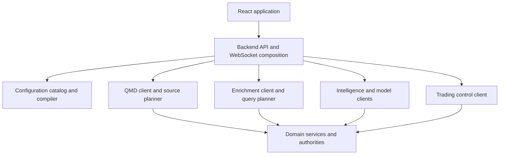

# Backend and API integration

[Top](README.md) · [Previous](09-intelligence-and-model-services.md) · [Next](11-research-and-model-lifecycle.md)

## 1. Backend role

The backend is the browser-facing composition boundary and application control API. It authenticates users, compiles configuration, plans bounded queries, calls domain services, merges read models, enforces command authorization, and exposes HTTP/WebSocket contracts.

It is not a second market-data, news, SEC, reference, portfolio, or order authority. Browser code must not know ClickHouse table names, service credentials, broker account IDs, or internal service topology.



## 2. API domains

| Domain | Representative operations |
|---|---|
| Catalog/configuration | list capabilities, fields, containers, strategies, policies; validate/publish configuration; compile/review Run Plan |
| Market discovery | universal ingest view, core scanner snapshots/deltas, watchlists, ranks, field availability |
| Charts | source-planned bars/events, indicator series, live subscriptions, provenance/coverage |
| Intelligence | news, filings, facts/XBRL, reference details, search, hypotheses |
| Trading | runs, proposals, approvals, orders, executions, positions, portfolios, protections, accounts/readiness |
| Replay/backtest | session lifecycle, clock controls, datasets, progress, results and comparison |
| Operations | service readiness, source coverage, lag, failures, audits and administrative actions |

Legacy aliases may remain during migration, but each operation has one canonical contract and owner.

## 3. Standard request and response contracts

All data requests include an explicit subject/universe, time semantics, requested fields/capabilities, adjustment/session policy, mode, and bounded paging/row limits as applicable.

Responses use a standard envelope:

```text
data
schema_version
request_id
as_of
source_coverage[]
source_versions{}
computation_versions{}
watermark / last_sequence
freshness and completeness
warnings[] and rejected/deferred counts
next_page_token
```

Errors are typed: invalid configuration, unsupported capability, missing causal data, incomplete coverage, stale source, not ready, authorization failure, resource limit, upstream unavailable and internal failure. An empty successful array is not a substitute for a failed or incomplete query.

## 4. Streaming and recovery

WebSocket/SSE streams begin from an HTTP snapshot identified by `snapshot_id` and `last_sequence`. Deltas carry monotonically ordered sequence or explicit partition sequence. Reconnect supplies the last applied checkpoint; the server either fills the gap or requires a new snapshot.

Subscriptions are reference-counted and bounded. Slow clients receive coalesced projections where valid, or a resnapshot instruction; authoritative events are not silently dropped. Heartbeats distinguish idle markets from dead connections.

## 5. Shared clients and query planners

Backend route handlers call shared typed clients:

- **QMD client:** resolves live/recent/archive coverage and returns normalized events/bars;
- **enrichment client:** resolves registry fields into batch/PIT query plans and feature-store reads;
- **intelligence clients:** retrieve domain detail and structured products;
- **trading client:** submits commands to the authoritative run/Portfolio/OMS control plane;
- **configuration compiler:** validates references and produces immutable releases and Run Plans.

Direct ClickHouse SQL embedded across route handlers is a migration target. SQL belongs in versioned repository/query-plan definitions behind the appropriate client.

## 6. Configuration registry and compiler

The catalog contains capability, field, container, strategy, policy, mode and service descriptors. Configuration records reference stable IDs and versions. The compiler:

1. resolves dependencies;
2. checks scope/mode compatibility and permissions;
3. constructs computation and enrichment DAGs;
4. calculates warm-up and source requirements;
5. validates account/environment bindings;
6. estimates resource class and applies limits;
7. emits a deterministic release/Run Plan hash.

The backend application registry now exposes versioned family endpoints for
market sources, QMD products, enrichment fields/query plans, Canvas containers,
typed link contracts, and configuration schemas. Its validator checks unique
IDs, cross-family references, product dependency cycles,
coverage/watermark authority, and supported modes. QMD's shared live/history
capability catalog remains the formula-level authority and additionally
declares implementation version, cadence, timeframe, warm-up, state class,
persistence, cost/scope, mode support, and implementation status.
`GET /api/registries/capabilities` exposes that QMD runtime authority with its
content hash and family counts. It fails with a typed 503 when QMD cannot prove
the runtime catalog; it never substitutes a Python-authored availability list.

The UI derives choices and statuses from this catalog. It must not maintain a competing handwritten list of “available” features.

## 7. Caching and workload isolation

Use separate resource budgets and queues for:

- latency-critical trading/control commands;
- live scanner/watchlist projections;
- interactive chart/intelligence reads;
- replay/backtest workloads;
- offline export/research work.

Cache keys include tenant/user scope where relevant, source versions, field/capability version, as-of semantics and adjustment/session policy. Commands and mutable trading state are never served from a generic response cache.

## 8. Security and authorization

The backend enforces user, workspace, environment, mode, account and command permissions. It resolves secret-backed bindings server-side, validates CSRF/origin for browser commands, audits configuration publishes and trading actions, redacts secrets from logs, and provides time-limited access to large artifacts when needed.

Service-to-service calls use scoped identities and explicit allowlists. Read access to a chart does not imply order authority; Paper authority does not imply Live authority.

## 9. Current drift

- Live and historical QMD HTTP/WebSocket transport, endpoint resolution,
  encoding, and error handling share `qmd_gateway_client.py`. Chart,
  compact-event and Scanner consumers now use one typed product/window planner;
  a causal window selects QMD History while a windowless request selects QMD
  live. Remaining non-product compatibility aliases and specialized operational
  endpoints still require separate migration.
- Shared workspace containers now use the backend registry and QMD runtime
  capabilities have a verified backend endpoint. The duplicate Python QMD
  fallback has been removed; saved releases retain embedded review evidence,
  while current choices require QMD authority. Remaining handwritten reference
  and deferred-intelligence projections still require registry generation.
- Snapshot/delta recovery, completeness and standard error semantics vary by endpoint.
- Replay, Live and draft Backtest surfaces do not yet all use one compiler and controller API.

---

[Top](README.md) · [Previous](09-intelligence-and-model-services.md) · [Next](11-research-and-model-lifecycle.md)
