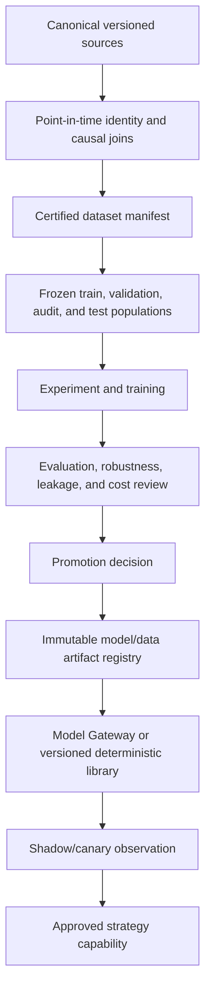

# Research and model lifecycle

[Top](README.md) · [Previous](10-backend-and-api-integration.md) · [Next](12-operations-reliability-and-security.md)

## 1. Separation of responsibilities

- `services/` contains online service boundaries and operational launchers.
- `src/` contains reusable application/runtime libraries and backend implementation.
- `pipelines/` builds durable canonical or certified data products.
- `research/` contains experiments, training, evaluation and promotion candidates.
- runtime artifacts, caches, checkpoints, datasets, plots and logs belong under the configured external runtime roots, never in the repository.

Research may consume application authorities. It must not quietly become live authority by being imported from an experiment folder.

## 2. Lifecycle

## 3. Dataset contract

Each dataset manifest records:

- source tables/partitions and content/schema hashes;
- event time, receive time and causal `available_at` policy;
- point-in-time identity and symbol mapping version;
- calendars, sessions, timezones, corporate-action adjustment policy;
- universe selection and survivorship treatment;
- features/labels and their implementation versions;
- exclusions, rejected/deferred counts and reasons;
- split construction and frozen member IDs;
- build code commit, configuration hash and restart-safe checkpoint.

Corrected/latest datasets are allowed for specific research questions, but they must not be mislabeled as causal backtest inputs.

## 4. Shared computation parity

Deterministic capabilities used in Live, Replay and Backtest should call the same versioned library against different source/clock adapters. Offline vectorized implementations may optimize throughput only if parity tests define and bound differences in warm-up, timestamps, floating-point tolerance, session boundaries and missing data.

Model-ready transforms remain distinct from market/reference authorities. They retain links to the source and feature versions that produced them.

## 5. Major research families in this repository

| Family | Role in the application |
|---|---|
| BarGPT and packed market models | Learned bar/event representations and forecasts; promoted outputs enter through Model Gateway/capability registry |
| News reaction and News Synthesis | Structured causal news features, labels and evaluation; promoted outputs enter through News/Text Intelligence contracts |
| Text Intelligence | Structured extraction/synthesis with deterministic validation and versioned render/source authority |
| SEC/XBRL research | Filing/fundamental feature discovery; durable facts and publications remain SEC/Reference authority |
| Strategy research/backtests | Candidate Strategy Profiles, parameters and policies; promotion requires controller parity and portfolio-aware evaluation |

## 6. Model artifact and inference contract

Promoted artifacts include model class/version, weights hash, code commit, preprocessing/tokenizer/feature contract, expected input schema, hardware/runtime constraints, calibration, evaluation reports, training manifest, licenses and known limitations.

Inference requests are bounded and identity-safe. Outputs include artifact version, input references/hash, produced time, horizon, calibration semantics, uncertainty/abstention and expiry. Model Gateway owns loading and resource scheduling; consuming strategies declare whether the output is required and how stale/missing values are handled.

## 7. Evaluation and promotion gates

At minimum:

- leakage and as-of audit;
- identity/corporate-action/session audit;
- frozen holdout evaluation and uncertainty/calibration;
- baseline and ablation comparison;
- regime, liquidity and missing-data slices;
- execution-cost and portfolio-capacity evaluation for trading use;
- deterministic replay/restart behavior;
- representative latency, memory and throughput measurements;
- shadow/canary monitoring and rollback criteria.

A notebook result or a good aggregate metric is not deployment approval.

## 8. Feedback without contamination

Production observations, predictions, operator actions and realized outcomes are journaled with causal IDs. They may seed future versioned datasets, but cannot mutate a frozen evaluation set or retroactively alter a released model’s claimed results.

## 9. Current drift

- Several research families have strong local manifests/evaluations, but there is no single application-wide artifact registry and promotion record.
- Shared live/history computation exists in parts of QMD and trading, but parity is not yet enforced across every capability and mode.
- Backtest now executes a pinned approved configuration through the shared
  Strategy, Portfolio, OMS, simulator, and journal path. Session-varying
  Watchlist membership, comprehensive result projections, restart/resume, and
  deterministic Replay/Backtest parity certification remain incomplete.

---

[Top](README.md) · [Previous](10-backend-and-api-integration.md) · [Next](12-operations-reliability-and-security.md)
