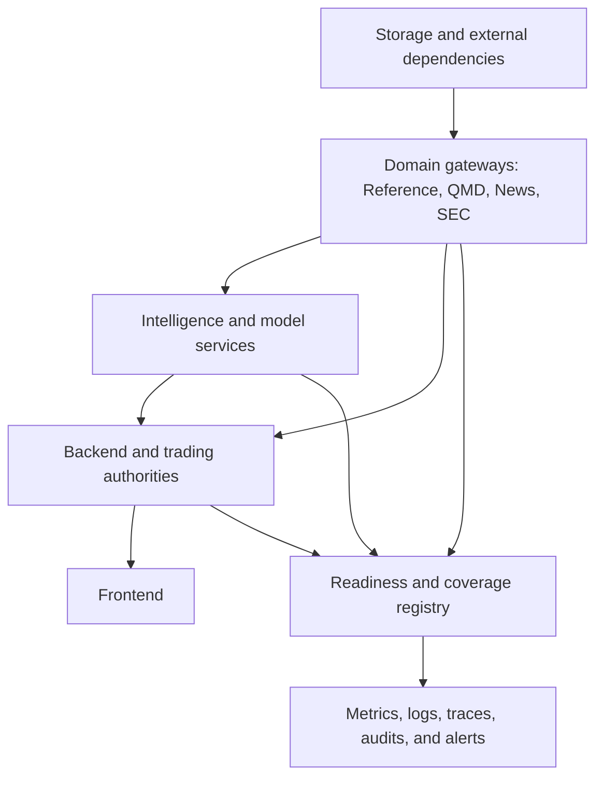

# Operations, reliability, and security

[Top](README.md) · [Previous](11-research-and-model-lifecycle.md) · [Next](13-current-drift-and-roadmap.md)

## 1. Operational model

Each online component has one documented owner, launcher, configuration source, durable state location, health/readiness contract, log location, dependency graph, shutdown behavior and recovery procedure. A bound port means only that a process is listening; readiness includes dependency and data-state checks.



Startup follows dependencies; shutdown removes new command authority first, drains bounded work, persists checkpoints, then closes downstream connections.

## 2. Readiness dimensions

Every service reports independently:

- process/liveness;
- dependency connectivity;
- configuration and schema compatibility;
- source coverage/watermark and freshness;
- queue depth, oldest age and backpressure state;
- durable checkpoint and last successful write;
- degraded capabilities and explicit reasons;
- executable authority where relevant.

The frontend operations view consumes these facts. It does not infer health from a successful generic endpoint.

## 3. Data integrity and reconciliation

Gateways and pipelines maintain coverage ledgers with expected, active, completed, skipped, retried, deferred and failed units. Idempotency keys and checkpoints make reruns safe. Deduplication, final-row semantics, ordering, partition boundaries, identity conflicts and timezone/session mappings are audited.

QMD retention additionally proves archive equivalence before deleting recent
data and durably records the per-session proof before the first mutation. A
retry may reuse that proof only while the current quote/trade remote identities
and archive fingerprint remain identical. Reference publications prove source
and interval coverage before becoming scanner authority. Trading proves
broker/journal/position reconciliation before accepting new executable commands.

## 4. Resource control

All queues, concurrency, batches, subscriptions, result sets, caches and retries are bounded. Each workload class has a budget and admission policy. The backend now isolates command, discovery, chart, simulation, offline, and general HTTP admission with separate environment-configurable semaphores and typed retryable 429 rejection; `/api/system/workload-budgets` exposes saturation and wait evidence. Long operations expose progress and cancellation, checkpoint frequently, and do not monopolize latency-critical trading or market-data threads.

Load shedding is semantic:

- drop or coalesce replaceable UI projections first;
- defer optional watchlist/model enrichments next;
- preserve authority/journal events and sequence gaps;
- reject new expensive work with a typed capacity response;
- never silently truncate a supposedly complete result.

QMD's top-level fan-out admits compact and optional raw source persistence
before awaiting live-state, bar, or indicator consumers. UI/event broadcasts
remain non-blocking and lagging consumers must resnapshot. Scanner and canonical
bar inputs are not shed: they are bounded authoritative derived state, so
dropping them would corrupt the computation funnel.

Historical Scanner and QMD cross-sectional materialization coordination is
bounded independently from durable ClickHouse results. Each family admits at
most four active background builds, reports `capacity_limited` for retryable
excess demand, retains at most 256 coordination entries, expires terminal state
after one hour, and never evicts active work. A later request reads the durable
snapshot or retries admission; no authoritative result is dropped.

## 5. Failure and degradation matrix

| Failure | Allowed behavior | Prohibited behavior |
|---|---|---|
| Live vendor/feed loss | Mark stale, use proven stored coverage for historical portion, policy-based trading halt | Pretend cached last price is live |
| `q_live` loss | Serve memory/archive portions that are provably covered; expose gap | Guess across the recent window |
| Archive gap | Bound result and report incomplete coverage; repair workflow | Delete overlapping recent authority |
| Reference/enrichment stale | Keep market stream; mark/disable dependent fields and strategies | Substitute current identity into past time |
| News/SEC/AI loss | Degrade optional capabilities; stop runs requiring them | Fabricate neutral values |
| Broker disconnect | Stop new executable commands per policy; reconcile on reconnect | Resubmit uncertain orders blindly |
| Journal failure | Fail closed for new orders | Execute unjournaled intent |
| Slow UI client | Coalesce or require resnapshot | Block authoritative ingestion |

## 6. Observability

Use correlation IDs from UI request or source event through backend, service, computation, proposal, Portfolio and OMS. Browser API calls create bounded transport-safe `X-Correlation-ID` values; the backend preserves or creates correlation and causation context, returns both headers, propagates them to QMD HTTP/WebSocket transport, and injects them into broker-event envelopes and authoritative Portfolio/OMS journal payloads. QMD Live and QMD History validate and echo the headers. Autonomous Strategy evaluation derives bounded lineage from its assignment and newest source-signal/observation identity; Portfolio decisions then cite the Strategy intent and OMS records cite the durable Portfolio decision. Autonomous Watchlist, Strategy Run, and chart computation leases derive and persist bounded correlation/causation identities in QMD target snapshot schema v2. QMD's shared decoder derives source-event lineage from immutable market identity before computation. Live and recent rows preserve the vendor sequence; legacy archive rows lack that column and use deterministic ordinal as an explicit fallback, so cross-tier causation equality is not claimed for those rows. Durable generic background continuations preserve their own job root and per-event causes. Metrics include throughput, event/available/processing lag, coverage, source transitions, gaps, cache hit rate, queue age, rejected/deferred work, strategy latency, risk dispositions, order reconciliation and error budgets.

Every backend thread-pool fan-out uses a context-preserving executor. Each
submission receives its own copied context, so QMD, Canvas, reference/facts,
account, and market-data composition keeps request lineage across worker
threads and cannot leak a previous submission identity.

Durable market-data background jobs persist a lineage schema at submission,
pass the job correlation root and parent causation into their worker process,
and stamp every append-only event with correlation, event causation, and parent
causation. Autonomous events derive stable causation from the job and event
identity; pause/cancel/retry events retain the active command cause. A stateful
retry keeps the original build correlation root and cites both the retry command
and prior build cause.

Portfolio/OMS operational counts are explicitly bounded to the newest 5,000
journal records per authority and carry a truncation flag. Current managed-group
state and active reservation totals are computed from durable state rather than
treated as lifetime counters. The UI highlights rejection, unknown outcome,
reconciliation failure, and unprotected-quantity evidence.

Replay and Backtest subscriber queues hold at most four replaceable snapshots.
Their service retains at most 32 resident run controllers by default, evicts
only the oldest terminal controller, preserves its durable run directory, and
rejects new runs with HTTP 429 when every resident slot is active. The bound is
configurable through `TRADING_REPLAY_MAX_RESIDENT_RUNS`.
Replay/Backtest historical warm-up also admits at most eight concurrent derived
QMD History streams by default, configurable from one through 32 with
`TRADING_REPLAY_HISTORY_FETCH_CONCURRENCY`; the cross-sectional Scanner signal
snapshot is fetched once per run window rather than once per ticker.

Replay, Backtest, and Backtest Debug status snapshots now distinguish a pending
checkpoint from an available durable checkpoint and expose its cursor,
event/write clocks, processed-event count, and interval. The UI repeats the
explicit `resume_supported: false` limitation; a checkpoint is operational
evidence, not proof that restart reconstruction has been implemented.

Logs are structured, bounded and redact credentials, account identifiers where required, licensed payloads and sensitive model prompts. Audit records are append-only and include actor, action, target, before/after version references and result.

## 7. Security and storage topology

- Laptop repository is source authority; workstation code is synchronized only through the controlled commit/push/deployment process.
- Generated data, logs, caches, checkpoints, manifests, models and reports live under configured runtime roots.
- Workstation secrets remain in the secrets root and are referenced by keys.
- ClickHouse and service credentials are least-privilege and scoped by function.
- Live trading requires stronger role/mode/account authority than viewing, research, Replay, Backtest or Paper.
- Browser clients communicate through the backend; internal services are not general public APIs.
- Paper/Live broker account IDs never enter browser configuration payloads;
  stable account keys map to named server-side environment bindings, and only
  internal runtime resolution reads their values.

Environment identity, code commit, configuration release and data/model versions are visible in diagnostics so laptop/workstation or stale-process drift is detectable.

## 8. Validation matrix

| Layer | Required validation |
|---|---|
| Registry/configuration | Schema, references, cycles, mode/scope compatibility, deterministic hash |
| Data | Keys, PIT joins, ordering, dedupe, partition/final rows, timezone/session, coverage |
| QMD | Live/recent/archive boundary parity, reconnect, retention proof, bar-family parity |
| Computation | Shared-library parity, warm-up, missing/stale behavior, representative performance |
| API/UI | Contract tests, snapshot/delta recovery, browser workflow and visual state validation |
| Trading | State-machine, idempotency, reconciliation, portfolio races, protection and restart tests |
| Replay/backtest | Causal availability, deterministic clock/fills, identical Run Plan contract |
| Models | Frozen evaluation, leakage, calibration, artifact identity, shadow/canary and rollback |

## 9. Release and rollback

A release records code commit, schema migrations, configuration/catalog versions, artifact hashes and validation evidence. Apply schema-compatible services before dependent configuration/UI. Rollback restores executable configuration and service version while preserving newer append-only source/journal records; destructive data rollback is not a normal deployment mechanism.

The executable migration order, evidence manifest, rollback boundaries, and
domain recovery procedures are defined in the
[release, rollback, and recovery runbook](16-release-rollback-and-recovery.md).

QMD acceptance evidence is captured read-only from both services. For example:

```powershell
$env:PYTHONDONTWRITEBYTECODE='1'
python scripts\validate_qmd_authority.py `
  --start 2026-08-07T08:00:00-04:00 `
  --end 2026-08-11T16:00:00-04:00 `
  --tickers AAPL,MSFT `
  --direct-clickhouse-parity
```

For a fully durable historical window, `--allow-history-only` may omit the Live
health check. The validator first proves that every source-plan segment is
queryable by QMD History; it rejects a gap or current-live continuation. This
mode can certify archive/recent decoding and direct parity, but cannot satisfy
the separate Live/recent/archive transition gate.

The report is written atomically under
`D:\TradingML\runtimes\qmd_validation`. A passing unit test or compiled binary
does not replace a passing report across representative archive, recent, and
current-live segments.

Point-in-time enrichment has a separate database-backed acceptance. It compares
two causal cutoffs, rejects any identity, reference, borrow, fundamental, or
freshness timestamp later than its requested cutoff, and requires a selected
source path to advance between the two snapshots:

```powershell
$env:PYTHONDONTWRITEBYTECODE='1'
python scripts\validate_point_in_time_enrichment.py `
  --ticker AAPL `
  --before 2026-08-07T14:00:00Z `
  --after 2026-08-07T15:00:00Z
```

Its atomic JSON report is also stored under
`D:\TradingML\runtimes\qmd_validation`. Missing evidence, an unchanged required
change path, an inexact response clock, a non-ready snapshot, or future evidence
returns a nonzero exit.

Direct parity is permitted only for a fully durable source plan. The validator
expands QMD's archive `events_YYYY` declaration by the requested years and
accepts only the registered archive and `q_live.events` authorities; a gap,
live continuation, unapproved table, incomplete page read, or Scanner primitive
difference fails the report.

## 10. Current implementation and remaining drift

The backend now projects a versioned readiness envelope for every registered
service and the existing Services dashboard displays its four independent
dimensions: liveness, dependencies, data and execution. Unknown evidence stays
unknown; an answering endpoint is not promoted to data or execution readiness.
Services that do not own broker authority explicitly report execution as not
applicable. IBKR execution readiness requires explicit authentication and
account-routing evidence from its existing contracts.

This is an application-side composition layer only. It does not change any
producer service. Existing service status, coverage and database contracts are
used when present, and absent structured evidence remains visible as unknown.

Every registered service now also receives the same schema-v2 operational
projection: authority, freshness, coverage, queue, cache, transition,
checkpoint and degradation fields are always present. The composer projects
only producer-declared values; an absent producer contract remains an empty
object or `null` and is displayed as `Unknown`, never promoted to healthy. The
Service Health detail page renders the six operational decision dimensions
uniformly, so QMD's richer evidence and unchanged producer services share one
review surface without pretending their contracts are equally complete.

Backend service-table and News/SEC histogram projections use a shared
thread-safe TTL/LRU cache contract with explicit entry limits and contract
revisions. Source-revision-aware invalidation is available to callers; the
legacy processed-artifact chart LRU includes the bounded date/timeframe
artifact-build and presentation-contract revision in every key. Remaining
mode-specific caches are either bounded by an immutable Run Plan or carry an
explicit contract/source revision. In particular, the Watchlist reference
projection now separates every explicit causal `as_of` clock instead of sharing
one process-global value.

QMD Gateway and QMD History now additionally publish/compose a bounded
operational contract. QMD reports live-event lag, persistence and drop
counters, maintenance/gap state, writer-lane transitions, pending rows and
recoveries. QMD History publishes a standardized status snapshot with the
latest archive coverage watermark, cache hit/miss/eviction/footprint evidence,
active build capacity, and every resident offline computation requirement with
its product, ticker, timeframe, parameter hash, event-time anchor, exact source
revision, runtime state, event count, and footprint. The backend preserves
those producer-declared requirements under the versioned `operations` envelope;
the Services UI consumes the envelope without treating an absent value as zero
or ready.

Remaining drift:

- Producer status contracts outside QMD still vary, so
  configuration/schema compatibility, watermarks, queue depth and checkpoint
  evidence are not uniformly available.
- Data coverage and trading authority evidence share one operations view, but
  deeper product-level coverage and command-authority diagnostics remain to be
  projected consistently.
- Some operational documentation reflects earlier service maturity and must not override current code or verified runtime behavior.

---

[Top](README.md) · [Previous](11-research-and-model-lifecycle.md) · [Next](13-current-drift-and-roadmap.md)
