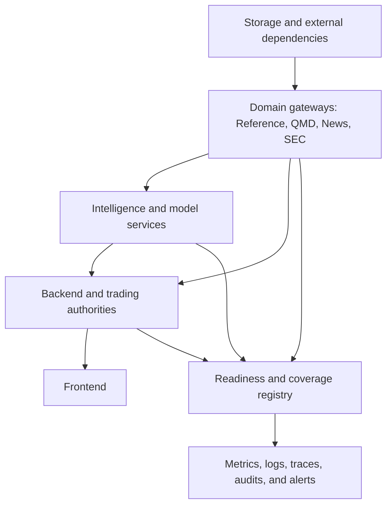

# Operations, reliability, and security

[Top](README.md) · [Previous](11-research-and-model-lifecycle.md) · [Next](13-current-drift-and-roadmap.md)

## 1. Operational model

Each online component has one documented owner, launcher, configuration source, durable state location, health/readiness contract, log location, dependency graph, shutdown behavior and recovery procedure. A bound port means only that a process is listening; readiness includes dependency and data-state checks.

Startup follows dependencies; shutdown removes new command authority first, drains bounded work, persists checkpoints, then closes downstream connections.

## 2. Readiness dimensions

Every service reports independently:

- process/liveness;
- dependency connectivity;
- configuration and schema compatibility;
- source coverage/watermark and freshness;
- queue depth, oldest age and backpressure state;
- durable checkpoint and last successful write;
- degraded capabilities and explicit reasons;
- executable authority where relevant.

The frontend operations view consumes these facts. It does not infer health from a successful generic endpoint.

## 3. Data integrity and reconciliation

Gateways and pipelines maintain coverage ledgers with expected, active, completed, skipped, retried, deferred and failed units. Idempotency keys and checkpoints make reruns safe. Deduplication, final-row semantics, ordering, partition boundaries, identity conflicts and timezone/session mappings are audited.

QMD retention additionally proves archive equivalence before deleting recent data. Reference publications prove source and interval coverage before becoming scanner authority. Trading proves broker/journal/position reconciliation before accepting new executable commands.

## 4. Resource control

All queues, concurrency, batches, subscriptions, result sets, caches and retries are bounded. Each workload class has a budget and admission policy. Long operations expose progress and cancellation, checkpoint frequently, and do not monopolize latency-critical trading or market-data threads.

Load shedding is semantic:

- drop or coalesce replaceable UI projections first;
- defer optional watchlist/model enrichments next;
- preserve authority/journal events and sequence gaps;
- reject new expensive work with a typed capacity response;
- never silently truncate a supposedly complete result.

## 5. Failure and degradation matrix

| Failure | Allowed behavior | Prohibited behavior |
|---|---|---|
| Live vendor/feed loss | Mark stale, use proven stored coverage for historical portion, policy-based trading halt | Pretend cached last price is live |
| `q_live` loss | Serve memory/archive portions that are provably covered; expose gap | Guess across the recent window |
| Archive gap | Bound result and report incomplete coverage; repair workflow | Delete overlapping recent authority |
| Reference/enrichment stale | Keep market stream; mark/disable dependent fields and strategies | Substitute current identity into past time |
| News/SEC/AI loss | Degrade optional capabilities; stop runs requiring them | Fabricate neutral values |
| Broker disconnect | Stop new executable commands per policy; reconcile on reconnect | Resubmit uncertain orders blindly |
| Journal failure | Fail closed for new orders | Execute unjournaled intent |
| Slow UI client | Coalesce or require resnapshot | Block authoritative ingestion |

## 6. Observability

Use correlation IDs from UI request or source event through backend, service, computation, proposal, Portfolio and OMS. Browser API calls create bounded transport-safe `X-Correlation-ID` values; the backend preserves or creates correlation and causation context, returns both headers, propagates them to QMD HTTP/WebSocket transport, and injects them into broker-event envelopes and authoritative Portfolio/OMS journal payloads. QMD Live and QMD History validate and echo the headers. Autonomous Strategy evaluation derives bounded lineage from its assignment and newest source-signal/observation identity; Portfolio decisions then cite the Strategy intent and OMS records cite the durable Portfolio decision. Autonomous Watchlist, Strategy Run, and chart computation leases now derive and persist bounded correlation/causation identities in QMD target snapshot schema v2. Autonomous market-source events and generic background continuations still require the same explicit lineage rather than borrowing an unrelated HTTP request. Metrics include throughput, event/available/processing lag, coverage, source transitions, gaps, cache hit rate, queue age, rejected/deferred work, strategy latency, risk dispositions, order reconciliation and error budgets.

Portfolio/OMS operational counts are explicitly bounded to the newest 5,000
journal records per authority and carry a truncation flag. Current managed-group
state and active reservation totals are computed from durable state rather than
treated as lifetime counters. The UI highlights rejection, unknown outcome,
reconciliation failure, and unprotected-quantity evidence.

Logs are structured, bounded and redact credentials, account identifiers where required, licensed payloads and sensitive model prompts. Audit records are append-only and include actor, action, target, before/after version references and result.

## 7. Security and storage topology

- Laptop repository is source authority; workstation code is synchronized only through the controlled commit/push/deployment process.
- Generated data, logs, caches, checkpoints, manifests, models and reports live under configured runtime roots.
- Workstation secrets remain in the secrets root and are referenced by keys.
- ClickHouse and service credentials are least-privilege and scoped by function.
- Live trading requires stronger role/mode/account authority than viewing, research, Replay, Backtest or Paper.
- Browser clients communicate through the backend; internal services are not general public APIs.

Environment identity, code commit, configuration release and data/model versions are visible in diagnostics so laptop/workstation or stale-process drift is detectable.

## 8. Validation matrix

| Layer | Required validation |
|---|---|
| Registry/configuration | Schema, references, cycles, mode/scope compatibility, deterministic hash |
| Data | Keys, PIT joins, ordering, dedupe, partition/final rows, timezone/session, coverage |
| QMD | Live/recent/archive boundary parity, reconnect, retention proof, bar-family parity |
| Computation | Shared-library parity, warm-up, missing/stale behavior, representative performance |
| API/UI | Contract tests, snapshot/delta recovery, browser workflow and visual state validation |
| Trading | State-machine, idempotency, reconciliation, portfolio races, protection and restart tests |
| Replay/backtest | Causal availability, deterministic clock/fills, identical Run Plan contract |
| Models | Frozen evaluation, leakage, calibration, artifact identity, shadow/canary and rollback |

## 9. Release and rollback

A release records code commit, schema migrations, configuration/catalog versions, artifact hashes and validation evidence. Apply schema-compatible services before dependent configuration/UI. Rollback restores executable configuration and service version while preserving newer append-only source/journal records; destructive data rollback is not a normal deployment mechanism.

## 10. Current implementation and remaining drift

The backend now projects a versioned readiness envelope for every registered
service and the existing Services dashboard displays its four independent
dimensions: liveness, dependencies, data and execution. Unknown evidence stays
unknown; an answering endpoint is not promoted to data or execution readiness.
Services that do not own broker authority explicitly report execution as not
applicable. IBKR execution readiness requires explicit authentication and
account-routing evidence from its existing contracts.

This is an application-side composition layer only. It does not change any
producer service. Existing service status, coverage and database contracts are
used when present, and absent structured evidence remains visible as unknown.

QMD Gateway and QMD History now additionally publish/compose a bounded
operational contract. QMD reports live-event lag, persistence and drop
counters, maintenance/gap state, writer-lane transitions, pending rows and
recoveries. QMD History publishes a standardized status snapshot with the
latest archive coverage watermark, cache hit/miss/eviction/footprint evidence,
and active build capacity. The backend normalizes those producer-declared
values under a versioned `operations` envelope, and the Services UI consumes
that envelope without treating an absent value as zero or ready.

Remaining drift:

- Producer status contracts outside QMD still vary, so
  configuration/schema compatibility, watermarks, queue depth and checkpoint
  evidence are not uniformly available.
- Data coverage and trading authority evidence share one operations view, but
  deeper product-level coverage and command-authority diagnostics remain to be
  projected consistently.
- Some operational documentation reflects earlier service maturity and must not override current code or verified runtime behavior.

---

[Top](README.md) · [Previous](11-research-and-model-lifecycle.md) · [Next](13-current-drift-and-roadmap.md)
