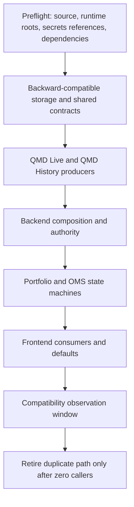

# Release, rollback, and recovery runbook

[Top](README.md) · [Previous](15-implementation-log.md) · [Operations](12-operations-reliability-and-security.md)

This runbook applies to the active application migration domains. Intelligence
producer changes remain deferred. IBKR Gateway, its supervisor, and deployment
automation require separate authorization; this document does not authorize a
change to those services.

## 1. Release evidence authority

Every release records one immutable evidence manifest outside the repository,
under `D:\TradingML\runtimes\application_releases\<release-id>`. It contains:

- Git commit and clean task-owned diff;
- service/configuration/catalog/schema versions and hashes;
- exact validation commands, exit codes, timestamps, and report paths;
- source coverage/revision evidence for data-dependent validation;
- caller compatibility measurements and known deferred consumers;
- deployment target identity and laptop/workstation source hashes;
- operator, release decision, rollback threshold, and final state.

The manifest references logs and reports; it does not copy licensed payloads,
secrets, account IDs, or broker credentials. A Git commit, an open port, or a
frontend build alone is never release evidence.

## 2. Ordered migration

Each arrow is a stop/go gate. Do not deploy a consumer before its producer is
compatible, and do not remove an old path in the same step that introduces its
replacement. Append-only market and trading records remain intact through
forward and rollback operations.

## 3. Domain matrix

| Domain | Release gate | Rollback | Recovery |
| --- | --- | --- | --- |
| Shared QMD contract | Both Rust crates compile/test against one `qmd_core`; schema and capability hashes recorded | Restore prior compatible binaries together | Restart from durable coverage/checkpoints; never invent missing events |
| QMD Live | `/health` ready, dependencies/schema compatible, queue/lag bounded, persistence and retention evidence current | Stop command/maintenance authority, drain, restore prior binary/config | Reconnect vendor, repair declared gaps, reconcile coverage before retention |
| QMD History | Source-plan tiling, pinned reads, archive/recent/live boundary evidence, bounded caches/builds | Restore prior read-only binary/config while retaining caches as disposable | Rebuild derived caches from pinned source authority |
| Backend/API | Contract, authority, workload, lineage, and compatibility tests; no secret exposure | Restore prior backend against still-compatible producer contracts | Restart stateless composition; recover durable jobs from manifests/checkpoints |
| Portfolio | Journal migration compatibility, reservation/allocation race and recovery tests | Disable new admissions before executable rollback | Rebuild state from canonical journal and broker projection; reconcile before admission |
| OMS | Idempotency, uncertain-outcome, protection, restart, and reconciliation tests | Disable new commands; never blindly resubmit uncertain orders | Reconcile broker orders/fills/positions, then resume only resolved groups |
| Frontend | Managed production build plus real-browser keyboard, responsive, error, reconnect, and resnapshot validation | Restore prior static bundle/config defaults | Clear disposable client cache; resnapshot canonical backend state |

## 4. QMD acceptance sequence

1. Confirm QMD Live and History identify themselves and report ready, not merely
   listening.
2. Select small representative windows crossing archive/recent and
   recent/current-live boundaries, plus a known gap or eviction case.
3. Run `scripts\validate_qmd_authority.py` for multiple tickers and retain its
   runtime report.
4. Compare direct approved ClickHouse query-plan output with QMD History for a
   fixed pinned revision once that parity probe is implemented.
5. Capture active-session Core Scan throughput, stage latency, queue depth,
   CPU, memory, and drop/lag evidence.
6. Exercise stream lag/reconnect and prove resnapshot or exact gap fill.
7. Permit retention only when QMD's durable archive-handoff fingerprint remains
   valid for the current live and archive identities.

Any incomplete plan, changed pinned revision, ordering regression, missing
lineage, unbounded queue, or unexplained count/hash difference fails the gate.

## 5. Rollback rules

- Remove new command authority first; keep read-only diagnostics available.
- Drain bounded queues where correctness requires it. Replaceable UI
  projections may be discarded only when consumers must resnapshot.
- Preserve newer append-only events and journal rows. Roll back readers and
  configuration, not authoritative history.
- Restore a configuration by immutable version/hash, never by editing the
  published release in place.
- If schema compatibility is one-way, deploy a forward repair rather than a
  destructive table downgrade.
- Record the trigger, last known good revision, unresolved commands/events, and
  reconciliation result in the release evidence manifest.

## 6. Recovery stop conditions

Recovery remains fail-closed while any of the following is unknown: market-data
coverage, point-in-time identity, source revision, journal availability,
broker outcome, account binding, protection quantity, or executable authority.
Read-only charts may degrade with explicit stale/gap labels. Strategy and manual
proposals may be inspected, but Portfolio admission and OMS execution remain
disabled until their required authorities reconcile.

## 7. Deferred and separately authorized work

The current release program consumes Market AI, News, SEC, Reference, Text
Intelligence, Text Embed, and Model Gateway through unchanged bounded contracts.
Producer migrations for those services are deferred. Broker gateway,
supervisor, and workstation deployment changes are separately authorized and
must not be inferred from backend, Portfolio, OMS, or frontend approval.

---

[Top](README.md) · [Previous](15-implementation-log.md) · [Operations](12-operations-reliability-and-security.md)
