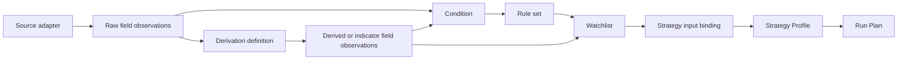
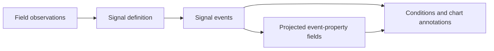

# Information ontology and registry inventory

Status: accepted target terminology with a current-state audit and migration register

Audit date: 2026-08-14

Scope: application fields, QMD processing and derivations, observations, signals,
columns, rules, Watchlists, Strategy inputs, service products, query plans, and
physical ClickHouse storage

## Outcome

The application should not use one broad object such as `Capability` to mean a
data value, a calculation, a signal, a table column, and a configured consumer.
Those are different objects with different lifecycles. The canonical model has
three independent axes:

| Axis | Objects | Question answered |
| --- | --- | --- |
| Information | `FieldDefinition`, `Observation`, `Record`, `Dataset` | What does this value mean, for which entity and clock? |
| Production | `SourceDefinition`, `ProcessingStepDefinition`, `DerivationDefinition`, `SignalDefinition`, `ProductDefinition` | How is the information acquired, transformed, or emitted? |
| Use and presentation | `ColumnDefinition`, `ConditionDefinition`, `RuleSetDefinition`, `WatchlistDefinition`, `StrategyInputBinding`, `StrategyProfile`, `RunPlan` | Where and why is the information selected or shown? |

The existing parts compose the larger parts. A Watchlist references registered
rule sets, fields, columns, and derivations. A Strategy references registered
evidence bindings and rule sets. Neither copies or recreates those definitions.

This document is the canonical terminology and inventory companion to
[Enrichment and field registry](05-enrichment-and-field-registry.md) and
[Market Discovery and computation funnel](06-market-discovery-and-computation.md).
It supersedes their use of **capability** as an undifferentiated noun; the
existing API and Rust type names remain compatibility names until migrated.

## Canonical terminology

### Information objects

| Term | Definition | Identity and lifecycle |
| --- | --- | --- |
| Field definition | Stable semantic contract for one typed fact, such as `market.last_price` or `reference.float_shares`. | Registered once by `field_id`; versioned when meaning changes. It declares entity grain, unit, clocks, owner, source/query plan, provenance, freshness, mode support, null reasons, and status. |
| Observation | One value of a field for an entity and causal clock. | `(field_id, entity_id, event_at, available_at, source_revision)`; immutable evidence, even if a current projection later changes. |
| Record | A schema-bound set of observations with a common entity and clocks, such as one Scanner row. | References field definitions; it does not redefine them. |
| Dataset or stream | A bounded or continuing collection of records plus coverage and continuation semantics. | Registered as a product/query contract, not as a field. |
| Event | A time-local occurrence with identity, lifecycle, evidence, and typed properties. | Registered by event definition; event properties may reference field definitions. |

### Production objects

| Term | Definition | What it is not |
| --- | --- | --- |
| Source adapter | Acquires or reads authoritative evidence and preserves source identity and clocks. | Not a user-selectable field. |
| Processing step | Integrity or transport work such as validation, sequencing, freshness checks, or persistence fanout. | Not a calculation result or Scanner column. |
| Derivation | Versioned deterministic transformation from input fields to output fields. | Not itself a field. Its outputs are fields. |
| Metric | A scalar or small-vector derivation with declared unit and window. | Not a separate top-level ontology. |
| Indicator | A market-data derivation, usually windowed or stateful. | The indicator is the producer; RSI/MACD values are output fields. |
| Oscillator | An indicator subtype with a bounded or centered interpretation. | Not a sibling of fields or calculations. |
| Classification | A derivation that maps evidence to a categorical field under a versioned taxonomy or threshold set. | Not a duplicate field namespace. |
| Ranking | A cross-sectional derivation that produces score/rank fields for a declared population and clock. | Not Watchlist membership by itself. |
| Signal definition | A lifecycle-aware detector that consumes observations and emits signal events (`opened`, `updated`, `resolved`, `expired`). | A signal is not a scalar field. A projected signal property such as latest score may be registered as a field. |
| Product | A delivered record/dataset/stream contract such as QMD Scanner or progressive chart payload. | Not a physical table or UI container. |

### Use and presentation objects

| Term | Definition | Required references |
| --- | --- | --- |
| Column definition | Presentation of one field in a table: heading, format, alignment, visibility, sorting, filtering. | Exactly one `field_id`; no independent data semantics. |
| Condition | Typed comparison over field observations, a field and constant, or an event state. | Stable field/event IDs, timeframe, comparator, parameters. |
| Rule set | Named Boolean composition of conditions. | References conditions; does not copy source definitions. |
| Watchlist | Causal membership and ranking definition over Core candidates. | Source scan, rule-set IDs, ranking field, size/expiry/overrides, selected column IDs, focused derivation IDs. |
| Strategy input binding | Maps a registered field or event property to the runtime name used by a Strategy definition. | `source_id`, runtime binding, timeframe/anchor, availability policy. It is an adapter, not a second field. |
| Strategy Profile | Parameters and evidence bindings for one registered Strategy definition/revision. | Strategy ID/revision plus referenced bindings and rule sets. |
| Run Plan | Mode-specific executable selection of Strategy Profile, Watchlists, Canvas profile, account/broker policy, and causal data plan. | References existing versioned parts; it does not embed new implementations. |

## Final user-facing access model

The registries above are backend authorities, not the final UI. The user should
never have to decide whether an item came from `FieldDefinition`, a Rust
catalog, a query plan, or a database table. The frontend projects those typed
definitions into one shared interaction pattern while preserving their real
kinds.

### The final access element

The common access control is the **Data & Analytics picker**. It is a searchable,
scrollable picker reused by Market Discovery, Scanner/Watchlist columns, chart
studies, rule construction, and Strategy Studio. It has typed tabs rather than
one generic “Capability” list:

| Picker tab | What the user selects | Registry authority | Result of selection |
| --- | --- | --- | --- |
| **Fields** | A directly usable fact such as Last price, Public float, Sector, or Revenue | `FieldDefinition` | Adds a column, condition operand, chart series, fact, or Strategy binding according to context. |
| **Indicators** | A derivation such as MACD, RSI, VWAP, or NBBO Liquidity | `DerivationDefinition` | Enables the derivation for the allowed population/timeframe and exposes its selected output fields. |
| **Signals** | A lifecycle detector such as VWAP Transition or Liquidity Dislocation | `SignalDefinition` | Adds an event condition/annotation or an explicitly registered latest-state projection. |
| **Rule sets** | A reusable named Boolean rule set | `RuleSetDefinition` | Adds the existing rule-set card to a Watchlist or Strategy stage. |
| **Watchlists** | A reusable configured universe | `WatchlistDefinition` | Adds a persisted Watchlist tab/container binding or selects it for a Run Plan. |

The picker is a derived UI view, not another semantic registry. Internally it
may use a `CatalogItemView`, but that view contains only presentation and
allowed-action data:

```text
kind, canonical_id, label, short_description
group, owner, provenance, availability/status
supported_timeframes, allowed_actions
output_field_ids (derivations only)
event_property_ids (signals only)
```

It must never infer `kind` from a name or ID and must never become a second
source of labels, outputs, or availability.

### Typed cards and rows

Each picker result uses a shared visual shell but a type-specific noun and
action. A user sees **Field**, **Indicator**, **Signal**, **Rule set**, or
**Watchlist**—never “Capability.”

```text
┌──────────────────────────────────────────────────────────────────┐
│ Last price                                      FIELD · MARKET   │
│ Most recent causally available eligible trade price.             │
│ QMD · Raw · Event driven · Available                             │
│ Used by: Scanner, 12 Watchlists, 1 Strategy      [Add column]     │
└──────────────────────────────────────────────────────────────────┘
```

```text
┌──────────────────────────────────────────────────────────────────┐
│ Core Momentum Oscillators                     INDICATOR · QMD     │
│ Outputs: RSI 14, MACD line, MACD signal, MACD histogram          │
│ Watchlist scope · 1m/5m · Implemented                            │
│ Configure: timeframe, parameters                 [Enable]         │
└──────────────────────────────────────────────────────────────────┘
```

A collapsed row shows label, type badge, source/owner, availability, and the
contextual action. Expansion shows canonical ID, definition, entity grain,
units/format, timeframe, event and availability clocks, freshness, provenance,
null reasons, producer/version, consumers, and coverage. Technical source paths
and query-plan IDs appear under **Provenance**, not as the primary label.

### Context changes the action, not the definition

| Surface | User-facing access element | What is selectable | Final visible result |
| --- | --- | --- | --- |
| Market Discovery > Universal Ingest | Read-only **Processing step cards** | Nothing; required steps are inspected | Step name, purpose, inputs/outputs, owner, readiness, coverage. No column action. |
| Market Discovery > Core Scan | **Core fields** and **Core analytics** sections | Allowed Core fields/derivations | Selected Core row schema and required computations. |
| Market Discovery > Watchlist > Rules | **Add rule set** picker and condition editor | Rule sets; fields/signals when authoring a rule | Removable Rule-set cards containing human-readable conditions. Presence means included; removal stops use. |
| Market Discovery > Watchlist > Columns | **Add field** picker | Fields with a ColumnDefinition for Watchlists | Removable/reorderable column chips/cards; table heading comes from the shared ColumnDefinition. |
| Market Discovery > Watchlist > Calculations | **Add indicator** picker | Watchlist/Strategy-scope derivations | Enabled Indicator cards with timeframe, parameters, and selected output fields. |
| Scanner/Watchlist container | **Columns** button | Fields allowed by the product and current mode | A formatted table column. The user sees the Column label; details link back to the Field. |
| Scanner/Watchlist row | Symbol cell, values, badges, event icons | No catalog selection | Current observations. Company/logo are part of the Symbol cell; News/SEC recency icons remain event/evidence accessors. |
| Chart | **Indicators** picker | Request-scope derivations and field series | Overlay/pane series named from output FieldDefinitions; settings belong to the selected derivation instance. |
| Strategy Studio | **Add evidence** picker with Fields, Signals, and Rule sets tabs | Strategy-eligible fields, signal event properties, rule sets | Evidence-binding chip/card showing user label, timeframe, runtime binding, and source status. |
| Facts/News/SEC/XBRL | Grouped **Field rows** and evidence cards | Usually read-only; optional export/filter selection | Value plus as-of/provenance details; document/event navigation where applicable. |
| Service Health / administrative catalog | **Sources**, **Products**, **Processing**, and **Coverage** tables | Administrative inspection/configuration only | Operational state and dependency graph; these do not appear as Scanner fields. |
| Run Plan editor | Reference selectors for Strategy Profile, Watchlists, and Canvas profile | Existing configured larger parts | Stable IDs/revisions summarized as removable selections. |

### What the user ultimately sees for each registry kind

| Registry kind | Role in the new design | Normal user presentation | Directly selectable? |
| --- | --- | --- | --- |
| `FieldDefinition` | Defines one fact that consumers can use consistently | **Field row/card** in the picker; value becomes a column, series, fact, or operand | Yes, when its status/mode/product policy allows. |
| `Observation` | Carries one field value with clocks/provenance | Formatted table cell, fact value, chart point, or condition evidence | No; it is runtime data. |
| `ColumnDefinition` | Defines how a Field appears in a specific table | Table heading and formatting; column chip in configuration | Selected through its Field, not as a separate catalog concept. |
| `DerivationDefinition` | Produces reusable derived/indicator fields | **Indicator card** with outputs, scope, timeframe, parameters, cost/readiness | Yes, in Analytics/Indicators contexts. |
| `SignalDefinition` | Emits lifecycle events from evidence | **Signal card**, chart marker, activity row, or event-condition choice | Yes, in Signals/evidence contexts. |
| `ProcessingStepDefinition` | Protects event integrity or transport | Read-only **Processing step card** in Universal Ingest/Service Health | No for ordinary users; system/admin policy only. |
| `RuleSetDefinition` | Reusable Boolean decision component | Removable **Rule-set card** with readable clauses | Yes. Adding means used; removing means no longer used. |
| `WatchlistDefinition` | Produces causal bounded membership | Named **Watchlist tab/card** and persistent Canvas container binding | Yes. It is a larger configured part. |
| `StrategyInputBinding` | Adapts canonical evidence to a Strategy runtime name | **Evidence binding chip/card** inside Strategy Studio | Created by selecting a Field/Signal; not browsed as an independent data item. |
| `ProductDefinition` | Delivers records/streams such as Scanner or Chart | Product/source badge and provenance details; container dependency in admin view | Usually no; a container or Run Plan references it. |
| `SourceDefinition` / `QueryPlanDefinition` | Establishes source and bounded retrieval authority | Provenance drawer and administrative catalog | No in ordinary authoring. |
| Configuration schemas, Profiles, Run Plans | Compose reusable parts into approved behavior | Named configuration cards/selectors with revision/status | Yes in their owning configuration workflow. |

### Semantic field groups in the user experience

This maps the large field inventory below to its actual role and presentation.

| Field group | Role | Primary user surfaces | Default presentation |
| --- | --- | --- | --- |
| Identity, listing, tradability | Establishes which instrument a row/value belongs to and whether it may participate | Scanner/Watchlist Symbol cell, Facts, filters, routing explanations | Symbol/company composite cell, exchange/tradability badges; stable IDs only in details. |
| Presentation | Supplies logo and asset state without changing identity | Symbol cells, instrument header | Logo/avatar integrated with Symbol; not standalone columns by default. |
| Country and classification | Provides categorical screening and grouping | Field picker, rules, Watchlists, Facts | Text/category field; optional table column or condition operand. |
| Market reference and share supply | Provides slower point-in-time context such as market cap, float, short interest, borrow | Scanner/Watchlist columns, rules, Facts | Formatted numeric/category field with source date and coverage/null explanation. |
| QMD Scanner market fields | Provides current causal market state and rank inputs | Core Scan, Scanner/Watchlist tables, chart, Strategy evidence | Primary numeric table fields; QMD owner/timeframe/freshness in expanded details. |
| Corporate events | Represents dated IPO, split, dividend, and ticker-change evidence | Event field picker, Watchlists, chart annotations, ticker facts | Event badge/card or date/distance column; opens event evidence. |
| Fundamentals and XBRL quality | Provides filing-derived facts, ratios, trajectories, and evidence quality | Fundamental Watchlists, Facts/XBRL, Strategy evidence | Grouped financial field rows/cards with period, filing availability, units, and quality. |
| News and SEC canonical fields | Provides document recency, counts, identity, and navigation | News/SEC containers, Scanner icons, rules | Recency/count field plus persistent News/SEC icons; document cards remain the event authority. |
| Intelligence and signal projections | Provides validated semantic/event properties for rules and Strategies | Signals picker, Watchlists, Strategy Studio, chart annotations | Signal card/event marker; scalar score only where an explicit projected Field exists. |
| Model context | Supplies promoted opaque/vector/model artifacts to approved consumers | Strategy/model administration and provenance | Not a raw table column. Show artifact/model card and readiness; expose a scalar only through a registered Field. |
| Quality, coverage, relationships, schedules | Explains absence, identity resolution, source completeness, and refresh state | Service Health, provenance drawer, eligibility explanation | Status/evidence row; hidden from ordinary column picker unless a diagnostic surface requests it. |

### Complete example: Last price as the user encounters it

1. In the application catalog the user finds **Last price**, type **Field**, group
   **Market**, source badge **QMD**, status **Available**.
2. In Scanner or Watchlist configuration, **Add field** creates the `last_price`
   ColumnDefinition reference. The visible heading is **LAST PRICE** and the
   value uses the shared currency/precision format.
3. In a rule editor, selecting **Last price** creates an operand reference to
   `market.last_price`; the user sees a sentence such as “Last price is greater
   than 5.00,” not a source column name.
4. In Strategy Studio, **Add evidence > Fields > Last price** creates a binding
   card that shows timeframe and the runtime adapter `price` in advanced
   details.
5. In a chart, Last price is the base price series supplied by the Chart
   product; it is not re-added as an indicator.
6. Expanding **Provenance** shows QMD, raw eligible trade state,
   `qmd.scanner.snapshot.v1`, event/availability clocks, TTL, coverage, and null
   reasons. Those details never replace the user-facing name.

## Composition hierarchy





The hierarchy is therefore not simply “data field to calculation.” It is:

1. sources publish raw field observations;
2. derivations consume fields and publish derived field observations;
3. signal detectors consume observations and publish lifecycle events;
4. columns present fields, while conditions consume fields or event state;
5. rule sets compose conditions;
6. Watchlists compose rule sets, ranking fields, columns, and focused derivations;
7. Strategies bind the same registered evidence;
8. Strategy Profiles and Run Plans select and version those reusable parts.

## Registration rules

| Existing thing | Register as | Register when | Do not register as |
| --- | --- | --- | --- |
| Physical source column | `FieldDefinition` | It has stable business meaning and crosses a service/application boundary or is selectable by a consumer. | A column merely because it exists in ClickHouse. |
| SQL/query code | `QueryPlanDefinition` | It is an approved bounded application read with identity, event, availability, and coverage semantics. | Arbitrary UI-authored SQL. |
| Validation/sequencing/fanout | `ProcessingStepDefinition` | It is an observable, versioned operational step with declared inputs/outputs. | Field or Scanner column. |
| Formula/indicator/oscillator | `DerivationDefinition` plus output `FieldDefinition` records | The producer is reusable; register each cross-boundary/selectable output. | One fake field representing the whole family. |
| Signal detector | `SignalDefinition` plus event schema | It has declared lifecycle, evidence, version, scope, and clocks. | Ordinary scalar field. |
| Latest signal score/state | `FieldDefinition` | A table/rule/Strategy needs a scalar projection of the signal event. | A replacement for the event history. |
| Table heading | `ColumnDefinition` | A field is allowed in a specific table surface. | New semantic field. |
| Database table | `SourceDefinition`, product storage, or query-plan source | It is an active authority or approved projection. | One application field per physical column. |
| Staging, backup, scratch, cache | Storage inventory only | It is needed for operations/recovery evidence. | Canonical field/source authority. |
| Model/training artifact | `ModelArtifactDefinition` or dataset manifest | A promoted consumer contract exists. | Scanner field merely because training data exists. |

Private intermediate values may stay inside a service-local schema. They require
application field registration only when they cross the service boundary,
become configurable, appear in a product record, or are used by a rule,
Watchlist, Strategy, export, or user-facing explanation.

## Worked lifecycle: Last price

| Layer | Current/target representation | Meaning |
| --- | --- | --- |
| Source evidence | Massive eligible trade event, preserved by QMD compact event processing | Raw trade price with SIP/source sequence and QMD availability clock. |
| Processing | QMD `nbbo_trade_state` processing step | Maintains the last eligible trade; this step is not a field. |
| Field definition | `market.last_price` | Number, currency unit, `security_at_market_clock` grain, owner `qmd_gateway`, raw provenance, event-driven cadence, 60-second TTL, point-in-time support. |
| Query plan | `qmd.scanner.snapshot.v1` via `service://qmd/scanner` | Bounded current/historical Scanner projection with QMD coverage evidence. |
| Observation | `(market.last_price, security, event_at, available_at, value, source_revision)` | One causally available price. |
| Record/product | `qmd.scanner` candidate row | References the field and carries projection/coverage metadata. |
| Column | `last_price`, heading **Last price** | Presentation only: formatting, sorting, filtering, visibility. |
| Rule/Watchlist | Conditions reference `market.last_price`; Watchlists select `last_price` | Reuses the field; no copied “price capability.” |
| Strategy | `source_id=market.last_price` bound to runtime field `price` | Adapter for a Strategy implementation; `price` is not a new semantic field. |

The canonical ID is `market.last_price`. The heading may change without changing
the field. A source/query implementation may change behind a versioned plan
without changing the field if its meaning, clocks, and provenance contract stay
equivalent.

## Current-state audit summary

The audit used the repository registry and Rust catalogs, backend configuration
at `127.0.0.1:8000`, QMD History at `127.0.0.1:8801`, and live ClickHouse
`system.tables`/`system.columns`. QMD Live at its configured `127.0.0.1:8795`
was unavailable during the audit. The shared QMD catalog was verified through
QMD History and the shared Rust source; this is source/catalog verification,
not a claim that the QMD Live process was operational.

| Registry or runtime surface | Current count | Finding |
| --- | ---: | --- |
| Static application field definitions | 229 | Canonical semantic field records in `application_registry.py`. |
| Static Market Discovery presentations | 51 | 49 resolve into the live column catalog; two integration-pending labeled-signal presentations are intentionally absent. |
| Resolved Market Discovery field catalog | 255 | It mixes fields with 31 QMD/runtime processing, event, and alias rows while omitting/replacing five static IDs. This collection is not currently a pure field registry. |
| Resolved Market Discovery columns | 49 | Presentation projections only; this should remain separate from fields. |
| Market Discovery processing/analytic entries | 45 | Six Universal steps, field projections, derivations, event products, signal projections, and system composites are mixed under `core_scan.calculations`. |
| Rule sets | 41 | Reusable condition compositions. |
| Watchlists | 19 | One Core set plus 18 configured Watchlists. |
| Strategy input bindings | 21 | Runtime aliases over registered fields/signal projections. |
| QMD primitive processing steps | 6 | Currently named `primitive` capabilities. |
| QMD derivation families | 26 | Currently named `indicator_family` capabilities. |
| QMD signal definitions | 7 | Currently named `market_observation` capabilities. |
| QMD derivation output names | 295 (294 unique) | Only 8 names directly match the current application field/presentation namespace. The other 287 require semantic review if exposed; they must not be bulk-promoted automatically. |
| Application query plans | 28 | Bounded point-in-time read contracts. |
| Market sources / products / links / containers | 6 / 8 / 5 / 22 | Separate registries already exist and should remain separate. |
| Configuration schemas / compatibility aliases | 13 / 1 | Reusable larger-part contracts and one deprecated endpoint alias; semantic field aliases are not yet registered. |

### Confirmed mixed-registry drift

The resolved field catalog adds processing steps (`qmd.primitive.*`), event
products (`news-events`, `sec-events`, `membership-history`), system composites,
signal projections, indicator projections, and runtime aliases. Five static IDs
are replaced rather than represented through explicit aliases:

| Static field ID | Current resolved replacement |
| --- | --- |
| `listing.exchange` | `identity.exchange` |
| `tradability.is_tradable` | `identity.is_tradable` |
| `market.vwap` | `indicator.vwap.value` |
| `news.score` | `signal.company_news.score` |
| `sec.score` | `signal.sec_filing.score` |

These must become explicit versioned aliases or be migrated to one canonical
ID. They must not silently replace FieldDefinitions while building a catalog.
The backend functions `_qmd_runtime_capabilities`,
`_market_discovery_field_catalog`, `_bind_discovery_scanner_columns`, and
`_watchlist_column_catalog` currently perform this mixing. The frontend
`DiscoveryCapability` type also contains both outputs and `scanner_columns`,
and `canonicalCapabilityType` infers ontology from naming. The target model
removes that inference and consumes explicit registry kinds.

## Application field inventory

All 229 current FieldDefinitions are listed below. A row groups fields only when
they share owner, source, query plan, and implementation status.

| Semantic group (count) | Field IDs | Owner and source | Query plan | Status / required action |
| --- | --- | --- | --- | --- |
| Identity (17) | `identity.issuer_id`, `identity.security_id`, `identity.listing_id`, `identity.symbol_id`, `identity.symbol`, `identity.company_name`, `identity.security_name`, `identity.composite_figi`, `identity.share_class_figi`, `identity.cik`, `identity.conid`, `identity.cusip`, `identity.isin`, `identity.valid_from`, `identity.valid_to_exclusive`, `identity.previous_symbol`, `identity.current_symbol` | Reference Gateway; `q_live.id_symbol_interval_v1` | `reference.identity_for_symbol.v1` | Registered; retain. |
| Listing (6) | `listing.exchange`, `listing.primary_exchange`, `listing.currency`, `listing.asset_class`, `listing.security_type`, `listing.ticker_type` | Reference Gateway; `q_live.id_listing_v1` | `reference.identity_for_symbol.v1` | Registered; make alias handling explicit. |
| Tradability (3) | `tradability.is_tradable`, `tradability.block_reason`, `tradability.issue_count` | Reference Gateway; `q_live.feature_tradable_universe_v1` | `reference.universe_snapshot.v1` | Registered; make alias handling explicit. |
| Presentation (2) | `presentation.logo_url`, `presentation.asset_status` | Reference Gateway; `q_live.market_presentation_asset_v1` | `reference.scanner_asof.v1` | Registered; presentation evidence, not ColumnDefinitions. |
| Country (5) | `country.listing`, `country.issuer_legal`, `country.headquarters`, `country.issue`, `country.effective` | Reference Gateway; `q_live.market_security_country_v1` | `reference.scanner_asof.v1` | Registered; retain. |
| Classification (5) | `classification.sector`, `classification.industry`, `classification.market_cap`, `classification.float`, `classification.short_pressure` | Backend derivation; `derived://reference-classification` | `reference.scanner_asof.v1` | Registered output fields; add explicit DerivationDefinitions and threshold/taxonomy versions. |
| Market reference (2) | `reference.market_cap`, `reference.shares_outstanding` | Reference Gateway; `q_live.market_security_market_snapshot_v1` | `reference.scanner_asof.v1` | Registered; retain. |
| Market reference (3) | `reference.float_shares`, `reference.float_source`, `reference.float_quality` | Reference Gateway; `q_live.market_security_float_v1` | `reference.scanner_asof.v1` | Registered; retain. |
| Market reference (3) | `reference.short_interest`, `reference.short_interest_pct`, `reference.days_to_cover` | Reference Gateway; `q_live.market_short_interest_v1` | `reference.scanner_asof.v1` | Registered; derived percentage needs explicit input/version metadata. |
| Market reference (2) | `reference.short_volume`, `reference.short_volume_pct` | Reference Gateway; `q_live.market_short_volume_v1` | `reference.scanner_asof.v1` | Registered; retain. |
| Market reference (2) | `reference.fails_to_deliver`, `reference.ftd_value` | Reference Gateway; `q_live.market_fails_to_deliver_v1` | `reference.scanner_asof.v1` | Registered; retain. |
| Market reference (1) | `reference.reg_sho_threshold` | Reference Gateway; `q_live.market_reg_sho_threshold_v1` | `reference.scanner_asof.v1` | Registered; retain. |
| Market reference (3) | `reference.borrow_status`, `reference.borrow_shares`, `reference.borrow_fee` | Reference Gateway; `q_live.market_security_borrow_v1` | `reference.scanner_asof.v1` | Registered `live_only`; historical consumers must fail/mark unavailable. |
| QMD Scanner (16) | `market.last_price`, `market.previous_close`, `market.change_pct`, `market.volume`, `market.relative_volume`, `market.vwap`, `market.spread_bps`, `market.trade_rate_10s`, `market.trade_rate_60s`, `market.liquidity_score`, `market.event_at`, `market.event_age_ms`, `market.quality_state`, `market.quality_flags`, `market.degradation_reason`, `market.liquidity_rank` | QMD Gateway; `service://qmd/scanner` | `qmd.scanner.snapshot.v1` | Registered; separate raw fields, derived fields, and ranking outputs through producer references. |
| Corporate event (4) | `event.split.execution_date`, `event.split.from`, `event.split.to`, `event.split.factor` | Reference Gateway; `q_live.market_stock_split_v1` | `reference.ticker_facts.v1` | Registered. |
| Corporate event (2) | `event.split.days_to_event`, `event.ipo.days_to_event` | Backend derivation; `derived://reference-scanner-event-distance` | `reference.scanner_asof.v1` | Registered output fields; add DerivationDefinition. |
| Corporate event (3) | `event.dividend.ex_date`, `event.dividend.amount`, `event.dividend.currency` | Reference Gateway; `q_live.market_cash_dividend_v1` | `reference.ticker_facts.v1` | Registered. |
| Corporate event (2) | `event.ipo.date`, `event.ipo.status` | Backend projection; `q_live.market_ipo_v1` | `reference.scanner_asof.v1` | Registered. |
| Corporate event (4) | `event.ticker_change.event_type`, `event.ticker_change.effective_date`, `event.ticker_change.old_symbol`, `event.ticker_change.new_symbol` | Reference Gateway; `q_live.market_ticker_event_v1` | `reference.ticker_facts.v1` | Registered. |
| Fundamental raw (37) | `fundamental.revenue`, `fundamental.gross_profit`, `fundamental.operating_income`, `fundamental.net_income`, `fundamental.diluted_eps`, `fundamental.operating_cash_flow`, `fundamental.capital_expenditure`, `fundamental.cash`, `fundamental.current_assets`, `fundamental.current_liabilities`, `fundamental.accounts_receivable`, `fundamental.accounts_payable`, `fundamental.inventory`, `fundamental.assets`, `fundamental.liabilities`, `fundamental.stockholders_equity`, `fundamental.long_term_debt`, `fundamental.current_debt`, `fundamental.research_development`, `fundamental.sga_expense`, `fundamental.stock_based_compensation`, `fundamental.interest_expense`, `fundamental.income_tax_expense`, `fundamental.effective_tax_rate_pct`, `fundamental.goodwill`, `fundamental.intangible_assets`, `fundamental.deferred_revenue`, `fundamental.debt_issued`, `fundamental.debt_repaid`, `fundamental.common_stock_issuance`, `fundamental.common_shares_outstanding`, `fundamental.weighted_average_basic_shares`, `fundamental.weighted_average_diluted_shares`, `fundamental.sec_public_float_value`, `fundamental.dividends_per_share`, `fundamental.share_repurchases`, `fundamental.repurchased_shares` | SEC Gateway; `q_live.sec_xbrl_company_fact_v3` | `sec.fundamentals_asof.v1` | Registered. “Raw” here means source fact projection, not absence of XBRL normalization. |
| Fundamental derived (29) | `fundamental.free_cash_flow`, `fundamental.gross_margin_pct`, `fundamental.operating_margin_pct`, `fundamental.net_margin_pct`, `fundamental.free_cash_flow_margin_pct`, `fundamental.return_on_assets_pct`, `fundamental.return_on_equity_pct`, `fundamental.working_capital`, `fundamental.current_ratio`, `fundamental.debt_to_equity`, `fundamental.net_debt`, `fundamental.interest_coverage`, `fundamental.revenue_growth_pct`, `fundamental.earnings_growth_pct`, `fundamental.share_growth_pct`, `fundamental.dilution_pct`, `fundamental.cash_conversion`, `fundamental.research_intensity_pct`, `fundamental.sga_intensity_pct`, `fundamental.latest_filing_at`, `fundamental.trajectory_score`, `fundamental.trajectory_label`, `fundamental.profitability_score`, `fundamental.cash_generation_score`, `fundamental.balance_sheet_score`, `fundamental.share_base_pressure_pct`, `fundamental.share_base_discipline_score`, `fundamental.valuation_pe`, `fundamental.valuation_label` | Backend derivation; `derived://sec-xbrl-company-facts` | `sec.fundamentals_asof.v1` | Registered outputs; DerivationDefinitions are missing. |
| Fundamental quality (1) | `fundamental.quality_score` | Backend derivation; `derived://sec-xbrl-company-facts/xbrl-quality` | `sec.fundamentals_asof.v1` | Registered output; DerivationDefinition is missing. |
| XBRL quality (8) | `xbrl.quality_score`, `xbrl.quality_label`, `xbrl.quality_coverage_pct`, `xbrl.profitability_score`, `xbrl.growth_score`, `xbrl.cash_quality_score`, `xbrl.balance_sheet_score`, `xbrl.capital_discipline_score` | Backend derivation; `derived://sec-xbrl-company-facts` | `sec.fundamentals_asof.v1` | Registered outputs; DerivationDefinitions are missing. |
| SEC canonical (15) | `sec.latest_at`, `sec.count`, `sec.recency`, `sec.latest_form`, `sec.cik`, `sec.accession`, `sec.form`, `sec.accepted_at`, `sec.filed_at`, `sec.period_end`, `sec.document_id`, `sec.document_type`, `sec.source_hash`, `sec.renderer_version`, `sec.market_bridge_state` | SEC Gateway; `service://sec-gateway/filings-v3` | `sec.filing_asof.v1` | Registered. |
| SEC semantics (8) | `sec.topic`, `sec.event_type`, `sec.direction`, `sec.score`, `sec.confidence`, `sec.impact`, `sec.uncertainty`, `sec.entity_relationships` | Text Intelligence; `service://text-intelligence/sec-synthesis-v1` | `intelligence.sec_asof.v1` | Registered `integration_pending`; do not claim runtime availability. |
| News canonical (8) | `news.latest_at`, `news.count`, `news.recency`, `news.latest_title`, `news.document_id`, `news.source_id`, `news.publisher`, `news.url` | News Gateway; canonical company-news service | `news.company_asof.v1` | Registered. |
| News semantics (12) | `news.topic`, `news.event_type`, `news.entities`, `news.relationships`, `news.direction`, `news.score`, `news.confidence`, `news.impact`, `news.uncertainty`, `news.horizon`, `news.eligible`, `news.expires_at` | Text Intelligence; `service://text-intelligence/news-synthesis-v1` | `intelligence.news_asof.v1` | Registered `integration_pending`. |
| Intelligence projections (2) | `signal.news_labeled`, `signal.sec_labeled` | Text Intelligence News/SEC Synthesis | `intelligence.news_asof.v1`, `intelligence.sec_asof.v1` | Registered `integration_pending`; these are Boolean/event projections, not SignalDefinitions. |
| Model context (4) | `embedding.news.vector`, `embedding.sec.vector`, `model.market_hypothesis.payload`, `model.market_prediction.payload` | Text Embed, Market AI, Model Gateway services | `model.context_asof.v1` | Registered `integration_pending`; remain non-column by default. |
| Quality and coverage (5) | `quality.mapping_issue_count`, `quality.mapping_issue_types`, `quality.mapping_blocked`, `quality.source_mapping_state`, `quality.source_mapping_evidence` | Reference Gateway; `q_live.id_mapping_issue_v1` | `reference.schema_inventory.v1` | Registered diagnostics. |
| Quality and coverage (3) | `relationship.issuer_type`, `relationship.valid_from`, `relationship.valid_to` | Reference Gateway; `q_live.id_issuer_relationship_v1` | `reference.schema_inventory.v1` | Registered diagnostics/evidence. |
| Quality and coverage (3) | `sec.bridge_state`, `sec.bridge_reason`, `sec.bridge_version` | Reference Gateway; `q_live.id_sec_market_bridge_v3` | `reference.schema_inventory.v1` | Registered diagnostics/evidence. |
| Quality and coverage (5) | `coverage.reference_source`, `coverage.window_start`, `coverage.window_end`, `coverage.state`, `coverage.ticker_event_entity_state` | Reference Gateway; publication coverage | `reference.schema_inventory.v1` | Registered diagnostics. |
| Quality and coverage (4) | `schedule.source`, `schedule.next_due_at`, `schedule.last_completed_at`, `schedule.state` | Reference Gateway; source schedule | `reference.schema_inventory.v1` | Registered operations fields; not ordinary Scanner columns. |

## QMD production inventory

### Universal processing steps

These six current `primitive` catalog entries should be renamed
`ProcessingStepDefinition`. Their outputs are artifacts/state schemas, not
ordinary application fields.

| ID | Outputs | Scope / status |
| --- | --- | --- |
| `event_validation_encoding` | canonical compact event; rejection reason | `universal_ingest`; implemented |
| `point_in_time_source_identity` | stable source identity; identity validity evidence | `universal_ingest`; implemented |
| `event_order_sequence` | ordered event; sequence gap state; continuation cursor | `universal_ingest`; implemented |
| `nbbo_trade_state` | current NBBO; last eligible trade; market state revision | `universal_ingest`; implemented |
| `freshness_quality` | freshness; quality flags; degradation reason | `universal_ingest`; implemented |
| `compact_persistence_fanout` | q_live event row; coverage update; live event notification | `universal_ingest`; implemented |

### Derivation families and output registration queue

All 26 current `indicator_family` entries should become
`DerivationDefinition` records with an explicit subtype. Every output below is
an existing QMD catalog output. **Register** means register the output as a
FieldDefinition only when it crosses the service boundary or is selectable;
otherwise retain it as a private typed output. The current direct name match is
shown, but an absent match is a review queue, not proof that runtime code cannot
produce the value.

| Derivation ID | Scope / status | Existing outputs | Current application-field action |
| --- | --- | --- | --- |
| `core_bars` | Core / implemented | `open`, `high`, `low`, `close`, `volume`, `dollar_volume`, `trade_count`, `vwap`, `price_change_pct`, `high_low_range_pct` | `volume` and `vwap` directly match; review/register 8 if exposed. |
| `quote_mid_spread_bars` | Core / implemented | `bid_open`, `bid_high`, `bid_low`, `bid_close`, `ask_open`, `ask_high`, `ask_low`, `ask_close`, `mid_open`, `mid_high`, `mid_low`, `mid_close`, `spread_mean`, `spread_bps_mean`, `spread_bps_close` | Review/register 15 if exposed. |
| `session_context` | Watchlist / planned realtime | `minute_of_day`, `session_phase`, `session_elapsed_pct`, `day_open`, `day_high`, `day_low`, `distance_from_open_pct`, `distance_from_day_high_pct`, `distance_from_day_low_pct`, `gap_from_previous_close_pct` | Review/register 10 only with implemented producer/version. |
| `opening_range` | Watchlist / planned realtime | `opening_range_high`, `opening_range_low`, `opening_range_mid`, `opening_range_volume`, `opening_range_dollar_volume`, `opening_range_breakout`, `opening_range_reclaim`, `opening_range_position_pct` | Review/register 8 only with implemented producer/version. |
| `tape_rates` | Core / implemented | `trade_rate_10s`, `trade_rate_60s`, `quote_rate_10s`, `quote_rate_60s`, `trade_accel_10s_60s`, `quote_accel_10s_60s` | Two trade rates registered; review/register 4. |
| `tape_pressure` | Watchlist / implemented | `rolling_vwap_60s`, `tape_imbalance_60s`, `buy_pressure_60s`, `sell_pressure_60s`, `buy_volume`, `sell_volume`, `buy_sell_volume_delta`, `cumulative_delta` | Review/register 8 if exposed. |
| `flow_structure_composite` | Watchlist / implemented | `microstructure_unified_signal`, `microstructure_unified_confidence`, `microstructure_unified_action`, `flow_structure_composite_score`, `flow_structure_composite_confidence`, `flow_structure_composite_bias`, `flow_structure_composite_reason`, `microstructure_buy_trade_count`, `microstructure_sell_trade_count`, `microstructure_buy_volume`, `microstructure_sell_volume`, `microstructure_signed_volume_delta`, `microstructure_cumulative_signed_volume_delta`, `microstructure_anchored_flow_relationship`, `microstructure_anchored_flow_relationship_score`, `microstructure_transaction_imbalance`, `microstructure_signed_volume_imbalance`, `microstructure_level1_ofi_delta`, `microstructure_cumulative_level1_ofi`, `microstructure_level1_ofi`, `microstructure_queue_imbalance`, `microstructure_microprice_lean`, `microstructure_midpoint_return_bps`, `microstructure_trade_return_bps`, `microstructure_aggressor_persistence`, `microstructure_arrival_intensity_imbalance`, `microstructure_arrival_rate_per_second`, `microstructure_resiliency`, `microstructure_aggressive_flow_score`, `microstructure_displayed_liquidity_score`, `microstructure_response_resiliency_score`, `microstructure_regime_reliability` | Review/register 32; current Strategy aliases must map explicitly to canonical outputs. |
| `large_trade_activity` | Watchlist / implemented | `avg_trade_size`, `median_trade_size`, `max_trade_size`, `large_trade_count`, `large_trade_volume`, `large_trade_notional` | Review/register 6 if exposed. |
| `nbbo_liquidity` | Core / implemented | `spread_bps`, `spread_bps_mean`, `quoted_bid_size_mean`, `quoted_ask_size_mean`, `quote_pressure`, `depth_imbalance_proxy`, `locked_crossed_quote_count`, `effective_spread_mean`, `slippage_proxy_bps`, `liquidity_score` | `spread_bps` and `liquidity_score` registered; review/register 8. |
| `volume_relative` | Watchlist / planned realtime | `rvol_1m`, `rvol_5m`, `relative_dollar_volume`, `volume_sma_20`, `volume_ema_20`, `dollar_volume_sma_20`, `volume_vs_avg_so_far`, `volume_vs_recent_3` | Review/register 8 only with implemented producer/version. |
| `volume_classic` | Watchlist / planned realtime | `obv`, `ad`, `adosc`, `cmf`, `mfi`, `pvt`, `nvi`, `pvi`, `eom`, `kvo`, `force_index` | Review/register 11 only with implemented producer/version. |
| `momentum_core` | Watchlist / implemented | `rsi_14`, `macd_line`, `macd_signal`, `macd_histogram`, `return_1_bar`, `price_vs_vwap_pct` | Review/register 6; current dotted MACD aliases need explicit mappings. |
| `momentum_extended` | Strategy / strategy-specific | `roc`, `rocp`, `rocr`, `mom`, `stoch`, `stochrsi`, `cci`, `cmo`, `williams_r`, `trix`, `ppo`, `apo`, `awesome_oscillator`, `kst`, `tsi`, `ultimate_oscillator` | Review/register 16 only when selected by a Strategy/product. |
| `trend_moving_averages` | Watchlist / implemented | `sma`, `ema_9`, `ema_20`, `ema_50`, `wma`, `dema`, `tema`, `hma`, `kama`, `zlema`, `alma`, `vwma`, `t3`, `ma_ribbon` | Review/register 14 if exposed. |
| `trend_directional` | Watchlist / planned realtime | `adx`, `plus_di`, `minus_di`, `plus_dm`, `minus_dm`, `supertrend`, `psar`, `ichimoku` | Review/register 8 only with implemented producer/version. |
| `volatility_core` | Watchlist / implemented | `true_range`, `atr_14`, `natr`, `bollinger_mid_20`, `bollinger_upper_20`, `bollinger_lower_20`, `bollinger_std_20`, `realized_volatility` | Review/register 8 if exposed. |
| `volatility_extended` | Strategy / strategy-specific | `keltner_channel`, `donchian_channel`, `historical_volatility`, `parkinson_volatility`, `garman_klass_volatility`, `yang_zhang_volatility`, `rvi`, `chop_index` | Review/register 8 only when selected. |
| `price_action` | Watchlist / planned realtime | `body_pct`, `upper_wick_pct`, `lower_wick_pct`, `close_location_value`, `inside_bar`, `outside_bar`, `body_break`, `range_expansion`, `range_compression`, `higher_high`, `lower_low` | Review/register 11 only with implemented producer/version. |
| `qmd_generic_structure` | Watchlist / implemented | `qmd_structure_direction`, `qmd_structure_score`, `qmd_structure_agreement`, `qmd_structure_strength`, `qmd_structure_confidence`, `qmd_structure_support_field`, `qmd_structure_resistance_field`, `qmd_structure_pressure_bias`, `qmd_structure_pressure_confidence`, `qmd_structure_up_probability`, `qmd_structure_support_price`, `qmd_structure_support_lower`, `qmd_structure_support_upper`, `qmd_structure_resistance_price`, `qmd_structure_resistance_lower`, `qmd_structure_resistance_upper`, `qmd_structure_active_levels`, `qmd_structure_timeframe_states`, `qmd_structure_developing_high`, `qmd_structure_developing_low`, `qmd_structure_developing_direction`, `qmd_structure_event_kind`, `qmd_structure_event_timeframe`, `qmd_structure_event_direction`, `qmd_structure_event_price`, `qmd_structure_event_pivot_at_ms`, `qmd_structure_session_high`, `qmd_structure_session_low`, `qmd_structure_opening_range_high`, `qmd_structure_opening_range_low`, `qmd_structure_trade_volume_poc`, `qmd_structure_nearest_round`, `qmd_structure_luld_upper`, `qmd_structure_luld_lower`, `qmd_structure_52_week_high`, `qmd_structure_52_week_low`, `qmd_structure_prior_month_high`, `qmd_structure_prior_month_low`, `qmd_structure_prior_month_close` | Review/register 39; current Strategy structure aliases require explicit mappings. |
| `shock_features` | Watchlist / planned realtime | `return_zscore`, `volume_zscore`, `dollar_volume_zscore`, `spread_zscore`, `trade_rate_zscore`, `quote_rate_zscore`, `volatility_expansion`, `gap_shock`, `liquidity_dry_up`, `price_volume_shock` | Review/register 10 only with implemented producer/version. |
| `cross_timeframe_confirmation` | Strategy / strategy-specific | `trend_alignment_1m_5m`, `trend_alignment_5m_1h`, `ema_stack_alignment`, `lower_tf_accel_higher_tf_trend`, `multi_tf_breakout_confirmed` | Review/register 5 only when selected. |
| `statistics` | Offline / offline-only | `rolling_mean`, `rolling_std`, `rolling_skew`, `rolling_kurtosis`, `zscore`, `correlation`, `beta`, `covariance`, `entropy`, `hurst`, `autocorrelation`, `linear_regression_forecast` | Keep dataset-local unless promoted to an application product; then register 12 with parameters/grain. |
| `cycles` | Offline / offline-only | `ht_trendline`, `ht_dcperiod`, `ht_dcphase`, `ht_phasor`, `ht_sine`, `ht_trendmode` | Keep dataset-local unless promoted; then register 6. |
| `candlestick_patterns` | Offline / offline-only | `cdl_all_talib_patterns`, `doji`, `hammer`, `engulfing`, `harami`, `morning_star`, `evening_star`, `shooting_star`, `three_white_soldiers`, `three_black_crows` | Keep dataset-local unless promoted; then register 10. |
| `performance` | Offline / offline-only | `log_return`, `cumulative_return`, `drawdown`, `sharpe`, `sortino`, `realized_pnl`, `unrealized_pnl`, `exposure` | These belong to research/trading-performance field groups, not QMD market fields; register with the owning product if promoted. |
| `reference_context` | Core / reference-only | `ibkr_conid`, `float_bucket`, `short_pressure_label`, `short_squeeze_likelihood`, `market_cap_bucket`, `sector`, `industry`, `news_flag`, `ssr_flag`, `halt_flag` | `sector` and `industry` directly match. Map others to Reference/News/QMD fields or register explicit outputs; do not let QMD become source authority. |

### Signal definitions

The seven current `market_observation` entries should become
`SignalDefinition` records: `flow_structure_alignment`,
`directional_flow_acceleration`, `price_volume_expansion`, `vwap_transition`,
`liquidity_dislocation`, `liquidity_recovery`, and `flow_price_divergence`.

They share the event schema: `schema_version`, `signal_version`,
`engine_version`, `event_id`, `signal_id`, `signal_key`, `producer`, `domain`,
`ticker`, `working_timeframe`, `clock`, `observed_at`, `effective_at`, `state`,
`direction`, `score`, `rank_score`, `confidence`, `trigger_reason`,
`resolution_reason`, `reference_price`, `invalidation_price`, `expires_at`, and
`evidence`. Register the event schema once. Register a scalar projection such as
`signal.vwap_transition.score` only when a rule/table/Strategy consumes that
projection; retain the event as the causal authority.

## Configured composition inventory

### Rule sets

The current 41 rule sets are already the correct larger-part abstraction. They
should reference registered conditions and fields, not be recast as fields:

| Semantic group | Rule-set IDs |
| --- | --- |
| Entry opportunity | `initial-entry-opportunity-break-structure`, `initial-entry-opportunity-break-vwap`, `initial-entry-opportunity-bullish-choch`, `initial-entry-opportunity-price-volume-expansion`, `initial-entry-opportunity-vwap-transition`, `initial-entry-opportunity-company-news` |
| Entry confirmation | `initial-entry-confirmation-qmd-alignment`, `initial-entry-confirmation-vwap-confirmation`, `initial-entry-confirmation-macd-confirmation` |
| Entry blockers | `initial-entry-blockers-flow-price-divergence`, `initial-entry-blockers-liquidity-dislocation` |
| Add/exit | `add-confirmed-position-add-bullish-structure-add`, `exit-failed-entry-thesis-lose-entry-structure`, `exit-adverse-momentum-adverse-qmd-score`, `exit-adverse-momentum-qmd-confidence`, `exit-adverse-momentum-adverse-macd-line`, `exit-adverse-momentum-adverse-macd-histogram` |
| Price/market-cap classification | `watchlist-penny-stocks`, `watchlist-small-caps`, `watchlist-mid-caps`, `watchlist-large-caps` |
| Float classification | `watchlist-float-tiny`, `watchlist-float-extra_small`, `watchlist-float-small`, `watchlist-float-medium`, `watchlist-float-medium_plus`, `watchlist-float-large`, `watchlist-float-extra_large`, `watchlist-float-broad` |
| Market behavior | `watchlist-positive-gainer`, `watchlist-relative-volume-gainer`, `watchlist-price-or-volume-squeeze`, `watchlist-vwap-breakout` |
| News/SEC/fundamental | `watchlist-news-bullish`, `watchlist-news-bearish`, `watchlist-sec-bullish`, `watchlist-sec-bearish`, `watchlist-fundamental-bullish`, `watchlist-fundamental-bearish` |
| Corporate event | `watchlist-ipo-window`, `watchlist-split-window` |

### Watchlists

The 19 configured Watchlists are `core-candidates`, `top-penny-gainers`,
`top-penny-volume-gainers`, `top-small-cap-gainers`,
`top-small-cap-volume-gainers`, `top-mid-cap-gainers`,
`top-mid-cap-volume-gainers`, `top-large-cap-gainers`,
`top-large-cap-volume-gainers`, `price-or-volume-squeeze`, `vwap-breakout`,
`news-bullish-sentiment`, `news-bearish-sentiment`,
`sec-bullish-sentiment`, `sec-bearish-sentiment`, `fundamental-bullish`,
`fundamental-bearish`, `past-upcoming-ipos`, and `stock-splits`.

Each remains a WatchlistDefinition referencing rule-set IDs, column IDs,
ranking field, focused derivations, timing, and overrides. Its visible columns
do not define new data semantics.

### Strategy input bindings

The current 21 bindings should be retained as adapters and validated against
canonical field or event-property IDs:

| Source IDs | Runtime bindings |
| --- | --- |
| `indicator.flow_structure.confidence`, `indicator.flow_structure.score` | `qmd_confidence`, `qmd_score` |
| `indicator.macd.histogram`, `indicator.macd.line`, `indicator.macd.signal` | `macd_histogram`, `macd_line`, `macd_signal` |
| `indicator.structure.bullish_choch`, `indicator.structure.swing_high`, `indicator.structure.swing_low` | `bullish_choch`, `swing_high`, `swing_low` |
| `indicator.vwap.slope`, `indicator.vwap.value` | `vwap_slope_bps_per_second`, `vwap` |
| `market.last_price`, `market.previous_close`, `market.previous_high` | `price`, `previous_close`, `previous_high` |
| `signal.company_news.score`, `signal.flow_price_divergence.score`, `signal.liquidity_dislocation.score`, `signal.price_volume_expansion.score`, `signal.sec_filing.score`, `signal.vwap_transition.score` | `news_score`, `flow_price_divergence_score`, `liquidity_dislocation_score`, `price_volume_expansion_score`, `sec_filing_score`, `vwap_transition_score` |
| `signal.news_labeled`, `signal.sec_labeled` | `news_labeled`, `sec_labeled` |

Seventeen of these source IDs are currently injected as resolved-catalog rows
rather than true static FieldDefinitions. They need explicit FieldDefinitions
or event-property projection definitions before the field registry can be pure.

## Service and query-plan inventory

### Registered sources and products

| Kind | IDs | Disposition |
| --- | --- | --- |
| Market sources (6) | `qmd.massive_live`, `qmd.live_memory`, `qmd.recent_events`, `qmd.archive_events`, `qmd.daily_bars`, `reference.point_in_time` | Retain as SourceDefinitions; never flatten into fields. |
| QMD products (8) | `qmd.compact_events`, `qmd.intraday_bars`, `qmd.macro_bars`, `qmd.indicators`, `qmd.market_signals`, `qmd.scanner`, `qmd.chart`, `qmd.computation_targets` | Retain as ProductDefinitions. Product output schemas reference fields/events. |
| Workspace links (5) | `workspace.symbol_context`, `workspace.clock_context`, `workspace.news_selection`, `workspace.sec_selection`, `workspace.order_selection` | Retain as interaction contracts, not information fields. |
| Canvas containers (22) | `chart`, `charts_quotes`, `facts`, `microstructure`, `scanner`, `watchlist`, `strategy_activity`, `strategy`, `portfolio`, `positions`, `orders`, `fills`, `closed_trades`, `activity`, `performance_journal`, `news`, `ticker_news`, `news_detail`, `sec`, `ticker_sec`, `sec_detail`, `xbrl` | Retain as UI/container registry; container state references products/links/columns. |

### Configuration schemas and compatibility

The 13 registered composition schemas are `trading_configuration`,
`strategy_profile`, `watchlist`, `historical_watchlist_plan`, `run_plan`,
`canvas_profile`, `canvas_layout`, `portfolio_policy`, `oms_policy`,
`strategy_intent`, `execution_policy`, `protection_profile`, and
`account_binding`. These are correct larger-part contracts: they reference
fields, products, rules, and policies rather than redefining those smaller
parts.

The only registered compatibility alias is the deprecated QMD endpoint
`qmd.stream.scanner_primitives`, from `/stream/scanner-primitives` to
`/stream/signals`. It does not cover the five semantic field replacements or
the Strategy runtime aliases identified above.

### Query plans

| Semantic group | Plan IDs | Current authority/action |
| --- | --- | --- |
| QMD current Scanner | `qmd.scanner.snapshot.v1` | QMD Gateway service; retain. |
| Historical market and cache | `market.daily_session_bars.v1`, `market.historical_scanner_materialization.v1`, `market.historical_scanner_cache.v1` | Market SIP archive/QMD historical materialization; retain with source revision and completeness. |
| Market/reference lookup | `market.ticker_presentation.v1`, `market.tradable_universe.v1`, `market.schema_inventory.v1` | Backend bounded projections; retain. |
| Reference authority | `reference.schema_inventory.v1`, `reference.universe_snapshot.v1`, `reference.identity_for_symbol.v1`, `reference.scanner_asof.v1`, `reference.ticker_facts.v1`, `watchlist.external_feature_intervals.v1` | Reference Gateway/point-in-time backend projections; retain. |
| SEC fundamentals | `sec.fundamentals_asof.v1` | SEC fact projection; retain. |
| News | `news.company_asof.v1`, `news.scanner_company_asof.v1`, `news.detail_asof.v1`, `news.operations_intraday.v1`, `news.canvas_asof.v1` | News Gateway/current backend query modules; retain. |
| SEC | `sec.filing_asof.v1`, `sec.operations_intraday.v1`, `sec.canvas_asof.v1`, `sec.scanner_filing_asof.v1`, `sec.ticker_identity_batch.v1` | SEC Gateway/current backend query modules; retain. |
| Intelligence | `intelligence.published_consumer.v1`, `intelligence.news_asof.v1`, `intelligence.sec_asof.v1` | Published Text Intelligence boundary; retain but honor integration status. |
| Model context | `model.context_asof.v1` | Model Gateway/Market AI context contract; integration-pending fields stay unavailable. |

## Physical database inventory and registration disposition

Physical storage is inventoried to prevent hidden authorities. It is not a list
of fields to expose automatically. Row counts were inspected during the audit
but are intentionally omitted here because they change continuously.

### `q_live` (164 tables)

| Storage family | Exact tables | Registration disposition |
| --- | --- | --- |
| QMD events, bars, coverage, and structures | `events`, `live_market_events_v1`, `live_symbol_market_event_v1`, `intraday_bars_v1`, `intraday_family_bars_v2`, `live_market_indicators`, `qmd_compact_event_issue_v1`, `qmd_flatfile_coverage_v2`, `qmd_gap_fill_runs`, `qmd_gap_fill_symbol_universe_v1`, `qmd_live_event_coverage_v1`, `qmd_market_coverage_manifest_v1`, `qmd_structure_events_v2`, `qmd_structure_focus_registry_v1`, `qmd_structure_state_v2` | Sources/products/coverage. Register cross-boundary output fields and signal schemas; do not register issue/manifest columns as business fields unless exposed diagnostically. `live_market_indicators` is empty and not proof of an implemented product. |
| Canvas historical projections/caches | `canvas_historical_qmd_scanner_v1`, `canvas_historical_qmd_signal_event_v1`, `canvas_historical_qmd_snapshot_meta_v1`, `canvas_historical_scanner_v1`, `canvas_scanner_technical_v1`, `canvas_scanner_technical_v3` | Registered query-plan cache sources only; never canonical field authority. Retire v1 consumers after migration. |
| Reference dimensions and identity | `ref_asset_class_v1`, `ref_country_v1`, `ref_exchange_currency_v1`, `ref_exchange_v1`, `ref_ticker_type_v1`, `id_issuer_identifier_v1`, `id_issuer_relationship_v1`, `id_issuer_v1`, `id_listing_v1`, `id_mapping_issue_v1`, `id_security_identifier_v1`, `id_security_v1`, `id_source_mapping_v1`, `id_symbol_interval_v1`, `id_symbol_v1`, `id_sec_market_bridge_v1`, `id_sec_market_bridge_v3` | Reference Gateway authorities. Register semantic projections, not every key/evidence column. `id_sec_market_bridge_v1` is legacy; v3 is active. |
| Reference publications | `feature_scanner_static_v1`, `feature_tradable_universe_v1`, `market_cash_dividend_v1`, `market_fails_to_deliver_v1`, `market_ipo_v1`, `market_presentation_asset_v1`, `market_reference_alert_consumer_state_v1`, `market_reference_alert_v1`, `market_reference_publication_coverage_v1`, `market_reference_source_schedule_v1`, `market_reg_sho_threshold_v1`, `market_security_borrow_v1`, `market_security_classification_v1`, `market_security_country_v1`, `market_security_float_v1`, `market_security_market_snapshot_v1`, `market_short_interest_v1`, `market_short_volume_v1`, `market_stock_split_v1`, `market_ticker_event_correction_v1`, `market_ticker_event_entity_coverage_v1`, `market_ticker_event_entity_v1`, `market_ticker_event_v1`, `massive_flatfile_source_file_v1` | Active Reference Gateway source/projection/operations tables. Most business projections are registered; candidate gaps are listed below. Alert/manifest/file rows are operations products, not ordinary fields. |
| Planned security fact products | `feature_sec_event_market_bridge_v1`, `issuer_fundamental_metric_fact_v1`, `security_liquidity_profile_fact_v1`, `security_news_catalyst_fact_v1`, `security_routing_fact_v1`, `security_sec_filing_event_fact_v1`, `security_sec_text_signal_fact_v1`, `security_share_supply_fact_v1`, `security_tradability_fact_v1`, `security_valuation_fact_v1`, `source_artifact_v1` | Several are empty/planned. Register product/output fields only after writers, clocks, provenance, and consumers are implemented. Nonempty routing/tradability facts remain projections, not new authorities. |
| Benzinga/News canonical and render | `benzinga_news_block_v2`, `benzinga_news_coverage_manifest_v1`, `benzinga_news_event_v2`, `benzinga_news_file_ingest_manifest_v1`, `benzinga_news_normalized_v1`, `benzinga_news_render_authority_v2`, `benzinga_news_rendered_v2`, `benzinga_news_source_v2`, `benzinga_news_ticker_v1`, `benzinga_news_ticker_v2`, `canonical_text_live_status_v1` | News products and manifests. Current application fields use bounded News query plans; blocks/manifests are not fields. Ticker v1 is legacy where v2 is authoritative. |
| News semantics/reaction research | `news_language_assessment_v2`, `news_language_features_v1`, `news_language_review_v1`, `news_phrase_dictionary_v1`, `news_phrase_reaction_stats_v2`, `news_phrase_reaction_stats_v3`, `news_phrase_reaction_stats_v5`, `news_reaction_baseline_v2`, `news_reaction_build_status_v1`, `news_reaction_calendar_v1`, `news_reaction_event_effects_v2`, `news_reaction_finalization_state_v1`, `news_reaction_labels_v2`, `news_reaction_labels_v3`, `news_reaction_model_status_v2`, `news_reaction_predictions_v2`, `news_reaction_quality_overlay_v1`, `news_reaction_scale_v2`, `news_semantic_event_dictionary_v2`, `news_semantic_event_features_v2`, `news_synthesis_build_status_v1`, `news_synthesis_v1`, `news_ticker_identity_alias_v2`, `news_ticker_relevance_v2`, `news_url_policy_v1` | Dataset/model/published semantic products. Only promoted, causal consumer outputs should become fields; build/review/reaction targets are not Scanner fields. |
| Scoped Text Intelligence | `scoped_content_relations_v2`, `scoped_content_relations_v3`, `scoped_text_labels_v4`, `scoped_text_labels_v4_build_status`, `scoped_text_labels_v5`, `scoped_text_labels_v5_build_status`, `scoped_text_live_status_v2` | V5/current published consumer path; earlier versions/build status are lineage/operations, not new fields. |
| SEC filings/documents/rendering | `sec_coverage_manifest_v1`, `sec_coverage_manifest_v3`, `sec_disclosure_taxonomy_candidate_v3`, `sec_disclosure_taxonomy_v3`, `sec_filing_archive_accession_current_v3`, `sec_filing_archive_accession_v3`, `sec_filing_archive_ingest_manifest_v3`, `sec_filing_document_skip_v1`, `sec_filing_document_skip_v3`, `sec_filing_document_v2`, `sec_filing_document_v3`, `sec_filing_entity_archive_manifest_v3`, `sec_filing_entity_current_v3`, `sec_filing_entity_v3`, `sec_filing_live_ingest_manifest_v3`, `sec_filing_pac_event_v3`, `sec_filing_text_file_ingest_manifest_v1`, `sec_filing_text_file_ingest_manifest_v3`, `sec_filing_text_render_candidate_v3`, `sec_filing_text_render_repair_manifest_v3`, `sec_filing_text_rendered_rebuild_bundle_manifest_v3`, `sec_filing_text_rendered_rebuild_manifest_v3`, `sec_filing_text_rendered_v3`, `sec_filing_text_v2`, `sec_filing_text_v3`, `sec_filing_v2`, `sec_filing_v3` | V3 product/query-plan sources are active. Current views, manifests, skips, candidates, and repair state remain operational. V2 is compatibility/lineage, not a new authority. |
| SEC XBRL | `sec_xbrl_company_fact_v1`, `sec_xbrl_company_fact_v3`, `sec_xbrl_concept_v1`, `sec_xbrl_concept_v3`, `sec_xbrl_frame_observation_v1`, `sec_xbrl_frame_observation_v3`, `sec_xbrl_frame_v1`, `sec_xbrl_frame_v3` | V3 sources back registered fundamental/XBRL projections. V1 remains lineage/compatibility. Physical concepts do not auto-register as application fields. |
| Operations | `ibkr_gateway_supervisor_event_v1`, `source_run_v1`, `sync_validation_v1`, `sync_watermark_v1` | Operational products. Register diagnostics only for an explicit service-health consumer. |
| Scratch/backups | `_codex_news_language_features`, `_codex_news_phrase_dictionary`, `_codex_news_phrase_reaction_stats`, `_codex_news_reaction_calendar`, `_codex_news_reaction_labels`, `_codex_news_reaction_status`, `id_sec_market_bridge_v3__backup_step_06_bridge_features_20260729_124446`, `sec_filing_text_rendered_pre_v8_20260716151718_v3`, `sec_filing_text_v3_inserted_at_engine_backup` | Never register as authorities or fields. Preserve only under explicit recovery/cleanup policy. |

### `market_sip_compact` (68 tables)

| Storage family | Exact tables | Registration disposition |
| --- | --- | --- |
| Canonical compact events | `events_2019`, `events_2020`, `events_2021`, `events_2022`, `events_2023`, `events_2024`, `events_2025`, `events_2026`, `events_build_manifest`, `events_ordinal_continuity`, `events_source_day_stats`, `events_ticker_day_index`, `event_condition_token_reference` | Registered source/product/coverage contracts; event fields remain QMD schema, not individual UI columns by default. |
| Bars and Scanner sidecars | `daily_session_bars_by_symbol_time_v1`, `daily_session_bars_manifest_v1`, `intraday_aux_build_status`, `intraday_base_bars_build_status`, `intraday_base_bars_by_time_ticker`, `intraday_condition_bars_by_time_ticker`, `intraday_condition_events_by_time_ticker`, `macro_bars_by_time_symbol`, `packed_scanner_sidecar_bars` | Registered products/query-plan sources. Build status and sidecars are not semantic authorities. |
| Market code references | `ref_cta_security_status`, `ref_financial_status`, `ref_halt_reason`, `ref_held_trade_indicators`, `ref_luld_indicators`, `ref_misc_indicators`, `ref_nbbo_indicators`, `ref_quote_conditions`, `ref_stock_exchanges`, `ref_stock_tapes`, `ref_trade_conditions`, `ref_trade_corrections_nyse`, `ref_utp_security_status` | Service-local decoding/reference inputs; register only if exposed as a bounded application reference product. |
| News embeddings/reaction datasets | `news_openai_embedding_batches_v1`, `news_openai_embedding_items_v1`, `news_openai_embeddings_v1`, `news_reaction_certified_target_status_v1`, `news_reaction_certified_targets_v1`, `news_reaction_embedding_dataset_v1`, `news_reaction_embedding_dataset_v1_manifest`, `news_reaction_numeric_tfidf_dataset_v6`, `news_reaction_numeric_tfidf_dataset_v6_manifest`, `news_reaction_openai_stock_state_dataset_v8`, `news_reaction_openai_stock_state_dataset_v8_manifest`, `news_reaction_percentage_dataset_v4`, `news_reaction_percentage_dataset_v4_manifest`, `news_reaction_sparse_tfidf_dataset_v5`, `news_reaction_sparse_tfidf_dataset_v5_manifest`, `news_reaction_stock_state_dataset_v7`, `news_reaction_stock_state_dataset_v7_manifest`, `news_text_embeddings`, `news_text_tokens` | Offline datasets/artifacts; do not register as application fields until a promoted model/product contract consumes them. |
| SEC/text model context | `sec_embedding_policy_v3`, `sec_filing_context`, `sec_filing_context_v3`, `sec_filing_text_context`, `sec_filing_text_embeddings`, `sec_filing_text_tokens`, `sec_xbrl_context`, `sec_xbrl_context_sync_manifest_v3`, `sec_xbrl_context_v3`, `text_embedding_coverage_v1`, `training_category_reference` | Offline/model-context and coverage products. Register promoted artifact contracts, not every stored column. |
| BarGPT manifests | `bar_gpt_1s_build_manifest_v1`, `bar_gpt_1s_build_manifest_v1_cohort_2tb`, `bar_gpt_1s_build_manifest_v1_identity_aliases` | Training/build manifests; never ordinary application fields. |

### Reference/SEC source and staging databases

| Database | Exact tables | Registration disposition |
| --- | --- | --- |
| `q_reference_tmp` (30) | `id_mapping_issue_v1`, `id_symbol_interval_v1`, `issuer_fundamental_metric_fact_v1`, `market_cash_dividend_v1`, `market_fails_to_deliver_v1`, `market_ipo_v1`, `market_presentation_asset_v1`, `market_reference_alert_consumer_state_v1`, `market_reference_alert_v1`, `market_reference_publication_coverage_v1`, `market_reg_sho_threshold_v1`, `market_security_borrow_v1`, `market_security_country_v1`, `market_security_float_v1`, `market_security_market_snapshot_v1`, `market_short_interest_v1`, `market_short_volume_v1`, `market_stock_split_v1`, `market_ticker_event_entity_coverage_v1`, `market_ticker_event_entity_v1`, `market_ticker_event_v1`, `massive_flatfile_source_file_v1`, `security_liquidity_profile_fact_v1`, `security_news_catalyst_fact_v1`, `security_routing_fact_v1`, `security_sec_filing_event_fact_v1`, `security_sec_text_signal_fact_v1`, `security_share_supply_fact_v1`, `security_tradability_fact_v1`, `security_valuation_fact_v1` | Staging only. Never register as authority; publication into `q_live` must establish the product/coverage boundary. |
| `sec_core` (16) | `sec_bulk_mirror_company_ticker_v1`, `sec_bulk_mirror_company_ticker_v3`, `sec_bulk_mirror_company_v1`, `sec_bulk_mirror_company_v3`, `sec_bulk_mirror_filing_acceptance_v1`, `sec_bulk_mirror_filing_v1`, `sec_bulk_mirror_filing_v3`, `sec_bulk_mirror_member_manifest_v1`, `sec_bulk_mirror_raw_source_file_v1`, `sec_bulk_mirror_raw_source_file_v3`, `sec_bulk_mirror_snapshot_manifest_v3`, `sec_bulk_mirror_submission_file_ref_v1`, `sec_bulk_mirror_submission_file_ref_v3`, `sec_bulk_mirror_xbrl_fact_v1`, `sec_bulk_mirror_xbrl_fact_v3`, `sec_submissions_filing_overlay_v3` | SEC acquisition/mirror authority feeding published SEC products. Register source/product contracts, not mirror columns as UI fields. V3 is current where present. |
| `trading_dashboard_dev` (33) | `market_asset_class_v1`, `market_canonical_reference_issue_v1`, `market_cash_dividend_v1`, `market_condition_definition_v1`, `market_country_v1`, `market_exchange_asset_class_coverage_v1`, `market_exchange_currency_v1`, `market_exchange_product_coverage_v1`, `market_exchange_v1`, `market_financial_statement_snapshot_v1`, `market_identity_merge_ambiguity_v1`, `market_ipo_v1`, `market_issuer_address_v1`, `market_issuer_v1`, `market_listing_v1`, `market_presentation_asset_v1`, `market_security_classification_v1`, `market_security_float_v1`, `market_security_identifier_v1`, `market_security_market_snapshot_v1`, `market_security_v1`, `market_short_interest_v1`, `market_short_volume_v1`, `market_source_identity_mapping_v1`, `market_stock_split_v1`, `market_symbol_v1`, `market_ticker_type_v1`, `massive_flatfile_source_file_v1`, `sec_filing_v1`, `sec_xbrl_company_fact_v1`, `sec_xbrl_concept_v1`, `sec_xbrl_frame_observation_v1`, `sec_xbrl_frame_v1` | Physical upstream/reference source currently used by publication code. The application authority is the Reference/SEC Gateway projection and registered query plans, not direct UI reads. |
| `trading_dashboard_dev_backup_20260517` (20) | `market_asset_class_v1`, `market_canonical_reference_issue_v1`, `market_condition_definition_v1`, `market_country_v1`, `market_exchange_asset_class_coverage_v1`, `market_exchange_currency_v1`, `market_exchange_product_coverage_v1`, `market_exchange_v1`, `market_identity_merge_ambiguity_v1`, `market_identity_merge_review_v1`, `market_issuer_v1`, `market_listing_v1`, `market_presentation_asset_v1`, `market_security_classification_v1`, `market_security_identifier_v1`, `market_security_market_snapshot_v1`, `market_security_v1`, `market_source_identity_mapping_v1`, `market_symbol_v1`, `market_ticker_type_v1` | Backup only; never register. |
| `trading_dashboard_semantic_graph_review` (2) | `semantic_graph_review_state`, `semantic_graph_section_review_state` | Review tooling only; never register as market/application fields. |

## Reference Gateway business-column review

The Reference Gateway owns 36 table contracts. Existing application fields
cover the common Scanner/Watchlist projections, but the following physical
business values are not represented by equivalent canonical FieldDefinitions
or need more precise producer mappings. They are candidates, not automatic
registrations:

| Semantic group | Candidate physical values | Decision |
| --- | --- | --- |
| Issuer identity/profile | legal/branding name, entity type, domicile, incorporation state, SIC, SIC description, industry group, websites | Register only those needed by Facts, screening, Strategy, or exports; keep canonical issuer grain and validity/publication clocks. |
| Security/listing | product/instrument type, options availability, board, segment, listing status, primary-listing flag, list/delist dates | Register the subset consumed by tradability, facts, rules, or routing. Avoid duplicates of existing `listing.*` fields. |
| Symbol evidence | display/root/suffix, provider identifier kind/value, mapping status/confidence, source event ID | Keep mapping/evidence fields diagnostic unless a consumer needs them. Do not expose provider keys as canonical identity. |
| Market snapshot | round lot, share-class and weighted shares outstanding, snapshot evidence reference | Register round lot for routing/size validation; reconcile outstanding-share variants with existing semantic fields before adding IDs. |
| Float | effective date, free-float percent, shares outstanding, source tag/evidence | Register `reference.float_pct` if screening needs it; reuse existing source/quality fields and do not duplicate aliases. |
| Short interest | settlement/publication dates, venue, average daily volume, event/evidence keys | Register dates/venue only for point-in-time explanation; average volume is an input and should reference a canonical volume field/derivation. |
| Short volume | trade/publication dates, venue, total/exempt/non-exempt volume | Register when a table/rule needs the values; define distinct units and publication clock. |
| Dividends | declaration, record, pay dates; type/frequency | Register for event calendars/rules; map current semantic aliases (`amount`, `currency`, `ex_date`) explicitly to physical columns. |
| IPO | announced/listing/offer-window dates, price range/final price, share range, offer size, exchange/security descriptors | Register event properties needed by Watchlists or research; retain one IPO event definition rather than independent ad hoc fields. |
| Fails to deliver | settlement date, CUSIP, quantity, previous close | Quantity/value are already projected; register settlement/evidence fields only when shown or filtered. |
| Reg SHO | threshold date, exchange, status | Register status/date for explanation if required; existing Boolean projection remains the common filter. |
| Borrow | broker, conid, shortable shares, lender count, indicative rate, fee rate | Reconcile physical aliases with existing borrow fields; broker-specific values need live-only provenance. |
| Country assertion | assertion date, per-dimension country codes, confidence, evidence | Current five country fields cover common values; register confidence/evidence only for explanation/audit consumers. |
| Ticker events | entity name/current ticker/provider timestamps, mapping status/reason, event coverage counts and dates | Keep event/coverage schemas; project only consumer-required properties. |
| Publication operations | coverage kind/object/date bounds, row counts/failures/details; schedule frequency/status/details | Existing high-level coverage/schedule fields are sufficient for general UI. Additional values belong in Service Health unless explicitly requested. |

## Migration register

| Priority | Required change | Acceptance condition |
| --- | --- | --- |
| P0 | Split the resolved catalog into explicit `fields`, `processing_steps`, `derivations`, `signals`, `products`, and `columns`. | Every entry has exactly one registry kind; no processing/event/product row appears in the FieldDefinition collection. |
| P0 | Establish explicit alias/version mappings for current dotted IDs and runtime names. | The five replaced static IDs and all 21 Strategy bindings resolve deterministically to one canonical semantic ID; no frontend name inference. |
| P0 | Make QMD the authority for QMD processing, derivation, and signal definitions while the application registry owns cross-service field/presentation contracts. | Backend imports typed QMD catalogs; Canvas, Market Discovery, Watchlists, Strategy Studio, Replay, Backtest, and Debug consume the same IDs/versions. |
| P1 | Add `DerivationDefinition` records for current backend and QMD derived outputs. | Each exposed derived FieldDefinition names inputs, algorithm/version, parameters, scope, warm-up, clocks, and null/coverage policy. |
| P1 | Register QMD output fields deliberately. | Every output crossing QMD has a canonical field/event-property ID; private/offline outputs remain private and are not bulk-added. |
| P1 | Replace `DiscoveryCapability` and `canonicalCapabilityType` heuristics with typed API contracts. | Frontend renders labels/groups/status from registry data and does not determine semantic kind from ID/name. |
| P1 | Implement the shared Data & Analytics picker and typed card shell. | Market Discovery, table Columns, charts, rule authoring, and Strategy Studio reuse one registry-driven picker with context-specific allowed actions; users never see a generic Capability item. |
| P1 | Normalize ColumnDefinitions. | Scanner and Watchlist headings, format, sorting, and filtering come only from the shared column registry; each column references exactly one field. |
| P2 | Review Reference Gateway candidate values against concrete consumers. | Each accepted candidate has a unique semantic ID and query-plan mapping; rejected candidates remain physical/internal without UI exposure. |
| P2 | Mark legacy/staging/backup/scratch storage explicitly. | Schema inventory and operational UI cannot select those tables as field authority. |

## Invariants for implementation

1. One semantic fact has one canonical field ID and any aliases are explicit,
   versioned, and directional.
2. A derivation consumes fields and produces fields; it is never itself inserted
   into the field registry.
3. An indicator or oscillator is a derivation subtype; its output values are
   fields.
4. A signal is an event lifecycle. Scalar “latest signal” values are explicitly
   registered projections and never replace event history.
5. A ColumnDefinition contains presentation policy only and references exactly
   one FieldDefinition.
6. A physical table/column is not automatically an application authority.
7. Staging, backup, scratch, cache, build-status, and training tables never
   become field authority by discovery.
8. Every cross-service observation preserves entity identity, `event_at`,
   `available_at`, provenance, source/schema revision, freshness, coverage, and
   explicit null reason.
9. Live, Paper, Replay, Backtest, and Debug resolve the same definitions; mode
   changes the source/clock plan, not semantic meaning.
10. Larger configured parts reference existing smaller parts by stable ID and
    version. They never recreate those parts in UI-local constants.
11. The shared picker is a presentation projection only. Selecting an item
    creates a reference to its canonical definition; it never copies or mutates
    that definition.

## Navigation

[Previous: Release and recovery](16-release-rollback-and-recovery.md) ·
[Architecture home](README.md)
