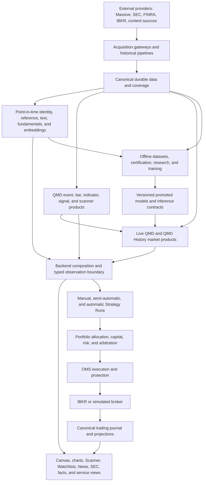

# Quant Research Workbench application architecture

Status: proposed target design with current-state and migration annotations

Design date: 2026-08-10

Scope: the complete application, its services, data products, user interfaces, trading runtime, and research lifecycle

This package is the top-level architecture for the Quant Research Workbench. It
starts with product boundaries and proceeds into storage, services, market data,
enrichment, discovery, interactive charting, trading, intelligence, research,
and operations. Existing documents remain valuable detailed references, but
some describe older generations of the system. When there is a conflict, this
package is the target design; current code remains the authority for what is
actually shipped.

Every detailed document uses these labels:

- **Current**: confirmed in the repository as of the design date.
- **Target**: accepted design that implementation should converge on.
- **Gap**: target behavior that is absent, partial, duplicated, or inconsistent.
- **Future**: intentionally deferred until a concrete consumer or model contract exists.

## Reading order

1. [Product and architectural principles](01-product-and-principles.md)
2. [System context and service responsibilities](02-system-context-and-services.md)
3. [Data authorities, clocks, and storage](03-data-authority-and-storage.md)
4. [QMD market-data distribution](04-qmd-market-data-distribution.md)
5. [Enrichment and field registry](05-enrichment-and-field-registry.md)
6. [Market discovery and computation funnel](06-market-discovery-and-computation.md)
7. [Canvas, charts, and interactive trading](07-canvas-charts-and-interaction.md)
8. [Strategy, Portfolio, OMS, and broker runtime](08-trading-control-plane.md)
9. [News, SEC, text, inference, and Market AI](09-intelligence-and-model-services.md)
10. [Backend integration and API contracts](10-backend-and-api-integration.md)
11. [Research, training, and model promotion](11-research-and-model-lifecycle.md)
12. [Operations, reliability, security, and validation](12-operations-reliability-and-security.md)
13. [Current drift and implementation roadmap](13-current-drift-and-roadmap.md)
14. [Complete implementation backlog](14-implementation-backlog.md)
15. [Implementation decision and delivery log](15-implementation-log.md)
16. [Release, rollback, and recovery runbook](16-release-rollback-and-recovery.md)

## Complete application at a glance

## Authority summary

| Concern | Canonical authority |
| --- | --- |
| Live quote/trade acquisition and recent market data | QMD Gateway |
| Historical SIP events and completed daily-session bars | Market SIP pipelines and `market_sip_compact` |
| Unified market-data delivery | QMD product boundary using the shared source resolver |
| Issuer, security, listing, ticker, conid, and tradability identity | Reference Gateway |
| News acquisition and structured rendering | News Gateway and shared News pipeline |
| SEC filings, documents, rendered text, and XBRL | SEC Gateway and shared SEC pipeline |
| Deterministic News/SEC semantics | Text Intelligence |
| Tokenization and embeddings | Text Embed Gateway |
| Structured model invocation | Model Gateway |
| Contextual, expiring market hypotheses | Market AI |
| Strategy decisions | Strategy runtime |
| Account, capital, allocation, and risk | Portfolio authority |
| Broker commands and protection | OMS |
| Broker session availability | IBKR Gateway Supervisor |
| Orders, executions, positions, strategy events, and performance evidence | Trading Journal and canonical broker projections |
| Product presentation and interaction | Canvas and application frontend; never data or trading authority |

## Navigation

[Next: Product and principles](01-product-and-principles.md)
