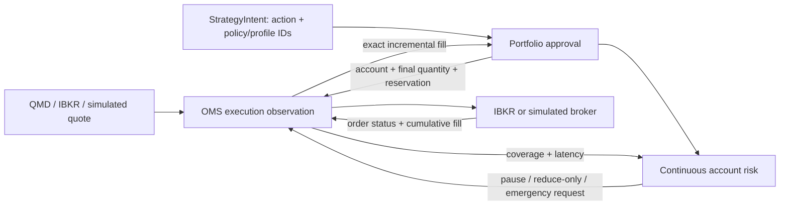

# Adaptive Execution, Protection, and Continuous Risk

## Decision flow



The strategy decides what change it wants and selects versioned execution and
protection policies. It may include causal structure such as a confirmed swing
anchor. It does not read broker order state or send broker commands.

Portfolio management binds one explicit account, validates that account's
allowlists/capabilities, sizes against the worst permitted execution price and
every protection slice, and reserves capacity. It never chooses a price from
the current quote and never calls the broker.

OMS owns fast execution-time observations, the adaptive state machine, IBKR
commands, per-order cumulative fills, protection coverage, and restart
reconciliation. It may use QMD because adaptive policies need current price,
but it cannot exceed the immutable strategy/portfolio envelope.

Continuous risk consumes portfolio metrics, sync/connection state, OMS
reaction latency, and protection coverage. It can only narrow authority. It
does not size or place orders directly.

## Strategy-selected execution policies

| Policy | Initial behavior | Adaptive behavior |
|---|---|---|
| `passive` | Passive touch | Stay passive within deadline |
| `midpoint` | Midpoint | Remain at midpoint |
| `adaptive_patient` | Passive touch | Move to midpoint |
| `adaptive_regular` | Midpoint | Move toward current touch |
| `adaptive_urgent` | Current touch | Follow current touch |
| `adaptive_very_urgent` | Current touch | Cross by bounded ticks |
| `immediate_with_limit` | Current touch | Follow touch, never market |
| `ibkr_native_adaptive` | Bounded limit | Broker-native selection within envelope |
| `cancel_if_not_filled` | Regular bounded path | Cancel remainder at deadline |

Every policy contains:

- stable `policy_id@revision`;
- quote authority (`qmd`, `ibkr`, or `simulated`);
- maximum buy/minimum sell;
- deadline and maximum replacement count;
- minimum replacement interval;
- partial-fill rule.

The portfolio can allowlist exact identities or policy names per account.

## Partial fill rule flow

Example: buy 1,000, broker reports cumulative 400.

1. OMS stores cumulative 400 for that broker order and derives incremental 400.
2. Portfolio converts only 400 from reservation to allocation; 600 remains
   reserved.
3. The OMS wakes immediately, obtains the latest execution quote, and reads
   the broker-known remaining quantity.
4. `complete_remainder` modifies the same parent order's price. The order's
   original total quantity remains 1,000 because IBKR modification semantics
   combine it with cumulative fill; the working remainder remains 600.
5. A fill racing the modification is applied cumulatively before any later
   action. A repeated cumulative 400 produces zero incremental fill.
6. `accept_partial` or `cancel_remainder` requests cancellation instead.
   Capacity is released only after broker-terminal confirmation.

## Protection profiles

A profile has one to four slices whose fractions total exactly one. Each slice
has its own hard stop, optional target, and trailing rule. This supports:

- one fixed stop for the full opening position;
- three/four entry slices tied to different causal swing lows;
- independent add-on protection;
- a catastrophic stop plus tighter tactical stops;
- post-profit breakeven, locked-profit, or trailing transitions.

Swing anchors carry observation ID, price, confirmation time, timeframe, and
ordinal. This prevents future structure from leaking into Replay/Backtest and
makes Live decisions auditable.

For adds, the profile selects independent slice, inherit position stop, rebase
all, tighten-only, or preserve-existing behavior. Portfolio policy decides
which profile identities and stop order types are allowed. Stop-limit
protection is off by default because it can remain unfilled through a gap.

## Event behavior

| Event | OMS behavior | Portfolio/risk behavior |
|---|---|---|
| Quote changes | Wake adaptive policy; replace only if price changed and bounds permit | No resizing |
| Partial entry fill | Record exact incremental fill; reprice/cancel remainder by policy; reconcile protection | Convert filled portion; retain remainder reservation |
| Fill during modify/cancel | Apply new cumulative fill before next command | Never double allocate |
| Protective fill | Attribute slice and role; emit exit; reconcile remaining coverage | Reduce matching allocation |
| Protective child cancelled/rejected | Keep semantic position live; repair coverage | Emergency state on unresolved deficit |
| Partial profit pocket | Reconcile actual remaining position and tighten/transition stops | Release exposure only on fill |
| Disconnect | Freeze new commands; broker-held stops remain | Entries paused; no automatic resume |
| Submission timeout | Persist `outcome_unknown`; reconcile by client/broker ID | Reservation retained |
| Restart | Restore groups/mappings/fills; reconcile broker orders/positions | Restore controls/reservations/allocations |
| Daily-loss warning | Keep reductions/protection; block new entries | `entries_paused` |
| Hard loss/drawdown | Kill entries; reductions only | `reduce_only` |
| Protection deficit/emergency loss | Request configured emergency action | `emergency_exit`; never auto-resume |

## Continuous-risk state machine

```text
normal
  -> entries_paused
  -> reconciling
  -> reduce_only
  -> emergency_exit
  -> fully_blocked
```

Severity can escalate automatically. A return to normal inputs stays latched
at `entries_paused` until the operator explicitly resumes and a fresh
evaluation confirms broker connectivity, portfolio synchronization, loss
limits, and protection coverage are all normal.

Emergency auto-liquidation is per-account and disabled by default. If enabled,
OMS first reconciles, cancels entry remainders, requires a fresh quote, and
submits a bounded exit with fallback stop. Broker-held protection is never
removed before replacement acknowledgement.

## Mode parity

Live and Paper use IBKR as account/order/position authority. Replay and
Backtest use `SimulatedBrokerAdapter`, but run the same intent, portfolio,
execution-policy, slice planning, OMS lifecycle, protection reconciliation,
continuous-risk, persistence, and evidence contracts. Mode differences are
transport, clock, market events, fills, commissions, and configured account
capabilities—not decision semantics.

## Operator evidence

Portfolio Canvas exposes, per account:

- continuous-risk state and reasons;
- daily loss/drawdown;
- protection required, covered, and deficit quantities;
- active managed groups with execution/protection policy identities;
- current working limit and measured internal reaction;
- pending/completed kill-entry or emergency-flatten commands.

`kill_entries` cancels only open entry roots. Existing exits and broker-held
protection remain. `emergency_flatten` is confirmation-gated in Canvas and is
executed only by the runtime command consumer, never by the browser.
