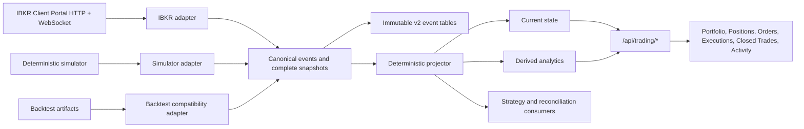

# Canonical IBKR-aligned trading architecture

Status: implemented v2 foundation, with explicit v1 compatibility adapters
Scope: live, paper, replay, backtest, Canvas, strategy services, and durable audit history

## Outcome

The application has one broker-neutral trading lifecycle whose concepts align with IBKR without copying unstable wire-response shapes into strategy or UI code. IBKR Client Portal is an adapter at the system boundary. The simulator and completed backtests expose the same canonical query model.

The design deliberately keeps four products separate:

1. raw broker evidence;
2. normalized immutable events;
3. current-state projections;
4. derived analytics, including FIFO round trips.

An IBKR execution is never mislabeled as a completed trade. A completed trade is a derived pairing of opening and closing executions and is explicitly not an IBKR tax lot or confirmation.

## Source contracts and IBKR semantics

The implementation follows the official [IBKR Client Portal Web API v1 documentation](https://www.interactivebrokers.com/campus/ibkr-api-page/cpapi-v1/) and [IBKR Trading Web API guide](https://www.interactivebrokers.com/campus/ibkr-api-page/web-api-trading/).

Important upstream semantics preserved by the design:

- `/portfolio/accounts` is the set of accounts whose portfolio can be viewed; `/iserver/accounts` is the set that can trade. They are not interchangeable.
- `/portfolio2/{accountId}/positions` provides near-real-time positions without the old paged endpoint's cache.
- `/portfolio/{accountId}/summary` is a dynamic key/value document. New keys are retained without schema changes.
- `/portfolio/{accountId}/ledger` contains BASE and individual currencies. All currencies are retained.
- `/iserver/account/orders` returns live-order state and requires explicit account selection in multi-account use.
- `/iserver/account/trades` is execution history for at most the current day plus six previous days. It is not a round-trip trade ledger.
- WebSocket topics `sor`, `str`, `ssd`, and `sld` are deltas. Initial HTTP snapshots establish the base state; deltas update it; reconciliation repairs drift.
- IBKR warning/reply chains serialize order submission. The adapter retains the existing single order lane and exposes warnings as canonical events.

TWS can be added later as another adapter. Its account callback semantics are documented in the official [TWS API documentation](https://www.interactivebrokers.com/campus/ibkr-api-page/twsapi-doc/); the canonical model already carries model, account-value key, currency, source time, and raw evidence required by that adapter.

## Canonical domain

`src/trading_runtime/domain.py` is the authority.

| Entity | Identity | Purpose |
| --- | --- | --- |
| `InstrumentContract` | internal instrument id + provider ids, including IBKR conid | Stable instrument identity across modes |
| `BrokerAccount` | provider + account id | View/trade permissions, account type, currency, hierarchy |
| `OrderIntent` | command id + client order id | Immutable strategy/user instruction before broker translation |
| `OrderState` | account + broker/client order id | Current normalized lifecycle plus exact raw broker status |
| `Execution` | account + execution id | One immutable fill/execution with commission state |
| `CommissionEvent` | account + execution id + source time | Late fee/P&L evidence without rewriting the execution source |
| `PositionState` | complete snapshot + account + conid + model | Current broker position, including a valid empty portfolio |
| `AccountValue` | account + key + segment + currency | Extensible account-summary values |
| `LedgerBalance` | account + currency | Complete multi-currency cash/value record |
| `BrokerEventEnvelope` | UUID plus broker identity fields and payload hash | Immutable ordered audit evidence |
| `RoundTripTrade` | deterministic derived id | FIFO realization audit, separate from executions |
| `TradeEpisode` | flat-to-flat account and instrument lifecycle | Performance reporting unit across live, paper, replay, and backtest |

Monetary and quantity fields use `Decimal`; transport serialization uses exact decimal strings. Source event time, receive time, and durable record time remain distinct.

## Order lifecycle

The normalized lifecycle is:

`created -> pending_submission -> working/trigger_pending -> partially_filled -> filled`

with cancellation, rejection, expiry, inactive, and unknown branches. `broker_status_raw` is always retained. An unrecognized IBKR status maps to `unknown`, never to `inactive` or a terminal state.

`OrderIntent` is translated once by `canonical_commands.intent_to_ibkr_request`. Both IBKR and simulated adapters implement the same `submit_intents`, `replace`, and `cancel` contract and return canonical audit events.

## Snapshot correctness

A list of positions alone cannot distinguish:

- a complete empty account;
- an incomplete request;
- a failed or missing response.

Every position refresh therefore has a `SnapshotManifest`. The projector replaces an account's prior positions only when the new manifest is complete. A complete snapshot with zero items clears prior positions. An incomplete snapshot keeps prior state and marks the projection stale.

## Streaming and reconciliation

`CanonicalBrokerSession` owns the operational sequence:

1. authenticate and discover accounts;
2. load account values, all ledger currencies, positions, orders, and executions;
3. mark state complete only after all viewable account position snapshots finish;
4. apply WebSocket deltas in source-time order;
5. periodically reread authoritative HTTP snapshots;
6. record a reconciliation event and correct the projection when differences exist.

The UI reads the projection and does not merge raw broker payloads itself. A two-second server cache protects IBKR rate limits and interactive latency; explicit refresh bypasses it.

## Durable ClickHouse v2 model

The v1 tables remain intact during migration. V2 tables are additive:

- `tr_broker_account_v2`
- `tr_broker_event_v2`
- `tr_order_command_v2`
- `tr_order_event_v2`
- `tr_execution_event_v2`
- `tr_commission_event_v2`
- `tr_account_value_event_v2`
- `tr_ledger_event_v2`
- `tr_snapshot_manifest_v2`
- `tr_position_snapshot_item_v2`
- `tr_reconciliation_event_v2`
- `tr_round_trip_trade_v2`

Current-state views are `tr_order_current_v2`, `tr_account_value_current_v2`, `tr_ledger_current_v2`, and `tr_position_current_v2`. Position current-state reads only the newest complete manifest.

Raw events retain identity, correlation/causation fields, source sequencing, three timestamps, a SHA-256 payload hash, and lossless JSON evidence. Typed tables support efficient queries without discarding fields not selected for projection.

## Query API

All read surfaces use schema version 2:

- `GET /api/trading/state`
- `GET /api/trading/accounts`
- `GET /api/trading/portfolio`
- `GET /api/trading/positions`
- `GET /api/trading/orders`
- `GET /api/trading/executions`
- `GET /api/trading/closed-trades`
- `GET /api/trading/activity`

Live and paper use `mode=live|paper` with account selectors. Completed backtests use `mode=backtest&run_id=...`; their existing Parquet artifacts are adapted into the same response rather than exposed as a second UI schema. New replay/backtest runtimes use `CanonicalBrokerSession` and the simulated adapter directly.

Real account identifiers remain internal. Existing Canvas-facing live services continue to return masked identifiers; direct broker sessions and durable event storage retain the real account identity.

## Canvas information architecture

The containers have distinct decisions and avoid redundant summaries:

| Container | Primary question | Key fields |
| --- | --- | --- |
| Portfolio | What is the account's capacity and risk now? | net liquidation, funds, excess liquidity, buying power, realized/unrealized P&L, long/short/net/gross exposure, currency ledger |
| Position Manager | What inventory is held, what is attached to it, and what happened previously? | Open positions with P&L and return, working-order and fill counts, expandable related evidence, derived closed round trips, and a position lifecycle timeline |
| Orders & Fills | What is working, what happened to every order, and what actually filled? | Working/all/fills tabs, normalized and raw status, fill progress, type/prices/TIF, account and identities, with each order expandable to its immutable execution evidence |
| Execution Audit | Does immutable broker fill evidence reconcile? | Advanced execution time/id, instrument, side, size, price, venue, commission state, and order correlation; not a required everyday container |
| Round-trip Audit | How were derived FIFO round trips constructed? | Advanced entry/exit, side, size, gross P&L, fees, net P&L, and explicit derivation disclosure; normal closed-position review remains in Position Manager |
| Activity | What happened and in what causal chain? | event type/time, provider, account, command/order/client/execution/correlation ids |

Every surface displays snapshot completeness, freshness, provider, mode, and as-of time. Trading tables use fit-content columns with horizontal overflow instead of stretching sparse fields and provide typed sorting, free-text search, semantic filters, stable row counts, and expandable evidence. Semantic colors are reserved for P&L, exposure direction, lifecycle state, and warnings.

The linked price chart renders the canonical open position for its symbol as one native average-entry line. The line shows long/short direction, signed quantity, average price, and unrealized P&L. It is a projection of the same position row used by Position Manager, not a separately calculated chart position. Order and execution evidence remain in Orders & Fills so the chart stays readable.

Canvas layout version 8 migrates everyday workspaces away from standalone Executions and Closed Trades windows. Existing standalone windows become the consolidated Orders & Fills and Position Manager surfaces at their prior positions. The advanced audit containers remain available from the library when reconciliation or debugging requires them.

## Compatibility and migration

The old `ibkr_schema.py` DTOs and strategy-facing backtest models remain supported because existing versioned strategies import them directly. They are compatibility contracts, not the new authority. Replacing every strategy import in one release would create broad behavioral risk without improving the broker boundary.

Migration sequence:

1. write and validate v2 events/projections alongside v1;
2. move Canvas and new strategy services to `/api/trading/*`;
3. compare v1 and v2 counts, quantities, cash, order states, executions, and empty snapshots;
4. move individual strategy versions to `OrderIntent` when modified for business reasons;
5. retire v1 only after parity and replay determinism are proven.

## Invariants and acceptance checks

- The same ordered inputs produce identical simulated events and deterministic round-trip ids.
- Historical projection time is derived from source events, never wall-clock load time.
- Unknown broker status remains unknown.
- Complete empty position snapshots clear positions; partial snapshots never do.
- Account summaries retain unknown keys and segments.
- Ledger merges update one currency without deleting the others.
- Executions and commissions are independently auditable.
- Closed trades are labeled derived and never presented as IBKR records.
- Multi-account order reads explicitly select the account.
- UI state cannot be considered current when reconciliation or required snapshots fail.

## Known boundary

The v2 foundation does not silently rewrite historical strategy implementations. Those implementations can continue using the legacy adapter while their observable state is exported through the canonical query model. This is an intentional compatibility boundary, not a second authority: all new broker integration, persistence, services, and Canvas work must use the v2 domain.
