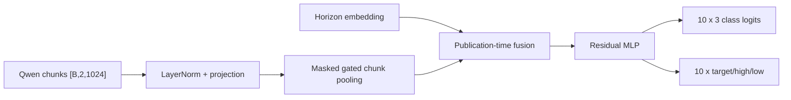

# News Reaction Model v1

This model forecasts ticker-specific post-news reactions from frozen
`Qwen/Qwen3-Embedding-0.6B` article embeddings. V1 intentionally accepts only
articles with exactly one provider ticker. It does not use future market data,
deterministic phrase features, or causal-v1 event tensors as input.

## Contract

- Training: `[2019-01-01, 2026-01-01)`.
- Evaluation: available rows in `[2026-01-01, 2027-01-01)`.
- Identity: `news_text_embeddings.source_id = news_reaction_labels_v2.canonical_news_id`,
  with exact ticker and publication timestamp equality.
- Input: one or two 1,024-dimensional Qwen chunks per single-ticker article.
- Targets: negative/neutral/positive class and abnormal target/high/low returns
  for 1m, 5m, 10m, 30m, 1h, 2h, 3h, premarket close, regular close, and extended close.
- Eligibility: the existing split-aware `news_reaction_quality_overlay_v1` must
  mark the reaction row eligible for statistics.

Target, high, and low are forecast independently because they are abnormal
returns measured against benchmark returns at different observation times.
Unlike raw price extrema, their ordering is not mathematically constrained.

One batch stores the article embedding once and carries all ten horizons. A
resumable monthly preparation stage performs the expensive exact source join
once. Training then streams the versioned prepared table through bounded
month/keyset queries and a bounded prefetch queue; it never rebuilds labels in
the training hot path.

## Prepare the dataset

Inspect the plan (read-only):

```powershell
python -m research.news_reaction_model.v1.run_prepare_data
```

Materialize 2019-2026 in bounded, resumable monthly units:

```powershell
python -m research.news_reaction_model.v1.run_prepare_data --execute
```

Only ranges with an exact durable completion manifest and matching row count are
skipped on restart; the presence of partial rows is never treated as completion.
Use `--rebuild` only when deliberately replacing the selected dataset version. Preparation writes one row per exact
article/ticker/publication-time identity and audits chunk/target shape plus
chronological split leakage before returning success.

## Architecture



## Training

Read-only dependencies are ClickHouse embeddings, ticker links, exact reaction
labels, the quality overlay, and training-only robust scales.

```powershell
python -m research.news_reaction_model.v1.run_train
```

The trainer first refuses to run if either chronological split is absent or the
prepared identity/shape audit fails. The run directory contains configuration, a git-aware redacted manifest,
metrics JSONL, W&B files, asynchronous latest/best/archive checkpoints, model
details, parameter inventory, Mermaid architecture, optional torchinfo/torchview
artifacts, and a final model card.

Two inspection notebooks follow the causal-v1 artifact workflow:

- `plot_model_diagram.ipynb` regenerates the parameter inventory and architecture artifacts.
- `plot_training_metrics.ipynb` plots sample-clock curves and final 2026 per-horizon metrics.

Smoke test:

```powershell
python -m research.news_reaction_model.v1.train --dummy-data --dummy-batches 2 `
  --batch-size 8 --epochs 1 --no-compile-model --wandb-mode disabled
```

## Size and batch profiler

Dummy throughput sweep:

```powershell
python -m research.news_reaction_model.v1.run_profile_sizes
```

Profile the same configurations with one real 2026 batch:

```powershell
python -m research.news_reaction_model.v1.run_profile_sizes --real-data
```

`profile.jsonl` records parameters, step time, samples/second, peak CUDA memory,
and OOM outcomes for every model-size/layer/batch-size combination. The summary
identifies the fastest successful configuration; accuracy must still be compared
through training runs before selecting the final model.

## Production inference

`inference.py` loads a training checkpoint and converts the same exact embedded
article contract into ten horizon forecasts. Every response retains
`canonical_news_id`, ticker, and publication timestamp and exposes class
probabilities plus abnormal target/high/low return forecasts. It does not query
or consume post-publication market data.

## Workstation sequence

From the synced runtime:

```powershell
cd D:\TradingML\codes\news-reaction-model\v1
python -m research.news_reaction_model.v1.run_prepare_data --execute
python -m research.news_reaction_model.v1.run_profile_sizes --real-data
python -m research.news_reaction_model.v1.run_train
```

Preparation is resumable. Run the GPU profiler after preparation, use its
successful memory/throughput frontier to choose candidates, and compare those
candidates by the 2026 per-horizon holdout metrics before selecting the model.
