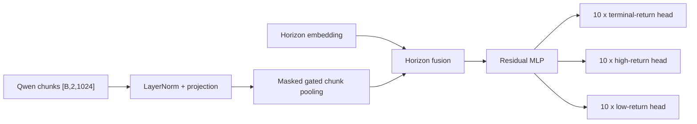

# News Reaction Model v2

V2 is the regression-only successor to v1. It keeps the same frozen
`Qwen/Qwen3-Embedding-0.6B` input, single-ticker population, exact identity
join, chronological split, model trunk, artifacts, W&B integration, bounded
loader, and checkpoint workflow. The classification heads and classification
loss are removed.

## Contract

- Train on `[2019-01-01, 2026-01-01)` and evaluate on available 2026 rows.
- Match embedding and reaction rows by canonical news ID, ticker, and exact
  publication timestamp.
- Accept one or two 1,024-dimensional Qwen chunks per article.
- Predict the actual extracted abnormal terminal, high, and low returns at all
  ten reaction horizons.
- Optimize plain mean-squared error over every valid horizon and all three
  return targets. No class target, robust normalization, or Huber term enters
  the objective.
- Report MSE, RMSE, MAE, per-target errors, Pearson correlation, and improvement
  over the zero-return forecast.

The shared `news_reaction_embedding_dataset_v1` prepared table remains the data
authority because it already contains the exact raw return targets required by
v2. Its class-target column is compatibility metadata and is not read by the v2
model, loss, metrics, or inference response. Reusing it avoids a redundant
486,078-row materialization.

Target, high, and low are independent abnormal-return labels measured against
benchmark returns at different observations. Their ordering is therefore not
constrained like raw price extrema.

## Architecture



## Default training

```powershell
cd D:\TradingML\codes\news-reaction-model\v2
python -m research.news_reaction_model.v2.run_train
```

The launcher preserves the selected v1 capacity and batch frontier:

- `d_model=384`, `hidden_dim=384`, four residual layers
- batch size 2,048
- 10 epochs
- AdamW and bfloat16 AMP
- cosine scheduling with two actual restarts

Two restarts produce three sample-clock cosine segments. With a complete
10-epoch run, resets occur near one-third and two-thirds of the planned training
articles. The scheduler uses processed samples rather than optimizer-step count,
so a short final batch does not distort the schedule. Its state is checkpointed
and must match when resuming.

The run directory contains the resolved config, redacted run manifest, metrics
JSONL, W&B files, latest/best/archive checkpoints, architecture artifacts,
parameter inventory, optional torchinfo/torchview outputs, and final model card.
The best checkpoint monitors validation MSE.

Smoke test:

```powershell
python -m research.news_reaction_model.v2.train --dummy-data --dummy-batches 2 `
  --batch-size 8 --d-model 16 --hidden-dim 16 --layers 1 --epochs 3 `
  --scheduler-restarts 2 --no-compile-model --wandb-mode disabled
```

## Data preparation and profiling

V2 normally consumes the already completed v1 prepared dataset, so data
preparation does not need to run again. `run_prepare_data` remains available for
rebuilding that shared source contract if it is deliberately versioned or
repaired:

```powershell
python -m research.news_reaction_model.v2.run_prepare_data
python -m research.news_reaction_model.v2.run_prepare_data --execute
```

The profiler uses the regression-only model and MSE objective:

```powershell
python -m research.news_reaction_model.v2.run_profile_sizes --real-data
```

It records parameters, step time, throughput, peak CUDA memory, and OOM results.
The selected v1 architecture is the v2 default; profiling is optional unless
the hardware or capacity target changes.

## Inference

`inference.py` loads a v2 checkpoint with restricted weights-only deserialization.
For each news identity and horizon it returns only:

- `abnormal_target_return`
- `abnormal_high_return`
- `abnormal_low_return`

It exposes no class probabilities and consumes no post-publication market data
at inference time.

## Inspection

- `plot_model_diagram.ipynb` regenerates architecture artifacts.
- `plot_training_metrics.ipynb` plots train/validation MSE and MAE plus final
  per-horizon RMSE.

The 2026 split remains the same evaluation split used by v1. Because it is
evaluated each epoch and used for best-checkpoint selection, it is not an
untouched final test set; a later model-selection study should introduce a
separate final holdout.
