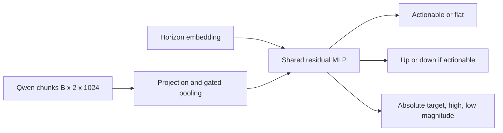

# News Reaction Model v3

V3 is the controlled hierarchical successor to v1. It keeps the same
single-ticker, publication-time-only `Qwen/Qwen3-Embedding-0.6B` inputs, exact
identity contract, prepared dataset, encoder capacity, loader, artifacts,
checkpointing, W&B integration, and chronological split. It changes the v1
three-class head into three related heads:

1. actionable versus flat, trained on every valid horizon label;
2. positive versus negative direction, trained only on actionable labels;
3. absolute target/high/low reaction magnitude, trained only on actionable
   labels.

No price, session, deterministic-language feature, or post-publication value is
added to model inputs.

## Data contract

- Prepared source: `market_sip_compact.news_reaction_embedding_dataset_v1`
- Dataset version: `news_reaction_embedding_dataset_v1`
- Article identity: canonical news ID, ticker, and publication timestamp
- Eligibility: `news_reaction_quality_overlay_v1`
- Label version: `news_reaction_event_labels_v3`
- Training: 2019-01-01 through 2025-12-31
- Validation/evaluation: 2026-01-01 through 2026-12-31, subject to available
  rows
- Horizons: 1m, 5m, 10m, 30m, 1h, 2h, 3h, premarket close, regular close,
  and extended close

The existing prepared dataset is authoritative and should normally be reused.
`run_prepare_data` remains only for an explicit repair or versioned rebuild; do
not run it for ordinary v3 training.

## Hierarchical semantics

The model composes three-class probabilities without a separate three-class
head:

```text
P(flat)     = P(not actionable)
P(negative) = P(actionable) * P(down | actionable)
P(positive) = P(actionable) * P(up | actionable)
```

The production position contract is deliberately direct:

```text
actionable argmax = false -> flat
actionable argmax = true and direction argmax = down -> short
actionable argmax = true and direction argmax = up -> long
```

Magnitude is a nonnegative auxiliary forecast of absolute abnormal target,
high, and low returns. It is exposed for inspection but does not override the
agreed position rule.

## Model



Default capacity matches the evaluated v1 run:

- `d_model=384`
- `hidden_dim=384`
- four residual layers
- batch size 2,048
- bfloat16 AMP

## Training

On the workstation:

```powershell
cd D:\TradingML\codes\news-reaction-model\v3
python -m research.news_reaction_model.v3.run_train
```

The default run is capped at 15 epochs. Values above 15 are rejected. The
sample-clock cosine scheduler has exactly three restart events, producing four
equal planned-sample cycles across the run. Scheduler state and the total sample
plan are checkpointed and must match on resume.

The default run directory is:

```text
D:\TradingML\runtimes\news-reaction-model\v3\train\news-v3-hierarchical-d384-l4-b2048
```

It contains resolved configuration, redacted manifest, JSONL and W&B metrics,
latest/best/archive checkpoints, model diagram and parameter artifacts, model
card, and final evaluation artifacts.

Smoke test:

```powershell
python -m research.news_reaction_model.v3.train --dummy-data --dummy-batches 2 `
  --batch-size 8 --d-model 16 --hidden-dim 16 --layers 1 `
  --epochs 4 --scheduler-restarts 3 --no-compile-model `
  --wandb-mode disabled
```

Dummy training skips database P&L evaluation.

## Automatic final evaluation

After a successful real-data run, training loads `checkpoint_best_val.pt` and
automatically evaluates the complete validation range. Evaluation uses the
exact label anchor and target prices and writes:

- `evaluation/evaluation_summary.json`
- `evaluation/evaluation_positions.csv`
- `evaluation/evaluation_predictions.jsonl.gz`

For every timeframe and the combined independent-timeframe ledger, it reports:

- long, short, and flat counts;
- long one-share P&L;
- short one-share P&L;
- total one-share P&L;
- mean P&L per active position;
- three-class position accuracy and confusion matrix.

This is the aligned descriptive contract: one share for each non-flat
news/timeframe position. It is not a portfolio backtest because costs,
overlapping positions, capital, and execution sequencing are not reconciled.

Evaluation can also be rerun independently:

```powershell
python -m research.news_reaction_model.v3.run_evaluate
```

Use `--no-evaluate-at-end` only when deliberately separating training from the
database evaluation job.

## Inference

`inference.py` loads restricted weights-only checkpoints and returns, for every
horizon:

- discrete position: short, flat, or long;
- actionable probability;
- negative, flat, and positive composed probabilities;
- conditional up probability;
- target/high/low magnitude forecasts;
- expected signed target return derived from the hierarchy.

## Profiling and inspection

The copied profiler remains available when hardware or capacity changes:

```powershell
python -m research.news_reaction_model.v3.run_profile_sizes --real-data
```

`plot_model_diagram.ipynb` and `plot_training_metrics.ipynb` follow the same
artifact workflow as v1 while targeting the v3 hierarchy and runtime root.
