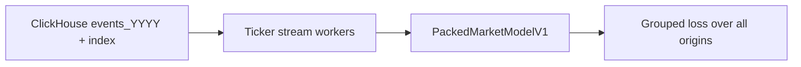

# Packed Market Model v1

`packed_market_model/v1` is the first block-native model family for market-event training.
It is designed around direct ClickHouse ticker streams rather than expanded per-origin context tensors.

## Data Flow



## Model Contract

| Input | Shape | Meaning |
|---|---:|---|
| `events` | `[T, F]` | Contiguous ticker-local event stream for the block. |
| `origin_positions` | `[M]` | Integer positions into `events`; each position is one training origin. |
| `event_feature_names` | `[F]` | Names of raw event fields. |
| `labels[name]` | `[M]` | One target per origin for each discovered label column. |

## Architecture

| Stage | Input | Output | Notes |
|---|---:|---:|---|
| Event projection | `[T, F]` | `[T, d_model]` | LayerNorm + MLP. Raw loader values stay raw; preprocessing is inside the model. |
| Position embedding | `[T]` | `[T, d_model]` | Optional learned position id within the packed stream; disabled by default because a multi-million-row learned table is too large for the default profile. |
| Causal event encoder | `[T, d_model]` | `[T, d_model]` | Stack of causal depthwise-conv residual blocks. This is faster than full attention for the first version. |
| Origin gather | `[T, d_model]`, `[M]` | `[M, d_model]` | Selects model state at each origin without rebuilding windows. |
| Label heads | `[M, d_model]` | `{label: [M]}` | One head per discovered label column. |

## Loss Groups

Labels are grouped by name:

| Group | Name Pattern | Loss |
|---|---|---|
| `price` | `price`, `open`, `high`, `low`, `close`, `bid`, `ask`, `trade` | Huber |
| `event_count` | `count`, `num_`, `event_count` | Huber |
| `event_size` | `size`, `volume`, `notional` | Huber |
| `event_state` | `flag`, `halt`, `luld`, `condition`, `is_` | BCE |
| `external_arrival` | `news`, `sec`, `arrival` | BCE |
| `corporate_action` | `split`, `dividend`, `corporate` | BCE |
| `regression` | fallback | Huber |

Loss groups are averaged without task weights to avoid the instability seen in prior AMP/bf16 runs.

## Scheduler

The trainer uses a sample-clock cosine scheduler:

- `learning_rate=1e-3`
- `scheduler=cosine`
- `scheduler_eta_min=1e-6`
- `scheduler_cycle_samples=1_024_000`
- after every `scheduler_decay_cycles=100` cosine cycles, peak LR is multiplied by `0.95`

All logs, metrics, and checkpoints are keyed by samples seen, not steps.

## Run Commands

Profile the direct streaming loader:

```powershell
python -m research.packed_market_model.v1.run_profile_workstation
```

The workstation launcher prints the full equivalent command and writes logs under:

```text
D:\TradingML\runtimes\packed_market_model\v1\profiles
```

Override any profile argument after the launcher name:

```powershell
python -m research.packed_market_model.v1.run_profile_workstation `
  --tickers AAPL `
  --max-blocks 2 `
  --ticker-workers 1
```

Profile all available loader modalities:

```powershell
python -m research.packed_market_model.v1.run_profile_full_workstation
```

This profiler times the real loads for:

- packed ticker events and event-derived labels
- intraday base bars
- intraday condition events
- ticker news embeddings
- market news embeddings
- SEC text embeddings
- XBRL context
- corporate actions
- ticker daily bars
- global daily bars
- scanner sidecar bars

The default small profile uses `--block-sampling round-robin`, so `--max-blocks 4`
profiles the first block from four different ticker/month plans instead of four
sequential blocks from the most active ticker. Shared month/day artifacts such as
market-news embeddings and global daily bars are cached inside the profiling run
and reported with `cache_hit` details in `profile.jsonl`.

Reusable month-window, multimodal ClickHouse context-query, and vectorized
intraday bar helpers are owned by `research.mlops.packed_market.context`. The
packed profiler and trainer do not depend on the removed temporal daily-index or
chronological-loader packages.

Profile the v1 model against the same ClickHouse ticker-stream loader used by
training:

```powershell
python -m research.packed_market_model.v1.run_profile_model_workstation
```

This runs one warmup block and four profiled blocks by default, with scanner
sidecar enabled, and writes stage timing to `profile.jsonl`:

- loader wait
- CPU/GPU tensor transfer
- forward
- loss calculation
- backward
- optimizer step
- CUDA peak allocated/reserved memory

Scanner is built by a ClickHouse sidecar, not by ticker workers and not from the
old daily-index scanner cache. The sidecar materializes run-scoped `1s` scanner
bars for aligned `15 minute` windows, then the loader fetches completed bars
only:

```text
bar_end_timestamp_us <= floor(origin_timestamp_us, 1s)
```

This means the current in-progress second is never visible to the model.

Train:

```powershell
python -m research.packed_market_model.v1.train `
  --data-source clickhouse `
  --months 2019-02 `
  --ticker-workers 24 `
  --ready-queue-blocks 8 `
  --scanner-sidecar
```

Smoke:

```powershell
python -m research.packed_market_model.v1.train --dummy-data --max-blocks 2 --max-samples 128 --wandb-mode disabled --no-compile-model
```

## Direct Loader

The active loader is `ClickHouseTickerStreamDataset`.

Each worker owns one ticker/month stream at a time:

```text
fetch ordinal chunk
compute vectorized future labels
emit packed block
release no-longer-needed memory
continue same ticker or move to next plan
```

Blocks are consumed by the GPU as soon as they are ready. They do not need to be globally ordered across tickers.

See [TICKER_STREAMING_LOADER_DESIGN.md](../../mlops/packed_market/TICKER_STREAMING_LOADER_DESIGN.md).
