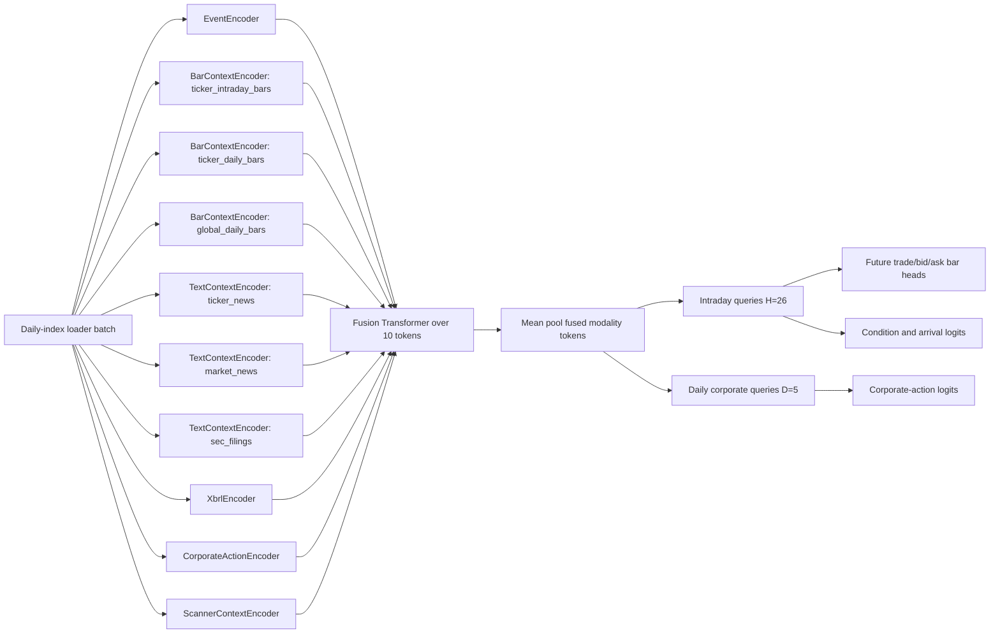

# Temporal Event Model v3 Trainer And Model Design

This guide defines the intended v3 trainer/model design before implementation.
It is a verification target: implementation should not start until the design is
approved.

## Goal

`temporal_event_model/v3` trains a multimodal temporal prediction model on the
ticker-month rolling cache. The model consumes raw event context, daily bar
context, precomputed Qwen text embeddings, XBRL context, and future-label
tensors. It should train end-to-end, but production inference should be able to
cache encoder outputs and run only the cheaper fusion/head path when context has
not changed.

The trainer must be stateful. A checkpoint must be sufficient to resume from
the same data position and reproduce benchmark batches across model variants.

## Data Source

The primary data source is the ticker-month cache loader:

```text
research.mlops.rolling_loader.daily_index_dataset.AsyncDailyIndexBatchLoader
```

The cache is produced by:

```text
research.mlops.rolling_loader.run_build_daily_index_streaming_cache
```

Current builder contract:

- Work is split by month and ticker. Each ticker/month package is independently
  reusable and contains raw compact events, eligible origins, event-window
  indexes, pivoted intraday labels, daily bars, text embeddings, and XBRL rows.
- The builder checks `training_category_reference` at startup. If the table is
  missing or empty it builds stable category ids before cache construction; a
  force flag can rebuild/append missing categories. Category ids are persisted
  and reused across periods so model embedding ids stay stable.
- Text context is read from precomputed embedding tables:
  `news_text_embeddings` and `sec_filing_text_embeddings`. The builder does not
  tokenize text or run Qwen during ticker/month cache construction.
- XBRL category ids are joined at build time and written into `xbrl.parquet`.
  Id `0` is reserved for missing/unknown values.
- All absolute cached time features use UTC. The New York session conversion is
  only used to decide active intraday origin eligibility.
- Event history is cached as raw rows. The default cache stores lookback rows
  before each physical part start, not before every origin. The loader may
  request any event coverage that fits inside the cached lookback.
- Intraday labels are stored as compact/pivoted `next_*` label arrays, one row
  per saved eligible origin. Builder output must satisfy:

```text
origins_part_N rows == event_window_index_part_N rows == intraday_forward_labels_part_N rows
```

  Candidate labels for origins later rejected by the event-window eligibility
  pass are filtered before write. The part manifest records
  `labels_filtered_out`; this should match the skipped invalid origins for that
  part. Missing labels for eligible origins, duplicate compact label rows, or
  label identity disagreements are fatal build errors.

The loader should support deterministic and non-deterministic modes:

- deterministic benchmark mode: fixed `dataset_id`, seed, hash buckets, and
  sample limit produce the same batches across runs
- production training mode: stochastic shuffling can vary by run while still
  being checkpointable

The loader should emit all selected data groups but allow low-level selection
for pretraining or ablation, such as events-only, events+labels, text-only, or
full multimodal training.

Current loader contract:

- It builds a package/sample plan from completed ticker/month manifests.
- It can filter origins by a requested training/validation period.
- It can shuffle at the package level and within loaded package groups while
  remaining reproducible from `dataset_id`, seed, split, hash buckets, and
  checkpointed loader state.
- It materializes all selected origins from a loaded package group. For the
  normal training path it uses sliding raw event streams ending at each origin,
  not byte-encoded event chunks.
- It validates event streams as ordinal-contiguous and ending at the requested
  origin. Invalid cache files should fail fast instead of silently dropping
  samples.
- Text and XBRL contexts are selected as-of `origin_timestamp_us`, using the
  latest available rows/items first and zero-filling only when insufficient
  historical context exists.
- Label materialization first uses the part's aligned label rows; if an older
  cache is not row-aligned, it builds a strict origin-to-label map and gathers
  only matching rows.
- The loader exposes `state_dict()` and `load_state_dict()` so training
  checkpoints can resume at the same package position and origin cursor.

## Batch Contract

Each batch keeps identity fields for audit and checkpoint logs:

```text
ticker                  [B]
origin_ordinal          [B]
origin_timestamp_us     [B]
source_part_key         [B]
```

Event inputs:

```text
raw_event_stream        [B, 1024, F]
raw_event_mask          [B, 1024]
raw_event_feature_names tuple[str, ...]
```

The event stream is a sliding window ending at the origin. It is not byte-encoded
by default. Event fields should include only useful model inputs, with redundant
identity columns suppressible by loader args. Identity columns remain available
in metadata for audit.

The default event output mode is `raw_stream`. Encoded event chunks remain a
legacy/optional path and should not be used for v3 training unless an ablation
explicitly asks for them.

Daily bar inputs:

```text
ticker_daily_bars       [B, ticker_offsets, bar_features]
ticker_daily_bar_mask   [B, ticker_offsets]
ticker_daily_bar_start_time_features [B, ticker_offsets, bar_time_features]
ticker_daily_bar_end_time_features [B, ticker_offsets, bar_time_features]
global_daily_bars       [B, global_symbols, global_offsets, bar_features]
global_daily_bar_mask   [B, global_symbols, global_offsets]
global_daily_bar_start_time_features [B, global_symbols, global_offsets, bar_time_features]
global_daily_bar_end_time_features [B, global_symbols, global_offsets, bar_time_features]
```

Text embedding inputs should use precomputed Qwen embeddings, not token ids, for
v3 training:

```text
ticker_news_embeddings  [B, 8, 2, 1024]
ticker_news_item_mask   [B, 8]
ticker_news_chunk_mask  [B, 8, 2]
ticker_news_item_time_features [B, 8, text_time_features]

market_news_embeddings  [B, 16, 2, 1024]
market_news_item_mask   [B, 16]
market_news_chunk_mask  [B, 16, 2]
market_news_item_time_features [B, 16, text_time_features]

sec_filing_embeddings   [B, 4, 8, 1024]
sec_filing_item_mask    [B, 4]
sec_filing_chunk_mask   [B, 4, 8]
sec_filing_item_time_features [B, 4, text_time_features]
```

Each text item has one availability timestamp feature vector. All chunks under
that item inherit the same `item_time_features[b,i,:]`, so
`embeddings[b,i,j,:]`, `chunk_mask[b,i,j]`, `item_mask[b,i]`, and
`item_time_features[b,i,:]` remain aligned.

The stored embedding source is:

```text
news_text_embeddings
sec_filing_text_embeddings
```

Embeddings are written as `Array(Float32)` in ClickHouse. Loader/model code may
cast them to bf16 on GPU during training. Missing items/chunks are zero-filled
and masked false.

Default context capacities for v3 are:

```text
ticker news:   latest 8 items, 2 chunks per item
market news:   latest 16 global/news items, 2 chunks per item
SEC filings:   latest 4 filings, 8 chunks per filing
XBRL rows:      latest 4096 rows
```

The builder may cache a slightly larger historical context envelope so loader
experiments can reduce these limits without rebuilding the cache. The model only
sees the loader-selected as-of subset for each origin.

XBRL inputs:

```text
xbrl_value              [B, 4096]
xbrl_mask               [B, 4096]
xbrl_fiscal_year        [B, 4096]
xbrl_period_end_days    [B, 4096]
xbrl_age_days           [B, 4096]
xbrl_timestamp_us       [B, 4096]
xbrl_time_delta_seconds [B, 4096]
xbrl_time_features      [B, 4096, xbrl_time_features]
xbrl_period_end_time_features [B, 4096, xbrl_period_time_features]
xbrl_category_ids       field-specific [B, 4096]
xbrl_confidence         [B, 4096]
```

XBRL time is split into two channels:

```text
availability time: source timestamp_us, used for as-of/no-lookahead selection
period time:       period_end_date/fiscal period, describes the accounting period
```

Availability time and period-end time are intentionally different raw feature
contracts. Availability rows have UTC timestamp features plus relative
origin-delta helpers, so they are 10-wide. Period-end rows are date/accounting
period features plus age helpers, so they are 7-wide. Both routes still pass
through the shared role-aware `TimeFeatureEncoder`; the encoder pads smaller
time roles to `time_feature_input_dim` before projection and uses a role
embedding to distinguish `xbrl_available` from `xbrl_period_end`.

Labels:

```text
future_bar_values["trade"]      [B, H, 6]
future_bar_masks["trade"]       [B, H]
future_bar_values["quote_bid"]  [B, H, 9]
future_bar_masks["quote_bid"]   [B, H]
future_bar_values["quote_ask"]  [B, H, 9]
future_bar_masks["quote_ask"]   [B, H]
intraday_labels           dict[str, [B, H]]
corporate_action_labels   dict[str, [B, D]]
```

The v3 target contract has exactly these three future bar families. It does not
train the older single `future_intraday_bars [B,H,5]` projection. Primary price
targets should use family-specific trade, bid, and ask fields. Redundant
mid-price targets should not be trained by default unless explicitly enabled for
an ablation.

Intraday labels are future-only and session bounded. They are computed from
events on the same New York trading date as the origin and do not cross the
20:00 ET session end. Each unavailable horizon is masked out rather than filled
as a valid target.

Corporate-action labels are daily future labels, not intraday bars. They match
the forward daily price-label horizons through `plus_28d`: `+1d,+2d,+3d,+7d,+28d`.
They include split, reverse split, forward split, dividend ex-date, special
dividend ex-date, and any-corporate-action flags. These labels are computed from effective dates.
Corporate-action inputs are separate X/context features selected by
availability time so declared future dividends can be seen only after they are
available, while labels still forecast future effective events.

## Atomic Model I/O Representation

The loader keeps source-aligned tensors for audit. The v3 model should not feed
every raw field exactly as stored. A versioned model data adapter should expose
raw typed loader tensors and unpack packed categorical ids into the atomic model
inputs below, while preserving identity fields outside the model for audit and
checkpoint logs. Decoding, normalization, clipping, `log1p`, bps/tick conversion,
and standardization are input-layer preprocessing choices, not loader outputs.

### Atomic Model Inputs

Shape symbols used in the atomic input/output tables:

The event sequence length is written as the numeric value `1024`, matching the
current v3 loader default `event_stream_length`. In event rows, `1024` is the
number of events in the context sequence, not the bit width of a field. Packed
source bits are extraction rules, not tensor axes. For example, `event_meta` bit
0 is unpacked into one scalar `event_type_id` per event. That scalar id is then
embedded to a learned vector before it is fused into the per-event token. If an
experiment changes the loader setting, update the table shapes to the new
numeric value in the model guide/config instead of reusing a symbolic length.

| Symbol | Meaning |
| --- | --- |
| `B` | Batch size emitted by the loader/trainer update. |
| `O` | Number of completed daily-bar offsets requested for ticker/global bar context. |
| `S` | Number of configured global symbols in global daily-bar context. |
| `H` | Number of intraday future horizons in `future_intraday_bar_horizons`. |
| `D` | Number of daily corporate-action label horizons in `corporate_action_label_days`; current default is `D=5` for `+1d,+2d,+3d,+7d,+28d`. |
| `F` | Number of raw event fields in loader-level event tensors before the model adapter splits them into atomic event inputs. |
| `I` | Number of as-of external-context items selected for a text group; the value is group-specific, for example ticker news, market news, or SEC filings. |
| `C` | Number of text chunks per external-context item; the value is group-specific. |
| `M` | Number of modality availability flags passed to the fusion path. |
| `T_event` | Number of event timestamp/session time features. |
| `T_bar` | Number of daily-bar time features. |
| `T_text` | Number of text item time features. |
| `T_xbrl` | Number of XBRL availability-time features. |
| `T_period` | Number of XBRL period-end time features. |
| `T_ca` | Number of corporate-action availability-time features. |
| `T_ca_eff` | Number of corporate-action effective-time features. |
| `F_ca` | Number of corporate-action numeric feature dimensions. |
| `d_model` | Backward-compatible default hidden width. |
| `D_fusion` | Effective fusion width, equal to `fusion_d_model` when set, otherwise `d_model`. |
| `D_event`, `D_bar`, `D_text`, `D_xbrl`, `D_ca`, `D_scanner` | Effective modality output widths before their adapters; each falls back to `d_model` when its explicit config value is `0`. |

Event raw storage and adapter chain:

```text
raw_event_stream                [B, 1024, F]
  -> v3 model data adapter      unpack categorical ids and expose raw typed fields
  -> categorical id tensors     [B, 1024] per categorical atom
  -> raw numeric/time tensors   [B, 1024] or [B, 1024, T_*]
  -> input preprocessing layers decode/normalize if enabled
  -> embeddings/projections     [B, 1024, d_atom] per atom/group
  -> event token projection     [B, 1024, d_model]
  -> event encoder              [B, 1024, d_model]
```

For packed event fields, the bit location stays only in the adapter source
definition. The model does not receive a tensor shaped `[B, 1024, bit_0]`.
It receives either scalar category ids shaped `[B, 1024]`, dense numeric
features shaped `[B, 1024]`, or dense vector features shaped `[B, 1024, T_*]`.

Event-atom connection details:

| Event atom | Loader x input | Storage location | Tensor entering input layer | Transformation/preprocessing | Learned output and connection |
| --- | --- | --- | --- | --- | --- |
| `event_type_id` | `event_meta` | bit 0 | `uint8 [B, 1024]`, vocab size 2 | unpack only | embedding `[B, 1024, d_event_type]`; concatenate into event token input |
| `event_primary_price_scale_id` | `event_meta` | bit 1 | `uint8 [B, 1024]`, vocab size 2 | unpack only; also used by price preprocessing | embedding `[B, 1024, d_price_scale]`; concatenate into event token input |
| `event_secondary_price_scale_id` | `event_meta` | bit 2 | `uint8 [B, 1024]`, vocab size 2 | unpack only; also used by price preprocessing | embedding `[B, 1024, d_price_scale]`; concatenate into event token input |
| `event_tape_id` | `event_meta` | bits 3-5 | `uint8 [B, 1024]`, vocab size 8 | unpack only | embedding `[B, 1024, d_tape]`; concatenate into event token input |
| `price_primary_int` | `price_primary_int` plus primary scale id | full integer column plus scale bit | `uint32/float32 [B, 1024]` raw packed price plus scale id | optional decode to float price, then optional origin-relative bps/tick normalization | numeric projection `[B, 1024, d_price]`; concatenate into event token input |
| `price_secondary_int` | `price_secondary_int` plus secondary scale id | full integer column plus scale bit | `uint32/float32 [B, 1024]` raw packed price plus scale id | optional decode to float price, optional origin-relative bps/tick normalization, mask/zero trade secondary | numeric projection `[B, 1024, d_price]`; concatenate into event token input |
| `size_primary` | `size_primary` | full float column | `float32 [B, 1024]` raw event size | optional `log1p`, clipping, and/or standardization | numeric projection `[B, 1024, d_size]`; concatenate into event token input |
| `size_secondary` | `size_secondary` | full float column | `float32 [B, 1024]` raw event size | optional `log1p`, clipping, and/or standardization; mask/zero trade secondary | numeric projection `[B, 1024, d_size]`; concatenate into event token input |
| `event_exchange_primary_id` | `exchange_primary` | full byte column | `uint8 [B, 1024]`, exchange vocabulary | none beyond missing/unknown id handling | embedding `[B, 1024, d_exchange]`; concatenate into event token input |
| `event_exchange_secondary_id` | `exchange_secondary` | full byte column | `uint8 [B, 1024]`, exchange vocabulary | none beyond missing/unknown id handling; mask/zero trade secondary if configured | embedding `[B, 1024, d_exchange]`; concatenate into event token input |
| `event_condition_token_1_id` | `condition_token_1` | full byte column | `uint8 [B, 1024]`, condition vocabulary | none beyond missing/unknown id handling | embedding `[B, 1024, d_condition]`; mask-aware pooled with other condition slots |
| `event_condition_token_2_id` | `condition_token_2` | full byte column | `uint8 [B, 1024]`, condition vocabulary | none beyond missing/unknown id handling | embedding `[B, 1024, d_condition]`; mask-aware pooled with other condition slots |
| `event_condition_token_3_id` | `condition_token_3` | full byte column | `uint8 [B, 1024]`, condition vocabulary | none beyond missing/unknown id handling | embedding `[B, 1024, d_condition]`; mask-aware pooled with other condition slots |
| `event_condition_token_4_id` | `condition_token_4` | full byte column | `uint8 [B, 1024]`, condition vocabulary | none beyond missing/unknown id handling | embedding `[B, 1024, d_condition]`; mask-aware pooled with other condition slots |
| `event_condition_token_5_id` | `condition_token_5` | full byte column | `uint8 [B, 1024]`, condition vocabulary | none beyond missing/unknown id handling | embedding `[B, 1024, d_condition]`; mask-aware pooled with other condition slots |
| `event_time_features` | UTC/session time feature columns | full float columns | `float32 [B, 1024, T_event]` | none; already generated by builder/loader using the agreed time-feature contract | time adapter `[B, 1024, d_time]`; concatenate into event token input |
| `event_position_id` | derived from context order | not stored | `int64 [B, 1024]` | derive monotonically from event context position | embedding `[B, 1024, d_position]`; add to event token |
| `event_mask` | derived from valid context rows | not stored | `bool [B, 1024]` | none | attention mask for event encoder |

The final event token is built by combining the learned outputs above:

```text
event_token_input =
  EventInputMLP(
    concat(
    event_type_emb,
    price_scale_embs,
    tape_emb,
    price_input_projection,
    size_input_projection,
    exchange_embs,
    condition_slot_projection,
    event_time_projection
    )
  )
  + position_emb
```

`EventInputMLP` is the default event input projection, not a plain linear layer.
It should be a small nonlinear block such as:

```text
Linear(concat_dim -> d_model)
LayerNorm
GELU or SiLU
Dropout
Linear(d_model -> d_model)
```

A single `Linear(concat_dim -> d_model)` projection is only an ablation
baseline. The nonlinear default is useful because one event token mixes event
type, side-specific price fields, sizes, exchanges, condition tokens, and time
features; these feature interactions should be available before the temporal
event encoder.

This yields `float32/bf16 [B, 1024, d_model]` before the event encoder.

| Model input atom | Loader x input | Tensor entering input layer | Loader x representation | Transformation/preprocessing | Learned layer / encoder path |
| --- | --- | --- | --- | --- | --- |
| `event_type_id` | `raw_event_stream.event_meta` bit 0 | `uint8 [B, 1024]` | one scalar category per event; vocab size 2: `0=quote`, `1=trade` | unpack only | event categorical embedding |
| `event_primary_price_scale_id` | `raw_event_stream.event_meta` bit 1 | `uint8 [B, 1024]` | one scalar category per event; vocab size 2: `0=/100`, `1=/10000` | unpack only; controls optional primary price decode | event categorical embedding and decode helper |
| `event_secondary_price_scale_id` | `raw_event_stream.event_meta` bit 2 | `uint8 [B, 1024]` | one scalar category per event; vocab size 2: `0=/100`, `1=/10000` | unpack only; controls optional secondary price decode | event categorical embedding and decode helper |
| `event_tape_id` | `raw_event_stream.event_meta` bits 3-5 | `uint8 [B, 1024]` | one scalar category per event; values `0..7` | unpack only | event categorical embedding |
| `price_primary_int` | `raw_event_stream.price_primary_int` plus primary scale id | `uint32/float32 [B, 1024]` | raw packed quote ask or trade price; scale is not applied by the loader | optional decode to float price and optional origin-relative bps/tick normalization | event numeric projection |
| `price_secondary_int` | `raw_event_stream.price_secondary_int` plus secondary scale id | `uint32/float32 [B, 1024]` | raw packed quote bid price or zero for trade; scale is not applied by the loader | optional decode to float price, optional origin-relative bps/tick normalization, mask/zero trade secondary | event numeric projection |
| `size_primary` | `raw_event_stream.size_primary` | `float32 [B, 1024]` | raw quote ask size or trade size from loader | optional `log1p`, clipping, and/or standardization | event numeric projection |
| `size_secondary` | `raw_event_stream.size_secondary` | `float32 [B, 1024]` | raw quote bid size or zero for trade from loader | optional `log1p`, clipping, and/or standardization; mask/zero trade secondary | event numeric projection |
| `event_exchange_primary_id` | `raw_event_stream.exchange_primary` | `uint8 [B, 1024]` | one scalar exchange category per event; byte value 0 means missing/unknown where applicable | none beyond missing/unknown id handling | event categorical embedding |
| `event_exchange_secondary_id` | `raw_event_stream.exchange_secondary` | `uint8 [B, 1024]` | one scalar exchange category per event; byte value 0 means missing/unknown where applicable | none beyond missing/unknown id handling; optional mask/zero for trade secondary | event categorical embedding |
| `event_condition_token_1_id` | `raw_event_stream.condition_token_1` | `uint8 [B, 1024]` | one scalar dense condition/indicator token per event; `0=missing/unknown` | none beyond missing/unknown id handling | event condition-token embedding |
| `event_condition_token_2_id` | `raw_event_stream.condition_token_2` | `uint8 [B, 1024]` | one scalar dense condition/indicator token per event; `0=missing/unknown` | none beyond missing/unknown id handling | event condition-token embedding |
| `event_condition_token_3_id` | `raw_event_stream.condition_token_3` | `uint8 [B, 1024]` | one scalar dense condition/indicator token per event; `0=missing/unknown` | none beyond missing/unknown id handling | event condition-token embedding |
| `event_condition_token_4_id` | `raw_event_stream.condition_token_4` | `uint8 [B, 1024]` | one scalar dense condition/indicator token per event; `0=missing/unknown` | none beyond missing/unknown id handling | event condition-token embedding |
| `event_condition_token_5_id` | `raw_event_stream.condition_token_5` | `uint8 [B, 1024]` | one scalar dense condition/indicator token per event; `0=missing/unknown` | none beyond missing/unknown id handling | event condition-token embedding |
| `event_time_features` | raw event UTC/session time feature columns | `float32 [B, 1024, T_event]` | dense time-feature vector per event generated by builder/loader | none; already follows the time-feature contract | event time adapter |
| `event_position_id` | derived from context order | `int64 [B, 1024]` | relative event-context position id | derive monotonically from event context position | event position embedding |
| `event_mask` | `raw_event_mask` | `bool [B, 1024]` | true for valid events, false for padded/missing positions | none | event attention mask |
| `ticker_daily_trade_values` | `bar_inputs["ticker_daily_bars"]["trade_values"]` | `float32 [B, O, 6]` | raw completed trade OHLC, size sum, and count fields from loader | optional price normalization to origin/recent close; optional `log1p`/standardization for size/count | ticker bar encoder |
| `ticker_daily_quote_bid_values` | `bar_inputs["ticker_daily_bars"]["quote_bid_values"]` | `float32 [B, O, 9]` | raw completed bid OHLC plus bid size state fields from loader | optional price normalization to origin/recent close; optional size transforms | ticker bar encoder |
| `ticker_daily_quote_ask_values` | `bar_inputs["ticker_daily_bars"]["quote_ask_values"]` | `float32 [B, O, 9]` | raw completed ask OHLC plus ask size state fields from loader | optional price normalization to origin/recent close; optional size transforms | ticker bar encoder |
| `ticker_daily_bar_offset_id` | configured ticker bar offsets | `int64 [B, O]` | one completed-bar offset category per ticker daily bar | broadcast configured offsets | ticker bar offset embedding |
| `ticker_daily_bar_start_time_features` | ticker daily bar start time features | `float32 [B, O, T_bar]` | UTC start-time vector per ticker daily bar from loader | none; already follows the time-feature contract | ticker bar start-time adapter |
| `ticker_daily_bar_end_time_features` | ticker daily bar end time features | `float32 [B, O, T_bar]` | UTC end-time vector per ticker daily bar from loader | none; already follows the time-feature contract | ticker bar end-time adapter |
| `ticker_daily_bar_family_masks` | `trade_mask`, `quote_bid_mask`, `quote_ask_mask` | each `bool [B, O]` | true for available completed bars in each bar family | none | ticker bar attention mask |
| `ticker_intraday_trade_values` | `bar_inputs["ticker_intraday_bars"]["trade_values"]` | `float32 [B, H, 6]` | same-session backward trade bars; normal rows end at the last completed grid boundary, while first-bucket rows use session open through the origin | optional price normalization to origin/recent event; optional `log1p`/standardization for size/count | intraday bar encoder |
| `ticker_intraday_quote_bid_values` | `bar_inputs["ticker_intraday_bars"]["quote_bid_values"]` | `float32 [B, H, 9]` | same-session backward bid bars with the same completed-grid plus first-bucket fallback rule | optional price normalization to origin/recent event; optional size transforms | intraday bar encoder |
| `ticker_intraday_quote_ask_values` | `bar_inputs["ticker_intraday_bars"]["quote_ask_values"]` | `float32 [B, H, 9]` | same-session backward ask bars with the same completed-grid plus first-bucket fallback rule | optional price normalization to origin/recent event; optional size transforms | intraday bar encoder |
| `ticker_intraday_bar_start_time_features` | intraday context grid-start time features | `float32 [B, H, T_bar]` | UTC start-time features plus age from origin to backward context start | none; already follows the time-feature contract | intraday bar start-time adapter |
| `ticker_intraday_bar_end_time_features` | intraday context grid-end time features | `float32 [B, H, T_bar]` | UTC end-time features plus age from origin to backward context end | none; already follows the time-feature contract | intraday bar end-time adapter |
| `ticker_intraday_bar_family_masks` | `trade_mask`, `quote_bid_mask`, `quote_ask_mask` | each `bool [B, H]` | true when that family has events in the selected backward window | none | intraday bar attention mask |
| `global_daily_trade_values` | `bar_inputs["global_daily_bars"]["trade_values"]` | `float32 [B, S, O, 6]` | raw completed global trade bars from loader | optional price normalization and size/count transforms | global bar encoder |
| `global_daily_quote_bid_values` | `bar_inputs["global_daily_bars"]["quote_bid_values"]` | `float32 [B, S, O, 9]` | raw completed global bid bars from loader | optional price normalization and size transforms | global bar encoder |
| `global_daily_quote_ask_values` | `bar_inputs["global_daily_bars"]["quote_ask_values"]` | `float32 [B, S, O, 9]` | raw completed global ask bars from loader | optional price normalization and size transforms | global bar encoder |
| `global_daily_bar_symbol_id` | configured global symbol ids | `int64 [B, S, O]` | one global-symbol category per global daily bar | broadcast configured symbol ids | global symbol embedding |
| `global_daily_bar_offset_id` | configured global bar offsets | `int64 [B, S, O]` | one completed-bar offset category per global daily bar | broadcast configured offsets | global bar offset embedding |
| `global_daily_bar_start_time_features` | global daily bar start time features | `float32 [B, S, O, T_bar]` | UTC start-time vector per global daily bar from loader | none; already follows the time-feature contract | global bar start-time adapter |
| `global_daily_bar_end_time_features` | global daily bar end time features | `float32 [B, S, O, T_bar]` | UTC end-time vector per global daily bar from loader | none; already follows the time-feature contract | global bar end-time adapter |
| `global_daily_bar_family_masks` | `trade_mask`, `quote_bid_mask`, `quote_ask_mask` | each `bool [B, S, O]` | true for available completed bars in each bar family | none | global bar attention mask |
| `ticker_news_embedding` | `text_inputs["ticker_news"].embeddings` | `bf16/float32 [B, 8, 2, 1024]` | precomputed Qwen embeddings from loader | optional cast to trainer dtype; no LLM inference in trainer | ticker-news projection and encoder |
| `market_news_embedding` | `text_inputs["market_news"].embeddings` | `bf16/float32 [B, 16, 2, 1024]` | precomputed Qwen embeddings from loader; market news means all news | optional cast to trainer dtype; no LLM inference in trainer | market-news projection and encoder |
| `sec_filing_embedding` | `text_inputs["sec_filings"].embeddings` | `bf16/float32 [B, 4, 8, 1024]` | precomputed Qwen embeddings from loader | optional cast to trainer dtype; no LLM inference in trainer | SEC text projection and encoder |
| `text_item_time_features` | text item time features | per text group `float32 [B, I, T_text]` | availability/publish/accepted time features from loader | none; already follows the time-feature contract | text time adapter |
| `text_item_mask` | text item mask | per text group `bool [B, I]` | true for available text items | none | text item pooling mask |
| `text_chunk_mask` | text chunk mask | per text group `bool [B, I, C]` | true for available text chunks | none | text chunk pooling mask |
| `xbrl_value` | `xbrl_inputs["value"]` | `float32 [B, 4096]` | raw XBRL numeric value from loader | none in current model; scalar item values are LayerNormed together before item projection | XBRL scalar projection |
| `xbrl_fiscal_year` | `xbrl_inputs["fiscal_year"]` | `int16/float32 [B, 4096]` | fiscal year from loader | no standalone transform; included in XBRL scalar LayerNorm input | XBRL scalar projection |
| `xbrl_period_end_days` | `xbrl_inputs["period_end_days"]` | `float32 [B, 4096]` | raw period-end day value from loader | no standalone transform; included in XBRL scalar LayerNorm input | XBRL scalar/time projection |
| `xbrl_age_days` | `xbrl_inputs["age_days"]` | `float32 [B, 4096]` | age from origin to XBRL availability timestamp | no standalone transform; included in XBRL scalar LayerNorm input | XBRL scalar/time projection |
| `xbrl_timestamp_us` | `xbrl_inputs["timestamp_us"]` | `int64/float32 [B, 4096]` | XBRL availability timestamp used for as-of selection | no standalone transform; included in XBRL scalar LayerNorm input and also represented by `xbrl_time_features` | XBRL scalar/time projection |
| `xbrl_time_delta_seconds` | `time_delta_seconds` plus scalar helper fields | `float32 [B, 4096]` each | signed origin-relative helper fields emitted by the loader | no standalone transform; included in XBRL scalar LayerNorm input and also represented by `xbrl_time_features` | XBRL scalar/time projection |
| `xbrl_category_ids` | XBRL category id fields | field-specific `int64 [B, 4096]` | persisted category ids; id `0=missing/unknown` | none beyond missing/unknown id handling | XBRL categorical embeddings |
| `xbrl_mapping_confidence` | `xbrl_inputs["mapping_confidence"]` | `float32 [B, 4096]` | raw confidence score from loader | optional clipping to valid range | XBRL numeric projection |
| `xbrl_time_features` | XBRL availability time features | `float32 [B, 4096, T_xbrl]` | availability time features from loader | none; already follows the time-feature contract | XBRL availability time adapter |
| `xbrl_period_end_time_features` | XBRL period-end time features | `float32 [B, 4096, T_period]` | period-end date/age features from loader | none; validated as 7-wide and padded to the shared time encoder width inside `TimeFeatureEncoder` | XBRL period time adapter |
| `xbrl_mask` | `xbrl_inputs["mask"]` | `bool [B, 4096]` | true for available XBRL rows | none | XBRL set mask |
| `corporate_action_category_ids` | action/dividend/currency/frequency ids | field-specific `int64 [B, 128]` | persisted category ids; id `0=missing/unknown` | none beyond missing/unknown id handling | corporate-action categorical embeddings |
| `corporate_action_numeric` | corporate numeric feature tensor | `float32 [B, 128, F_ca]` | raw split factors, log factors, cash amount, and indicator flags from loader | optional clipping/standardization for numeric fields only | corporate-action numeric projection |
| `corporate_action_available_time_features` | corporate available time features | `float32 [B, 128, T_ca]` | availability time features from loader | none; already follows the time-feature contract | corporate-action availability time adapter |
| `corporate_action_effective_time_features` | corporate effective time features | `float32 [B, 128, T_ca_eff]` | effective time features from loader | none; already follows the time-feature contract | corporate-action effective time adapter |
| `corporate_action_mask` | corporate action mask | `bool [B, 128]` | true for available corporate-action rows | none | corporate-action set mask |
| `modality_available_mask` | `input_availability` | `bool [B, M]` | true when a modality is available | none | fusion transformer mask or missing-modality token selector |

### Atomic Model Outputs

Use query tokens for every supervised horizon. Intraday query tokens are keyed
by `future_intraday_bar_horizons`; corporate-action query tokens are keyed by
`corporate_action_label_days`.

| Model output atom | Target source | Output shape | Target transform | Loss |
| --- | --- | --- | --- | --- |
| `trade_bar_price` | `future_bar_values["trade"][..., open/close/high/low]` | `[B, H, 4]` | none; raw loader price/tick units | masked Huber/MAE |
| `trade_size` | `future_bar_values["trade"][..., size_sum]` | `[B, H]` | none; raw loader size units | masked Huber/MAE |
| `trade_event_count` | `future_bar_values["trade"][..., event_count]` | `[B, H]` | none; raw loader count units | masked Huber/MAE |
| `quote_bid_bar_price` | `future_bar_values["quote_bid"][..., open/close/high/low]` | `[B, H, 4]` | none; raw loader bid price/tick units | masked Huber/MAE |
| `quote_bid_size` | `future_bar_values["quote_bid"][..., size_open/size_close/size_high/size_low]` | `[B, H, 4]` | none; raw loader size units | masked Huber/MAE |
| `quote_bid_event_count` | `future_bar_values["quote_bid"][..., event_count]` | `[B, H]` | none; raw loader count units | masked Huber/MAE |
| `quote_ask_bar_price` | `future_bar_values["quote_ask"][..., open/close/high/low]` | `[B, H, 4]` | none; raw loader ask price/tick units | masked Huber/MAE |
| `quote_ask_size` | `future_bar_values["quote_ask"][..., size_open/size_close/size_high/size_low]` | `[B, H, 4]` | none; raw loader size units | masked Huber/MAE |
| `quote_ask_event_count` | `future_bar_values["quote_ask"][..., event_count]` | `[B, H]` | none; raw loader count units | masked Huber/MAE |
| `halt_pause_logit` | `condition_halt_pause_flag` | `[B, H]` | bool target | masked BCE-with-logits |
| `resume_logit` | `condition_resume_flag` | `[B, H]` | bool target | masked BCE-with-logits |
| `news_risk_logit` | `condition_news_risk_flag` | `[B, H]` | bool target | masked BCE-with-logits |
| `luld_limit_state_logit` | `condition_luld_limit_state_flag` | `[B, H]` | bool target | masked BCE-with-logits |
| `ticker_news_arrival_logit` | `ticker_news_arrival_flag` | `[B, H]` | bool target | masked BCE-with-logits |
| `sec_filing_arrival_logit` | `sec_filing_arrival_flag` | `[B, H]` | bool target | masked BCE-with-logits |
| `future_split_logit` | `future_split_flag` | `[B, D=5]` | bool target at `+1d,+2d,+3d,+7d,+28d` | daily BCE-with-logits |
| `future_reverse_split_logit` | `future_reverse_split_flag` | `[B, D=5]` | bool target at `+1d,+2d,+3d,+7d,+28d` | daily BCE-with-logits |
| `future_forward_split_logit` | `future_forward_split_flag` | `[B, D=5]` | bool target at `+1d,+2d,+3d,+7d,+28d` | daily BCE-with-logits |
| `future_dividend_ex_logit` | `future_dividend_ex_flag` | `[B, D=5]` | bool target at `+1d,+2d,+3d,+7d,+28d` | daily BCE-with-logits |
| `future_special_dividend_ex_logit` | `future_special_dividend_ex_flag` | `[B, D=5]` | bool target at `+1d,+2d,+3d,+7d,+28d` | daily BCE-with-logits |
| `future_any_corporate_action_logit` | `future_any_corporate_action_flag` | `[B, D=5]` | bool target at `+1d,+2d,+3d,+7d,+28d` | daily BCE-with-logits |

Do not train redundant mid-price labels by default. If an experiment wants a
mid or spread target, it should be derived explicitly in the model adapter and
registered as an ablation head with an explicit diagnostic-only/default-off
setting.

## Model Architecture

The v3 model is a set of independent encoders plus a fusion transformer and
horizon heads.

### Current Implemented Architecture

This section describes the code that is currently implemented in
`research/temporal_event_model/v3/model.py`, `data.py`, and `losses.py`.
It is intentionally more concrete than the research design notes below.

Default dimensions:

| Name | Current value | Meaning |
| --- | ---: | --- |
| `d_model` | 256 | Backward-compatible default hidden width used when a modality-specific width is `0`. |
| `fusion_d_model` | 0 by default | Fusion token width. `0` means use `d_model`. Cached production tokens are `[B,fusion_d_model]` after adapter projection. |
| `event_d_model` | 0 by default | Event encoder output width before its fusion adapter. Large presets set this higher than fusion width. |
| `bar_d_model`, `text_d_model`, `xbrl_d_model`, `corporate_action_d_model`, `scanner_d_model` | 0 by default | Per-modality output widths before fusion adapters. `0` means use `d_model`; sweep presets cap sparse side modalities below event/fusion capacity. |
| `side_encoder_dim` | 0 by default | Internal hidden width for side encoder MLPs. `0` means use `fusion_d_model`/`d_model`. |
| `event_stream_length` | 1024 | Raw event rows ending at each origin. |
| `event_feature_count` | 24 | Raw event feature columns available to the model. The event numeric branch consumes only raw price/size fields by name; time and categorical fields have separate branches. |
| `event_numeric_dim` | 64 | Projected width for `price_primary_int`, `price_secondary_int`, `size_primary`, and `size_secondary`. |
| `event_category_dim` | 16 | Embedding width for event type, price-scale bits, tape, and exchange ids. |
| `event_condition_dim` | 16 | Mask-aware pooled embedding width for `condition_token_1..5`. |
| `time_encoder_dim` | 32 | Shared role-aware time embedding width injected into each modality before pooling. |
| `time_feature_input_dim` | 12 | Maximum raw time-feature width accepted by `TimeFeatureEncoder`; smaller time roles are right-padded inside the encoder. |
| `H` | 26 | Intraday future/backward bar horizons. |
| `D` | 5 | Corporate-action daily horizons: `+1d`, `+2d`, `+3d`, `+7d`, `+28d`. |
| `G` | 5 | Scanner groups: top gainers and top volume for large/mid/small/penny stocks. |
| `K` | 5 | Scanner leaders per group. |
| `S` | 4 | Scanner horizons: `1s`, `5s`, `30s`, `1m`. |
| `ticker_news_items` | 8 | Latest as-of ticker news items. |
| `market_news_items` | 16 | Latest as-of market/news items. |
| `sec_filing_items` | 4 | Latest as-of SEC filing text items. |
| `text_item_dim` | 128 | Internal text chunk/item token width before attention pooling. |
| `text_latents` | 4 | Learned text latent/query tokens per text group. |
| `text_attention_heads` | 4 | Cross-attention heads for text latent pooling. |
| `bar_item_dim` | 128 | Internal trade/bid/ask bar row width before attention pooling. |
| `bar_latents` | 4 | Learned bar latent/query tokens per bar group. |
| `bar_attention_heads` | 4 | Cross-attention heads for bar latent pooling. |
| `scanner_item_dim` | 128 | Internal scanner trade/bid/ask row width before scanner latent pooling. |
| `scanner_latents` | 4 | Learned scanner latent/query tokens used to attend over leader/origin/numeric scanner rows. |
| `scanner_attention_heads` | 4 | Cross-attention heads for scanner latent pooling. |
| `xbrl_max_items` | 4096 | Latest as-of XBRL rows. |
| `xbrl_item_dim` | 64 | Internal XBRL item width before attention pooling. |
| `xbrl_latents` | 8 | Learned XBRL latent/query tokens used to attend over the 4096 item slots. |
| `xbrl_attention_heads` | 4 | Cross-attention heads for XBRL latent pooling. |
| `corporate_action_max_items` | 128 | Latest as-of corporate-action rows. |
| `corporate_action_item_dim` | 64 | Corporate-action row token width before latent attention pooling. |
| `corporate_action_latents` | 4 | Learned corporate-action query tokens used to pool sparse action rows. |
| `corporate_action_attention_heads` | 4 | Cross-attention heads for corporate-action latent pooling. |

Current forward path:

```text
loader batch
  -> batch_to_torch(...)
  -> validate required time-feature tensors and widths
  -> EventEncoder(raw_event_stream, raw_event_mask)
  -> BarContextEncoder(ticker_intraday_bars)
  -> BarContextEncoder(ticker_daily_bars)
  -> BarContextEncoder(global_daily_bars)
  -> TextContextEncoder(ticker_news)
  -> TextContextEncoder(market_news)
  -> TextContextEncoder(sec_filings)
  -> XbrlEncoder(xbrl_inputs)
  -> CorporateActionEncoder(corporate_action_inputs)
  -> ScannerContextEncoder(scanner_inputs)
  -> per-modality adapters to fusion_d_model
  -> stack 10 modality tokens [B, 10, fusion_d_model]
  -> add learned modality embeddings
  -> fusion TransformerEncoder
  -> mean pool across 10 fused modality tokens
  -> intraday query MLP for H=26 intraday horizons
  -> daily query MLP for D=5 corporate-action horizons
  -> typed output heads
```

Sizing rule:

- Event and fusion encoders are the primary capacity paths because they see the
  dense event stream and learn cross-modality interactions.
- Text, XBRL, corporate-action, bar, and scanner encoders are side paths. They
  can use smaller output widths and lighter internal item widths, then adapt to
  the common fusion width.
- Large profile presets should therefore increase `event_d_model`,
  `fusion_d_model`, `event_layers`, and `fusion_layers` first, while keeping
  sparse side widths moderate unless a side modality is proven to be the
  bottleneck or underfit.

Loader replay rule:

- v3 training uses chronological replay by default with
  `time_window_seconds=1.0`.
- Event input is a production-style rolling ticker cache. At the first origin
  the loader fills `[B,1024,F]` from saved lookback context plus the origin
  event. Later origins append only newly arrived events to the ticker cache and
  evict the oldest rows before copying the cache snapshot to the batch.
- If configured days are adjacent in replay order, event and sparse-context
  cache state is carried into the next day. If the schedule jumps, state is
  rebuilt from saved context before that day's first origin.
- Low-frequency context updates are keyed by availability timestamp, not market
  session. News, SEC, XBRL, corporate actions, and daily/global bars that arrive
  overnight or on weekends must be visible to the next origin after their
  availability timestamp.

Loader scanner rule:

- Scanner parquet artifacts are loaded for the active replay window and
  prefetched for the next window. The loader should not do a blocking
  month-wide scanner load for chronological training.
- `scanner_index_cache_entries` bounds retained scanner day indexes. It should
  be high enough to avoid rebuilding the active day while keeping memory
  bounded.
- Scanner prefetch and gather timings are logged separately so steady-state
  stalls can be isolated from startup or next-window prefetch work.

Loader telemetry rule:

- Training emits grouped loader telemetry under `loader/cache/*`,
  `loader/window/*`, `loader/prefetch/*`, and `loader/state/*`.
- These values must be counters or cheap estimates from existing in-memory
  state: no extra parquet scans, ClickHouse queries, or tensor reductions.
- The Rich terminal has a compact `Loader Cache` panel for event-cache ticker
  states, estimated cache MiB, payload-cache size, materializer index-cache
  entries, active window size, and pending materialization batches.

Current model diagram:



Important current behavior:

- The model currently compresses each modality to exactly one `[B, 256]` token
  before fusion.
- `input_availability` is emitted by the loader and passed to torch, but the
  current `model.py` does not yet use it as a fusion mask or missing-modality
  token selector. Missing modality tensors are therefore represented by their
  zero/masked pooled encoder output plus the learned modality embedding.
- No z-score normalization is currently applied inside the model. The only
  implemented normalizations/transforms are the explicit transforms listed in
  the encoder and loss tables below.
- Time features are not treated as ordinary value columns in the current
  encoders. Each time-bearing row/item routes its raw time features through the
  shared role-aware `TimeFeatureEncoder`, then concatenates the resulting
  `[*, 32]` time embedding with that row/item value projection before pooling.
  The roles are `event`, `bar_start`, `bar_end`, `text_available`,
  `xbrl_available`, `xbrl_period_end`, `corporate_available`, and
  `corporate_effective`. Scanner bar rows intentionally reuse the same
  `bar_start` and `bar_end` roles because they are encoded by the shared bar
  row encoder.
- `batch_to_torch` and the rolling loader validate required time-feature
  widths before the tensors reach the model. A malformed time tensor should
  raise early instead of being silently interpreted as a generic feature.
- Target values are not transformed in the loss. Future price, size, and count
  labels stay in the raw units emitted by the loader/cache.

Bar inputs use one shared loader time-feature contract for intraday, ticker
daily, global daily, and scanner bars. Each bar family row has a start vector
and an end vector. Both vectors have the same width and differ only in the
timestamp semantics:

| Column | Meaning |
| --- | --- |
| `bar_start_utc_second_of_day_sin` | UTC sine encoding of the bar start second of day. |
| `bar_start_utc_second_of_day_cos` | UTC cosine encoding of the bar start second of day. |
| `bar_start_utc_day_of_week_sin` | UTC sine encoding of the bar start weekday. |
| `bar_start_utc_day_of_week_cos` | UTC cosine encoding of the bar start weekday. |
| `bar_start_utc_day_of_year_sin` | UTC sine encoding of the bar start day of year. |
| `bar_start_utc_day_of_year_cos` | UTC cosine encoding of the bar start day of year. |
| `bar_start_years_since_2000` | Continuous UTC year offset for the bar start. |
| `bar_age_days` | Non-negative age from origin timestamp to the selected bar start. |
| `bar_age_days_log1p` | `log1p(bar_age_days)` for a smooth long-age scale. |

For end-time tensors, the same structure is emitted with `bar_end_*` column
names and `bar_end_age_days` / `bar_end_age_days_log1p`. The loader emits
family-aligned tensors such as `trade_start_time_features`,
`trade_end_time_features`, `quote_bid_start_time_features`, and
`quote_bid_end_time_features`. Older aliases like `trade_time_features` remain
accepted only as fallback for old caches. The model validates the widths and
sends each row to `TimeFeatureEncoder(role="bar_start")` and
`TimeFeatureEncoder(role="bar_end")`.

### Current Encoder Contracts

| Encoder | Input representation | Implemented transform | Output |
| --- | --- | --- | --- |
| `EventEncoder` | `raw_event_stream float32 [B,1024,24]`, `raw_event_mask bool [B,1024]`, and `event_feature_names` | Numeric branch extracts only `price_primary_int`, `price_secondary_int`, `size_primary`, and `size_secondary` by name, applies row `LayerNorm(4)`, and projects to `event_numeric_dim`. Time branch extracts the UTC/session event time columns and encodes them with `TimeFeatureEncoder(role="event")`. Categorical branch extracts event type, price-scale bits, tape bits, exchanges, and `condition_token_1..5`; exchange/category ids outside the configured vocabulary map to id `0`; condition token embeddings are mask-averaged over nonzero tokens. Numeric, categorical, and time branches pass through a nonlinear input MLP, learned position embedding, optional local depthwise temporal convolution, TransformerEncoder, and masked mean. No target-style price transform or price decoding is applied inside this encoder. | One event token `[B,event_d_model or d_model]`, then adapter to `[B,fusion_d_model or d_model]`. |
| `BarContextEncoder` for `ticker_intraday_bars` | Family payloads `trade_values [B,H,6]`, `quote_bid_values [B,H,9]`, `quote_ask_values [B,H,9]`, family masks `[B,H]`, family start-time tensors `[B,H,9]`, and family end-time tensors `[B,H,9]` | For each family, `BarRowEncoder` pads value features to width 9 and concatenates `TimeFeatureEncoder(role="bar_start")` and `TimeFeatureEncoder(role="bar_end")` outputs. The row is projected to `bar_item_dim=128`, then learned family, bar-group, and horizon-position embeddings are added. `bar_latents=4` learned query tokens use 4-head cross-attention over valid family/horizon rows. No price normalization or z-score is applied here. | One intraday-bar token `[B,bar_d_model or d_model]`, then adapter to fusion width. |
| `BarContextEncoder` for `ticker_daily_bars` | Same family payload pattern with daily offsets `O=8`: `[B,O,*]`, masks `[B,O]`, start-time tensors `[B,O,9]`, and end-time tensors `[B,O,9]` | Same shared `BarRowEncoder` and attention encoder as intraday bars. The position embedding represents the configured daily offset slot. Raw completed daily bar values and encoded bar-start/bar-end age time are projected directly. | One ticker-daily-bar token `[B,bar_d_model or d_model]`, then adapter to fusion width. |
| `BarContextEncoder` for `global_daily_bars` | Same family payload pattern with symbols and offsets: `[B,S,O,*]`, masks `[B,S,O]`, start-time tensors `[B,S,O,9]`, and end-time tensors `[B,S,O,9]` | Same shared bar row encoder as ticker bars, with an additional learned global-symbol slot embedding plus offset-position embedding. The model uses the stable symbol slot/order emitted by the loader, not the string symbol value. | One global-daily-bar token `[B,bar_d_model or d_model]`, then adapter to fusion width. |
| `TextContextEncoder` for ticker news | `embeddings [B,8,2,1024]`, `chunk_mask [B,8,2]`, `item_mask [B,8]`, `item_time_features [B,8,10]` | Each Qwen chunk embedding is `LayerNorm(1024) -> Linear(1024,128) -> GELU -> Dropout`. `item_time_features[b,i,:]` is validated, encoded by `TimeFeatureEncoder(role="text_available")`, projected to `text_item_dim=128`, and broadcast to every chunk token for item `i`. Group, item-position, and chunk-position embeddings are added. `text_latents=4` learned group-specific query tokens use 4-head cross-attention over all valid chunk tokens. The model does not run Qwen and does not z-score embeddings. | One ticker-news token `[B,text_d_model or d_model]`, then adapter to fusion width. |
| `TextContextEncoder` for market news | `embeddings [B,16,2,1024]`, masks, item time features | Same attention encoder as ticker news, with a different group embedding and group-specific latent queries. | One market-news token `[B,text_d_model or d_model]`, then adapter to fusion width. |
| `TextContextEncoder` for SEC filings | `embeddings [B,4,8,1024]`, masks, item time features | Same attention encoder as ticker news, with SEC-specific group embedding and latent queries. Each filing chunk receives the filing item's accepted/published time features before attention. | One SEC-text token `[B,text_d_model or d_model]`, then adapter to fusion width. |
| `XbrlEncoder` | `value [B,4096]`, `mask [B,4096]`, scalar fields `mapping_confidence`, `fiscal_year`, `period_end_days`, `age_days`, `timestamp_us`, XBRL scalar time helper fields, availability time features `[B,4096,10]`, period-end time features `[B,4096,7]`, and category id fields | Each index `i` is one aligned XBRL item slot: `value[b,i]`, `time_features[b,i,:]`, `period_end_time_features[b,i,:]`, ids, and mask all refer to the same item. Scalar item input is the raw emitted scalar set listed above, LayerNormed together; the previous synthetic `log1p(abs(value))` duplicate is not part of the current contract. Availability time uses `TimeFeatureEncoder(role="xbrl_available")`; period-end time uses `TimeFeatureEncoder(role="xbrl_period_end")`, with role-specific raw widths padded inside the shared time encoder. Category ids are dense ids from `training_category_reference`; id `0` is missing/unknown, and ids outside the configured table are treated as unknown rather than modulo-hashed. Item features project to `xbrl_item_dim=64`; `xbrl_latents=8` learned query tokens use 4-head cross-attention over the 4096 masked item slots. No z-score or per-tag/unit normalization is currently applied. | One XBRL token `[B,xbrl_d_model or d_model]`, then adapter to fusion width. |
| `CorporateActionEncoder` | `numeric_features [B,128,13]`, `mask [B,128]`, availability time features `[B,128,10]`, effective time features `[B,128,10]`, action/dividend/currency/frequency ids | Numeric corporate-action features are LayerNormed, concatenated with `TimeFeatureEncoder(role="corporate_available")`, `TimeFeatureEncoder(role="corporate_effective")`, and four separate dense-id embeddings for action type, dividend type, currency, and frequency. Out-of-range ids map to `0=missing/unknown`. Row features project to `corporate_action_item_dim=64`; `corporate_action_latents=4` learned query tokens use 4-head cross-attention over valid sparse rows. IPO-like action types can participate as historical context if present, but IPO is not a prediction target. | One corporate-action token `[B,corporate_action_d_model or d_model]`, then adapter to fusion width. |
| `ScannerContextEncoder` | `leader_values [B,G,K,S,3,F]`, `leader_mask [B,G,K]`, `leader_horizon_mask [B,G,K,S]`, `leader_start_time_features [B,G,K,S,9]`, `leader_end_time_features [B,G,K,S,9]`, origin-comparison tensors `origin_values [B,G,S,3,F]`, `origin_start_time_features [B,G,S,9]`, `origin_end_time_features [B,G,S,9]`, rank/top-k fields, and scanner numeric features `[B,G,6]` | Scanner leader and origin bars use the same `BarRowEncoder` as normal bar context, so trade/bid/ask values are padded to width 9 and combined with `bar_start` and `bar_end` time embeddings. Scanner then adds scanner-group, horizon, top-K, rank, ticker-id, and row-type embeddings and uses `scanner_latents=4` learned query tokens with 4-head cross-attention over leader, origin, and numeric scanner rows. The result is not merged into the normal bar encoder; it remains a separate scanner modality token for fusion. Zero value plus false scanner mask is missing/padded, not a real zero bar. Older caches without scanner artifacts emit masked zeros unless strict scanner mode is enabled in the loader. | One scanner token `[B,scanner_d_model or d_model]`, then adapter to fusion width. |

### Current Output Heads And Target Transforms

The model uses separate query sets:

| Query set | Shape | Heads |
| --- | --- | --- |
| Intraday queries | `[B,H=26,256]` | future bar regression heads plus condition/news/SEC arrival classification heads. |
| Daily corporate-action queries | `[B,D=5,256]` | one binary head per corporate-action target at `+1d,+2d,+3d,+7d,+28d`. |

Current output heads:

| Output group | Model output | Target | Current loss transform |
| --- | --- | --- | --- |
| Future trade bars | `future_bar_values["trade"] [B,H,6]` | `future_bar_values["trade"]` | No target transform. Price, size, and count fields are compared in raw loader/cache units with masked Smooth L1. |
| Future quote bid bars | `future_bar_values["quote_bid"] [B,H,9]` | `future_bar_values["quote_bid"]` | No target transform. Bid price, bid size, and count fields are compared in raw loader/cache units with masked Smooth L1. |
| Future quote ask bars | `future_bar_values["quote_ask"] [B,H,9]` | `future_bar_values["quote_ask"]` | No target transform. Ask price, ask size, and count fields are compared in raw loader/cache units with masked Smooth L1. |
| Intraday condition flags | one logit tensor `[B,H]` per `condition_halt_pause_flag`, `condition_resume_flag`, `condition_news_risk_flag`, `condition_luld_limit_state_flag` | `intraday_labels[...]` | Masked BCE-with-logits using `intraday_labels.available`. |
| External arrival flags | one logit tensor `[B,H]` per `ticker_news_arrival_flag`, `sec_filing_arrival_flag` | `intraday_labels[...]` | Masked BCE-with-logits using `intraday_labels.available`. |
| Corporate-action daily flags | one logit tensor `[B,D=5]` per `future_split_flag`, `future_reverse_split_flag`, `future_forward_split_flag`, `future_dividend_ex_flag`, `future_special_dividend_ex_flag`, `future_any_corporate_action_flag` | `corporate_action_labels[...]` | Dense BCE-with-logits. A false value is a valid target meaning no such event in that horizon. |

### Current Versus Intended Gaps

The current implementation is intentionally compact and efficient, but several
items below are design targets rather than implemented behavior:

- The model uses lightweight in-model `LayerNorm` preprocessing on event
  numeric fields, XBRL scalar fields, and corporate-action numeric fields. It
  does not use dataset-wide z-score statistics or target-style price
  transforms.
- The current fusion path does not consume `input_availability` as an attention
  mask. This should be added if missing modalities start to behave like
  misleading learned modality embeddings.
- Each modality is reduced to one token before fusion. This is efficient but
  limits item-level cross-attention. A later version can preserve selected
  item tokens for news, XBRL, corporate actions, or bars when speed allows.
- Global daily-bar symbol ids and offset ids are documented in the atomic
  input table, but the current `BarContextEncoder` does not embed them.

### Research-Backed Architecture Choice

The recommended v3 architecture is:

```text
loader tensors
  -> atomic model data adapter
  -> modality-specific encoders
  -> fixed-size modality latent tokens
  -> bottleneck/cross-attention fusion transformer
  -> intraday and daily horizon query tokens
  -> typed multi-task heads
```

This is the most practical design for our data because each modality has a
different structure: ordered event streams, completed intraday and daily bar sequences,
sets of text embeddings, sets of XBRL facts, sparse corporate-action rows, and
typed future labels. A single concatenated transformer over every raw element is
not the default because it is harder to cache, more expensive for large XBRL/text
sets, and less explicit about missing modalities.

Research basis:

| Source | Relevant result | v3 design implication |
| --- | --- | --- |
| [Perceiver IO](https://arxiv.org/abs/2107.14795) | Uses latent arrays and output queries to handle arbitrary input/output structures with better scaling than full self-attention over every input. | Use cross-attention from each large modality into a small number of latent tokens, then use horizon query tokens for outputs. |
| [Attention Bottlenecks for Multimodal Fusion](https://arxiv.org/abs/2107.00135) | Fusion bottleneck tokens improve multimodal fusion efficiency and force modalities to share compact useful information. | Fuse event/bar/text/XBRL/corporate-action tokens through a small bottleneck rather than unrestricted pairwise attention across every raw item. |
| [Set Transformer](https://arxiv.org/abs/1810.00825) | Attention over sets supports permutation-invariant/equivariant processing and can reduce cost with inducing points. | Use set/pooling or Perceiver-style attention for news items, XBRL rows, and corporate-action rows where row order is by recency but not a physical sequence like events. |
| [Temporal Fusion Transformer](https://arxiv.org/abs/1912.09363) | Multi-horizon forecasting benefits from variable selection, gating, static/context conditioning, and interpretable attention. | Use horizon-specific query tokens, modality gates, and typed heads instead of one undifferentiated output vector. |
| [FT-Transformer](https://arxiv.org/abs/2106.11959) and [TabTransformer](https://arxiv.org/abs/2012.06678) | Tabular models work well when categorical fields are embedded and numerical fields are projected separately before transformer mixing. | Treat event categories, XBRL ids, and corporate-action ids as embeddings; do not concatenate raw ids as numeric values. |
| [PatchTST](https://arxiv.org/abs/2211.14730) | Long time-series transformers benefit from local patching to reduce attention cost while retaining local semantics. | If 1024-event attention is too expensive, patch local event blocks before the event transformer rather than reducing coverage. |
| [DeepLOB](https://arxiv.org/abs/1808.03668) | Market microstructure models benefit from local temporal filters plus longer temporal dependency modeling. | Event encoder should preserve local event ordering and can use TCN/conv front-end before transformer attention. |
| [Flamingo](https://arxiv.org/abs/2204.14198) | Strong multimodal systems bridge pretrained modality encoders with trainable cross-attention while keeping expensive pretrained encoders frozen. | Keep Qwen embedding extraction offline/frozen; train only projection, pooling, fusion, and heads. |

Default implementation choice:

- Event input layers: unpack categorical ids, optionally decode/normalize raw
  event numeric fields, embed/project all event atoms, combine them with a
  nonlinear `EventInputMLP`, and emit `[B, 1024, d_model]` event tokens.
- Event encoder: consume event tokens, run local temporal mixing plus
  transformer/attention pooling, and emit 8-32 event latent tokens.
- Bar encoder: process ticker and global completed bars separately, emit 1-4
  ticker-bar tokens and 1-8 global-bar tokens.
- Text encoders: project Qwen embeddings, pool chunks into items, then pool
  items into one or a few tokens per text group.
- XBRL encoder: use category/numeric/time projections plus Perceiver or Set
  Transformer inducing tokens; emit 4-16 XBRL tokens without full 4096-row
  self-attention by default.
- Corporate-action encoder: lightweight Set/Perceiver pooling; emit 1-4 tokens.
- Fusion: concatenate modality tokens, missing-modality masks, learned bottleneck
  tokens, and horizon query tokens. Run a compact fusion transformer. Decode
  only from query tokens.
- Production caching: cache modality encoder outputs keyed by the modality cache
  state. Qwen is outside v3 and is served by `text_embed_gateway`; the model
  receives the same precomputed Qwen embeddings in training and production.
  Recompute fusion/head outputs more often than expensive encoders.

### Production Cache API

The implemented v3 model must support two equivalent execution paths:

```text
training/full forward:
  batch x -> all modality encoders -> modality-token fusion -> heads

production cached inference:
  changed modality x -> encode_modality_tokens(...)
  cached modality token dict -> predict_from_modality_tokens(...) -> heads
```

The cached token dict contains one post-adapter `[B,fusion_d_model]` tensor per
modality. The stable modality names and order are:

| Position | Token name | Source encoder | Production cache invalidation key |
| ---: | --- | --- | --- |
| 0 | `events` | raw event-stream encoder | ticker, origin ordinal/timestamp, event-stream context state, model fingerprint |
| 1 | `ticker_intraday_bars` | backward same-session intraday bar encoder | ticker, origin timestamp, intraday-bar artifact state, model fingerprint |
| 2 | `ticker_daily_bars` | ticker daily-bar encoder | ticker, daily bar as-of date, model fingerprint |
| 3 | `global_daily_bars` | global/macro daily-bar encoder | global symbol set, as-of date, model fingerprint |
| 4 | `ticker_news` | cached Qwen ticker-news embedding encoder | ticker, latest selected news embedding ids/timestamps, model fingerprint |
| 5 | `market_news` | cached Qwen market-news embedding encoder | latest selected market/news embedding ids/timestamps, model fingerprint |
| 6 | `sec_filings` | cached Qwen SEC embedding encoder | ticker/CIK, latest selected filing embedding ids/timestamps, model fingerprint |
| 7 | `xbrl` | XBRL numeric/category/time encoder | ticker/CIK, latest selected XBRL row ids/timestamps, model fingerprint |
| 8 | `corporate_actions` | corporate-action context encoder | ticker, latest available corporate-action rows, model fingerprint |
| 9 | `scanner_context` | scanner leader/origin comparison encoder | origin timestamp, scanner artifact state, model fingerprint |

The cache stores encoder outputs after the modality-specific adapter and before
the learned modality-position embedding. `predict_from_modality_tokens()` is
responsible for stacking tokens in the stable order, adding the learned
modality embeddings, running the fusion transformer, and decoding all heads.
Missing or stale modality tokens must be represented by a zero token plus the
same availability/mask convention used in training; production must not
silently reuse a token whose model/config fingerprint differs from the active
head.

The profiler must report both paths:

| Field group | Meaning |
| --- | --- |
| `model/*_seconds` | Normal training forward path, including all encoders and heads. |
| `production/cache_encode_*` | Time to refresh cacheable modality tokens from raw batch inputs. |
| `production/cached_predict_*` | Time to run fusion and heads from cached modality tokens only. |

This split is required because production does not run every encoder on every
forecast. It reuses context embeddings when only the head/fusion output needs to
refresh.

### Time Encoding Contract

Time should be represented consistently across modalities, but not interpreted
as the same semantic object everywhere. The model should use a hybrid time
design:

```text
raw time features
  -> shared TimeEncoder
  -> modality-specific TimeAdapter
  -> add to that modality's content token
```

The shared encoder learns common calendar geometry:

```text
UTC second/day/week/year cycles
years_since_2000
signed source-minus-origin delta
log age to origin
```

The modality adapter lets the model reinterpret the same age differently for
different data. For example, old SEC filings and old XBRL facts can remain
useful long after old breaking news has decayed.

Recommended modules:

```text
CalendarTimeEncoder   small shared MLP/Fourier projection, output 32-64 dims
RelativeAgeEncoder    shared log-age/delta projection, output 16-32 dims
ModalityTimeAdapter   small per-modality linear/MLP to d_model
```

Each modality token should be constructed as:

```text
token = content_projection(x)
      + modality_time_adapter(shared_time_embedding)
      + position_or_rank_embedding
      + modality_embedding
```

Do not use one global sequence-level time encoder that mixes all modality times
before the modality encoders. Event timestamps, text publish times, SEC accepted
times, XBRL period/availability times, corporate-action availability/effective
times, daily-bar offsets, and label horizons have different semantics. Also do
not rely only on raw time-feature
concatenation inside each modality; that makes the time representation
inconsistent and harder to cache.

### Event Encoder

Input:

```text
raw_event_stream [B, 1024, F]
raw_event_mask   [B, 1024]
```

Design:

- numeric projection for price, size, and time features
- categorical embeddings for event type, exchanges, flags, and conditions
- temporal encoder over the 1024-event stream using a transformer or TCN
- output an event modality token and optional event summary sequence

### Bar Encoder

Input:

```text
ticker_daily_bars
global_daily_bars
```

Design:

- separate ticker and global bar encoders
- MLP projection for bar features
- add shared time encoding through a bar-specific adapter
- add learned completed-bar offset embeddings, e.g. `-1d`, `-2d`, `-7d`
- small transformer or attention pooling over offsets/symbols
- output ticker-bar and global-bar modality tokens

### Text Embedding Encoder

Input:

```text
Qwen chunk embeddings + item/chunk masks + timestamps + metadata category ids
```

Design:

- project Qwen chunk embeddings `1024 -> text_item_dim=128`
- encode every `item_time_features[b,i,:]` with `TimeFeatureEncoder(role="text_available")`
- broadcast that time embedding to every chunk token `embeddings[b,i,j,:]`
- add group, item-position, and chunk-position embeddings
- use `text_latents=4` learned group-specific query tokens with `text_attention_heads=4`
- cross-attend over all valid chunk tokens instead of mean-pooling chunks/items
- output one modality token per group:
  - ticker news
  - market news
  - SEC filings

The model does not fine-tune Qwen in v3. Qwen inference is offline and cached.

### XBRL Encoder

Input:

```text
up to 4096 latest as-of XBRL item slots per sample
```

Design:

- item-wise numeric projection for value, fiscal fields, timestamp fields, period/time fields, confidence
- category embeddings for taxonomy, tag, unit, form, row kind, and location
- use separate time embeddings for accepted/availability time and period-end age
- project each aligned item slot to `xbrl_item_dim=64`
- use `xbrl_latents=8` learned latent query tokens with `xbrl_attention_heads=4`
- avoid full 4096-item self-attention; cross-attention cost is proportional to `4096 * 8`
- output one XBRL modality token

### Corporate Action Encoder

Input:

```text
up to 128 corporate-action rows per sample
```

Design:

- category embeddings for action type, dividend type, currency, and frequency
- numeric projection for split factors, log factors, cash amount, and indicator bits
- use availability-time embeddings for as-of/source timing
- use effective-time embeddings for the economic event date
- gated pooling or compact cross-attention over the sparse action rows
- output one corporate-action modality token

This encoder should be lightweight. Corporate actions are sparse and the model
mainly needs to know whether a known upcoming or recent split/dividend context
changes the event dynamics and whether future daily corporate-action labels are
likely.

### Fusion Transformer

Input modality tokens:

```text
event
ticker_daily_bars
global_daily_bars
ticker_news
market_news
sec_filings
xbrl
corporate_actions
```

Design:

- add modality embeddings
- include missing-modality masks
- append learned horizon query tokens
- run a fusion transformer
- decode each horizon query through prediction heads

### Prediction Heads

The model should expose prediction heads for every label group emitted by the
loader. A training run can disable a group by omitting the data group from the
loader or by marking the head as diagnostic-only, but the default
full-supervised v3 objective should consume all available labels in the batch.

Prediction heads are grouped by target type so the trainer can use the right
normalization, mask, and loss for each output.

Regression label groups:

```text
future_bar_values["trade"]          float32 [B, H, 6]
  fields                            open, close, high, low, size_sum, event_count
  mask                              future_bar_masks["trade"] [B, H]

future_bar_values["quote_bid"]      float32 [B, H, 9]
  fields                            open, close, high, low, size_open, size_close, size_high, size_low, event_count
  mask                              future_bar_masks["quote_bid"] [B, H]

future_bar_values["quote_ask"]      float32 [B, H, 9]
  fields                            open, close, high, low, size_open, size_close, size_high, size_low, event_count
  mask                              future_bar_masks["quote_ask"] [B, H]
```

The daily-index v3 loader does not populate the older single-family
`future_intraday_bars [B,H,5]` projection. Use `future_bar_values` and
`future_bar_masks` for all intraday future bar supervision.

`H` is `len(future_intraday_bar_horizons)`. Price-like targets arrive from the
loader as decoded `float32` price levels; the ticker-month builder has already
applied the scale bits packed in each source event's `event_meta`. The default
v3 objective does not transform these targets: price, size, and count fields are
trained in the same raw units emitted by the loader/cache. Any normalized target
space must be introduced only as an explicit ablation with its own run manifest
flag and metric names.

Intraday future labels are grid-aligned, not exact origin-relative windows. The
builder skips the origin's current partial bucket and emits
`label_resolution_us`, `label_grid_start_timestamp_us`, and
`label_grid_end_timestamp_us` in `intraday_labels`. The model should not consume
raw grid timestamps by default, but audits and diagnostic plots should use them
to explain the effective target window.
`last_event_timestamp_us [B, H]` is diagnostic timing metadata and should not be
part of the default supervised objective unless explicitly enabled.

Classification label groups:

```text
Intraday event-state flags, bool [B, H]:
  condition_halt_pause_flag
  condition_resume_flag
  condition_news_risk_flag
  condition_luld_limit_state_flag
  mask: intraday_labels.available [B, H]

Intraday external-arrival flags, bool [B, H]:
  ticker_news_arrival_flag
  sec_filing_arrival_flag
  mask: intraday_labels.available [B, H]

Corporate-action daily flags, bool [B, D]:
  future_split_flag
  future_reverse_split_flag
  future_forward_split_flag
  future_dividend_ex_flag
  future_special_dividend_ex_flag
  future_any_corporate_action_flag
  default D horizons: +1d, +2d, +3d, +7d, +28d
```

Classification heads must output logits, not probabilities. Corporate-action
labels are dense for emitted origins; if a future loader version adds an
explicit `corporate_action_label_mask`, the trainer must use it. Until then, the
corporate-action mask is true wherever the label group is present in the batch.

Optional diagnostic heads:

- label availability calibration
- spread or liquidity regime classification

Every head must have an explicit metric prefix and a diagnostic-only switch.
Manual per-head loss weights are off by default because prior AMP/bf16 training
showed that weighted objectives can destabilize optimization. If a future
ablation enables weights, it must record the full weighting config and compare
against the unweighted baseline.

## Loss

The v3 trainer should calculate loss over all labels available in the emitted
batch, not only the price targets. Availability is controlled by masks and
presence of label groups, not by a hard-coded list in the trainer.

All task losses use a masked mean:

```text
masked_mean(value, mask) = sum(value * mask) / max(sum(mask), 1)
```

The default total loss is an unweighted average over active task losses:

```text
active_task_losses =
    price_loss
  + event_count_loss
  + event_size_loss
  + event_state_bce
  + external_arrival_bce
  + corporate_action_bce

active_task_count = count(tasks with at least one valid target)

total_loss = active_task_losses / max(active_task_count, 1)
```

All terms are mask-aware. If a label group is absent from the batch, or if all
targets for a task are masked unavailable, that task contributes zero loss and
reports zero valid count for the batch. The trainer should still log raw losses,
valid counts, positive rates for binary labels, and the active task count.

Bar price loss:

- target shapes: trade `[B, H, 4]`, quote_bid `[B, H, 4]`, quote_ask `[B, H, 4]`
- prediction shapes: same family/field shapes in raw loader/cache units
- masks: `future_bar_masks[family] [B, H]`
- default loss: Huber in raw loader/cache units
- no default family, field, or horizon weights
- no duplicate loss is computed from any single-family compatibility projection

Event-count and size losses:

- target shapes: trade size/count from `[B, H, 6]`; quote bid/ask size state and count from `[B, H, 9]`
- masks: `future_bar_masks[family] [B, H]`
- event count: Huber on the raw loader count field
- size sums/state fields: Huber on raw loader size/state fields
- count and size heads are not forced through a target transform; any output
  constraint should be an explicit model-head design choice.

Binary event-state and arrival losses:

- target shape: one bool tensor `[B, H]` per flag
- logit shape: one float tensor `[B, H]` per flag
- mask: `intraday_labels.available [B, H]`
- loss: masked BCE-with-logits
- event-state group: halt/pause, resume, news-risk, and LULD flags
- external-arrival group: ticker-news and SEC-filing arrival flags
- no default positive-class weighting; sparse-label imbalance should first be
  handled through metrics, threshold analysis, and optional ablation runs

Corporate-action losses:

- target shape: one bool tensor `[B, D]` per corporate-action flag
- logit shape: one float tensor `[B, D]` per corporate-action flag
- default daily horizons: `+1d,+2d,+3d,+7d,+28d`
- loss: masked BCE-with-logits
- flags: split, reverse split, forward split, dividend ex-date, special dividend
  ex-date, and any corporate action
- no default positive-class or day-horizon weighting; sparse-label weighting is
  an explicit ablation only

Label availability calibration remains optional and should not be enabled by
default unless there is a clear diagnostic need.

## Metrics

Metrics should be emitted to Rich terminal, JSONL, and W&B, but not every
metric should be calculated every optimizer update. Loss is the high-frequency
signal and is computed every batch. Expensive metrics are aggregated from
buffered predictions at a slower sample-count cadence so training does not
stall on validation-style analysis and so runs remain comparable when batch
size changes.

Default metric cadence:

| Cadence | Default | Purpose | Metric families |
| --- | ---: | --- | --- |
| Batch loss | every batch | smooth training loop and detect immediate failures | total loss, raw task losses, learning rate, batch timing |
| Fast train summary | every 25,000 samples by default | cheap diagnostics from already-computed batch tensors | valid fractions, positive rates, availability fractions, throughput |
| Train metric window | every 250,000 samples by default | regression/classification metrics from a rolling prediction buffer | MAE, RMSE, sign accuracy, BCE/AUC where valid |
| Validation | every 2,000,000 samples by default or epoch end | deterministic validation loader metrics | same grouped metrics as train window with `val/` prefix |
| Full audit metrics | manual or end of run | expensive cohort and rare-label diagnostics | all cohorts, sparse corporate-action and halt/LULD slices |

W&B grouping rules:

- Use one W&B panel per metric group below.
- Keep each panel below 12-18 scalar series. If a group would exceed that, split
  by horizon family, modality, or label type.
- Log JSONL with the full metric dictionary. W&B receives the curated grouped
  keys so the dashboard remains readable.
- Rich terminal shows only the latest high-signal subset: total loss, active
  task losses, validation headline metrics, throughput, loader wait, and data
  availability.
- Per-horizon metrics should use compact horizon labels such as `h_100ms`,
  `h_1s`, `h_1m`, `d_1`, and `d_28`. Do not put every horizon for every target
  in one W&B panel.

### W&B Metric Panels

| Panel | Keys | Cadence | Notes |
| --- | --- | --- | --- |
| `loss/core` | `train/loss`, `train/loss_ema`, `train/active_task_count`, `train/grad_norm`, `train/learning_rate`, `train/loss_scale`, `train/skipped_update`, `train/nan_guard_triggered` | every batch | Keep this as the first dashboard panel. |
| `loss/task` | `train/loss_price`, `train/loss_event_count`, `train/loss_event_size`, `train/loss_event_state`, `train/loss_external_arrival`, `train/loss_corporate_action` | every batch | Raw task losses only by default. Loss weighting metrics belong only in explicit ablation runs. |
| `train/speed` | `train/samples_per_second`, `train/tokens_or_events_per_second`, `train/batch_seconds`, `train/gpu_batch_seconds`, `train/loader_wait_seconds`, `train/materialize_seconds`, `train/host_to_device_seconds`, `train/backward_seconds`, `train/optimizer_seconds` | fast train summary | All timing values should be moving averages. |
| `train/memory` | `train/gpu_memory_allocated_gib`, `train/gpu_memory_reserved_gib`, `train/gpu_memory_peak_gib`, `train/cpu_rss_gib`, `train/loader_rss_gib`, `train/pinned_memory_gib` | fast train summary | Record memory after synchronization only at summary cadence. |
| `data/loader_state` | `loader/epoch`, `loader/package_position`, `loader/origin_cursor`, `loader/emitted_batches`, `loader/emitted_samples`, `loader/seen_origins_total`, `loader/seen_origins_this_epoch`, `loader/replay_seed`, `loader/cache_manifest_changed` | fast train summary | String identifiers stay in JSONL/run manifest, not W&B scalar panels. |
| `data/availability` | `data/event_window_valid_fraction`, `data/daily_bars_available_fraction`, `data/global_bars_available_fraction`, `data/ticker_news_available_fraction`, `data/market_news_available_fraction`, `data/sec_filings_available_fraction`, `data/xbrl_available_fraction`, `data/corporate_action_available_fraction`, `data/label_available_fraction` | fast train summary | Use masks from the emitted batch, not post-hoc DB checks. |
| `labels/distribution` | `labels/price_target_mean`, `labels/price_target_std`, `labels/price_target_abs_p95`, `labels/event_count_mean`, `labels/event_count_p95`, `labels/event_state_positive_rate`, `labels/news_arrival_positive_rate`, `labels/sec_arrival_positive_rate`, `labels/corporate_action_positive_rate` | fast train summary | These are target diagnostics, not model quality metrics. |
| `train/price_intraday` | `train/price_mae_bid/<h>`, `train/price_mae_ask/<h>`, `train/price_rmse_bid/<h>`, `train/price_rmse_ask/<h>`, `train/price_sign_acc_bid/<h>`, `train/price_sign_acc_ask/<h>` | train metric window | Split into separate panels for short, medium, and long intraday horizons if needed. |
| `val/price_intraday` | same as `train/price_intraday` with `val/` prefix | validation | This is usually the main model-quality panel. |
| `train/bar_activity` | `train/event_count_mae/<h>`, `train/size_primary_mae/<h>`, `train/size_secondary_mae/<h>`, `train/label_valid_fraction/<h>` | train metric window | Keep count/size metrics separate from price metrics. |
| `val/bar_activity` | same as `train/bar_activity` with `val/` prefix | validation | Compare against train for overfit and sparse-horizon drift. |
| `train/event_state` | `train/halt_bce/<h>`, `train/halt_auc/<h>`, `train/luld_bce/<h>`, `train/luld_auc/<h>`, `train/news_arrival_bce/<h>`, `train/news_arrival_auc/<h>`, `train/sec_arrival_bce/<h>`, `train/sec_arrival_auc/<h>` | train metric window | AUC is logged only when positives and negatives are both present. |
| `val/event_state` | same as `train/event_state` with `val/` prefix | validation | Rare labels should also report valid count in JSONL. |
| `val/corporate_actions_daily` | `val/future_split_bce/<d>`, `val/future_reverse_split_bce/<d>`, `val/future_forward_split_bce/<d>`, `val/future_dividend_ex_bce/<d>`, `val/future_special_dividend_ex_bce/<d>`, `val/future_any_corporate_action_bce/<d>`, optional AUC keys when valid | validation | Daily horizons only, matched to the configured daily label horizons up to `+28d`. |
| `val/cohorts_price` | selected headline price metrics for `cohort_liquid_asof`, `cohort_wide_spread_asof`, `cohort_high_vol_asof`, and `cohort_afterhours_origin` | validation or full audit | Keep to one or two headline metrics per cohort to avoid panel overload. |
| `val/cohorts_context` | selected headline metrics for `cohort_news_context_available`, `cohort_sec_context_available`, `cohort_xbrl_context_available` | validation or full audit | Used to verify whether sparse modalities help. |

### Detailed Timing Metrics

Detailed timing is enabled only on the first training batch, every
`detail_profile_samples` samples, and at validation/profile cadence. The
default is 250,000 samples. It must not run on every batch because CUDA
synchronization around every encoder would slow training.

The trainer logs these timing families to JSONL and W&B when collected:

| Prefix | What it measures |
| --- | --- |
| `profile/model/event_encoder_seconds` | Raw event stream encoder including event time features and transformer. |
| `profile/model/intraday_bar_encoder_seconds` | Backward intraday bar context encoder. |
| `profile/model/ticker_daily_bar_encoder_seconds` | Ticker daily bar context encoder. |
| `profile/model/global_daily_bar_encoder_seconds` | Global/macro daily bar context encoder. |
| `profile/model/ticker_news_encoder_seconds` | Ticker-news Qwen-embedding context encoder. |
| `profile/model/market_news_encoder_seconds` | Market-news Qwen-embedding context encoder. |
| `profile/model/sec_filing_encoder_seconds` | SEC-filing Qwen-embedding context encoder. |
| `profile/model/xbrl_encoder_seconds` | XBRL numeric/category/time context encoder. |
| `profile/model/corporate_action_encoder_seconds` | Corporate-action context encoder. |
| `profile/model/scanner_encoder_seconds` | Scanner leader/origin comparison encoder. |
| `profile/model/fusion_seconds` | Modality-token transformer fusion. |
| `profile/model/*_heads_seconds` | Query and prediction heads. |
| `profile/val_model/*` | Same model timings collected during validation. |

The training/profiler rows also include loader wait, host-to-device conversion,
loss calculation, backward pass, optimizer update, checkpoint write messages,
CPU RSS, and CUDA allocated/reserved/peak memory. Use these timing families to
find bottlenecks before changing model architecture or loader materialization.

Diagnostic cohort metrics:

The trainer should support cheap boolean cohort flags for slicing every major
loss/metric. These flags are metric metadata, not model inputs. As-of/input
cohorts can be computed from `x` and used for normal validation reporting.
Future-label-derived cohorts can be useful for debugging difficult regimes, but
they must be used only after loss calculation for metric aggregation and must
never be fed to the model, sample plan, loss weighting, or sampler.

| Cohort flag | Source | Definition sketch | Metric value |
| --- | --- | --- | --- |
| `liquid_event_count_asof` | `raw_event_stream` mask | event count in the as-of context above the batch 75th percentile | separates active/liquid windows without lookahead |
| `illiquid_event_count_asof` | `raw_event_stream` mask | event count in the as-of context below the batch 25th percentile | shows whether sparse windows lag |
| `wide_spread_asof` | last valid event bid/ask-like prices | last valid primary/secondary spread in bps above the batch 75th percentile | shows whether price heads fail on costly/wide-spread regimes |
| `high_size_asof` | last valid event sizes | latest displayed/traded size proxy above the batch 75th percentile | separates high-participation windows |
| `is_regular_hours`, `is_premarket`, `is_afterhours` | event session flags | origin event session state from the raw event stream | checks session-specific degradation |
| `ticker_news_available`, `market_news_available`, `sec_filings_available` | text masks | context mask has at least one valid embedding item | compares text-context vs no-text samples |
| `xbrl_available` | XBRL mask | XBRL mask has at least one valid row | checks fundamental-context availability effects |
| `corporate_action_context_available` | corporate-action context mask | corporate-action context has at least one valid historical/as-of row | checks corporate-action context value |
| `scanner_context_available` | scanner leader mask | scanner artifact produced at least one valid leader slot | checks market-leader context value |
| `future_<condition_or_arrival_flag>` | intraday labels only | any future horizon has the named condition/arrival flag | outcome-conditioned diagnostic only; never feed to model/loss weighting |

For each major regression or classification metric, emit aggregate and cohort
forms when the cohort has enough samples:

```text
val/mae_bid
val/mae_bid/cohort_liquid_asof/true
val/mae_bid/cohort_liquid_asof/false
val/sign_accuracy_ask/cohort_wide_spread_asof/true
val/event_state_auc/cohort_future_halt_luld/true
```

Minimum reporting rules:

- Do not report AUC/F1 for a cohort unless it has both positive and negative
  labels.
- Do not report any cohort metric below a configured minimum sample count.
- Compute cohort thresholds from the training split or fixed config, then reuse
  those thresholds for validation/test to keep comparisons stable.
- Store cohort counts beside metrics so apparent improvements are not confused
  with small-sample noise.

Validation metrics should mirror training metrics with `val/` prefixes and
should be computed on deterministic validation loader state. The validation
loader state and sample plan must be checkpointed so repeated experiments can
compare identical validation batches.

## Stateful Trainer Contract

Training is schedule-based. A schedule is an ordered list of cache days, not
necessarily a contiguous calendar range. The trainer discovers available days
from selected monthly cache manifests, then applies one of:

- explicit `--training-days`;
- all discovered days after month/period filtering;
- an explicit validation day list;
- or validation reservation from the training day schedule when no separate
  validation cache/day list is provided.

Epoch means one full pass through the configured day schedule. The ledger key is
therefore:

```text
epoch_index
schedule_index
day
```

No SQLite or live database is used during training. The run writes file-based
state under `run_dir/state/`:

```text
day_schedule.csv
validation_plan.csv
training_ledger_latest.csv
```

`day_schedule.csv` stores the ordered training days and discovered sample counts.
`validation_plan.csv` stores the deterministic validation day policy, liquid
ticker list, random ticker count, and seed. `training_ledger_latest.csv` stores
visited samples and visit count per `epoch_index/schedule_index/day`.

Resume policy is conservative: the checkpoint stores loader state and the
matching ledger snapshot. If a run is restarted from a checkpoint, the ledger is
restored from that checkpoint so bookkeeping and checkpoint state stay aligned.
For future strict daily resume, an incomplete day should be restarted from the
beginning rather than trying to replay from an arbitrary origin inside the day.

Metrics and logs use `samples_seen` as the primary x-axis. Every metric row
should include `samples_seen`, `sample_clock`, `update_count`, `epoch_index`, `schedule_index`,
and current-day sample progress so runs with different batch sizes remain
comparable.

Each checkpoint must contain enough state to resume the same run without
changing data order:

```text
model.state_dict
optimizer.state_dict
scheduler.state_dict
scaler.state_dict
sample_clock
update_count
epoch
samples_seen
best_metric_state
train_loader.state_dict()
validation_loader.state_dict()
day_schedule
training_ledger_snapshot
validation_plan
python RNG state
numpy RNG state
torch RNG state
cuda RNG state
config snapshot
dataset_id
cache_manifest_fingerprint
git commit
wandb run id
```

Resume flow:

1. Rebuild config and model.
2. Recreate train/validation loaders from config.
3. Verify cache manifest fingerprint.
4. Restore model, optimizer, scheduler, scaler.
5. Restore RNG state.
6. Restore train and validation loader states.
7. Continue from the next batch.

The trainer should expose:

- `--resume-checkpoint`
- `--warm-start-checkpoint`
- `--fresh-start`
- `--dataset-id`
- `--max-origins-per-epoch`
- deterministic hash bucket controls for train/validation/holdout

For benchmarking and hyperparameter search, use fixed dataset ids such as:

```text
temporal_v3_1m_2019_v1
```

The same dataset id, seed, period, hash buckets, and sample limit should produce
identical batches across trainer instances.

## Trainer Engineering

Reuse the v20 training engineering style where practical:

- Rich terminal panels
- W&B metrics
- JSONL metrics
- async checkpoint manager
- run manifest
- failure traceback bundle
- bf16 AMP support
- optional model compile
- model artifact export at run start
- periodic validation
- loader throughput profiling

Data loading should overlap with GPU training:

```text
background loader reads and materializes next batches
GPU trains current batch
checkpoint stores model + optimizer + loader state
```

Default precision:

```text
stored text embeddings: Float32 in ClickHouse/cache
loader CPU tensors: float32 unless memory pressure requires otherwise
GPU training: bf16 AMP by default
```

## Run Artifacts

Each run writes a single run directory. Required files:

```text
config.json
run_manifest.json
metrics.jsonl
logs/fatal_error.txt
checkpoints/
artifacts/model/model_details.json
artifacts/model/model_parameters.jsonl
artifacts/model/model_summary.txt
artifacts/model/model_summary_torchinfo.txt
artifacts/model/model_summary_training_torchinfo.txt
artifacts/model/model_architecture.md
artifacts/model/model_architecture.mmd
artifacts/model/model_architecture_torchview
artifacts/model/model_architecture_torchview_error.txt
```

If `torchinfo` or `torchview` is unavailable, the trainer must write the matching
`*_error.txt` artifact rather than silently skipping model artifacts.

The model artifact export should include:

- model config
- parameter count by module
- trainable/frozen parameter count
- input/output shape contract
- production inference path summary
- full training path summary
- Mermaid architecture diagram
- optional torchview graph

## Rich Terminal Panels

The terminal should show:

- run summary: run name, dataset id, device, precision, params
- state panel: epoch, sample clock, update count, samples seen, loader cursor, checkpoint path
- loss/metrics panel: current and moving-average training metrics
- validation panel: latest validation metrics
- throughput panel: samples/s, loader wait, GPU batch time, memory
- data availability panel: event/text/XBRL/bar availability fractions
- message panel: recent warnings, checkpoints, validation, audit messages

Panels should be stable and non-flickering, following the v20 Rich layout style.

## Verification Checklist

Before a real training run:

1. Loader emits all requested groups with expected shapes.
2. Text embedding tensors come from `news_text_embeddings` and
   `sec_filing_text_embeddings`, not token ids.
3. Missing text/XBRL/bar context is zero-filled and masked false.
4. Event windows are aligned to `ticker + origin_ordinal`.
5. No origin appears outside the requested train/validation period.
6. Future labels never cross invalid intraday boundaries.
7. Daily bar features use only bars available as of the origin.
8. Future daily labels use only forward bars.
9. Label masks are false when a target horizon is unavailable.
10. The default training objective computes masked losses for every label group
    present in the batch, including price/bar, event-state, external-arrival,
    and corporate-action labels.
11. Checkpoint resume reproduces the exact next batch.
12. Deterministic dataset mode reproduces the same 1M-sample benchmark set.
13. Validation loader is deterministic and independent of train-loader position.
14. Model artifact files are created before training starts.
15. W&B and JSONL metrics contain the same key scalar metrics.
16. Audit can query a small set of sampled identities against ClickHouse and
    verify event rows, labels, bars, text embeddings, and XBRL context.

## Open Implementation Notes

- Text embedding tables must be available before full v3 training.
- XBRL pooling must be designed to avoid quadratic attention over 4096 rows.
- Label normalization constants should be logged in config and manifest.
- Production encoder-cache interfaces should be explicit:
  `encode_events`, `encode_bars`, `encode_text`, `encode_xbrl`, and
  `predict_from_embeddings`.
